<picture>
  <source media="(prefers-color-scheme: dark)" srcset="docs/assets/banner-dark.svg">
  <source media="(prefers-color-scheme: light)" srcset="docs/assets/banner-light.svg">
  
</picture>

<p align="center">
  <a href="https://github.com/Guilhem-Bonnet/Grimoire-kit/actions/workflows/ci-sdk.yml"></a>
  <a href="https://pypi.org/project/grimoire-kit/"></a>
  <a href="https://guilhem-bonnet.github.io/Grimoire-kit/"></a>
  <a href="LICENSE"></a>
  <a href="#quality"></a>
  <a href="https://www.python.org/"></a>
  <a href="https://docs.astral.sh/ruff/"></a>
  <a href="https://mypy-lang.org/"></a>
  <a href="https://codecov.io/gh/Guilhem-Bonnet/Grimoire-kit"></a>
</p>

<p align="center">
  <i>The governed operating system for AI agents in your IDE — verify, don't trust.</i>
</p>

<p align="center">
  <sub>English — <a href="README.fr.md">version française (complète)</a></sub>
</p>

<p align="center">
  <a href="#quick-start">Quick Start</a> •
  <a href="#the-governed-agentic-standard">Governed Standard</a> •
  <a href="#architecture">Architecture</a> •
  <a href="#features">Features</a> •
  <a href="docs/getting-started.md">Full guide</a> •
  <a href="CHANGELOG.md">Changelog</a>
</p>

---

## Why Grimoire Kit?

AI coding assistants run on trust: you *hope* the agent kept its guardrails, remembered
the context, and produced evidence for what it claims. Grimoire Kit replaces that hope
with **verifiable governance**:

- **A governed agentic standard** — 36 declarative patterns (security, memory, context,
  observability, quality…) verified *fail-closed* by `grimoire standard verify` /
  `audit` / `score` / `gate check`. If a required proof is missing, the gate fails.
- **Agent teams with personas and semantic memory** — specialized agents, persistent
  memory across sessions, delivery contracts, quality automation.
- **One config, every assistant** — `grimoire init` generates portable entrypoints
  (`CLAUDE.md`, `AGENTS.md`, `GEMINI.md`, `.cursorrules`) plus a `.mcp.json`, so the
  same project works with Copilot, Claude Code, Codex, Gemini CLI and Cursor.

## Quick Start



```bash
# Install (uv recommended)
uv tool install grimoire-kit

# Or with pipx
pipx install grimoire-kit

# New project
grimoire init my-project --archetype web-app

# Existing project
cd your-project/
grimoire init . --name "My Project"

# Health check
grimoire doctor

# Local multi-project dashboard (background + browser)
grimoire cockpit
```

> **Multi-assistant** — `grimoire init` writes portable assistant entrypoints pointing
> to a single canonical instruction file, and registers the Grimoire MCP server in
> `.mcp.json` (OS-neutral, via `grimoire-mcp`). No per-assistant duplication.

## The governed agentic standard

Declare **what your project needs**; Grimoire resolves a maturity **profile**
(`starter → controlled → orchestrated → governed → production`) and activates
**governed patterns** — 36 in the catalog. Each pattern scaffolds a declarative
artifact (`_grimoire/standard/*.yaml`) and a *fail-closed* check:

```bash
grimoire standard needs                        # needs grouped by tier, with footprint
grimoire standard plan --needs solo-prototyping  # preview without writing anything
grimoire standard init . --needs solo-prototyping # minimal recommended start
grimoire standard init . --interactive         # guided setup

grimoire standard verify       # artifacts present + conform to the profile
grimoire standard audit        # compliance report + remediation actions
grimoire standard score        # multi-dimensional compliance score
grimoire standard gate check   # CI gate: fails when required evidence is missing
```

Example controls: tool blast-radius limits, controller/agent privilege separation,
prompt-injection firewall, decision council, memory integrity, LLM cost registry +
reliability SLO, guardrail contracts (input/output/tool/model), visual evidence,
workspace isolation, per-environment policies.

Reference: [governed controls (36 patterns)](docs/governed-controls.md) ·
[standard integration](docs/agentic-standard-integration.md) ·
[install by needs](docs/agentic-standard-install-by-needs.md)

## Architecture

Three layers, one wheel (`pip install grimoire-kit`):

| Layer | What it provides |
|---|---|
| **SDK Python** (`src/grimoire/`) | `grimoire` CLI (Typer), governed standard engine, memory manager with pluggable backends, MCP server, archetype registry |
| **Shell framework** (`framework/`) | 108 standalone Python tools (agent lifecycle, quality, orchestration), lifecycle hooks, prompt templates |
| **Archetypes** (`archetypes/`) | Pre-configured agent packs: `web-app`, `infra-ops`, `platform-engineering`, `creative-studio`, `fix-loop`, `minimal`… |

Details in [ARCHITECTURE.md](ARCHITECTURE.md).

## Features

| Feature | Description |
|---|---|
| **Team of Teams** | Vision / Build / Ops agent teams with delivery contracts between them |
| **Semantic memory** | Qdrant vector search with JSON fallback; contradiction detection, consolidation, failure museum |
| **Completion contract** | `cc-verify.sh` detects the stack and verifies build + tests + lint before anything is called "done" |
| **Local cockpit** | Packaged local dashboard for all your Grimoire projects: portfolio, cost/trace observability, governed memory management (`127.0.0.1` only) |
| **Boomerang orchestration** | The orchestrator decomposes, delegates to sub-agents in parallel, aggregates results |
| **MCP server** | 12 tools exposed to any MCP client — including the governed standard itself |

Experimental R&D features (session branching, agent darwinism, stigmergy, dream mode…)
are documented separately in [docs/rnd.md](docs/rnd.md) — functional and tested, but
exploratory surface.

## CLI, SDK and MCP

```bash
grimoire init | doctor | status | up | validate     # project lifecycle
grimoire add <agent> | remove <agent> | registry    # agents & archetypes
grimoire standard …                                 # governed standard (see above)
grimoire cockpit …                                  # local dashboard daemon
grimoire memory …                                   # governed memory operations
```

```python
from pathlib import Path
from grimoire.tools import PreflightCheck

report = PreflightCheck(Path(".")).run()
print(report.status)  # GO / GO-WITH-WARNINGS / NO-GO
```

MCP server (`grimoire-mcp`, stdio) exposes 12 tools: `project_context`, `status`,
`agent_list`, `config`, `harmony_check`, `memory_store`, `memory_search`, `add_agent`,
`standard_verify`, `standard_audit`, `standard_score`, `standard_gate` — agents can
query *and enforce* the governed standard directly.

<a id="quality"></a>
## Quality

- **5 990+ tests** (pytest), coverage gate ≥ 70 % (Codecov)
- **mypy strict** on the SDK, **ruff** lint + format
- CI matrix: Ubuntu / Windows / macOS × Python 3.12 / 3.13, CodeQL, dependency audit
  with governed, time-boxed waivers
- Releases: SBOM (CycloneDX), smoke tests, PyPI trusted publishing (OIDC)

## Documentation

[Getting started](docs/getting-started.md) ·
[Concepts](docs/concepts.md) ·
[SDK guide](docs/sdk-guide.md) ·
[CLI reference](docs/cli-reference.md) ·
[MCP integration](docs/mcp-integration.md) ·
[FAQ](docs/faq.md) — full docs (French) on the
[documentation site](https://guilhem-bonnet.github.io/Grimoire-kit/).

## Contributing & License

Contributions welcome — see [CONTRIBUTING.md](CONTRIBUTING.md).
MIT — see [LICENSE](LICENSE).
