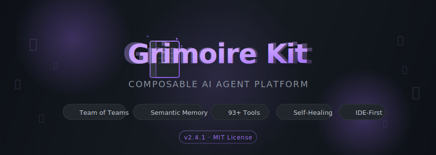
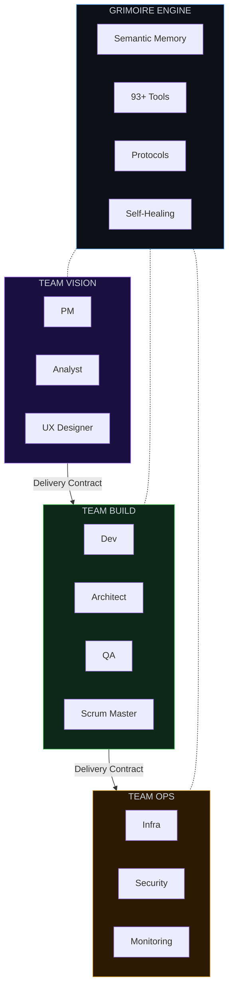
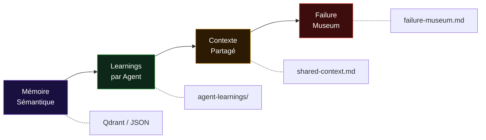

<picture>
  <source media="(prefers-color-scheme: dark)" srcset="docs/assets/banner-dark.svg">
  <source media="(prefers-color-scheme: light)" srcset="docs/assets/banner-light.svg">
  
</picture>

<p align="center">
  <a href="https://github.com/Guilhem-Bonnet/Grimoire-kit/releases"></a>
  <a href="LICENSE"></a>
  <a href="#-tests"></a>
  <a href="https://www.python.org/"></a>
  <a href="#-outils-cli"></a>
</p>

<p align="center">
  <i>The missing operating system for AI agents in your IDE.</i>
</p>

<p align="center">
  <b>Transformez votre IDE en entreprise virtuelle peuplée d'agents IA spécialisés.</b><br>
  <sub>Teams · Personas · Mémoire sémantique · Workflows · Qualité automatisée · Self-Healing</sub>
</p>

<p align="center">
  <a href="#-quick-start">Quick Start</a> •
  <a href="#-pourquoi-grimoire-kit-">Pourquoi ?</a> •
  <a href="#-architecture">Architecture</a> •
  <a href="#-features">Features</a> •
  <a href="#-outils-cli">Outils CLI</a> •
  <a href="docs/concepts.md">Concepts</a> •
  <a href="docs/getting-started.md">Guide complet</a> •
  <a href="CHANGELOG.md">Changelog</a>
</p>

<br>


<br>

##  Pourquoi Grimoire Kit ?

<table>
<tr>
<td width="50%">

### Le problème

Les assistants IA génériques manquent de **contexte**, de **spécialisation** et de **mémoire**. Chaque session repart de zéro. Aucune coordination entre les tâches. Pas de contrôle qualité.

### La solution

Grimoire Kit déploie des **équipes d'agents IA** qui fonctionnent comme une vraie entreprise :

- Chaque agent a une **persona forte** et un domaine d'expertise
- Mémoire **persistante et sémantique** entre les sessions
- **Protocoles** standardisés de livraison et qualité
- **Self-improvement** — le système apprend de ses erreurs

</td>
<td width="50%">

```
    Votre Projet
         │
    ┌────┴────┐
    │  _bmad/ │  ← "Les bureaux" de votre
    │         │     entreprise virtuelle
    ├─────────┤
    │ agents/ │  ← Les employés spécialisés
    │ memory/ │  ← La mémoire collective
    │ config/ │  ← Le règlement intérieur
    │ tools/  │  ← La boîte à outils (93+)
    └─────────┘
         │
    ┌────┴────────────┐
    │  IDE / Copilot  │  ← Interface naturelle
    └─────────────────┘
```

</td>
</tr>
</table>

<br>

##  Quick Start

```bash
# Installation via pip (v3)
pip install bmad-kit

# Initialiser un nouveau projet
bmad init mon-projet --archetype web-app

# Depuis un projet existant
cd votre-projet/
bmad init . --name "Mon Projet"

# Vérifier la santé du projet
bmad doctor

# Migrer un projet v2 → v3
bmad upgrade --dry-run   # aperçu
bmad upgrade             # exécuter
```

<details>
<summary><b>Installation classique (clone)</b></summary>

```bash
git clone https://github.com/Guilhem-Bonnet/Grimoire-kit.git
cd Grimoire-kit/
pip install -e ".[dev]"
```
</details>

> **Premier pas ?** Lisez [docs/concepts.md](docs/concepts.md) — tous les concepts expliqués avec des analogies.

<br>


<br>

##  Architecture

<table>
<tr><td>



</td></tr>
</table>

**Règle fondamentale** : aucune team ne commence sans un **Delivery Contract** signé de la team précédente. Zéro handoff informel.

<br>

##  Features

<table>
<tr>
<td align="center" width="33%">

###  Team of Teams

Trois teams autonomes : **Vision**, **Build**, **Ops**. Chacune avec ses agents, workflows et contrats de livraison inter-teams.

</td>
<td align="center" width="33%">

###  Mémoire Sémantique

Recherche vectorielle **Qdrant** + fallback JSON. Détection de contradictions, consolidation automatique, failure museum.

</td>
<td align="center" width="33%">

###  Completion Contract

`cc-verify.sh` détecte le stack et vérifie build + tests + lint avant tout "terminé". Zéro livraison sans validation.

</td>
</tr>
<tr>
<td align="center">

###  Boomerang Orchestration

L'orchestrateur décompose, **délègue en parallèle** à des sous-agents, et agrège les résultats. Coordination invisible.

</td>
<td align="center">

###  Session Branching

Explorez plusieurs approches en parallèle — comme des branches Git, mais pour vos sessions d'agents. Diff, merge, cherry-pick.

</td>
<td align="center">

###  Plan / Act / Think

Switch explicite entre **planification**, **exécution autonome** et **délibération profonde** `[THINK]` pour les décisions critiques.

</td>
</tr>
<tr>
<td align="center">

###  Self-Healing

Système immunitaire : détecte les anomalies, diagnostique, et propose des réparations automatiques. Failure museum intégré.

</td>
<td align="center">

###  Agent Darwinism

Sélection naturelle des agents : fitness multi-dimensionnelle, évolution par générations, leaderboard, hybridation.

</td>
<td align="center">

###  Stigmergy

Coordination **indirecte** par phéromones numériques : émission, détection, amplification, évaporation. Intelligence émergente.

</td>
</tr>
<tr>
<td align="center">

###  Dream Mode

Consolidation **hors-session** : croise mémoire, trace, décisions et failure museum pour produire des insights émergents.

</td>
<td align="center">

###  MCP Server

Expose BMAD comme serveur MCP local. Compatible **Cursor, Cline, Claude Desktop** et tout IDE MCP.

</td>
<td align="center">

###  R&D Engine v2.1

Innovation autonome : reinforcement learning, closed-loop reward, prototypage automatique, seed memory, gap-analysis.

</td>
</tr>
</table>

<details>
<summary><b>Et bien plus encore... (15+ features avancées)</b></summary>
<br>

| Feature | Description |
|:--------|:-----------|
| **Adversarial Consensus** | Protocole BFT : 3 votants + 1 avocat du diable pour les décisions critiques |
| **Anti-Fragile Score** | Mesure la résilience adaptative (recovery, learning velocity, signal trend) |
| **Reasoning Stream** | Flux structuré : HYPOTHESIS, DOUBT, ASSUMPTION, ALTERNATIVE |
| **Cross-Project Migration** | Exporte/importe learnings, rules, DNA, agents entre projets |
| **Digital Twin** | Jumeau numérique : snapshot, simulation d'impact, scénarios "what if" |
| **Quantum Branch** | Timelines parallèles : fork, compare, merge de configurations alternatives |
| **Time-Travel** | Archéologie temporelle : checkpoints, replay, restore, bisect |
| **CRISPR** | Édition chirurgicale de workflows : scan, splice, excise, transplant |
| **Decision Log** | Blockchain légère de décisions architecturales avec vérification d'intégrité |
| **Mirror Agent** | Neurones miroirs : observation et transfert de patterns inter-agents |
| **Sensory Buffer** | Mémoire sensorielle court terme à décroissance exponentielle |
| **Self-Improvement Loop** | Analyse les patterns d'échec → améliore le framework automatiquement |
| **Context Budget Guard** | Mesure le budget LLM consommé par chaque agent |
| **Harmony Check** | Score d'harmonie architecturale et détection de dissonances |
| **Dashboard** | Santé, entropie Shannon, Pareto Gini, activité git — en un coup d'œil |

</details>

<br>


<br>

## 🐍 SDK Python (v3)

Le SDK v3 expose **toute la puissance de Grimoire** en tant que package Python installable :

```bash
pip install bmad-kit
```

### CLI

| Commande | Description |
|:---------|:-----------|
| `bmad init [path]` | Initialiser un projet BMAD |
| `bmad doctor` | Vérifier la santé du projet |
| `bmad status` | Afficher l'état courant |
| `bmad up` | Réconcilier l'état avec la config |
| `bmad add <agent>` | Ajouter un agent |
| `bmad remove <agent>` | Retirer un agent |
| `bmad validate` | Valider la config YAML |
| `bmad merge <source>` | Fusionner des fichiers BMAD |
| `bmad merge --undo` | Annuler le dernier merge |
| `bmad upgrade` | Migrer un projet v2 → v3 |
| `bmad registry list` | Lister les archétypes disponibles |
| `bmad registry search <q>` | Chercher un agent |

### SDK — Outils programmatiques

```python
from pathlib import Path
from bmad.tools import (
    HarmonyCheck, PreflightCheck, MemoryLint,
    ContextRouter, ContextGuard, Stigmergy, AgentForge,
)

root = Path(".")
report = PreflightCheck(root).run()
print(report.status)  # GO / GO-WITH-WARNINGS / NO-GO
```

### MCP Server

```bash
bmad-mcp                    # Démarrer le serveur MCP
bmad-mcp --transport sse    # Mode SSE pour IDE distants
```

8 outils exposés : `init`, `doctor`, `status`, `harmony_check`, `preflight`, `memory_lint`, `context_route`, `stigmergy_sense`.

<br>


<br>

##  Archétypes

Des packs d'agents pré-configurés selon votre type de projet :

<table>
<tr>
<td align="center" width="25%">
<br>

**minimal**

<sub>Atlas · Sentinel · Mnemo</sub>

Point de départ universel

</td>
<td align="center" width="25%">
<br>

**web-app**

<sub>+ agents stack auto-détectés</sub>

SPA + API + DB

</td>
<td align="center" width="25%">
<br>

**infra-ops**

<sub>Forge · Vault · Flow · Hawk<br>Helm · Phoenix · Probe</sub>

Infrastructure & DevOps

</td>
<td align="center" width="25%">
<br>

**meta**

<sub>Atlas · Sentinel · Mnemo</sub>

Auto-amélioration du kit

</td>
</tr>
<tr>
<td align="center">
<br>

**creative-studio**

<sub>Agents créatifs</sub>

Design & Contenu

</td>
<td align="center">
<br>

**platform-engineering**

<sub>Agents plateforme</sub>

Developer Experience

</td>
<td align="center">
<br>

**fix-loop**

<sub>Agents correctifs</sub>

Bug fixing rapide

</td>
<td align="center">
<br>

**stack**

<sub>Gopher · Pixel · Serpent<br>Container · Terra · Kube</sub>

Auto-détection stack

</td>
</tr>
</table>

```bash
# Déployer un archétype
bash bmad-init.sh --archetype infra-ops

# Mode auto : détecte le stack → choisit les bons agents
bash bmad-init.sh --auto
```

<br>


<br>

##  Outils CLI

**93 outils Python** organisés par domaine. Tous accessibles via CLI et programmables en Python.

<details>
<summary><b> Cognition & Mémoire</b> — 12 outils</summary>

| Outil | Description |
|:------|:-----------|
| `dream.py` | Consolidation hors-session, insights émergents |
| `reasoning-stream.py` | Hypothèses, doutes, alternatives structurées |
| `sensory-buffer.py` | Mémoire court terme à décroissance exponentielle |
| `procedural-memory.py` | Mémoire procédurale persistante |
| `semantic-cache.py` | Cache sémantique intelligent |
| `semantic-chain.py` | Chaînes de pensée sémantiques |
| `memory-lint.py` | Validation de cohérence mémoire |
| `memory-sync.py` | Synchronisation mémoire multi-agents |
| `context-guard.py` | Garde-fou du budget contexte LLM |
| `context-router.py` | Routage intelligent du contexte |
| `context-merge.py` | Fusion de contextes multi-sources |
| `context-summarizer.py` | Résumé intelligent de contexte |

</details>

<details>
<summary><b> Évolution & Innovation</b> — 10 outils</summary>

| Outil | Description |
|:------|:-----------|
| `r-and-d.py` | Moteur R&D v2.1 avec reinforcement learning |
| `agent-darwinism.py` | Sélection naturelle, fitness, hybridation |
| `dna-evolve.py` | Évolution du DNA depuis l'usage réel |
| `incubator.py` | Incubateur d'idées et de prototypes |
| `agent-forge.py` | Génération de squelettes d'agents |
| `agent-bench.py` | Benchmarks de performance agents |
| `mirror-agent.py` | Observation et transfert de patterns |
| `cognitive-flywheel.py` | Boucle d'auto-amélioration continue |
| `fitness-tracker.py` | Suivi de fitness des agents |
| `new-game-plus.py` | Redémarrage enrichi de sessions |

</details>

<details>
<summary><b> Résilience & Qualité</b> — 10 outils</summary>

| Outil | Description |
|:------|:-----------|
| `self-healing.py` | Diagnostic et réparation automatique |
| `immune-system.py` | Détection d'anomalies et auto-réparation |
| `antifragile-score.py` | Score de résilience adaptative |
| `early-warning.py` | Système d'alerte précoce |
| `harmony-check.py` | Score d'harmonie architecturale |
| `preflight-check.py` | Validation pre-flight du projet |
| `failure-museum.py` | Catalogue structuré des échecs |
| `bug-finder.py` | Détection automatique de bugs |
| `quality-score.py` | Score de qualité multi-dimensionnel |
| `schema-validator.py` | Validation des fichiers YAML |

</details>

<details>
<summary><b> Architecture & Workflows</b> — 11 outils</summary>

| Outil | Description |
|:------|:-----------|
| `crispr.py` | Édition chirurgicale de workflows |
| `digital-twin.py` | Simulation d'impact "what if" |
| `quantum-branch.py` | Timelines parallèles |
| `time-travel.py` | Checkpoints, replay, bisect |
| `decision-log.py` | Blockchain de décisions |
| `project-graph.py` | Graphe de dépendances |
| `dashboard.py` | Tableau de bord santé projet |
| `oracle.py` | CTO virtuel : SWOT, maturité |
| `dark-matter.py` | Détection de patterns cachés |
| `desire-paths.py` | Chemins de désir émergents |
| `workflow-adapt.py` | Adaptation dynamique de workflows |

</details>

<details>
<summary><b> Coordination & Communication</b> — 10 outils</summary>

| Outil | Description |
|:------|:-----------|
| `stigmergy.py` | Phéromones numériques émergentes |
| `adversarial-consensus.py` | Consensus BFT avec avocat du diable |
| `swarm-consensus.py` | Consensus en essaim |
| `nso.py` | Nervous System Orchestrator |
| `orchestrator.py` | Orchestration multi-agents |
| `nudge-engine.py` | Nudges comportementaux doux |
| `bias-toolkit.py` | 12 biais cognitifs documentés |
| `mycelium.py` | Réseau mycelium inter-agents |
| `message-bus.py` | Bus de messages inter-agents |
| `rosetta.py` | Traduction cross-format |

</details>

<details>
<summary><b> Intégrations & DevTools</b> — 10 outils</summary>

| Outil | Description |
|:------|:-----------|
| `bmad-mcp-tools.py` | Serveur MCP BMAD |
| `mcp-proxy.py` | Proxy MCP multi-server |
| `cross-migrate.py` | Migration cross-projet |
| `auto-doc.py` | Synchronisation README ↔ code |
| `gen-tests.py` | Générateur de tests automatique |
| `llm-router.py` | Routage intelligent LLM |
| `token-budget.py` | Gestion budget tokens |
| `tool-registry.py` | Registre des outils disponibles |
| `tool-advisor.py` | Conseiller d'outils contextuel |
| `observatory.py` | Observatoire de métriques |

</details>

<br>

Voir [framework/tools/README.md](framework/tools/README.md) pour la référence complète des 93 outils.

<br>


<br>

##  MCP Server

Compatible avec tout IDE supportant le [Model Context Protocol](https://modelcontextprotocol.io/) :

```jsonc
// Claude Desktop / Cursor / Cline
{
  "mcpServers": {
    "bmad": {
      "command": "node",
      "args": ["/chemin/vers/grimoire-kit/framework/mcp/server.js"],
      "env": { "BMAD_PROJECT_ROOT": "/votre-projet" }
    }
  }
}
```

**Tools exposés** : `get_project_context` · `get_agent_memory` · `run_completion_contract` · `get_workflow_status` · `list_sessions` · `get_failure_museum` · `spawn_subagent_task`

<br>

##  Tests

<table>
<tr>
<td>

**1 875+ tests** couvrant l'intégralité du framework :

```bash
# Tous les tests
python3 -m pytest tests/ -q --tb=short

# Un fichier spécifique
python3 -m pytest tests/test_dream.py -v

# Smoke tests Bash (122 assertions)
bash tests/smoke-test.sh
```

</td>
<td>

| Catégorie | Tests |
|:----------|------:|
| Cognition & Mémoire | 380+ |
| Évolution & R&D | 350+ |
| Résilience & Qualité | 280+ |
| Architecture & Workflows | 250+ |
| Coordination | 200+ |
| Intégrations | 180+ |
| Robustesse (fuzzing) | 38 |
| **Total** | **1 875+** |

</td>
</tr>
</table>

<br>


<br>

##  Grimoire vs. Alternatives

<table>
<tr>
<th></th>
<th>CrewAI</th>
<th>AutoGen</th>
<th>LangGraph</th>
<th>Aider</th>
<th>Cline</th>
<th><b>Grimoire Kit</b></th>
</tr>
<tr><td><b>Local / IDE-native</b></td><td>—</td><td>—</td><td>—</td><td>&#x2713;</td><td>&#x2713;</td><td><b>&#x2713;</b></td></tr>
<tr><td><b>Team of Teams</b></td><td>—</td><td>—</td><td>—</td><td>—</td><td>—</td><td><b>&#x2713;</b></td></tr>
<tr><td><b>Delivery Contracts</b></td><td>—</td><td>—</td><td>—</td><td>—</td><td>—</td><td><b>&#x2713;</b></td></tr>
<tr><td><b>Semantic Memory</b></td><td>—</td><td>—</td><td>—</td><td>—</td><td>—</td><td><b>&#x2713;</b></td></tr>
<tr><td><b>Session Branching</b></td><td>—</td><td>—</td><td>~</td><td>—</td><td>—</td><td><b>&#x2713;</b></td></tr>
<tr><td><b>Agent Orchestration</b></td><td>~</td><td>&#x2713;</td><td>&#x2713;</td><td>—</td><td>&#x2713;</td><td><b>&#x2713;</b></td></tr>
<tr><td><b>MCP Server</b></td><td>—</td><td>—</td><td>—</td><td>—</td><td>—</td><td><b>&#x2713;</b></td></tr>
<tr><td><b>Self-Improvement</b></td><td>—</td><td>—</td><td>—</td><td>—</td><td>—</td><td><b>&#x2713;</b></td></tr>
<tr><td><b>Agent Evolution</b></td><td>—</td><td>—</td><td>—</td><td>—</td><td>—</td><td><b>&#x2713;</b></td></tr>
<tr><td><b>Plan/Act/Think</b></td><td>—</td><td>—</td><td>—</td><td>—</td><td>&#x2713;</td><td><b>&#x2713;</b></td></tr>
<tr><td><b>Failure Museum</b></td><td>—</td><td>—</td><td>—</td><td>—</td><td>—</td><td><b>&#x2713;</b></td></tr>
<tr><td><b>Anti-Fragile Score</b></td><td>—</td><td>—</td><td>—</td><td>—</td><td>—</td><td><b>&#x2713;</b></td></tr>
</table>

<br>


<br>

##  Structure du Kit

```
grimoire-kit/
├── bmad-init.sh                     # Script d'initialisation + session-branch
├── project-context.tpl.yaml         # Template contexte projet
│
├── framework/                       # Moteur générique (ne pas modifier par projet)
│   ├── agent-base.md                   # Protocole activation + CC + Plan/Act + [THINK]
│   ├── cc-verify.sh                    # Completion Contract verifier (multi-stack)
│   ├── sil-collect.sh                  # Self-Improvement Loop collector
│   ├── teams/                          # Team manifests (Vision, Build, Ops)
│   ├── tools/                          # 93 outils Python CLI
│   ├── memory/                         # Système de mémoire à 4 niveaux
│   ├── mcp/                            # MCP Server spec
│   ├── sessions/                       # Session Branching
│   ├── workflows/                      # Boomerang, orchestration, state checkpoint
│   └── hooks/                          # Git hooks & lifecycle
│
├── archetypes/                      # 9 starter kits thématiques
│   ├── minimal/                        # Point de départ universel
│   ├── web-app/                        # Applications web
│   ├── infra-ops/                      # Infrastructure & DevOps
│   ├── stack/                          # Agents par techno (Go, Python, TS...)
│   ├── meta/                           # Auto-amélioration du kit
│   ├── creative-studio/                # Design & contenu
│   ├── platform-engineering/           # Developer Experience
│   ├── fix-loop/                       # Bug fixing rapide
│   └── features/                       # Feature-driven development
│
├── docs/                            # Documentation complète
├── tests/                           # 1 875+ tests Python + smoke tests Bash
└── src/                             # Package Python installable
```

<br>

##  Système de Mémoire

Un système à **4 niveaux** pour ne jamais repartir de zéro :



**Qualité automatisée** : détection de contradictions, consolidation des learnings, state checkpoints avec resume automatique.

<br>

##  Gestion du Kit

```bash
# Version actuelle
bash bmad-init.sh --version

# Mise à jour depuis upstream
bash bmad-init.sh upgrade              # met à jour framework/ et archetypes/
bash bmad-init.sh upgrade --dry-run    # preview sans modification

# Completion Contract — vérifier avant "terminé"
bash _bmad/_config/custom/cc-verify.sh

# Self-Improvement Loop — analyser les patterns d'échec
bash _bmad/_config/custom/sil-collect.sh
```

<details>
<summary><b>Commandes avancées complètes</b></summary>

```bash
# Bench — mesurer les scores de performance des agents
bash bmad-init.sh bench --summary
bash bmad-init.sh bench --report
bash bmad-init.sh bench --improve

# Forge — générer des squelettes d'agents
bash bmad-init.sh forge --from "migrations DB PostgreSQL"
bash bmad-init.sh forge --from-gap

# Guard — budget de contexte LLM
bash bmad-init.sh guard
bash bmad-init.sh guard --agent atlas --detail --model gpt-4o
bash bmad-init.sh guard --suggest

# Evolve — DNA vivante
bash bmad-init.sh evolve
bash bmad-init.sh evolve --apply

# Dream — consolidation hors-session
bash bmad-init.sh dream
bash bmad-init.sh dream --agent dev
bash bmad-init.sh dream --multi-project ../proj-a ../proj-b

# Consensus — protocole adversarial
bash bmad-init.sh consensus --proposal "Utiliser PostgreSQL pour le cache sessions"
bash bmad-init.sh consensus --history

# Anti-Fragile Score
bash bmad-init.sh antifragile
bash bmad-init.sh antifragile --detail --trend

# Reasoning Stream
bash bmad-init.sh reasoning log --agent dev --type HYPOTHESIS --text "Redis > memcached"
bash bmad-init.sh reasoning analyze

# Cross-Project Migration
bash bmad-init.sh migrate export --only learnings,rules
bash bmad-init.sh migrate import --bundle migration-bundle.json --dry-run

# Agent Darwinism
bash bmad-init.sh darwinism evaluate
bash bmad-init.sh darwinism leaderboard
bash bmad-init.sh darwinism evolve

# Stigmergy
bash bmad-init.sh stigmergy emit --type NEED --location "src/auth" --text "review sécurité"
bash bmad-init.sh stigmergy landscape
bash bmad-init.sh stigmergy trails

# NSO — Nervous System Orchestrator
bash bmad-init.sh nso run
bash bmad-init.sh nso retro

# Digital Twin / Quantum Branch / Time-Travel / CRISPR / Decision Log
# Mirror Agent / Sensory Buffer / R&D Engine
# → Voir framework/tools/README.md pour la doc complète
```

</details>

<br>

##  Prérequis

| Requis | Version |
|:-------|:--------|
| Python | 3.12+ |
| Git | 2.x+ |
| BMAD Framework | v6.0+ |

| Optionnel | Pour |
|:----------|:-----|
| Node.js 18+ | MCP Server |
| Qdrant | Recherche sémantique avancée |
| Ollama | LLM local |

<br>

##  Contribuer

Les contributions sont les bienvenues ! Voir [CONTRIBUTING.md](CONTRIBUTING.md) pour les guidelines.

<br>


<br>

<p align="center">
  <sub>MIT License · Made with Grimoire by <a href="https://github.com/Guilhem-Bonnet">Guilhem Bonnet</a> · <a href="CHANGELOG.md">Changelog</a></sub>
</p>

<p align="center">
  <a href="https://github.com/Guilhem-Bonnet/Grimoire-kit/stargazers">
    
  </a>
</p>

