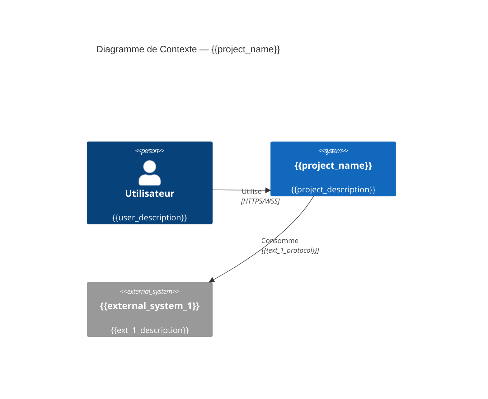
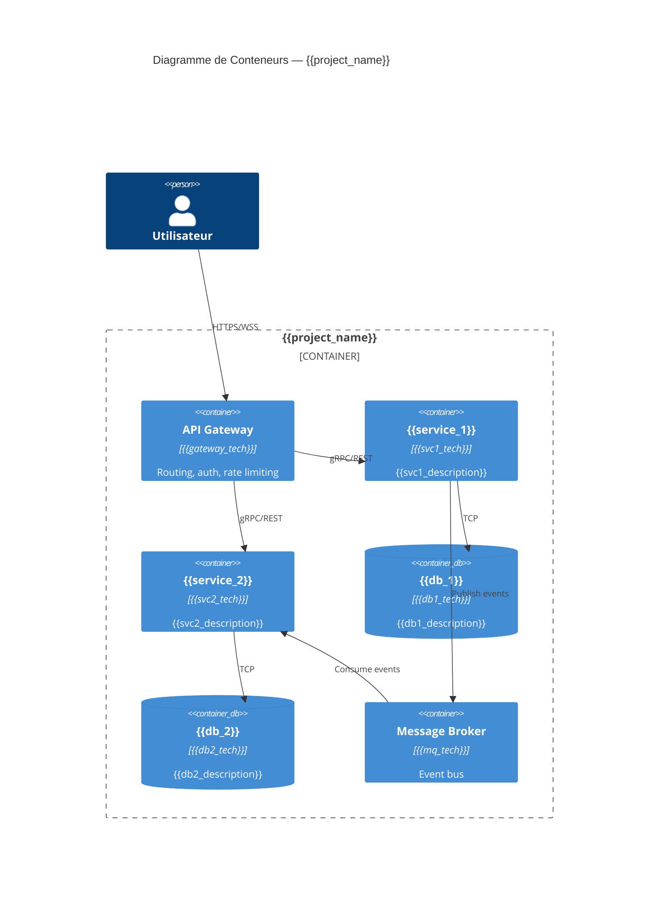
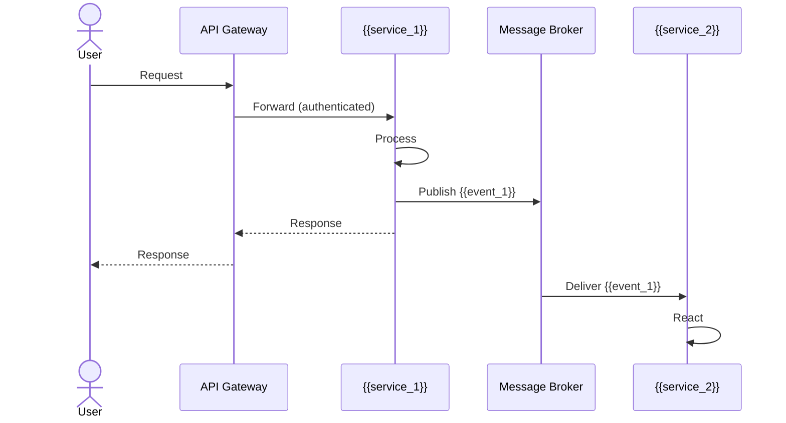
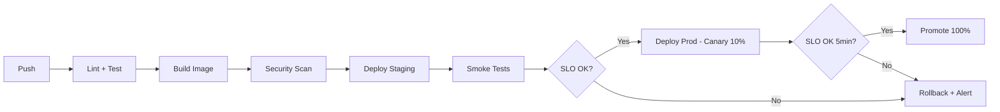

# Architecture — {{project_name}}

> **Source de vérité architecturale.**
> Tous les agents lisent ce fichier. Toute modification passe par un ADR.
> Dernière mise à jour : {{date}}

---

## 1. Vue d'Ensemble (C4 — Context)



## 2. Vue Conteneurs (C4 — Container)



## 3. Services

### {{service_1}}

| Attribut | Valeur |
|----------|--------|
| **Responsabilité** | {{svc1_description}} |
| **Langage/Framework** | {{svc1_tech}} |
| **Port** | {{svc1_port}} |
| **Base de données** | {{db1_tech}} |
| **API** | {{svc1_api_type}} — contrat : `{{svc1_contract_path}}` |
| **Events produits** | {{svc1_events_out}} |
| **Events consommés** | {{svc1_events_in}} |
| **SLO Availability** | {{svc1_slo_avail}} |
| **SLO Latency p99** | {{svc1_slo_latency}} |
| **Répertoire** | `{{svc1_dir}}` |

### {{service_2}}

| Attribut | Valeur |
|----------|--------|
| **Responsabilité** | {{svc2_description}} |
| **Langage/Framework** | {{svc2_tech}} |
| **Port** | {{svc2_port}} |
| **Base de données** | {{db2_tech}} |
| **API** | {{svc2_api_type}} — contrat : `{{svc2_contract_path}}` |
| **Events produits** | {{svc2_events_out}} |
| **Events consommés** | {{svc2_events_in}} |
| **SLO Availability** | {{svc2_slo_avail}} |
| **SLO Latency p99** | {{svc2_slo_latency}} |
| **Répertoire** | `{{svc2_dir}}` |

## 4. Modèle de Données

### Bounded Contexts (DDD)

```mermaid
graph LR
    subgraph BC1[{{bounded_context_1}}]
        A1[{{aggregate_1}}]
    end
    subgraph BC2[{{bounded_context_2}}]
        A2[{{aggregate_2}}]
    end
    BC1 -- "Domain Event" --> BC2
```

### Entités principales

| Bounded Context | Aggregate Root | Entités | Repository |
|----------------|---------------|--------|------------|
| {{bounded_context_1}} | {{aggregate_1}} | {{entities_1}} | {{repo_1}} |
| {{bounded_context_2}} | {{aggregate_2}} | {{entities_2}} | {{repo_2}} |

## 5. Flux & Events

### Event Catalog

| Event | Producer | Consumer(s) | Schema | Description |
|-------|----------|-------------|--------|-------------|
| {{event_1}} | {{producer_1}} | {{consumers_1}} | `{{schema_path_1}}` | {{event_1_desc}} |
| {{event_2}} | {{producer_2}} | {{consumers_2}} | `{{schema_path_2}}` | {{event_2_desc}} |

### Flux Principal



## 6. Infrastructure & Déploiement

### Environnements

| Env | Infra | Accès | Déploiement | Config |
|-----|-------|-------|-------------|--------|
| dev | Docker Compose local | localhost | `docker compose up` | `.env.dev` |
| staging | {{staging_infra}} | {{staging_url}} | {{staging_deploy}} | `values-staging.yaml` |
| production | {{prod_infra}} | {{prod_url}} | {{prod_deploy}} | `values-prod.yaml` |

### Pipeline de Déploiement



## 7. Observabilité

### SLO Dashboard

| Service | SLI | SLO Target | Error Budget/mois | Alerte |
|---------|-----|-----------|------------------|--------|
| {{service_1}} | Availability | {{slo_1_avail}} | {{eb_1}} | burn-rate 14.4x/1h |
| {{service_1}} | Latency p99 | {{slo_1_lat}} | — | &gt; {{threshold_1}} pendant 5min |
| {{service_2}} | Availability | {{slo_2_avail}} | {{eb_2}} | burn-rate 14.4x/1h |

### Instrumentation par Service

| Service | Métriques | Logs | Traces | Dashboard |
|---------|-----------|------|--------|-----------|
| {{service_1}} | ✅ Prometheus | ✅ Loki | ✅ Tempo | [link] |
| {{service_2}} | ✅ Prometheus | ✅ Loki | ✅ Tempo | [link] |

## 8. Sécurité

| Aspect | Implémentation |
|--------|---------------|
| Authentication | {{auth_method}} |
| Authorization | {{authz_method}} |
| Secrets | {{secrets_manager}} |
| TLS | {{tls_config}} |
| API Rate Limiting | {{rate_limiting}} |
| Network Policy | {{network_policy}} |

## 9. Décisions Architecturales (ADRs)

| # | Titre | Statut | Date | Impact |
|---|-------|--------|------|--------|
| — | _Aucun ADR pour l'instant_ | — | — | — |

<!-- Chaque ADR est un fichier séparé dans docs/adr/adr-NNN-slug.md -->

## 10. Risques & Dette Technique

| # | Risque / Dette | Sévérité | Mitigation | Owner |
|---|---------------|----------|-----------|-------|
| — | _Aucun risque identifié_ | — | — | — |
