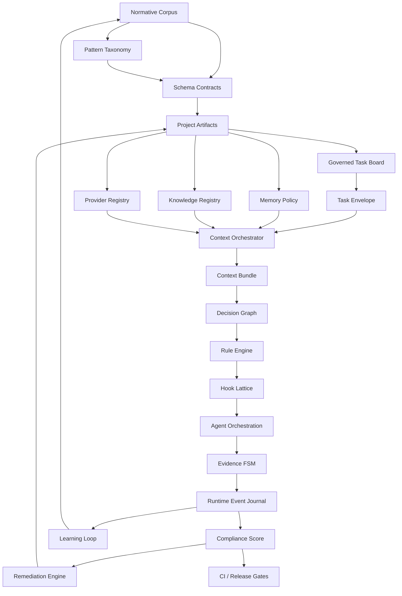
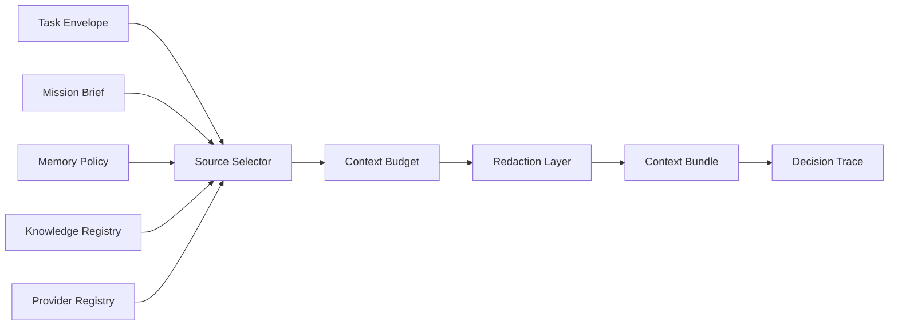
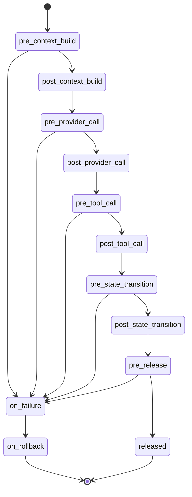
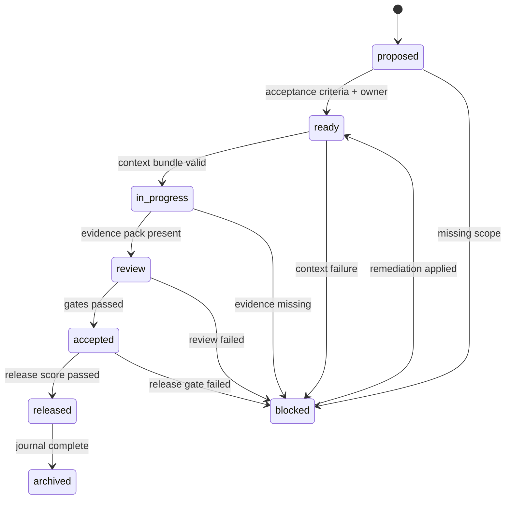
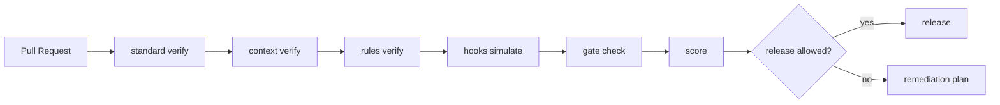

# Cible finale maximale du standard agentique

Ce document fixe la cible ideale, maximale et normative de Grimoire Kit. Il sert de north star pour transformer les normes, schemas, patterns, hooks, regles et diagrammes d'orchestration en runtime agentique executable.

Le plan cible decrit la trajectoire. Cette cible finale decrit l'etat ideal a atteindre.

## Vision finale

Grimoire Kit devient le runtime de conformite agentique qui permet a un projet de declarer, executer, tracer, auditer et ameliorer son fonctionnement agentique selon une norme explicite.

La cible finale n'est pas seulement une documentation. C'est un systeme complet compose de :

- contrats machine-readable ;
- artefacts projet normalises ;
- profils d'adoption progressifs ;
- orchestration de contexte ;
- memoire multi-niveaux gouvernee ;
- graphe de decision ;
- rule engine ;
- registry de hooks ;
- orchestration multi-agents ;
- FSM evidence-gated ;
- journal d'evenements ;
- audit et score de conformite ;
- remediation automatique ;
- gates CI et release ;
- tracabilite norme -> regle -> check -> hook -> evenement -> preuve -> remediation.

## Definition de la cible maximale

```text
Normes agentiques
→ corpus de principes
→ taxonomie de patterns
→ schemas contractuels
→ artefacts projet
→ task board gouverne
→ memoire multi-niveaux
→ orchestrateur de contexte
→ graphe de decision
→ rule engine
→ hook lattice
→ orchestration multi-agents
→ evidence FSM
→ event journal
→ audit + score
→ remediation
→ CI / release governance
→ apprentissage et amelioration continue
```

La cible ideale est atteinte quand une equipe peut lancer :

```bash
grimoire standard init --profile governed
grimoire standard verify --profile governed
grimoire standard run --task-id <task>
grimoire standard audit --profile governed
grimoire standard score --profile governed
grimoire standard fix --dry-run
```

et obtenir un etat complet, explicable et gouverne du projet.

## Principes normatifs finaux

| Principe | Exigence finale |
|---|---|
| Explicitness | Toute decision agentique doit avoir une source, une regle et une trace. |
| Traceability | Chaque norme doit pointer vers un artefact, un check, un hook, un evenement et une remediation. |
| Progressive governance | `minimal`, `orchestrated` et `governed` doivent rester compatibles avec une adoption graduelle. |
| Evidence first | Aucune transition critique ne doit passer sans preuve suffisante. |
| Context determinism | Un contexte runtime doit etre reproductible, justifie et verifiable. |
| Memory governance | Toute memoire injectee doit avoir scope, trust, retention, freshness et redaction. |
| Provider accountability | Tout provider doit etre declare, contraint et auditable. |
| Safe autonomy | Les agents peuvent agir seulement dans les limites declarees par profil, role et hook. |
| Explainable decisions | Les choix de routing, fallback, review, escalation et release doivent etre explicables. |
| Remediation by design | Toute erreur bloquante doit produire une action corrective ou une justification explicite. |

## Architecture finale



## Couches finales du runtime

| Couche | Fonction | Sortie attendue |
|---|---|---|
| Normative corpus | Source de verite des principes, obligations et recommandations | concepts, obligations, severites |
| Pattern taxonomy | Classement des patterns par famille et intention | patterns applicables |
| Contract schema | Forme machine-readable de la norme | schemas YAML/JSON |
| Artifact layer | Etat declare du projet | `_grimoire/standard/*` |
| Task governance | Kanban, owners, blockers, transitions | `task-board.yaml` |
| Memory governance | Scope, trust, retention, freshness, redaction | `memory-policy.yaml` |
| Knowledge governance | Sources, index, graph, freshness | `knowledge-source-registry.yaml` |
| Provider governance | Providers, data policy, fallback, budgets | `llm-provider-registry.yaml` |
| Context orchestration | Construction deterministe du contexte | `context-bundle.yaml` |
| Decision layer | Decisions expliquees et tracables | `decision-graph.yaml` |
| Rule layer | Regles executables | `rule-packs.yaml` |
| Hook layer | Interceptions avant/apres action | `hook-registry.yaml` |
| Agent orchestration | Roles, routing, handoff, review, arbitration | `orchestration-policy.yaml` |
| Evidence layer | FSM et preuves | `evidence-gates.yaml` |
| Observability | Journal runtime append-only | `runtime-journal.jsonl` |
| Compliance | Audit, score, risques, exceptions | `compliance-score.yaml` |
| Remediation | Corrections proposees ou appliquees | `remediation-plan.yaml` |
| Release governance | Blocage ou autorisation release | CI gates |

## Adaptation normative a Grimoire

La cible finale doit etre adaptee aux surfaces reelles de Grimoire, pas seulement a des concepts generiques d'orchestration.

| Domaine Grimoire | Norme cible | Artefact |
|---|---|---|
| Kanban / travail | Task board gouverne, statuts, blockers, evidence, transitions | `task-board.yaml` |
| Agents | Roles, responsabilites, autonomie, outils, memoire autorisee | `orchestration-policy.yaml` |
| Personas / archetypes | Mapping persona -> role -> droits -> gates | `orchestration-policy.yaml` |
| Workflows | Handoffs, review gates, escalation, rollback | `orchestration-policy.yaml` |
| Memoire | Types, scopes, retention, freshness, trust, redaction | `memory-policy.yaml` |
| Contexte | Sources, budget, exclusions, redactions, fingerprints | `context-contract.yaml` |
| Knowledge | Sources, index, freshness, graph, obligations | `knowledge-source-registry.yaml` |
| Providers | Routes, fallback, data policy, compatibilites | `llm-provider-registry.yaml` |
| Decisions | Provider, memoire, contexte, role, outil, transition, release | `decision-graph.yaml` |
| Hooks | Interceptions runtime pre/post, failure, rollback | `hook-registry.yaml` |
| Rules | Regles normatives executables | `rule-packs.yaml` |

Le schéma cible `framework/agentic-standard/target-schema.yaml` represente ces domaines dans `grimoire_normative_domains`.

## Profils finaux

| Profil | Intention | Niveau de contrainte |
|---|---|---|
| `minimal` | Adoption initiale | artefacts essentiels, checks advisory |
| `orchestrated` | Projet agentique actif | contexte, providers, knowledge, evidence et orchestration verifies |
| `governed` | Release-grade | hard-fail sur violations critiques |
| `certified` | Cible ideale future | conformite complete, journal runtime, score minimal par dimension, exceptions documentees |

Le profil `certified` est une cible future possible. Il ne doit pas bloquer l'adoption actuelle, mais il donne une definition claire du niveau maximal.

## Artefacts finaux attendus

```text
_grimoire/
  standard/
    standard-profile.yaml
    mission-brief.md
    compliance-declaration.yaml
    task-board.yaml
    memory-policy.yaml
    context-contract.yaml
    decision-graph.yaml
    rule-packs.yaml
    hook-registry.yaml
    orchestration-policy.yaml
    evidence-gates.yaml
    pattern-catalog.yaml
    knowledge-source-registry.yaml
    knowledge-graph-manifest.yaml
    llm-provider-registry.yaml
    compliance-score.yaml
    remediation-policy.yaml
  exceptions/
    accepted-risks.yaml
    waivers.yaml
_grimoire-output/
  context/{task_id}/context-bundle.yaml
  evidence/{task_id}/task-envelope.yaml
  evidence/{task_id}/evidence-pack.yaml
  decisions/{task_id}/decision-trace.yaml
  events/runtime-journal.jsonl
  audit/standard-audit.json
  audit/standard-audit.md
  audit/compliance-score.json
  remediation/remediation-plan.yaml
```

## Taxonomie finale des patterns

| Famille | Role | Exemples de patterns |
|---|---|---|
| Context | Construire et contraindre le contexte | context bundle, source prioritization, context budget |
| Memory | Gouverner les memoires | episodic memory, semantic memory, retention policy |
| Workflow | Gouverner le travail | evidence task, state transition, blocker protocol |
| Orchestration | Coordonner agents et roles | router, handoff, escalation, arbitration |
| Decision | Rendre les choix explicables | decision matrix, decision trace, confidence policy |
| Rule | Executer les normes | blocking rule, advisory rule, exception rule |
| Hook | Intercepter les phases runtime | pre tool, post provider, pre release, rollback |
| Evidence | Relier action et preuve | evidence pack, gate, acceptance evidence |
| Provider | Encadrer les LLM/tools | provider registry, fallback, model capability policy |
| Knowledge | Relier docs et execution | source registry, graph manifest, freshness gate |
| Security | Reduire le risque | containment, redaction, secret avoidance, destructive-action guard |
| Quality | Mesurer et ameliorer | score, audit, remediation, regression guard |
| Release | Gouverner la livraison | release gate, changelog evidence, version policy |

## Orchestrateur de contexte final

L'orchestrateur de contexte est le coeur du runtime. Il doit prendre mission, profil, task board, task envelope, memory policy, knowledge registry, provider registry, context contract, decision graph et risques acceptes.

Il doit produire :

- context bundle ;
- sources incluses et exclues ;
- redactions appliquees ;
- budget contextuel ;
- contraintes provider ;
- justification des choix ;
- hash ou fingerprint d'entree ;
- evenements runtime.



Sections obligatoires du context bundle :

- resume de la tache ;
- criteres d'acceptation ;
- sources selectionnees ;
- sources exclues ;
- memoires incluses ;
- memoires exclues ;
- knowledge nodes ;
- contraintes provider ;
- contraintes de role agentique ;
- budget contextuel ;
- redactions ;
- inputs de decision ;
- exigences d'evidence ;
- fingerprints.

## Systeme de decision final

Le decision graph doit couvrir toutes les decisions qui influencent l'autonomie agentique.

| Decision | Inputs | Sorties |
|---|---|---|
| Provider selection | provider registry, task, data policy | provider choisi, fallback ou block |
| Memory inclusion | memory policy, task scope, trust | include, redact, exclude |
| Knowledge inclusion | freshness, source trust, relevance | include, refresh, exclude |
| Context budget | task priority, profile, provider budget | budget autorise |
| Agent routing | role matrix, task type, risk | agent role ou escalation |
| Review requirement | risk, profile, evidence status | no review, required review, block |
| Gate transition | current state, evidence pack | advance, block, remediate |
| Release authorization | score, risks, gates, journal | release, block, exception required |

Chaque decision doit avoir un `decision_id`, une source policy, les inputs evalues, les regles appliquees, le resultat, la justification, le niveau de confiance, l'evenement emis et la remediation si bloquee.

Les types de decisions adaptes a Grimoire sont :

- priorisation de tache ;
- selection de sources contextuelles ;
- injection de memoire ;
- routing provider ;
- routing de role agentique ;
- autorisation d'outil ;
- transition d'etat ;
- autorisation de release.

Chaque record de decision doit inclure `task_id`, `profile`, `policy_refs`, `rule_refs`, `event`, `evidence_refs`, `remediation_ref` et `timestamp`.

## Rule engine final

Le rule engine execute les obligations normatives.

```yaml
id: provider.no-undeclared-route
source_normative: provider-governance.require-declared-provider
severity: error
phase: pre_provider_call
condition:
  provider_declared: false
action: block
event: provider.blocked
remediation: declare_provider_or_reroute
```

Types de regles :

- `required` ;
- `advisory` ;
- `blocking` ;
- `exception` ;
- `remediation` ;
- `release`.

## Hook lattice final

Les hooks rendent les regles actives dans le cycle runtime.



Phases finales : `pre_context_build`, `post_context_build`, `pre_provider_call`, `post_provider_call`, `pre_tool_call`, `post_tool_call`, `pre_state_transition`, `post_state_transition`, `pre_release`, `on_failure`, `on_rollback`.

Actions finales : `allow`, `warn`, `block`, `redact`, `reroute`, `require_evidence`, `escalate`, `create_remediation`, `rollback`.

## Orchestration multi-agents finale

L'orchestration finale doit declarer roles agentiques, responsabilites, limites d'autonomie, droits outils, droits memoire, criteres de routing, handoffs, arbitration, escalation, review gates, fallback et rollback.

| Role | Responsabilite | Peut agir seul | Gate critique |
|---|---|---|---|
| Planner | Decouper la mission | Oui en `orchestrated` | validation task board |
| Context orchestrator | Construire le contexte | Oui | context verify |
| Implementer | Modifier le projet | Selon risk/profile | evidence pack |
| Reviewer | Evaluer changements | Oui | review evidence |
| Release governor | Autoriser livraison | Non en governed sans score | release gate |
| Remediator | Corriger ecarts | Dry-run par defaut | remediation approval/force |

## FSM evidence-gated finale



Chaque transition doit produire evenement runtime, preuve minimale, check associe, impact score et remediation si echec.

## Runtime journal final

Le journal runtime est append-only et doit permettre de reconstruire l'histoire agentique.

Evenements obligatoires :

- `context.built`
- `decision.evaluated`
- `rule.evaluated`
- `hook.triggered`
- `provider.routed`
- `provider.blocked`
- `memory.included`
- `memory.excluded`
- `knowledge.used`
- `tool.requested`
- `tool.completed`
- `gate.passed`
- `gate.failed`
- `task.transitioned`
- `review.requested`
- `release.authorized`
- `release.blocked`
- `remediation.created`
- `remediation.applied`
- `risk.accepted`

Schema minimal d'un evenement :

```json
{
  "timestamp": "ISO-8601",
  "task_id": "bootstrap",
  "event": "gate.failed",
  "profile": "governed",
  "source": "evidence-gates",
  "severity": "error",
  "decision_id": "release.authorization",
  "rule_id": "release.score-minimum",
  "evidence": [],
  "remediation": "generate-missing-evidence"
}
```

## Score de conformite final

Le score final doit etre multidimensionnel.

| Dimension | Exemple de controle |
|---|---|
| Profile | profil present et coherent |
| Artifacts | artefacts obligatoires presents |
| Task board | transitions et blockers coherents |
| Memory | freshness, retention, trust, redaction |
| Context | bundle reproductible et justifie |
| Provider | routes declarees et compatibles |
| Knowledge | sources valides et index frais |
| Decision | decisions tracees |
| Rules | rule packs valides |
| Hooks | hooks connus et simulables |
| Orchestration | roles, routing, handoff |
| Evidence | gates et preuves |
| Events | journal complet |
| Security | containment, secrets, destructive actions |
| Release | gates CI et risques acceptes |

En profil `governed`, le score global ne suffit pas. Chaque dimension critique doit avoir un seuil minimal.

## Remediation finale

Le moteur de remediation doit transformer les ecarts en actions :

- generer un artefact manquant ;
- completer un champ obligatoire ;
- relier une evidence ;
- declarer un provider ;
- ajouter une regle ou un hook ;
- rafraichir un knowledge index ;
- redact une memoire ;
- bloquer une transition ;
- creer une exception documentee ;
- produire un patch dry-run.

Regles de securite : dry-run par defaut, aucune ecriture hors racine projet, aucune action destructive sans `--force`, tout fix pointe vers un check et une source normative, tout risque accepte est journalise.

## Gouvernance CI et release finale

En cible finale, la CI devient un arbitre normatif.

Gates cibles :

- schema validation ;
- artifact verification ;
- provider policy verification ;
- context build verification ;
- rules verification ;
- hooks simulation ;
- evidence gates ;
- event journal audit ;
- compliance score ;
- release authorization.



## Traceabilite finale

La cible finale impose une chaine complete :

```text
Normative source
→ obligation
→ schema field
→ project artifact
→ check
→ rule
→ hook
→ event
→ evidence
→ score dimension
→ remediation
```

| Source normative | Artefact | Check | Rule | Hook | Event | Remediation |
|---|---|---|---|---|---|---|
| Provider governance | provider registry | provider declared | provider.no-undeclared-route | pre_provider_call | provider.blocked | declare provider |
| Memory governance | memory policy | freshness valid | memory.freshness-required | pre_context_build | memory.excluded | refresh memory |
| Context governance | context contract | budget valid | context.budget-limit | post_context_build | context.built | reduce sources |
| Evidence governance | evidence gates | evidence present | gate.requires-evidence | pre_state_transition | gate.failed | create evidence |
| Release governance | compliance score | score threshold | release.score-minimum | pre_release | release.blocked | remediation plan |

## Commandes finales visees

```bash
grimoire standard init --profile governed
grimoire standard verify --profile governed
grimoire standard audit --profile governed --markdown
grimoire standard score --profile governed

grimoire standard board verify
grimoire standard task create
grimoire standard task update
grimoire standard task transition

grimoire standard memory verify
grimoire standard knowledge verify
grimoire standard providers verify

La vérification mémoire cible le contrat Memory OS complet : Redis pour la mémoire
chaude, Weaviate pour les vecteurs durables, Neo4j pour les graphes mémoire/code/tâches,
SQLite comme sidecar local, et Qdrant uniquement comme source legacy de migration ou rollback.

grimoire standard context build --task-id <task>
grimoire standard context verify --task-id <task>

grimoire standard decision explain --task-id <task>
grimoire standard decision trace --task-id <task>

grimoire standard rules verify
grimoire standard hooks verify
grimoire standard hooks simulate --task-id <task> --phase pre_release

grimoire standard gate check --task-id <task>
grimoire standard events audit --task-id <task>

grimoire standard fix --dry-run
grimoire standard fix --apply
```

## Cible Grimoire Kit

Grimoire Kit doit fournir schemas, templates, CLI, verification, audit, scoring, remediation, documentation, integration CI et implementation de reference du runtime standard.

Il doit rester installable et utilisable par :

```bash
pipx install grimoire-kit
grimoire standard init --profile orchestrated
```

## Cible Grimoire Forge

Grimoire Forge doit devenir le projet consommateur de reference :

- adoption du profil `orchestrated`, puis `governed` ;
- task board reel ;
- memory policy projet ;
- knowledge registry projet ;
- provider registry projet ;
- context bundle bootstrap ;
- evidence gates ;
- CI standard ;
- score visible ;
- documentation de consommation.

## Ecart actuel vers la cible finale

| Bloc | Etat actuel | Ecart |
|---|---|---|
| Standard profiles | Base en place | ajouter obligations detaillees par dimension |
| Init/verify/audit | En place | etendre aux nouveaux artefacts |
| Target schema | Avance | formaliser schemas dedies par artefact |
| Final target doc | Ce document | maintenir comme reference de convergence |
| Kanban | Planifie | implementation CLI et schema |
| Memory policy | Planifie | verifier freshness/trust/redaction |
| Context orchestrator | Planifie | construire bundle deterministe |
| Decision graph | Cible declaree | moteur explain/trace |
| Rules | Cible declaree | parser/verifier/executer |
| Hooks | Cible declaree | registry + simulation |
| Orchestration | Cible declaree | routing/handoff/arbitration executables |
| Evidence FSM | Planifiee | gates bloquants |
| Runtime journal | Cible declaree | JSONL append-only |
| Compliance score | Planifie | score multidimensionnel |
| Remediation | Planifiee | dry-run puis apply |
| CI release gates | Partiel | governed hard-fail |

## Priorites de convergence

### Priorite 0 — Verrouiller les contrats

- schemas finaux des artefacts ;
- matrice norme -> artefact -> check -> rule -> hook -> event -> remediation ;
- obligations par profil ;
- validation schema en CI.

### Priorite 1 — Rendre le travail gouverne

- task board ;
- task envelope ;
- evidence pack ;
- evidence FSM ;
- context bundle.

### Priorite 2 — Activer la gouvernance runtime

- decision graph ;
- rule packs ;
- hook registry ;
- event journal ;
- orchestration policy.

### Priorite 3 — Rendre l'audit actionnable

- score multidimensionnel ;
- remediation dry-run ;
- remediation apply controlee ;
- exceptions et accepted risks.

### Priorite 4 — Gouverner la release

- governed hard-fail ;
- release authorization ;
- CI gates ;
- Forge comme projet reference.

## Definition de done finale

La cible finale est atteinte quand :

- un projet peut initialiser le profil `governed` sans configuration manuelle dangereuse ;
- chaque artefact standard est valide par schema ;
- chaque task a un contexte, une decision trace, des preuves et des evenements ;
- chaque decision critique est explicable ;
- chaque hook est declaratif et simulable ;
- chaque transition FSM est prouvee ;
- chaque release est autorisee ou bloquee par score et gates ;
- chaque erreur bloquante produit une remediation ;
- Forge consomme le standard comme projet reference ;
- la documentation publique explique la norme, le runtime et la trajectoire.
