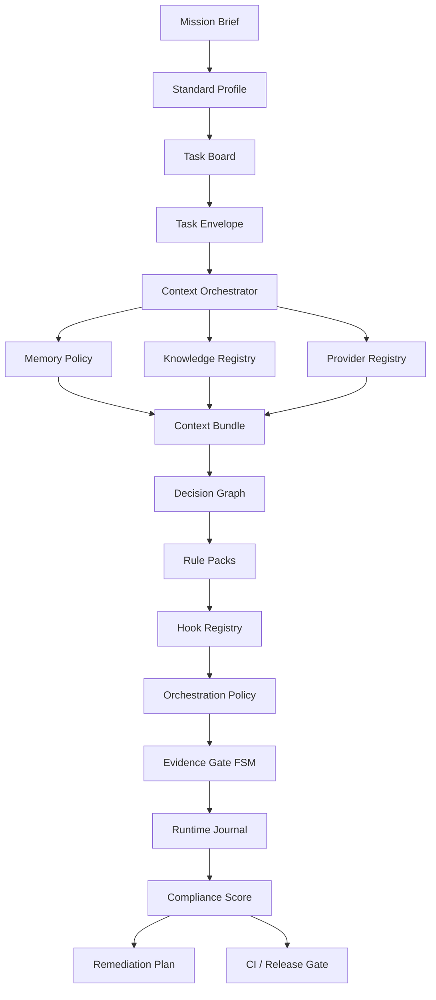

# Schéma et documentation cible du standard agentique

Cette page décrit l’architecture de convergence du standard agentique Grimoire. La cible maximale et idéale est définie dans [Cible finale standard agentique](agentic-standard-final-target.md). Cette page complète le guide d’intégration existant en décrivant les artefacts futurs, leurs relations et les règles de validation attendues.

## Contrat cible

Le contrat machine-readable de référence est :

```text
framework/agentic-standard/target-schema.yaml
```

Il définit :

- les principes normatifs ;
- les obligations par profil ;
- les artefacts cibles ;
- les checks attendus ;
- les commandes CLI prévues ;
- le flux runtime ;
- les critères de validation.

## Vue d’ensemble

```text
standard-profile.yaml
  ├─ mission-brief.md
  ├─ task-board.yaml
  │   └─ task-envelope.md
  │       └─ evidence-pack.md
  ├─ memory-policy.yaml
  ├─ knowledge-source-registry.yaml
  ├─ llm-provider-registry.yaml
  ├─ context-contract.yaml
  │   └─ context-bundle.yaml
  ├─ decision-graph.yaml
  ├─ rule-packs.yaml
  ├─ hook-registry.yaml
  ├─ orchestration-policy.yaml
  ├─ evidence-gates.yaml
  ├─ runtime-journal.jsonl
  ├─ pattern-catalog.yaml
  ├─ knowledge-graph-manifest.yaml
  ├─ compliance-score.yaml
  └─ remediation-plan.yaml
```

## Artefacts cibles

| Artefact | Chemin cible | Rôle |
|---|---|---|
| Task board | `_grimoire/standard/task-board.yaml` | Kanban normatif, cycle de vie, blockers, owners et evidence links. |
| Memory policy | `_grimoire/standard/memory-policy.yaml` | Règles mémoire par niveau : scope, fraîcheur, trust, rétention. |
| Context contract | `_grimoire/standard/context-contract.yaml` | Règles d’assemblage du contexte par tâche. |
| Context bundle | `_grimoire-output/context/{task_id}/context-bundle.yaml` | Contexte calculé, traçable, vérifiable. |
| Decision graph | `_grimoire/standard/decision-graph.yaml` | Matrices de décision pour provider, contexte, mémoire, agent, gates et release. |
| Rule packs | `_grimoire/standard/rule-packs.yaml` | Règles normatives exécutables et reliées aux checks. |
| Hook registry | `_grimoire/standard/hook-registry.yaml` | Hooks pré/post action, tool, provider, transition, release et rollback. |
| Orchestration policy | `_grimoire/standard/orchestration-policy.yaml` | Rôles, routing, handoffs, escalation et review gates. |
| Evidence gates | `_grimoire/standard/evidence-gates.yaml` | FSM de transitions conditionnées par preuves. |
| Runtime journal | `_grimoire-output/events/runtime-journal.jsonl` | Trace événementielle des décisions, hooks, gates et transitions. |
| Pattern catalog | `_grimoire/standard/pattern-catalog.yaml` | Catalogue exécutable de patterns normatifs. |
| Knowledge graph manifest | `_grimoire/standard/knowledge-graph-manifest.yaml` | Index documents → concepts → obligations → checks. |
| Compliance score | `_grimoire/standard/compliance-score.yaml` | Pondérations et seuils par profil. |
| Remediation plan | `_grimoire/standard/remediation-plan.yaml` | Corrections produites par audit. |

## Profils

### `minimal`

Profil d’adoption. Il exige les artefacts de base, un provider registry, un knowledge registry et un audit consultatif.

### `orchestrated`

Profil de travail réel. Il ajoute board, memory policy, context contract et evidence gates. Les gates peuvent avertir sans bloquer toutes les transitions.

### `governed`

Profil de release. Il ajoute orchestration policy, pattern catalog, knowledge graph, score, remediation et CI release gate. Les erreurs doivent bloquer la release.

## Flux runtime cible

1. Charger la mission et le profil.
2. Sélectionner une tâche depuis le board.
3. Résoudre memory, knowledge et provider policies.
4. Construire un context bundle.
5. Évaluer le decision graph.
6. Appliquer les rule packs.
7. Déclencher les hooks de phase.
8. Déduire l’orchestration applicable.
9. Vérifier les gates d’évidence.
10. Écrire les événements dans le runtime journal.
11. Calculer l’audit et le score.
12. Produire un plan de remediation si nécessaire.
13. Bloquer ou autoriser la transition selon le profil.

## Diagramme d’orchestration cible



## Decision graph

Le `decision-graph.yaml` est la couche qui rend les choix runtime explicables. Il ne remplace pas les policies ; il les connecte.

Décisions attendues :

- choisir ou refuser un provider ;
- inclure, exclure ou rédacter une mémoire ;
- accepter ou rafraîchir une source knowledge ;
- choisir un rôle agentique ;
- exiger une review ;
- escalader ;
- bloquer une transition ;
- proposer une remediation ;
- autoriser une release.

Chaque décision doit produire :

- les inputs évalués ;
- les règles appliquées ;
- la sortie ;
- la justification ;
- le niveau de confiance ;
- les événements émis.

## Rule packs

Les `rule-packs.yaml` regroupent les règles normatives exécutables.

Familles de règles :

- sécurité ;
- provider ;
- mémoire ;
- knowledge ;
- contexte ;
- orchestration ;
- evidence ;
- release ;
- remediation.

Chaque règle doit déclarer :

- `id` ;
- `source_normative` ;
- `severity` ;
- `condition` ;
- `action` ;
- `check_id` ;
- `hook_phase` optionnelle ;
- `remediation` optionnelle.

## Hook registry

Le `hook-registry.yaml` définit les points d’interception runtime.

Phases cibles :

| Phase | Exemples d’usage |
|---|---|
| `pre_context_build` | refuser une tâche non déclarée ou sans profil. |
| `post_context_build` | vérifier budget, redaction et sources. |
| `pre_provider_call` | bloquer un provider incompatible avec la policy. |
| `post_provider_call` | journaliser usage et résultat. |
| `pre_tool_call` | contrôler droits et scope outil. |
| `post_tool_call` | collecter evidence ou erreurs. |
| `pre_state_transition` | appliquer gates FSM. |
| `post_state_transition` | écrire l’événement runtime. |
| `pre_release` | vérifier score, gates et risques acceptés. |
| `on_failure` | générer remediation ou rollback. |
| `on_rollback` | tracer l’annulation. |

Actions possibles :

- `allow` ;
- `warn` ;
- `block` ;
- `redact` ;
- `reroute` ;
- `require_evidence` ;
- `escalate` ;
- `create_remediation` ;
- `rollback`.

## Règles de cohérence

- Un `task_id` doit être unique, stable et compatible avec les chemins sûrs.
- Une tâche en `review`, `accepted` ou `released` doit référencer un evidence pack.
- Un context bundle doit lister ses sources et leur ordre de priorité.
- Une source memory ou knowledge doit respecter freshness, trust et scope.
- Une route d’orchestration doit pointer vers un provider déclaré.
- Une décision doit pointer vers une règle ou une policy.
- Un hook bloquant doit produire une remediation ou une justification.
- Un événement release doit être présent dans le runtime journal en profil `governed`.
- Un score insuffisant doit générer une remediation.
- En profil `governed`, une erreur d’audit doit bloquer la release.

## CLI cible

```bash
grimoire standard board verify
grimoire standard task create
grimoire standard memory verify
grimoire standard context build --task-id bootstrap
grimoire standard context verify --task-id bootstrap
grimoire standard decision explain --task-id bootstrap
grimoire standard decision trace --task-id bootstrap
grimoire standard rules verify
grimoire standard hooks verify
grimoire standard hooks simulate --task-id bootstrap --phase pre_release
grimoire standard gate check --task-id bootstrap
grimoire standard events audit --task-id bootstrap
grimoire standard score
grimoire standard fix --dry-run
grimoire standard fix --apply
grimoire pattern list
grimoire pattern show <pattern-id>
grimoire pattern apply <pattern-id>
```

## Adoption dans un projet consommateur

Un projet consommateur comme Grimoire Forge devra progressivement ajouter :

```text
_grimoire/standard/task-board.yaml
_grimoire/standard/memory-policy.yaml
_grimoire/standard/context-contract.yaml
_grimoire/standard/decision-graph.yaml
_grimoire/standard/rule-packs.yaml
_grimoire/standard/hook-registry.yaml
_grimoire/standard/orchestration-policy.yaml
_grimoire/standard/evidence-gates.yaml
_grimoire/standard/pattern-catalog.yaml
_grimoire/standard/knowledge-graph-manifest.yaml
_grimoire/standard/compliance-score.yaml
```

La première cible stable est `orchestrated`. La cible finale est `governed`.
