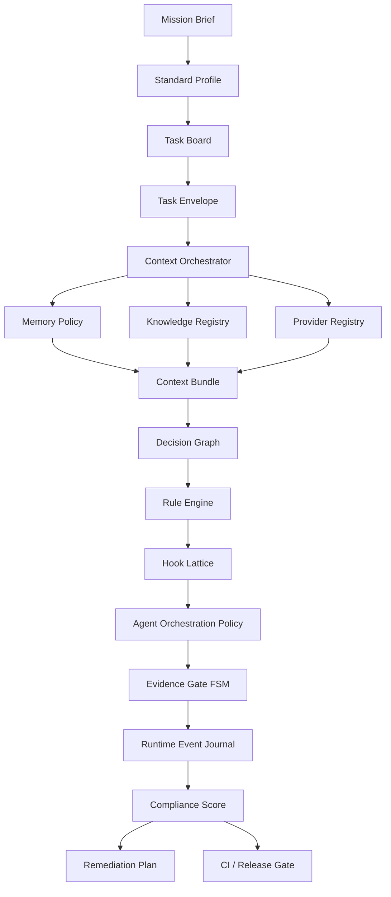
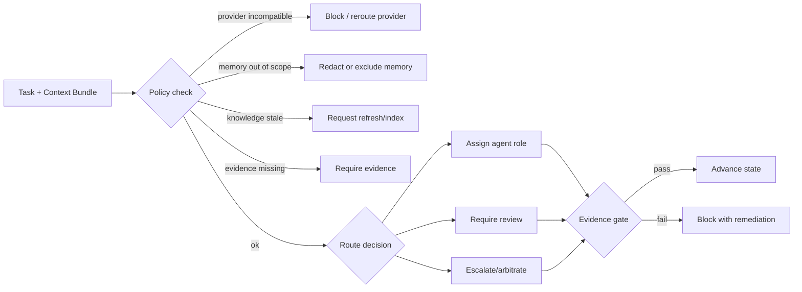
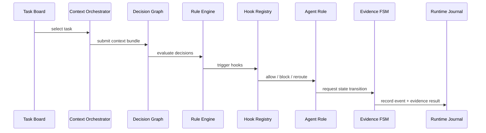

# Plan cible du runtime normatif agentique

Ce plan décrit la cible projet pour transformer la documentation normative Grimoire en runtime agentique gouverné. Le socle actuel fournit déjà `grimoire standard init/verify/audit/detect-providers`, les profils `minimal`, `orchestrated`, `governed`, les registres provider/knowledge et les artefacts de conformité. La suite consiste à rendre les patterns de kanban, mémoire, orchestration, contexte et preuves exécutables.

## Cible

```text
Normes et patterns
→ schémas machine-readable
→ artefacts projet
→ kanban normatif
→ mémoire multi-niveaux
→ orchestration de contexte
→ graphe de décision
→ rule packs et hooks runtime
→ orchestration agentique
→ FSM evidence-gated
→ journal d’événements
→ score conformité
→ remediation
→ CI / release gates
```

## Écart identifié

La première version du plan couvrait les artefacts principaux, mais restait trop légère par rapport au corpus normatif complet. La cible doit aussi intégrer :

- les diagrammes d’orchestration et de décision ;
- les rules hooks avant/après action ;
- les guardrails runtime ;
- les policies de routing ;
- les matrices de décision ;
- les événements observables ;
- les journaux de transitions ;
- les règles de conflit, d’escalade, d’arbitrage et de rollback.

La cible n’est donc pas seulement un ensemble de fichiers YAML. C’est un système d’exécution normatif composé de policies, hooks, décisions, traces et preuves.

## Diagramme cible d’orchestration



## Diagramme cible de décision



## Couches normatives cibles

| Couche | Rôle | Artefact cible |
|---|---|---|
| Profile layer | Définit le niveau d’obligation | `standard-profile.yaml` |
| Work layer | Kanban, tâches, blockers, owners | `task-board.yaml` |
| Context layer | Sélection, priorité et budget du contexte | `context-contract.yaml`, `context-bundle.yaml` |
| Memory layer | Scopes, rétention, trust et freshness mémoire | `memory-policy.yaml` |
| Knowledge layer | Sources, index, graphe documentaire | `knowledge-source-registry.yaml`, `knowledge-graph-manifest.yaml` |
| Provider layer | Providers, routing, fallback, données autorisées | `llm-provider-registry.yaml` |
| Decision layer | Matrices de décision et critères d’arbitrage | `decision-graph.yaml` |
| Rule layer | Règles normatives exécutables | `rule-packs.yaml` |
| Hook layer | Hooks pré/post action, gate, rollback | `hook-registry.yaml` |
| Orchestration layer | Rôles, handoffs, escalation, review | `orchestration-policy.yaml` |
| Evidence layer | FSM et preuves minimales | `evidence-gates.yaml` |
| Observability layer | Événements, traces, journal runtime | `runtime-journal.yaml` |
| Compliance layer | Score, audit, remediation | `compliance-score.yaml`, `remediation-plan.yaml` |

## P0 — Socle normatif exécutable

Objectif : convertir les concepts de la documentation en contrats vérifiables.

Livrables :

- `framework/agentic-standard/target-schema.yaml`
- schémas pour board, mémoire, contexte, orchestration, decision graph, hooks, rule packs, event journal, evidence gates, patterns, score ;
- extension de `profile-map.yaml` pour déclarer les obligations par profil ;
- matrice `normative-rule → artifact/check/hook/gate/score/remediation` ;
- tests de validation des contrats.

Critères de sortie :

- chaque règle normative pointe vers un artefact, un check, un gate, un score ou une remediation ;
- chaque hook a un trigger, une phase, un niveau de sévérité et une action ;
- chaque décision a une source, une règle, un résultat et une trace ;
- `minimal`, `orchestrated`, `governed` restent progressifs ;
- le mode `governed` peut devenir strict sans casser l’adoption initiale.

## P0 — Kanban normatif

Objectif : relier le travail réel aux preuves.

Artefact cible : `_grimoire/standard/task-board.yaml`.

Contenu minimal :

- backlog ;
- tâches avec `task_id`, statut, owner, priorité, blockers ;
- liens vers task envelope et evidence pack ;
- acceptance criteria ;
- gates attendus par transition.

Commandes cibles :

```bash
grimoire standard board verify
grimoire standard task create
grimoire standard task update
grimoire standard task verify
```

## P0 — Mémoire multi-niveaux gouvernée

Objectif : normer l’usage des mémoires existantes et futures.

Artefact cible : `_grimoire/standard/memory-policy.yaml`.

Niveaux :

- session ;
- project ;
- organization ;
- procedural ;
- semantic ;
- episodic ;
- long-term.

Chaque niveau doit déclarer :

- scope ;
- droits read/write ;
- rétention ;
- fraîcheur ;
- trust ;
- redaction ;
- compatibilité provider.

## P0 — Orchestrateur de contexte avancé

Objectif : produire un contexte déterministe, traçable et compatible avec la mission, la tâche, la mémoire, les sources knowledge et la policy provider.

Artefact cible : `_grimoire-output/context/{task_id}/context-bundle.yaml`.

Sources d’entrée :

- mission brief ;
- task board ;
- task envelope ;
- memory policy ;
- knowledge registry ;
- provider registry ;
- standard profile.

Commandes cibles :

```bash
grimoire standard context build --task-id bootstrap
grimoire standard context verify --task-id bootstrap
```

Le context bundle doit inclure :

- sources utilisées et sources exclues ;
- ordre de priorité ;
- budget contextuel ;
- redactions appliquées ;
- mémoire injectée ;
- knowledge nodes utilisés ;
- provider constraints ;
- hash ou fingerprint des entrées ;
- justification de décision.

## P0 — Graphe de décision normatif

Objectif : représenter les choix runtime sous forme traçable.

Artefact cible : `_grimoire/standard/decision-graph.yaml`.

Décisions couvertes :

- sélection du provider ;
- inclusion/exclusion mémoire ;
- inclusion/exclusion source knowledge ;
- choix agent/rôle ;
- besoin de review ;
- escalation ;
- blocage par gate ;
- remediation proposée ;
- autorisation de release.

Chaque décision doit déclarer :

- inputs ;
- règles évaluées ;
- résultat ;
- niveau de confiance ;
- evidence requise ;
- événement émis.

Commandes cibles :

```bash
grimoire standard decision explain --task-id bootstrap
grimoire standard decision trace --task-id bootstrap
```

## P0 — Rule packs et hooks runtime

Objectif : intégrer nos rules hooks comme surface normative officielle.

Artefacts cibles :

- `_grimoire/standard/rule-packs.yaml`
- `_grimoire/standard/hook-registry.yaml`

Phases de hooks :

- `pre_context_build`
- `post_context_build`
- `pre_provider_call`
- `post_provider_call`
- `pre_tool_call`
- `post_tool_call`
- `pre_state_transition`
- `post_state_transition`
- `pre_release`
- `on_failure`
- `on_rollback`

Types d’actions :

- allow ;
- warn ;
- block ;
- redact ;
- reroute ;
- require_evidence ;
- escalate ;
- create_remediation ;
- rollback.

Commandes cibles :

```bash
grimoire standard rules verify
grimoire standard hooks verify
grimoire standard hooks simulate --task-id bootstrap --phase pre_release
```

## P1 — Orchestration agentique normée

Objectif : convertir les patterns d’orchestration en politique exécutable.

Artefact cible : `_grimoire/standard/orchestration-policy.yaml`.

Domaines :

- rôles ;
- routing ;
- handoffs ;
- escalation ;
- arbitration ;
- review gates ;
- fallback ;
- compatibilité provider.

La policy doit aussi inclure :

- matrice rôle → responsabilité → evidence attendue ;
- matrice événement → hook → action ;
- règles de conflit entre agents ;
- règles d’arbitrage ;
- règles de rollback ;
- règles de handoff entre humains et agents ;
- limites d’autonomie par profil.

Diagramme cible :



## P1 — FSM evidence-gated

Objectif : empêcher ou signaler les transitions sans preuves.

Artefact cible : `_grimoire/standard/evidence-gates.yaml`.

États cibles :

```text
proposed → ready → in_progress → review → accepted → released → archived
              ↘ blocked ↗
```

Commandes cibles :

```bash
grimoire standard gate check --task-id bootstrap
grimoire standard gate explain --task-id bootstrap
```

La FSM doit émettre des événements :

- `task.proposed`
- `task.ready`
- `task.started`
- `task.blocked`
- `task.review_requested`
- `task.accepted`
- `task.release_requested`
- `task.released`
- `gate.failed`
- `gate.passed`
- `remediation.created`

## P1 — Catalogue de patterns exécutable

Objectif : classer les patterns et les rendre applicables par CLI.

Artefact cible : `_grimoire/standard/pattern-catalog.yaml`.

Familles :

- context ;
- memory ;
- orchestration ;
- workflow ;
- governance ;
- provider ;
- knowledge ;
- security ;
- quality ;
- runtime UX.

Commandes cibles :

```bash
grimoire pattern list
grimoire pattern show context.context-bundle
grimoire pattern apply governance.evidence-gate
```

## P1 — Doc-to-graph / knowledge index

Objectif : relier les checks aux sources normatives.

Artefact cible : `_grimoire/standard/knowledge-graph-manifest.yaml`.

Le graphe doit relier :

- documents sources ;
- concepts ;
- obligations ;
- recommandations ;
- checks ;
- patterns ;
- artefacts générés.

Chaque nœud d’obligation doit pouvoir répondre à :

- quelle règle impose ce comportement ?
- quel check la vérifie ?
- quel hook l’applique ?
- quel événement la trace ?
- quelle remediation corrige l’écart ?

## P1 — Journal runtime et observabilité normative

Objectif : rendre le runtime auditable après coup.

Artefact cible : `_grimoire-output/events/runtime-journal.jsonl`.

Événements minimaux :

- contexte construit ;
- décision prise ;
- hook déclenché ;
- provider routé ;
- mémoire incluse/exclue ;
- source knowledge utilisée ;
- gate passé/échoué ;
- transition FSM ;
- remediation créée/appliquée ;
- release autorisée/refusée.

Commandes cibles :

```bash
grimoire standard events tail
grimoire standard events audit --task-id bootstrap
```

## P2 — Score de conformité

Objectif : rendre l’audit lisible, pondéré et actionnable.

Artefact cible : `_grimoire/standard/compliance-score.yaml`.

Dimensions :

- artifacts ;
- provider policy ;
- knowledge registry ;
- task board ;
- memory policy ;
- context contract ;
- orchestration policy ;
- evidence gates ;
- pattern catalog ;
- knowledge graph ;
- decision graph ;
- rule packs ;
- hook registry ;
- runtime journal ;
- CI release gate.

Commande cible :

```bash
grimoire standard score --profile governed
```

## P2 — Remediation automatique

Objectif : transformer l’audit en corrections contrôlées.

Artefact cible : `_grimoire/standard/remediation-plan.yaml`.

Commandes cibles :

```bash
grimoire standard fix --dry-run
grimoire standard fix --apply
```

Contraintes :

- aucune modification destructive sans `--force` ;
- aucune écriture hors racine projet ;
- chaque correction doit pointer vers un check et une source normative.

Types de remediation :

- générer un artefact manquant ;
- compléter un champ obligatoire ;
- relier une evidence manquante ;
- ajouter une règle hook absente ;
- corriger une route provider ;
- déclarer une memory policy ;
- rafraîchir un knowledge index ;
- abaisser une tâche à `blocked` si gate impossible.

## P2 — Mode governed strict

Objectif : faire de `governed` un profil de release.

Règles :

- CI hard-fail sur score insuffisant ;
- providers verrouillés ;
- evidence gates obligatoires ;
- memory et knowledge freshness obligatoires ;
- release impossible si audit error.

Le profil `governed` doit aussi exiger :

- hooks activés ;
- rule packs vérifiés ;
- decision graph complet ;
- runtime journal non vide pour les tâches release ;
- score minimal par dimension, pas seulement score global ;
- interdiction des routes provider non déclarées ;
- justification explicite des risques acceptés.

## P3 — Adoption Forge et release

Objectif : faire de Forge le projet consommateur de référence.

Livrables :

- board Forge ;
- memory policy Forge ;
- context bundle bootstrap ;
- score audit Forge ;
- documentation Kit/Forge ;
- release PyPI.

## Validation globale

La cible sera considérée atteinte quand ces commandes seront stables :

```bash
grimoire standard init --profile governed
grimoire standard board verify
grimoire standard memory verify
grimoire standard context build --task-id bootstrap
grimoire standard gate check --task-id bootstrap
grimoire standard rules verify
grimoire standard hooks verify
grimoire standard decision explain --task-id bootstrap
grimoire standard events audit --task-id bootstrap
grimoire standard audit --markdown
grimoire standard score
```
