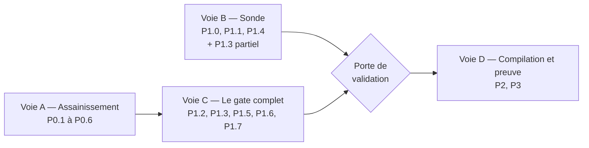

# Plan cible — gouvernance des agents cloud

Ce plan décrit la trajectoire qui amène grimoire-kit de son état actuel — un standard
agentique qui n'audite que les projets qu'il a lui-même scaffoldés — à une couche de
gouvernance opposable autour des runtimes d'agents cloud. La décision de positionnement
qui le commande est gravée dans
[ADR-004](adr-004-gouvernance-des-runtimes-cloud.md) : grimoire gouverne ces runtimes,
il n'en devient jamais un.

Le plan est établi sur une cartographie du code réel du kit et de l'état des trois
plateformes cibles au 2026-08-26. Chaque lot touche des fichiers existants et porte des
critères de sortie vérifiables par une commande, un test ou un artefact.

## Objectif final

> Depuis le dépôt d'un tiers qui ne contient aucun code grimoire, trois commandes
> lisent une définition d'agent cloud et les traces de ses exécutions, échouent de
> façon déterministe quand une preuve exigée manque, et produisent un artefact
> qu'un auditeur vérifie sans compte cloud et sans installer grimoire — le tout sans
> qu'aucun SDK cloud n'entre dans les dépendances du kit.

```bash
grimoire cloud gate <definition> --strict
grimoire cloud compile <definition> --target cedar|iam|otel
grimoire cloud audit <definition> --traces <spans.otlp.jsonl>
```

## Positionnement et fenêtre

Les trois postures visées, par coût croissant :

| Posture | Ce qu'elle livre | Statut concurrentiel |
|---|---|---|
| **P1 — Gate pré-déploiement** | La CI échoue quand une définition d'agent n'est pas conforme au profil | Libre. Aucun fournisseur ne bloque un pipeline sur la complétude d'une déclaration d'agent |
| **P2 — Compilation** | Une intention déclarée une fois produit les contrôles natifs du cloud cible | Libre. Aucun standard ne traduit une exigence vers Cedar, IAM, Azure Policy et Org Policy |
| **P3 — Audit post-run** | Les traces confrontées à la définition, scellées en preuve portable | **Contesté.** Les fournisseurs désertent la preuve de conformité, mais Microsoft Agent 365 est GA et vend explicitement de l'« audit-ready evidence » |

Deux mouvements de marché commandent le séquencement, et corrigent la thèse initiale :

1. **L'autorisation runtime n'est plus un terrain libre.** AgentCore Policy est GA
   depuis le 2026-03-03, en Cedar, default-deny, avec un `EnforcementMode LOG_ONLY`
   qui est nativement un mode shadow. Un shadow mode tiers n'a donc plus de valeur
   propre. Ce qui manque au-dessus reste l'agrégation en score, la progression dans le
   temps et le rapport lisible.
2. **La preuve de conformité a été désertée.** AWS Audit Manager n'accepte plus de
   nouveau compte depuis le 2026-04-30, n'ajoutera ni framework ni région, et sa FAQ
   renvoie explicitement vers des solutions partenaires. Ni Cloud Trace ni Application
   Insights ne scellent quoi que ce soit. C'est la faille principale à occuper.

Contre-signal, et il est plus lourd que les deux premiers points : **Microsoft Agent 365
est GA depuis le 2026-05-01**, vendu 15 $ par utilisateur et par mois ou inclus dans
M365 E7. Sa synchronisation de registre avec AWS Bedrock et Google Cloud est en
préversion publique et couvre déjà découverte, inventaire et cycle de vie (démarrer,
arrêter, supprimer) multi-plateformes, avec l'« audit-ready evidence » comme argument de
vente. S'y ajoutent Foundry Control Plane et Entra Agent ID, qui gouverne des agents
Bedrock par fédération d'identité.

Ce que cela laisse à grimoire, et qu'il faut assumer comme un périmètre étroit plutôt
qu'un espace ouvert : Agent 365 est un plan de contrôle centré sur un tenant Microsoft,
qui fait de l'**inventaire et du cycle de vie** sur des agents déjà déployés. Il ne fait
pas échouer un pipeline sur la complétude d'une déclaration avant déploiement, et ne
produit pas d'artefact vérifiable hors de son propre plan de contrôle. C'est cette bande
étroite — le design-time et la preuve portable — qui reste défendable. Elle ne se vendra
pas comme conformité réglementaire, dont l'échéance haut risque a glissé au 2027-12-02.

## Cible

```text
définition d'agent cloud (CloudFormation Harness / azure.yaml / reasoningEngines)
→ modèle neutre CloudAgentDefinition, avec couverture déclarée par facette
→ needs → patterns → checks du standard existant
→ gate pré-déploiement : code de sortie + JSON à schéma versionné
→ compilation vers Cedar / IAM / attributs OTel
→ ingestion OTLP des exécutions
→ réconciliation intention déclarée ↔ comportement observé
→ evidence pack in-toto, signé par la CI
→ vérifiable par un tiers sans compte cloud
```

## Règle d'or — compiler vers les surfaces ennuyeuses

La dette de maintenance récurrente est le risque existentiel d'un projet à un
développeur. La parade est de ne s'ancrer que sur des surfaces dont le rythme de
changement est annuel ou plus lent.

| Surface retenue | Pourquoi elle tient |
|---|---|
| Schémas CloudFormation `AWS::BedrockAgentCore::*`, `AWS::Bedrock::Guardrail` | Contrats de propriétés versionnés qu'AWS ne peut pas casser sans rupture IaC ; alimentent aussi CDK et Terraform `awscc` — un seul parseur couvre les trois |
| IAM, RBAC Entra, IAM GCP | Primitives les plus anciennes de chaque pile, sans invention propre aux agents |
| OTLP, modèle span/trace, W3C Trace Context | OpenTelemetry est CNCF *graduated* depuis le 2026-05-21 ; le signal tracing et OTLP sont stables, et les trois clouds ingèrent nativement |
| Cedar | Sémantique formelle prouvée en Lean, CNCF Sandbox depuis le 2025-12-15, implémentations Rust, Go, Java et WASM, adopté hors AWS |
| A2A AgentCard v1.0 + signature (§8.4) | Spécification 1.0 sous gouvernance Linux Foundation, source normative en Protocol Buffers, adoptée par les trois fournisseurs |
| OpenAPI et JSON Schema | Dix ans d'outillage, aucune volatilité |
| in-toto, DSSE, cosign keyless, Rekor | in-toto CNCF *graduated* depuis avril 2025 ; précédent direct avec OpenSSF Model Signing, adopté par NVIDIA depuis mars 2025 |

| Surface refusée | Preuve de churn |
|---|---|
| AWS Agent Registry | Passé GA le 2026-08-06 sous le namespace `agent-registry` ; refusé non pour instabilité mais parce que l'inventaire d'agents est un terrain que trois fournisseurs occupent déjà (voir Hors périmètre, point 10) |
| API Managed Agents de Google | Pre-GA, avec un identifiant daté en dur dans le contrat (`base_agent = "antigravity-preview-05-2026"`) |
| `agent.yaml` / `agent.manifest.yaml` Azure | Dépréciés en moins d'un an au profit d'un `azure.yaml` unifié |
| `AgentSchema` Microsoft | Format d'échange intra-Microsoft en `1.0.0-beta.x`, pas un standard neutre |
| Conventions sémantiques `gen_ai.*` | Aucun attribut marqué Stable, six vagues de rupture en deux ans, repo dédié sans release taggée et dont le Schema URL est encore un `TODO` |
| Guardrails, Model Armor, Content Safety | Trois taxonomies sans aucun mapping officiel entre elles |
| Politiques sémantiques GCP | Contraintes en langage naturel évaluées par LLM : non déterministes, non diffables, structurellement incompatibles avec une notion de preuve |
| `AWS::Bedrock::Agent` (classique) | Maintenance mode depuis le 2026-07-30 ; utile à **détecter**, jamais à cibler |

## Écart identifié

Le kit possède déjà les trois quarts des briques nécessaires. Elles sont écrites,
testées unitairement, et branchées sur rien. C'est l'écart réel, et il précède
tout travail cloud.

### Le fail-closed ne ferme pas

- `verify_standard_profile` appelle `_planned_artifacts(profile.id)` **sans** les
  `extra_artifacts`, alors que `setup_standard_profile` a déjà écrit la liste
  complète — extras compris — dans `standard-profile.yaml` via
  `_manifest_content(profile, name, task_id, artifacts)`. `verify` ouvre pourtant ce
  même fichier, mais n'en extrait que la clé `profile` (`_read_manifest_profile`). Après
  `standard init --needs solo-prototyping`, supprimer
  `_grimoire/standard/evidence-gates.yaml` laisse `ok=true, missing=[]`.
- `--strict` ne renvoie 2 que pour les profils `governed` et `production`
  (`cmd_standard.py:997`).
- `gate check` n'exécute pas la machine à états déclarée dans `evidence-gates.yaml` :
  les états et leurs artefacts requis sont codés en dur.

### Six verrous décoratifs mesurés

Le même geste se répète : la sémantique de gouvernance est en YAML, l'application est
en Python codée en dur ailleurs, et les deux ne se rencontrent jamais.

| Constat | Mesure |
|---|---|
| `check_refs` du pattern-catalog dont l'identifiant n'apparaît nulle part dans `src/` | 17 sur 66 |
| `check_id` de `rule-packs.yaml` ne pointant nulle part | 13 sur 14 |
| `rule_refs` sans règle correspondante | 21 sur 35 |
| Machine à états `evidence-gates.yaml` | Validée en forme, réimplémentée en dur juste à côté |
| `EvidenceService.verify()`, `evaluate_pack_trust()` | Aucun appelant de production |
| `GRIMOIRE_THREAT_MATRIX.coverage_pct()` | Rend 100 % parce que les `negative_test_id` ne sont jamais résolus |

Le digest SHA-256 d'un `EvidenceItem` est calculé une fois et jamais recomparé : le
check `digests-valid` teste seulement que la chaîne est non vide. Un pack dont tous les
fichiers ont été modifiés après coup passe.

### Les surfaces sont injoignables

`grimoire.runtime.*`, `grimoire.bridges.*` et `grimoire.traces.*` ne sont importés par
aucune commande CLI ni aucun outil MCP. Le `RuntimeKernel`, les adapters CrewAI et
LangGraph, le bridge A2A et le `TraceLedger` ne sont appelables qu'en `python -c`.
`VerificationGate` est écrit par trois converters et lu par zéro module.

### Le contrat d'adapter est recopié trois fois

`_slugify` est dupliqué mot pour mot dans `crewai_adapter.py`, `langgraph_adapter.py` et
`gascity_converter.py` ; la méthode d'entrée s'appelle successivement `import_flow`,
`import_graph` puis `convert` ; le garde-fou `output_schema` est vérifié dans deux
fichiers sur trois ; `VerificationGate(blocking=...)` vaut `False` dans deux et `True`
dans le troisième. Écrire un quatrième adapter par copie figerait cette divergence.

### Deux contraintes structurelles

- **Le ratchet.** `scripts/code-ratchet-baseline.json` fige
  `src/grimoire/core/agentic_standard.py` à 2980 lignes, appliqué en CI. Le module ne
  peut plus gagner une ligne : un registre de checks n'est pas une amélioration
  optionnelle, c'est la condition d'existence de tout check cloud.
- **La couverture CI est partielle, pas absente.** Une PR qui ne modifie que du YAML du
  standard déclenche bien `agentic-standard.yml` (`framework/agentic-standard/**`) et
  `ci-validate.yml` (`framework/**`), mais **pas** `ci-sdk.yml`, dont les `paths:`
  ignorent `framework/**`. Or c'est `ci-sdk.yml` qui exécute
  `tests/test_agentic_standard.py`, donc les tests d'intégrité référentielle de P0.2 ne
  tourneraient pas sur les PR qu'ils doivent précisément garder.

### Le trafic des traces est à sens unique

`TraceLedger` exporte vers OTel GenAI et vers Langfuse, et n'importe rien. `TraceRecord`
n'a aucun champ libre où loger la sortie des `normalize_*` des trois adapters, qui n'ont
donc littéralement aucun destinataire. Bug associé :
`_ns(tc.latency_ms.__class__.__name__)` passe la chaîne `"float"`, donc tous les
événements `grimoire.tool_call` exportés portent `timeUnixNano=0`.

## Séquencement

Le séquencement obéit à un principe : **aucun travail ne doit dépendre de la validité de
la thèse cloud tant que cette thèse n'a pas été confrontée à un dépôt réel.** Le paysage
concurrentiel s'est refermé pendant que ce plan s'écrivait, et rien ne garantit qu'il ne
se refermera pas davantage. Les travaux se répartissent donc en deux voies indépendantes
qui avancent en parallèle, puis une porte, puis le reste.



**Voie A — assainissement.** P0.1 à P0.6 se justifient **sans aucune thèse cloud**. Le
fail-closed qui ne ferme pas, les références mortes, l'absence de registre de checks et
le contrat d'adapter recopié trois fois sont des défauts du kit tel qu'il est livré
aujourd'hui. Ces lots restent à faire même si tout le reste de ce plan est abandonné :
ils ne sont pas un investissement dans le pari cloud, ils en sont indépendants. C'est la
raison pour laquelle ils passent en premier, et non parce qu'ils débloquent la suite.
P0.5 et P0.6, décrits en annexe, relèvent de la même justification : ils réparent un
champ mort et une limite de poste, indépendamment de toute thèse cloud.

**Voie B — sonde.** P1.0, P1.1, P1.4 et la moitié de P1.3 qui livre `grimoire cloud
inspect` et `grimoire cloud lifecycle` ne dépendent ni de la voie A ni du moteur du
standard : un parseur hors ligne, une table de cycle de vie, un rendu lisible et deux
commandes suffisent à produire un verdict réel — « cette définition cible une surface en
maintenance mode depuis telle date » — sur un dépôt que l'auteur n'a pas écrit. C'est le
moyen le moins cher de confronter la thèse au terrain, et il peut avancer en parallèle de
la voie A.

**Voie C — le gate complet.** P1.2, la seconde moitié de P1.3 qui livre `grimoire cloud
gate`, puis P1.5, P1.6 et P1.7 exigent les deux voies : le registre de checks d'un côté,
le modèle de définition de l'autre.

**Voie D — compilation et preuve.** P2 et P3 ne s'ouvrent qu'une fois la porte franchie.
Ce sont les lots les plus coûteux et les plus exposés à la concurrence ; les engager sur
une thèse non confrontée serait le pire emploi possible du temps disponible.

## Porte de validation

Entre la voie C et la voie D. Elle n'est pas décorative : tant qu'elle n'est pas
franchie, P2 et P3 restent fermés.

**Critères de franchissement** :

1. Le gate a été exécuté sur **au moins trois dépôts publics tiers** contenant une
   définition d'agent cloud, qu'aucun contributeur du kit n'a écrite. Les dépôts, leurs
   URL et le commit exercé sont consignés.
2. Chaque exécution a produit un verdict explicite — conforme, non conforme avec la
   raison, ou `not_computable` avec la facette manquante. Aucune n'a levé d'exception ni
   rendu un vert par défaut.
3. **Au moins un faux positif ou un faux négatif a été constaté**, puis corrigé ou tracé
   en waiver justifié. Une campagne qui ne trouve aucun défaut n'a rien mesuré : elle
   signale un jeu de dépôts trop proche des fixtures.
4. Le verdict rendu est lisible par quelqu'un qui n'a pas écrit le kit. Critère
   opérationnel : le rapport de P1.0 nomme la règle violée, l'emplacement dans la
   définition, et l'action attendue — sans exiger la lecture du JSON.

**Critère d'abandon.** Si les critères 1 et 2 sont atteints mais que les verdicts rendus
n'apprennent rien qu'un fournisseur ne dise déjà — Agent 365 pour l'inventaire, AgentCore
Policy pour l'autorisation — la voie D n'est pas ouverte et le chantier s'arrête à la
voie C. Le kit garde alors le bénéfice entier de la voie A, qui n'a jamais dépendu de ce
pari.

## P0 — Rendre honnête ce qui existe

### P0.1 — Fermer le trou du gate et figer le contrat de sortie (M)

**Objectif** : rendre le fail-closed réel, et donner à une CI tierce un contrat de
sortie sur lequel s'appuyer.

**Touche** : `core/agentic_standard.py`, `cli/cmd_standard.py`,
`tests/test_agentic_standard.py`, `.github/workflows/ci-sdk.yml`, `docs/adr-004-*.md`,
`mkdocs.yml`, `CHANGELOG.md`.

**Critères de sortie** :

- Un test scaffolde `standard init --needs solo-prototyping`, supprime
  `_grimoire/standard/evidence-gates.yaml`, et assert `ok=False` avec le fichier dans
  `missing`. Le test doit d'abord échouer sur le code actuel.
- `verify_standard_profile` lit la liste d'artefacts **déjà persistée** dans
  `standard-profile.yaml` plutôt que de la recalculer depuis le seul profil ; un test
  assert que deux projets de même profil mais de needs différents n'ont pas le même
  ensemble requis. Aucun nouveau fichier de manifeste n'est introduit.
- `standard gate check --strict` renvoie 2 dès que `ok` est faux, pour les cinq profils
  y compris `starter`.
- Les payloads JSON de `gate check`, `verify`, `audit` et `score` portent une clé
  `schema` de la forme `grimoire.standard-<verbe>/v1`, et un test verrouille la liste
  exacte des clés de premier niveau.
- Les deux blocs `paths:` de `ci-sdk.yml` listent `framework/agentic-standard/**`, pour
  que `tests/test_agentic_standard.py` s'exécute sur une PR YAML-only ; vérifié par une
  PR qui ne modifie que `capability-map.yaml`.
- `docs/adr-004-gouvernance-des-runtimes-cloud.md` est déclaré dans la nav mkdocs et
  tranche si le schéma `-o json` entre dans l'API publique définie par ADR-002.

**Risque** : le durcissement fait passer de vert à rouge des projets dont les
`extra_artifacts` n'ont jamais été générés. C'est l'effet voulu, mais il impose un bump
mineur assumé et une entrée CHANGELOG explicite.

### P0.2 — Solder l'intégrité référentielle des couches déclaratives (M)

**Objectif** : supprimer la possibilité même d'un verrou décoratif, par un test qui
refuse toute déclaration sans exécutant.

**Touche** : `framework/agentic-standard/templates/pattern-catalog.yaml`,
`rule-packs.yaml`, `capability-map.yaml`, `profile-map.yaml`,
`tests/test_agentic_standard.py`, `docs/gen-governed-controls.py`.

**Critères de sortie** :

- Un test `test_declarative_refs_resolve` assert trois inclusions : tout `check_refs`
  appartient aux ids de checks réellement émis, tout `rule_refs` aux ids de
  `rule-packs.yaml`, tout `check_id` aux checks émis. Il doit d'abord échouer en listant
  les références orphelines.
- Un test symétrique assert que tout `artifacts:` de `capability-map.yaml` existe dans
  `artifact_types` de `profile-map.yaml` et y a une entrée `generation_targets`.
- Chaque référence orpheline a un sort tracé — supprimée ou implémentée — et le
  CHANGELOG les énumère. Aucune n'est laissée en l'état.
- `python docs/gen-governed-controls.py` régénéré et
  `test_governed_controls_doc_covers_all_patterns` vert.
- `standard verify` sur un projet neuf produit strictement les mêmes ids de checks
  qu'avant le lot : on retire des promesses, pas des contrôles.

**Risque** : la tentation d'implémenter les 17 checks manquants pour ne pas « perdre »
de gouvernance, ce qui transformerait un lot d'hygiène en chantier. Le lot supprime
par défaut ; implémenter est l'exception justifiée cas par cas.

### P0.3 — Registre de checks (L)

**Objectif** : remplacer le dispatch plat de 39 vérificateurs par un registre, seule
façon d'ajouter un check cloud sous le ratchet.

**Touche** : `core/agentic_standard.py`, `core/standard_checks/`,
`scripts/code-ratchet-baseline.json`, `tests/test_agentic_standard.py`,
`cli/cmd_standard.py`.

**Critères de sortie** :

- `python scripts/check-code-ratchet.py` passe et l'entrée `agentic_standard.py`
  descend strictement sous 2980, jamais par une hausse du plafond.
- Aucun nouveau fichier de `core/standard_checks/` ne dépasse 1500 lignes.
- Un check se déclare par une entrée de registre portant id, sévérité, artefact et
  dimension de score. Un test assert que tout id émis a une dimension déclarée et
  qu'aucun ne retombe dans le bucket `artifacts` par défaut.
- `standard verify` et `standard score` produisent, sur un projet de référence, une
  sortie JSON octet pour octet identique à celle d'avant le lot.
- Les 30+ assertions existantes sur des ids de checks précis passent sans modification :
  l'extraction ne renomme rien.

**Risque** : c'est une refonte, pas un incrément. Découpée en plusieurs PR, le ratchet
peut bloquer l'état intermédiaire.

### P0.4 — Contrat d'adapter unique (S)

**Objectif** : factoriser avant de dupliquer une quatrième fois.

**Touche** : `runtime/adapter_base.py` (nouveau), `runtime/crewai_adapter.py`,
`runtime/langgraph_adapter.py`, `runtime/gascity_converter.py`, `runtime/__init__.py`.

**Critères de sortie** :

- `grep -rn "def _slugify" src/grimoire/` renvoie exactement une définition.
- `runtime/adapter_base.py` déclare un `Protocol` avec `source_id` et
  `to_recipe(raw, *, recipe_id_prefix) -> tuple[Recipe, ImportReport]`, plus une
  dataclass `ImportReport` commune.
- Les trois adapters satisfont le Protocol, vérifié par un test qui les instancie via
  une liste et appelle `to_recipe` sur une fixture pour chacun ; les anciens noms
  restent en alias `@deprecated` conformément à ADR-002.
- Un test négatif assert `report.ok is False` sur une définition sans `output_schema`,
  pour les trois adapters, et `blocking` prend le même défaut partout.
- `from grimoire.runtime import Recipe, RecipeStep, VerificationGate` fonctionne.

**Risque** : sur-ingénierie du Protocol en anticipant des besoins cloud non constatés.
Le Protocol se limite à ce que les trois adapters existants font déjà.

## P1 — Le gate pré-déploiement

### P1.0 — Sortie lisible par un humain (S)

**Objectif** : le plan désigne deux fois « le rapport lisible » comme la valeur qui reste
face aux fournisseurs. Sans ce lot, tout sort en JSON et en codes de sortie, et cette
valeur n'est produite par aucun lot. C'est aussi le critère 4 de la porte de validation.

**Touche** : `cli/cmd_cloud.py`, `core/report.py`, `tests/unit/cli/`.

**Critères de sortie** :

- Le rendu par défaut des commandes `grimoire cloud` (sans `-o json`) est un rapport
  texte qui nomme, pour chaque finding : la règle violée, l'emplacement dans la
  définition source, et l'action attendue. Un test assert la présence des trois éléments.
- Le rendu réutilise la voie de rendu markdown existante (`_audit_markdown`,
  `cmd_standard.py:196`) plutôt que d'en créer une seconde ; un test assert qu'il n'existe
  pas deux implémentations de rendu de findings.
- Un rapport sur zéro finding dit explicitement ce qui a été vérifié, jamais une sortie
  vide : un silence ne se distingue pas d'une commande qui n'a rien fait.
- `-o json` reste disponible et inchangé, conformément au contrat de sortie de P0.1.

**Risque** : glisser vers un rapport riche et joli. Le critère est qu'un humain sache
quoi faire, pas qu'il trouve la sortie agréable.

### P1.1 — Modèle neutre et trois parseurs hors ligne (M)

**Objectif** : donner une entrée au moteur, qui ne sait aujourd'hui auditer que ce
qu'il a lui-même scaffoldé.

**Touche** : `runtime/cloud_agent.py`, `runtime/cloud/bedrock.py`,
`runtime/cloud/vertex.py`, `runtime/cloud/foundry.py`,
`tests/unit/test_portable_imports.py`.

**Critères de sortie** :

- Trois fixtures réelles versionnées se parsent en `CloudAgentDefinition` : un template
  CloudFormation contenant `AWS::BedrockAgentCore::Harness` et `::Policy`, un
  `azure.yaml` avec un service `azure.ai.agent`, un JSON de ressource
  `reasoningEngines`. Un test par cloud.
- `CloudAgentDefinition` porte une couverture par facette
  (`declared` / `undeclared` / `not_applicable`). Le test Vertex assert que
  `instructions` et `tools` sont `undeclared`, le test Bedrock qu'ils sont `declared`.
  **Aucune facette ne vaut `declared` par défaut.**
- Un test par analyse AST assert que `grimoire.runtime.cloud` n'importe ni `boto3`, ni
  `google`, ni `azure`, et que `pyproject.toml` n'a gagné aucune dépendance runtime.
- Parser un `AWS::Bedrock::Agent` classique produit un warning nommé, pas une exception.
- Chaque fixture est **capturée depuis une source publique tierce** que l'auteur n'a pas
  écrite, et porte un en-tête de provenance (`source_url`, `captured_at`,
  `upstream_version`) ; un test assert que les trois champs sont présents et non vides.
  Une fixture écrite par l'auteur teste le parseur contre ses propres hypothèses.

**Risque** : la tentation de suivre les API plutôt que les schémas. Cibler la CLI
`agentcore`, `boto3` ou l'API Managed Agents fait entrer dans le kit le rythme de
release de trois fournisseurs.

### P1.2 — Brancher le cloud dans le moteur needs → patterns → checks (M)

**Objectif** : rendre la gouvernance cloud native au standard plutôt que parallèle
à lui. La couture existe et elle est intégralement pilotée par les données.

**Touche** : `needs-catalog.yaml`, `capability-map.yaml`, `pattern-catalog.yaml`,
`templates/cloud-agent-contract.yaml`, `profile-map.yaml`, `core/standard_checks/`,
`core/needs_suggest.py`.

**Critères de sortie** :

- `standard plan --needs cloud-agent-governance` résout sans warning ;
  `test_every_need_resolves_without_warnings` reste vert.
- `standard init --needs cloud-agent-governance` génère
  `_grimoire/standard/cloud-agent-contract.yaml`, et `standard verify` renvoie zéro
  check sur le template livré.
- Grâce à P0.1, supprimer ce contrat après l'init fait passer `verify` en `ok=False`.
- Au moins un test négatif par nouveau check, sur le modèle de
  `test_detects_bad_privilege_boundary`.
- `needs_suggest.py` détecte le need depuis un signal réel du dépôt — présence de
  `AWS::BedrockAgentCore::` dans un template, `azure.yaml` avec host `azure.ai.agent` —
  et produit la preuve associée.
- Chaque nouveau check est routé dans une dimension de score déclarée, préfixe `cloud.`,
  **et cette dimension porte un poids non nul**. Sans quoi le routage est inerte :
  `percentage = int((earned / weight) * 100) if weight else 100` — une dimension de poids
  zéro score 100 %. Un test assert qu'aucune dimension `cloud.` n'a un poids nul dans le
  `compliance-score.yaml` généré.

**Risque** : ajouter du déclaratif à du déclaratif sans exécutant, c'est-à-dire
reproduire le défaut soldé en P0.2. Le test d'intégrité référentielle est le garde-fou
et doit rester en place tout le plan.

### P1.3 — Surface exécutable : `grimoire cloud` (M)

**Objectif** : rendre joignable ce que P1.1 et P1.2 produisent. C'est le manque numéro
un du kit : aucun module `runtime`, `bridges` ou `traces` n'est importé par une CLI.

**Livré en deux temps.** `grimoire cloud inspect` et `grimoire cloud lifecycle` ne
dépendent que de P1.1 et P1.4 : ils appartiennent à la voie B et doivent être livrés
avec elle, sinon la sonde n'a aucun point d'exécution. `grimoire cloud gate` exige les
checks de P1.2 et arrive avec la voie C.

**Touche** : `cli/cmd_cloud.py`, `cli/app.py`, `mcp/server.py`, `tests/unit/cli/`,
`tests/unit/mcp/test_server.py`, `docs/cli-reference.md`.

**Critères de sortie** :

- `grimoire cloud inspect <fixture> --cloud bedrock -o json` sort le
  `CloudAgentDefinition` normalisé, couverture par facette incluse.
- `grimoire cloud gate <fixture> --strict` renvoie 0 sur conforme, 1 sur non conforme
  sans `--strict`, 2 avec. Payload portant `"schema": "grimoire.cloud-gate/v1"`.
- La commande fonctionne sur un répertoire jamais scaffoldé par grimoire, testé dans un
  tmpdir contenant seulement le template CloudFormation.
- Un outil `grimoire_cloud_gate` est ajouté au serveur MCP et importé nommément dans
  ses tests.
- `docs/cli-reference.md` documente les commandes, ce qui les fait entrer dans le
  périmètre opposable d'ADR-002.

**Décision tranchée** : groupe de **premier niveau** `grimoire cloud`, aux côtés de
`standard`, `blueprint`, `cockpit`, `registry` et `ext`. Le critère n'est pas
l'esthétique mais le préalable : toute sous-commande de `grimoire standard` lit
`_grimoire/standard/` dans un projet scaffoldé, alors que `grimoire cloud gate` doit
fonctionner dans un dépôt que grimoire n'a jamais touché. Nicher les commandes cloud
sous `standard` signalerait un prérequis inexistant, et rendrait le gate inutilisable
là où il a précisément sa valeur — le dépôt d'un tiers.

### P1.4 — Radar de cycle de vie des surfaces (S)

**Objectif** : une capacité vendable immédiatement, qui ne dépend d'aucune thèse sur les
agents. Personne, chez aucun fournisseur, ne répond à « lesquelles de mes définitions
ciblent une surface en préversion ou en maintenance mode ».

**Touche** : `framework/agentic-standard/cloud-surface-lifecycle.yaml`,
`runtime/cloud/lifecycle.py`, `cli/cmd_cloud.py`, `tests/unit/cloud/`.

**Critères de sortie** :

- `grimoire cloud lifecycle <fixture>` signale `AWS::Bedrock::Agent` avec
  `status=maintenance_mode` et la date 2026-07-30 ; exit 1 en `--strict`.
- Signale `agent.manifest.yaml` comme format déprécié et nomme `azure.yaml` comme
  remplaçant.
- La table porte un champ `reviewed_at` ; passé un seuil déclaré, chaque finding se
  dégrade en `warning` avec mention explicite de table périmée, au lieu d'affirmer un
  statut qui n'est plus vérifié.

**Risque** : la table est une donnée périssable. Le mécanisme de dégradation par
`reviewed_at` est ce qui l'empêche de devenir un mensonge, il n'est pas optionnel.

### P1.5 — Écart entre intention déclarée et surface effective (M)

**Objectif** : le premier contrôle réellement différenciant, calculable entièrement au
design-time. Aucun fournisseur ne confronte ce qu'un agent déclare à ce qu'il peut faire.

**Touche** : `runtime/cloud/drift.py`, `runtime/cloud/iam.py`, `cli/cmd_cloud.py`,
`policies/security.py`, `tests/unit/cloud/`.

**Critères de sortie** :

- `grimoire cloud drift <fixture> -o json` sort `excess_permissions[]` et
  `unmediated_tools[]` non vides sur une fixture où le rôle IAM accorde plus que ce que
  la définition déclare ; exit 1.
- Le détecteur signale `bedrock-agentcore:GetWorkloadAccessTokenForUserId` — qui accepte
  un identifiant fourni par l'appelant sans vérification IdP — en sévérité `error`, et le
  distingue de `GetWorkloadAccessTokenForJWT`.
- Le détecteur compte les outils déclarés qui ne transitent par aucun Gateway, donc hors
  de portée du moteur de policy natif.
- Deux nouvelles `ThreatEntry` dans `GRIMOIRE_THREAT_MATRIX`, chacune avec un
  `negative_test_id` pointant vers un test réellement présent, plus un test qui vérifie
  que **tout** `negative_test_id` de la matrice se résout — ce qui corrige le
  `coverage_pct()` actuel, à 100 % en mentant.

**Risque** : glissement vers le runtime. Détecter un écart est du design-time ; le
bloquer en vol serait du runtime et sortirait du périmètre d'ADR-004.

### P1.6 — Contrat CI consommable par un dépôt tiers (S)

**Objectif** : le gate n'existe comme produit que s'il tourne dans le pipeline de
quelqu'un d'autre.

**Touche** : `.github/actions/grimoire-cloud-gate/action.yml`,
`.github/workflows/agentic-standard.yml`, `docs/ci-gate.md`, `mkdocs.yml`.

**Critères de sortie** :

- Un job construit dans `$RUNNER_TEMP` un dépôt jetable contenant une définition
  conforme puis une non conforme, invoque l'action sur les deux, et assert explicitement
  les codes 0 puis 2 — sans `continue-on-error` masquant l'échec.
- `action.yml` épingle la version du kit, ne contient aucune logique hors de l'appel
  CLI, et expose en sortie le chemin du payload JSON.
- `docs/ci-gate.md` publie la table des codes de sortie et le schéma
  `grimoire.cloud-gate/v1` ; `mkdocs build --strict` passe.

**Risque** : une action publiée devient une surface versionnée indépendamment du wheel,
avec son propre cycle de release et ses propres ruptures. La mitigation est de la garder
sans logique. Si l'appétit manque, livrer le snippet documenté et testé en CI plutôt que
l'action packagée : le contrat, pas le paquet.

### P1.7 — Waiver tracé pour les checks cloud (S)

**Objectif** : donner au faux positif une sortie légitime. Un gate qui échoue sur un cas
que l'utilisateur sait faux, sans échappatoire tracée, est contourné en désactivant le
gate — et le contrôle est perdu entièrement plutôt que localement.

Le kit possède déjà la primitive : `framework/agentic-standard/templates/waivers.yaml`
est scaffoldé et vérifié (`agentic_standard.py:1629`). Ce lot l'étend aux checks cloud
plutôt que d'inventer un second mécanisme.

**Touche** : `framework/agentic-standard/templates/waivers.yaml`,
`core/standard_checks/`, `cli/cmd_cloud.py`, `docs/ci-gate.md`.

**Critères de sortie** :

- Un waiver portant `check_id`, `reason` et `expires_at` fait passer le check
  correspondant de `error` à une mention explicite dans le rapport, et le gate en exit 0.
  Test avec une fixture non conforme plus son waiver.
- Un waiver **expiré** ne waive plus : le check redevient bloquant et le rapport nomme la
  date d'expiration. Test dédié — c'est la seule chose qui empêche un waiver de devenir
  permanent.
- Un waiver sans `reason` ou sans `expires_at` est refusé à la vérification, pas ignoré
  silencieusement.
- Le rapport de P1.0 liste les checks waivés séparément des checks passés : un vert
  obtenu par waiver ne se confond jamais avec un vert obtenu par conformité.
- L'evidence pack de P3.3, quand il existe, porte les waivers actifs dans son predicate.

**Risque** : le waiver sans date, qui transforme le gate en décoration. L'expiration
obligatoire et son test négatif sont ce qui distingue ce lot d'une trappe.

## P2 — La compilation vers les contrôles natifs

### P2.1 — Champ `compiles_to:` et backend Cedar (L)

**Objectif** : qu'une intention déclarée une fois produise la plomberie du cloud cible.
Les 36 patterns ne portent aujourd'hui aucun mapping vers une primitive : leur seul champ
de traçabilité est `source_normative`, une chaîne libre que le code ne résout jamais.

**Touche** : `capability-map.yaml`, `pattern-catalog.yaml`, `core/cloud_compile/`,
`cli/cmd_cloud.py`.

**Critères de sortie** :

- `grimoire cloud compile <fixture> --target cedar` produit des policies identiques à un
  golden versionné.
- Un test assert que la liste des cibles acceptées est exactement
  `{cedar, iam, otel, openapi}` et qu'aucun backend ne vise une API d'agent. C'est le
  verrou architectural du lot : il existe en test, pas en commentaire.
- Un test assert que chacun des 36 patterns porte soit un `compiles_to`, soit
  `compiles_to: none` avec une raison textuelle. Aucun silence.
- La sortie Cedar est validée structurellement à chaque exécution, plus par le binaire
  `cedar` s'il est présent, dans un test marqué `integration` désélectionné par défaut.
- Compiler une définition Vertex dont les outils sont `undeclared` **refuse** de produire
  une politique et le dit ; le test assert le refus explicite, pas une sortie vide.

**Risque** : compiler des références mortes produirait des politiques mortes. C'est
pourquoi ce lot dépend de P0.2 et ne peut pas le précéder.

### P2.2 — Backends IAM et OTel (M)

**Objectif** : étendre la compilation aux deux autres primitives ennuyeuses, en gardant
la même discipline de golden.

**Critères de sortie** :

- `--target iam` produit des statements JSON identiques à un golden ; `--target otel`
  produit la liste d'attributs attendus.
- `docs/governed-controls.md` régénérée avec la colonne de cible de compilation.
- Un test assert qu'aucun backend n'émet vers Guardrails, Model Armor ou Content Safety :
  trois taxonomies sans mapping officiel, à refaire chaque trimestre pour zéro valeur
  différenciante.

## P3 — L'audit post-run et la preuve opposable

### P3.1 — Ingestion OTLP (M)

**Objectif** : ouvrir la porte d'entrée. La flèche est aujourd'hui à sens unique et dans
le mauvais sens.

**Touche** : `traces/schemas.py`, `traces/ledger.py`, `tests/unit/test_traces.py`.

**Critères de sortie** :

- `TraceRecord` gagne `source: str` et `normalized_payload: dict` ; un test relit une
  ligne JSONL écrite avant le lot et assert la rétro-compatibilité.
- `TraceLedger.import_otel_jsonl(src)` existe ; un test de round-trip prouve que
  `export_otel_jsonl` puis `import_otel_jsonl` restitue `run_id`, `model`, `token_usage`
  et les `tool_calls`.
- Le bug `_ns(tc.latency_ms.__class__.__name__)` est corrigé ; un test assert un
  horodatage non nul, là où le test actuel ne compte que les lignes écrites.
- La correspondance `gen_ai.*` vit dans une **table versionnée par version de semconv**,
  isolée du modèle interne. Un test importe un span dépourvu de `gen_ai.provider.name`
  sans lever, en marquant l'attribut manquant dans `normalized_payload`.
- Un test importe des spans d'un émetteur différent, sans attributs `grimoire.*`, et
  produit un `TraceRecord` exploitable.
- La sortie des `normalize_*` des adapters est effectivement persistée : ces fonctions
  ont enfin un destinataire.

**Risque** : s'aligner sur `gen_ai.*` comme schéma interne serait une dette permanente.
Le schéma interne reste celui du kit ; `gen_ai.*` est une entrée optionnelle, mappée et
fail-open. Ne jamais écrire « conforme à GenAI semconv vX » : aucune version épinglable
n'existe.

### P3.2 — Câbler la preuve non signée qui existe déjà (M)

**Objectif** : le geste le moins cher et le plus rentable du plan. Avant d'ajouter de la
preuve signée, brancher celle qui est écrite, testée et appelée par personne.

**Touche** : `evidence/service.py`, `evidence/schemas.py`, `runtime/recipes.py`,
`policies/security.py`, `cli/cmd_evidence.py`.

**Critères de sortie** :

- `grimoire evidence verify <root> --task <id> -o json` existe, suit le contrat de sortie
  de P0.1, et sort en exit 1 sur verdict non ok.
- Le check `digests-valid` **recalcule** le SHA-256 depuis `uri` et le compare ; un test
  crée un pack, modifie le fichier référencé, et assert que `verify` échoue.
- `Recipe.blocking_gates()` et `check_gates(recipe, pack)` existent et sont appelées par
  le CLI ; `grep -rn "verification_gates" src/` montre un lecteur hors des converters.
- `evaluate_pack_trust` est appelée depuis le CLI ; un test de bout en bout prouve qu'un
  pack de tier `VERIFIED` sans signature est refusé.
- `get_latest_verdict` trie par `created_at` ; un test écrit deux verdicts en ordre
  inversé et assert que le plus récent est rendu.
- Les deux vocabulaires de risque incompatibles sont réconciliés ou pontés par une table
  testée.

**Risque** : le recalcul de digest transforme des packs aujourd'hui valides en packs
invalides. Effet voulu, mais il peut casser des projections cockpit qui relisent ces
packs.

### P3.3 — Evidence pack portable, signature déléguée à la CI (M)

**Objectif** : occuper la faille laissée ouverte par les fournisseurs, sans jamais faire
entrer de clé dans le kit.

**Touche** : `evidence/schemas.py`, `evidence/service.py`, `cli/cmd_cloud.py`,
`.github/workflows/publish.yml`, `.github/workflows/release.yml`.

**Critères de sortie** :

- `grimoire cloud audit <definition> --traces <spans> -o json` produit un in-toto
  Statement — subject = digest du bundle, `predicateType` propre à grimoire — qui valide
  contre le schéma in-toto v1.
- Un test assert que `pyproject.toml` n'a gagné **aucune** dépendance cryptographique :
  ni `cryptography`, ni `pynacl`, ni `PyJWT`. Le kit produit un Statement non signé ; la
  CI signe avec cosign keyless via OIDC.
- Un `EvidenceProfile` dédié à l'audit cloud est ajouté avec ses `EvidenceKind` requis ;
  un test prouve qu'un pack sans trace ni rapport est refusé.
- Le doublon de chaîne de release est tranché : `publish.yml` et `release.yml` se
  déclenchent aujourd'hui tous deux et créent chacun une release avec des assets
  différents. Un seul crée désormais une GitHub Release sur tag `v*.*.*`.
- `publish.yml` ajoute `actions/attest-build-provenance` et la permission
  `attestations: write` ; un job vérifie l'attestation et échoue si elle est absente.
- `docs/ci-gate.md` décrit la vérification par un tiers, en une commande, sans installer
  grimoire.

**Risque** : la pente naturelle est d'écrire une signature maison parce que c'est plus
rapide qu'une chaîne CI. Cela introduirait génération, rotation, révocation, stockage et
distribution du matériel de vérification aux auditeurs : une infrastructure, pas une
fonction, non amortissable à une personne.

### P3.4 — Réconcilier l'intention déclarée et le comportement observé (L)

**Objectif** : le contrôle à plus haute valeur du plan, et celui que personne n'occupe.
Le registre stocke une carte d'agent, l'observabilité stocke des traces, les évaluations
notent la qualité des réponses — rien ne dit « la définition déclare deux outils, les
traces en montrent trois ».

**Touche** : `core/standard_checks/`, `cli/cmd_cloud.py`, `runtime/cloud_agent.py`,
`traces/schemas.py`, `policies/security.py`.

**Critères de sortie** :

- `grimoire cloud audit <definition> --traces <spans>` liste tout outil appelé dans les
  traces qui n'est pas dans les outils déclarés, et sort en exit 1. Test avec une fixture
  déclarant deux outils et une trace en montrant trois.
- Les écarts sont émis comme checks de préfixe `cloud.drift.`, routés dans une dimension
  de score déclarée, et figurent dans le predicate de l'evidence pack de P3.3.
- Sur une définition Vertex dont les outils sont `undeclared`, l'audit rend
  `not_computable` avec la raison. Un test assert que ce n'est ni un succès ni un échec
  silencieux : **la parité entre clouds n'est jamais simulée**.
- Le contrôle détecte au moins un second écart structurel — appel de modèle hors
  allowlist, ou dépassement du plafond d'itérations déclaré — avec un test négatif par
  écart.
- L'audit rend un **taux de couverture des traces** à côté de son verdict.

**Risque** : l'écart mesuré n'a de sens que si les traces sont exhaustives. Un
échantillonnage OTel, un agent partiellement instrumenté ou un appel d'outil qui ne passe
pas par le Gateway produisent un faux « conforme ». Sans le taux de couverture, ce
contrôle devient précisément le verrou décoratif que tout le plan cherche à éviter.

## Hors périmètre

Ces refus sont opposables. Chacun doit exister comme test ou comme absence vérifiable,
pas comme intention.

1. **Devenir un runtime, même par accident.** Câbler `PolicyEngine.evaluate_or_raise`
   dans le `tool_mediator` de `RuntimeKernel.mediate_tool` est le geste le plus naturel
   du dossier — quatre modules qui s'ignorent, une seule fonction à injecter — et c'est
   la ligne à ne pas franchir. Que `RuntimeKernel.create_instance` ne prenne qu'un
   `recipe_id` et n'importe pas `recipes.py` est une propriété à préserver, pas un bug.
2. **Toute dépendance à un SDK cloud.** `pip-audit --strict` tourne sur l'environnement
   complet `[dev]` qui tire `[all]` : chaque SDK ajouté peut rendre `main` rouge sans
   qu'une ligne du kit ait bougé, avec pour seule sortie un waiver daté.
3. **Compiler vers les API d'agents.** Action groups, agent aliases, Harness API,
   AgentSchema, Managed Agents API. Le test de P2.1 l'interdit en dur.
4. **Écrire un moteur de règles maison.** Ni l'évaluateur des `condition` de
   `rule-packs.yaml`, ni l'exécuteur de la machine à états d'`evidence-gates.yaml`. Soit
   on compile vers un moteur existant, soit on purge la promesse déclarative.
5. **Réimplémenter un mode shadow.** AWS expose déjà `EnforcementMode: LOG_ONLY`. Ce qui
   manque au-dessus est l'agrégation en score et le rapport, pas le mécanisme.
6. **Faire entrer la cryptographie dans le kit.** Pas d'Ed25519, pas de PKI, pas même un
   HMAC à clé de dépôt.
7. **Créer un troisième espace de noms de patterns.** Deux coexistent déjà et divergent
   en silence : les 36 patterns kebab-case exécutables, et les 78 identifiants
   `ORC-xx` / `GOV-xx` importés d'un dépôt externe à un commit épinglé. Toute mécanique
   cloud se rattache aux 36.
8. **Étendre `HostId`** avec Bedrock, Vertex ou Foundry.
9. **Adopter `gen_ai.*` comme schéma interne de preuve.**
10. **Construire un registre d'agents multi-organisation.** Le terrain est pris :
    Microsoft Agent 365 est GA depuis le 2026-05-01 et synchronise déjà son registre avec
    AWS Bedrock et Google Cloud, AWS Agent Registry est GA depuis le 2026-08-06, et
    Foundry Control Plane couvre la même surface. Occuper frontalement ce terrain en solo,
    c'est perdre. La valeur tierce est le gate design-time et la preuve portable, pas
    l'inventaire.
11. **Promettre la parité entre clouds.**
12. **Migrer les journaux JSONL vers une base de données.** Le problème de `_load_all`
    est un O(n) par écriture, donc un problème d'échelle, pas de preuve. Un fichier
    lisible à l'œil **est** la preuve, inspectable sans outillage.
13. **Faire naître du code hors de `src/grimoire/`.** La règle R1 du ratchet gèle
    `framework/`, et un répertoire racine absent des `paths:` de `ci-sdk.yml` mergerait
    sans qu'une ligne de test ne tourne — panne déjà survenue.
14. **Vendre la conformité réglementaire comme argument principal.**

## Risque principal

Reproduire à l'échelle cloud le verrou décoratif que le kit porte déjà six fois.

Le danger n'est pas que ce plan échoue techniquement : c'est qu'il réussisse en
apparence. Ajouter un champ `compiles_to:` à 36 patterns, un need cloud, un artefact
`cloud-agent-contract.yaml` et un evidence pack signé donne un produit qui a l'air
complet — et qui, si les checks derrière restent absents, promet exactement ce qu'un
auditeur externe viendra vérifier en premier.

La contre-mesure est structurelle et reste en place tout le plan :

- aucun lot n'a pour critère de sortie un fichier YAML ou une page de documentation ;
- chaque lot exige une commande qui échoue sur une fixture non conforme et passe sur une
  fixture conforme ;
- chaque lot exige au moins un test qui échoue sur le code d'avant le lot ;
- le test d'intégrité référentielle de P0.2 refuse toute déclaration sans exécutant ;
- le test de dimensions de P0.3 refuse tout check qui retombe dans le bucket fourre-tout ;
- le test de `negative_test_id` de P1.5 refuse toute menace déclarée couverte sans test.

Un contrôle qui ne sait pas échouer n'est pas un contrôle.

## Validation globale

Chaque voie a sa propre cible. Toutes les commandes s'exécutent dans un dépôt tiers que
grimoire n'a jamais scaffoldé.

**Voie A — assainissement.** Atteinte sans qu'aucune commande cloud n'existe :

```bash
grimoire standard verify .        # échoue si un artefact activé par un need a disparu
grimoire standard gate check . --strict   # exit 2 sur les cinq profils, pas deux
pytest tests/test_agentic_standard.py     # test d'intégrité référentielle vert
python scripts/check-code-ratchet.py      # agentic_standard.py sous 2980
```

**Voie B — sonde.** Atteinte quand la thèse peut être confrontée au terrain :

```bash
grimoire cloud inspect <definition> --cloud bedrock
grimoire cloud lifecycle <definition> --strict
```

**Voie C — le gate complet.** Atteinte quand le gate est opposable dans un pipeline
tiers :

```bash
grimoire cloud gate <definition> --strict
grimoire cloud gate <definition> --strict   # exit 0 avec un waiver daté et valide
grimoire cloud drift <definition>
```

**Voie D — compilation et preuve.** Ouverte seulement après la porte de validation :

```bash
grimoire cloud compile <definition> --target cedar
grimoire cloud compile <definition> --target iam
grimoire cloud audit <definition> --traces <spans.otlp.jsonl>
grimoire evidence verify . --task <id>
cosign verify-attestation --type https://guilhem-bonnet.github.io/Grimoire-kit/EvidencePack/v1 <bundle>
```

Et, tout au long, un test qui assert que `pyproject.toml` ne contient ni SDK cloud, ni
dépendance cryptographique.

## Annexe — demandes d'un projet consommateur (2026-08-27)

Un projet tiers qui veut consommer grimoire dans son architecture cloud — plateforme de
connaissance d'entreprise, dix-neuf équipes, un pipeline cloud — a produit huit demandes
en les contraignant lui-même au hors périmètre ci-dessus. Aucune ne viole les quatorze
refus : ni runtime, ni SDK cloud, ni cryptographie, ni base de données, ni moteur de
règles maison.

Cette annexe est datée et arbitrée. Elle ne réécrit pas les lots : elle dit lesquels
absorbent quelle demande, et à quel prix.

### Ce que la demande se représente mal

Trois écarts entre la demande et le code réel, vérifiés au commit courant.

**Le profil n'est pas la bonne maille.** La demande d'un profil `knowledge-platform`
frère de `solo-prototyping`, `governed` et `production` confond deux mécanismes.
`profile-map.yaml` déclare une **échelle de maturité ordonnée** — `starter` (1),
`controlled` (2), `orchestrated` (3), `governed` (4), `production` (5) — et
`capability-map.yaml` s'en sert par comparaison de rang via `profile_min:`. Un profil
thématique inséré comme frère n'a pas de rang et casse la comparaison.
`solo-prototyping`, lui, est un **need** de `needs-catalog.yaml`, pas un profil.

La forme correcte est donc un need `knowledge-platform` portant
`recommended_profile: governed` et ses patterns. Elle passe par le moteur
need → patterns → checks de P1.2, déjà prévu, et coûte moins cher que la demande
formulée.

**La provenance n'est pas à ajouter, elle est à brancher.** `MemoryEntry` porte déjà
`provenance: dict`, `source`, `freshness` et `task_ref`. Aucune des dix-huit
constructions de `MemoryEntry` du dépôt ne renseigne `provenance` ; `store()` ne
l'accepte pas en paramètre ; le champ n'est que sérialisé, vide, vers Neo4j. En
parallèle, un second canal vit dans `metadata`, dict libre, où `memory/shared.py` écrit
effectivement une provenance de promotion.

Deux vocabulaires coexistent donc, l'un typé et mort, l'autre libre et vivant : c'est un
**septième verrou décoratif**, de la même famille que les six déjà mesurés. La demande
relève de P0 — rendre honnête ce qui existe — et non d'un lot de schéma. Son critère de
sortie est un check qui échoue sur une assertion sans provenance, pas un champ de plus.

**Trois demandes visent du code qui n'existe pas.** `compiles_to:`, l'evidence pack
cloud et la réconciliation intention/observé sont P2.1, P3.3 et P3.4 : aucun n'est
écrit. Il n'existe ni `cli/cmd_cloud.py`, ni modèle neutre de définition, ni notion
d'autorité. Élargir ces lots élargit une spécification. Leur coût réel pour le
demandeur inclut la voie B, la voie C et la porte de validation en amont.

### Arbitrage

| # | Demande | Verdict | Lot d'accueil |
|---|---|---|---|
| 2 | Provenance native dans les phéromones et la mémoire | Retenu, prioritaire | P0 (nouveau lot P0.5) |
| 1 | Board stigmergique fusionnable | Retenu sous contrat | P0 (nouveau lot P0.6) |
| 4 | Profil `knowledge-platform` | Retenu, reformulé en need | P1.2, après P0.2 |
| 6 | Evidence pack portant la chaîne de provenance | Retenu | P3.3, dépend de P0.5 |
| 5 | Classification et autorité compilables | Retenu, échelle opaque | P2.1 |
| 3 | Réconciliation générique intention/observé | Refusé sous cette forme | P3.4 étendu, sans moteur |
| 7 | Télémétrie OTel des prompts servis | Retenu, marginal | P2.2 |
| 8 | Gate applicable à des définitions non-agent | Refusé pour l'instant | — |

### Les deux refus

**Un réconciliateur générique serait un moteur de règles.** La demande décrit « deux
sources, une règle de comparaison, un rapport ». La règle de comparaison est le piège :
paramétrer la comparaison, c'est un langage ; un langage, c'est l'évaluateur que le refus
n°4 du hors périmètre interdit. P3.4 est borné exprès — outils déclarés contre outils
tracés, modèle hors allowlist, plafond d'itérations — chacun avec son test négatif.

Le service demandé s'obtient sans généraliser : un **second réconciliateur écrit en dur**,
assertion déclarée contre fait observé, enregistré dans le registre de checks de P0.3
sous le préfixe `knowledge.drift.`. Deux réconciliateurs codés valent mieux qu'un moteur
paramétrable : même valeur pour le consommateur, aucune surface de langage pour le kit.

Le garde-fou de P3.4 s'applique tel quel : sans taux de couverture du corpus, une
réconciliation d'assertions rend un « conforme » faux dès que l'indexation est
partielle, exactement comme un échantillonnage OTel.

**Le gate sur des définitions non-agent est prématuré.** Le modèle neutre que la demande
veut réutiliser est P1.1 et n'existe pas. Étendre un modèle à des objets non-agent avant
qu'il ait absorbé trois définitions cloud réelles, c'est la dérive « valider n'importe
quoi » que la demande identifie elle-même. À reconsidérer après la porte de validation,
jamais avant.

### Les deux lots nouveaux

#### P0.5 — Brancher la provenance de la mémoire (M)

**Objectif** : un champ typé qui existe et que personne n'écrit est une promesse, pas un
contrôle. Le lot supprime le second vocabulaire ou le fait converger vers le premier.

**Touche** : `memory/backends/base.py`, les six backends, `memory/manager.py`,
`memory/shared.py`, `memory/neo4j_graph.py`, `core/standard_checks/`.

**Critères de sortie** :

- `store()` accepte la provenance sur les six backends ; un test assert qu'une entrée
  écrite puis relue restitue `provenance`, `source` et `task_ref` non vides.
- Les deux vocabulaires sont réconciliés : un test assert que la provenance de promotion
  de `memory/shared.py` est lisible depuis le champ typé, et non seulement depuis
  `metadata`.
- Un check `memory.provenance_missing` échoue sur une entrée sans provenance quand le
  profil l'exige, et le test négatif échoue sur le code d'avant le lot.
- Le champ ne devient obligatoire que par un need, jamais globalement : un projet
  `starter` continue d'écrire sans provenance.

**Risque** : rendre la provenance obligatoire partout invaliderait les mémoires
existantes. L'exigence est portée par le need, pas par le modèle.

#### P0.6 — Board stigmergique fusionnable (S)

**Objectif** : lever la limite d'un poste sans faire entrer ni base de données ni
transport dans le kit. Le transport — S3, Git, dépôt partagé — reste au consommateur.

**Touche** : `tools/stigmergy.py`, `cli/cmd_stigmergy.py`, `tests/`.

**Critères de sortie** :

- `grimoire stigmergy merge a.json b.json ... -o board.json` existe et suit le contrat de
  sortie de P0.1.
- Deux tests portent le contrat de fusion : **commutativité** — `merge(a, b)` égale
  `merge(b, a)` octet pour octet — et **idempotence** — `merge(a, a)` égale `a`. Sans ces
  deux tests, le lot ne passe pas.
- Les règles de conflit sont testées une par une : `resolved` est collant, `reinforced_by`
  s'unit sans doublon, `intensity` prend le maximum, `timestamp` reste celui de l'émission
  d'origine.
- `total_emitted` et `total_evaporated` ne sont pas sommés : un test assert qu'une
  phéromone présente dans les deux boards n'est comptée qu'une fois. Les compteurs d'un
  board fusionné sont dérivés de la liste, pas additionnés.
- L'identifiant passe de huit à seize caractères hexadécimaux, avec relecture des anciens
  identifiants courts. Un test assert la rétro-compatibilité de lecture.

**Risque** : `_generate_id` produit aujourd'hui huit caractères hexadécimaux, soit
trente-deux bits — une collision d'anniversaire vers soixante-cinq mille phéromones.
Suffisant pour un poste, mince pour dix-neuf équipes qui fusionnent. L'élargissement est
la condition de la fusion, pas un raffinement.

### Ce que cette demande apporte au plan

Plus que n'importe laquelle des huit demandes : la porte de validation exige trois dépôts
tiers réels et au moins un faux positif constaté. Ce projet est le premier candidat, avec
une architecture cloud et des besoins écrits avant que le gate n'existe.

La contrepartie à demander n'est pas un avis mais de la matière : **une définition d'agent
réelle et un échantillon de traces**. Un gate validé contre des fixtures écrites par
l'auteur du gate ne mesure rien.
