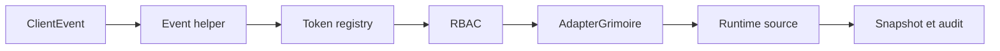

# Guardrails runtime agentiques pour Grimoire Game

## Portée

Ce document décrit les concepts ajoutés au runtime `grimoire-kit/apps/grimoire-game` pour gouverner les mutations et préparer la suite du modèle de confiance.

Il couvre deux niveaux:

- ce qui est **déjà implémenté et validé** dans le code;
- ce qui est **déjà cadré** mais reste à implémenter dans les prochaines slices runtime.

## Statut d'implémentation

| Concept | Statut | Landing zones principales |
| --- | --- | --- |
| Mutation guardrails | Implémenté | `src/contracts/`, `src/server/auth/`, `src/bridge/`, tests d'intégration |
| Verification chain | Cadré, non encore déployé | `src/state/verification-view.ts`, `src/state/audit-view.ts`, `src/state/session-view.ts` |
| Canonical envelope pilot | Cadré, non encore déployé | `src/contracts/`, projections runtime/read-only, vues de session |

## Vue d'ensemble du flux runtime

Le flux actuel des guardrails déjà implémentés ressemble à ceci.



## Concept 1 - Mutation guardrail

Le runtime ajoute un objet `guardrail` aux événements mutateurs gouvernés.

### Structure

```typescript
type MutationGuardrail = {
  surface: 'runtime_config' | 'task_lifecycle' | 'task_assignment' | 'agent_presence';
  policy: 'surface_scoped' | 'elevated' | 'read_only';
  trustLevel: 'trusted' | 'restricted';
  provenance: {
    source: 'runtime_ui' | 'runtime_adapter' | 'runtime_replay' | 'runtime_api';
    actorTag: string;
  };
};
```

### Vocabulaire actuel

#### Surfaces

| Valeur | Signification |
| --- | --- |
| `runtime_config` | Mutation de configuration runtime ou HUD |
| `task_lifecycle` | Mutation du statut d'une tâche |
| `task_assignment` | Mutation de l'assignation d'une tâche |
| `agent_presence` | Mutation de présence ou de statut d'un agent |

#### Policies

| Valeur | Signification |
| --- | --- |
| `surface_scoped` | Mutation autorisée seulement si la surface est explicitement autorisée |
| `elevated` | Mutation plus sensible, attendue dans un contexte trusté |
| `read_only` | Mutation explicitement interdite |

#### Trust levels

| Valeur | Signification |
| --- | --- |
| `trusted` | Contexte d'exécution capable de porter une mutation gouvernée |
| `restricted` | Contexte limité, incapable de porter une mutation trustée |

#### Provenance sources

| Valeur | Signification |
| --- | --- |
| `runtime_ui` | Mutation initiée par la surface UI runtime |
| `runtime_adapter` | Mutation injectée par un adapter ou un bridge |
| `runtime_replay` | Mutation provenant d'un flux de replay |
| `runtime_api` | Mutation initiée par une API runtime |

### Injection par défaut dans les helpers

Les helpers d'événements ajoutent automatiquement un guardrail par défaut pour éviter de casser les call sites existants.

| Helper | Surface | Policy par défaut | Trust par défaut | Provenance par défaut |
| --- | --- | --- | --- | --- |
| `createConfigUpdate()` | `runtime_config` | `elevated` | `trusted` | `runtime_ui` + `config.update` |
| `createTaskTransition()` | `task_lifecycle` | `surface_scoped`, sauf `done` en `elevated` | `trusted` | `runtime_ui` + `task.transition` |
| `createTaskAssign()` | `task_assignment` | `surface_scoped` | `trusted` | `runtime_ui` + `task.assign` |
| `createAgentStatusUpdate()` | `agent_presence` | `surface_scoped` | `trusted` | `runtime_ui` + `agent.status.update` |

## Concept 1.1 - Modèle d'autorisation effectif

Le runtime n'autorise pas une mutation sur le seul rôle du principal.

Une mutation gouvernée est autorisée seulement si toutes les conditions suivantes sont vraies:

1. le rôle peut exécuter le type d'événement;
2. l'événement porte un `guardrail` valide;
3. la `policy` n'est pas `read_only`;
4. la `surface` est présente dans `authorizedMutationSurfaces` du contexte;
5. un `trustLevel=trusted` n'est accepté que dans un contexte lui-même trusté.

### Cas particuliers importants

- `RECONNECT_HANDSHAKE` reste hors du périmètre gouverné et reste autorisé pour le spectateur.
- le rôle `spectator` reste strictement read-only sur les mutations runtime.
- une mutation gouvernée sans `guardrail` est rejetée au runtime, même si son schéma reste parsable.

## Concept 1.2 - Compatibilité descendante

Le contrat `v1` a été conservé additif.

Concrètement:

- les schémas Zod gardent `guardrail` en champ optionnel sur les événements mutateurs;
- les helpers runtime injectent automatiquement un guardrail cohérent;
- le runtime refuse les writes gouvernés qui arrivent sans guardrail;
- la compatibilité de parsing est donc conservée, mais la compatibilité d'autorisation ne l'est pas pour les writes legacy.

Ce compromis permet de protéger le runtime sans casser tous les parseurs ou fixtures historiques d'un coup.

## Concept 1.3 - Portage jusqu'au runtime source

Le guardrail n'est pas seulement validé à l'entrée.

Il est désormais propagé jusqu'aux handlers write du runtime source:

- `applyConfigUpdate()`
- `applyTaskTransition()`
- `applyTaskAssign()`
- `applyAgentStatusUpdate()`

Cette propagation permet au runtime source et à ses persistences de raisonner sur la même donnée gouvernée que la couche RBAC.

## Concept 1.4 - Tokens et contexte de confiance

Le registre local de tokens transporte maintenant les deux dimensions nécessaires au modèle:

- `trustLevel`
- `authorizedMutationSurfaces`

### Valeurs par défaut actuelles

| Rôle | Trust par défaut | Surfaces autorisées par défaut |
| --- | --- | --- |
| `orchestrator` | `trusted` | toutes les surfaces gouvernées |
| `spectator` | `restricted` | aucune |

Le runtime accepte aussi des tokens orchestrator plus bornés si vous fournissez explicitement une liste réduite de surfaces autorisées.

## Concept 1.5 - Audit et traçabilité

Les décisions d'autorisation exposent maintenant les métadonnées suivantes dans l'audit:

- `surface`
- `policy`
- `trustLevel`
- `provenanceSource`
- `provenanceActorTag`

Cela permet d'expliquer un refus ou une autorisation sans repasser par le payload brut de l'événement.

## Concept 2 - Verification chain cible

Ce concept est déjà cadré, mais pas encore déployé de bout en bout dans le runtime.

L'objectif est de rendre une décision critique relisible via un modèle minimal:

- `actionId`
- `traceId`
- `verificationRef`
- `evidenceRefs`
- `controlsExecuted`
- `unmetControls`

### Landing zones prévues

| Zone | Rôle attendu |
| --- | --- |
| `verification-view` | Rendre visible l'état prêt/pas prêt et les contrôles manquants |
| `audit-view` | Exposer refus, findings et preuves associées |
| `session-view` | Recomposer une séquence par `traceId` et `verificationRef` |

### Règle structurante

Une transition critique ne doit pas être considérée comme fiable si elle ne permet pas de reconstruire la chaîne `action -> contrôles -> verdict -> preuves`.

## Concept 3 - Canonical envelope pilot cible

Ce concept est lui aussi déjà cadré, mais non encore activé dans le runtime.

L'idée est de produire une projection commune de forme `header/context/body` sur un panier borné d'événements critiques.

### Intention

- aligner runtime live, replay, lecture spectateur et lecture session;
- conserver `protocolVersion: 'v1'` dans le contexte;
- éviter une migration massive du protocole principal.

### Règle d'usage

Le pilote doit être généré par projection. Il ne remplace pas immédiatement les événements runtime existants.

## Étendre correctement ce modèle

Quand vous ajoutez une nouvelle mutation gouvernée, suivez toujours cette séquence:

1. ajoutez la surface et les enums dans `src/contracts/schemas.ts`;
2. exposez le type et le helper dans `src/contracts/events.ts`;
3. définissez un défaut cohérent de `policy`, `trustLevel` et `provenance`;
4. raccordez la surface au contexte de token et au RBAC;
5. transmettez le `guardrail` jusqu'au runtime source;
6. ajoutez un test de contrat, un test RBAC et un test d'intégration adapter;
7. gardez la stratégie additive tant que `v1` reste le protocole public.

## Preuves actuelles

Les concepts déjà implémentés sont verrouillés par les tests suivants:

- `tests/contracts/events.test.ts` vérifie l'injection par défaut et la compatibilité de parsing;
- `tests/integration/auth-rbac.test.ts` vérifie refus sans guardrail, refus hors surface et refus hors trust;
- `tests/integration/auth-token-registry.test.ts` vérifie le transport du trust et du scope dans les tokens;
- `tests/integration/adapter-grimoire.test.ts` vérifie la propagation du guardrail jusqu'aux handlers write.

Le package a été revalidé après cette tranche avec `npm run check` et `npm test`.
