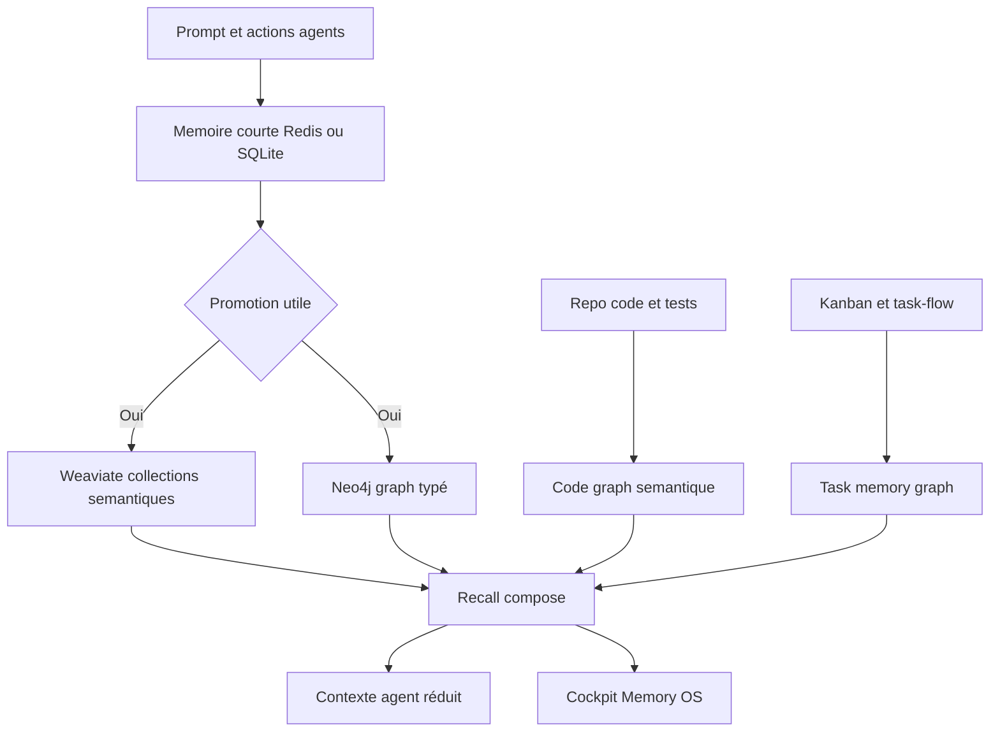

# Memory OS Grimoire

Ce document fixe la cible des couches mémoire Grimoire et distingue ce qui est
déjà opérationnel, partiel, et à construire. L'objectif n'est pas de reproduire
un projet mémoire existant, mais de fournir une mémoire agentique plus fiable :
typée, vérifiable, interrogeable, visualisable, et reliée aux tâches.

## État Actuel

| Couche | Statut | Source actuelle | Écart principal |
|---|---:|---|---|
| Mémoire sémantique | Prêt selon santé backend | Weaviate, Qdrant rollback, Ollama, MemPalace, local | Weaviate est le backend cible, mais la qualité de recall doit rester vérifiée |
| Connaissance sémantique | Partiel | `MemorySidecar` SQLite facts et diary, projection Neo4j | Extraction automatique et contradictions absentes |
| Memory graph sémantique | Partiel | `Neo4jMemoryGraph` runtime, bundle de migration, liens task/evidence/code/décision | Mémoire lue, contradictions et supersessions à compléter |
| Code graph sémantique | Partiel | `CodeGraph` AST, projection Neo4j, chunks Weaviate fichier/symbole/méthode/test/contrat, liens task/evidence -> code | Tree-sitter et extraction diff/git à compléter |
| Mémoire courte | Partiel | Fichiers locaux et sidecar | Redis non implémenté, promotion court-terme vers durable absente |
| Kanban task memory | Partiel | `MissionLedger`, import task-flow réel, `EvidenceService`, projection Neo4j, documents Weaviate déterministes, décisions vérifiées | Recall history et promotion durable des apprentissages à compléter |
| Visualisation | Partiel | `apps/grimoire-game` memory views | Pas encore de cockpit Memory OS complet connecté au SDK Python |

## Todo List Active

Verdict : la cible Memory OS complète n'est pas atteinte. Le socle durable est
en place, mais plusieurs couches restent volontairement en statut partiel.

| Item | Statut | Gate d'acceptation |
| --- | --- | --- |
| Ajouter mémoire courte Redis optionnelle | Partiel | Scaffold infra/platform + compose + requirements OK ; adapter runtime TTL/leases à finaliser |
| Ajouter évaluation recall Memory OS | À faire | scénarios task similaire, fichier impacté, incident récurrent |
| Connecter le cockpit Memory OS au runtime réel | À faire | UI consomme `memory status`, graph stats et projections vectorielles |
| Étendre extraction task-code depuis diff/git/runtime | À faire | liens `TOUCHES_CODE` couvrent fichiers réellement modifiés et symboles impactés |
| Nettoyer les statuts et plans qui sur-déclarent `ready` | En cours | statut docs aligné avec `grimoire memory status` |

## Architecture Cible

## Principes

- Weaviate est la source vectorielle cible pour la mémoire durable.
- Qdrant reste une source de migration et de rollback tant que les gates de parité sont utiles.
- Redis sert de mémoire chaude et volatile, pas de source de vérité.
- SQLite reste le fallback local fiable pour les faits et le journal agent.
- Neo4j devient la projection graphe durable pour souvenirs, tags, faits, journaux, code et tâches.
- Chaque entrée mémoire doit avoir une provenance, un propriétaire, une fraîcheur, et une politique de promotion.
- Le contexte prompt doit devenir une vue calculée de la mémoire, pas un sac de texte recopié.
- La visualisation lit le même contrat que le CLI : elle ne doit pas inventer des états absents du runtime.

## Couches À Construire

### Mémoire Courte

But : remplacer une partie de la pression contexte par une mémoire chaude avec TTL,
namespaces et leases de session.

Backend recommandé :

- Local par défaut : SQLite sidecar et fichiers runtime.
- Multi-agent distribué : Redis avec TTL, streams et pub/sub.

Contrat minimal :

- `session_id`, `agent_id`, `task_id`, `correlation_id`
- `content`, `content_type`, `importance`, `ttl`, `created_at`
- `promotion_policy`: `never`, `on_task_done`, `on_decision`, `on_failure`, `manual`

### Mémoire Sémantique

But : rechercher les souvenirs durables par proximité sémantique.

Collections recommandées :

- `grimoire_memory`: souvenirs, décisions, incidents, apprentissages
- `grimoire_knowledge`: faits normalisés et résumés conceptuels
- `grimoire_code`: chunks de code, symboles, tests, contrats
- `grimoire_tasks`: tâches, preuves, transitions, blockers, reviews

### Connaissance Sémantique

But : extraire des faits vérifiables à partir des décisions, incidents, docs,
tâches, résultats de tests et journaux agent.

Noeud factuel :

- `subject`
- `predicate`
- `object`
- `valid_from`
- `valid_to`
- `confidence`
- `source_ref`
- `evidence_refs`

### Memory Graph Sémantique

But : relier les souvenirs aux agents, tâches, fichiers, symboles, décisions,
preuves, incidents et événements.

Types de noeuds :

- `memory`
- `fact`
- `agent`
- `task`
- `file`
- `symbol`
- `test`
- `decision`
- `evidence`
- `incident`

Types d'arêtes :

- `mentions`
- `decides`
- `supersedes`
- `contradicts`
- `supports`
- `produced_by`
- `used_by`
- `blocks`
- `verifies`
- `touches`

### Code Graph Sémantique

But : permettre à un agent de comprendre impact, ownership et contexte code sans
charger tout le repo.

Sources :

- AST Python natif pour `src/grimoire`
- Tree-sitter pour les langages additionnels
- Imports, exports, tests, fixtures, routes, contrats
- Historique git et fichiers modifiés

Sorties :

- Graph SQLite pour relations exactes
- Chunks Weaviate pour recherche sémantique
- Liens vers tasks et evidence packs

### Kanban Task Memory

Oui, il faut mettre une mémoire sur le Kanban. Une tâche est le meilleur point
de jonction entre intention, agent, preuves, code, décisions et résultat.

Ce que la task memory doit retenir :

- Pourquoi la tâche existe
- Qui l'a prise et sous quelle contrainte
- Quelles mémoires ont été lues
- Quels fichiers et symboles ont été touchés
- Quelles preuves bloquent ou débloquent la transition
- Quelle décision est née de la tâche
- Ce qui doit être rappelé au prochain travail similaire

Garde-fous :

- Ne pas stocker chaque micro-action comme connaissance durable.
- Promouvoir seulement les décisions, preuves, blocages, patterns et erreurs répétées.
- Lier la mémoire au statut Kanban, mais ne pas laisser la mémoire changer le statut sans événement de tâche vérifié.

## Visualisation Cible

La visualisation moderne doit être un cockpit de mémoire, pas une simple liste.

Vues nécessaires :

- Graphe multi-couches avec filtres `agent`, `task`, `file`, `memory`, `fact`
- Carte de voisinage sémantique autour d'une tâche ou d'un fichier
- Timeline de fraîcheur et obsolescence
- Vue Kanban augmentée avec souvenirs lus, preuves, décisions et blockers
- Vue code graph avec symboles, tests, ownership et impact
- Vue promotion pipeline : court-terme vers durable
- Vue contradictions et supersessions

Contrat UI :

- Le cockpit consomme `grimoire memory status --output json`.
- Les graphes consomment des endpoints ou exports JSON stables.
- Chaque élément visuel doit pouvoir remonter à une source vérifiable.

## Plan D'Exécution

### Étape 1 : Contrat Memory OS

- Ajouter une configuration de couches mémoire dans `project-context.yaml`.
- Exposer le statut des couches dans `grimoire memory status`.
- Marquer explicitement `ready`, `partial`, `planned` et `disabled`.
- Utiliser ce contrat comme base de la visualisation.

### Étape 2 : Mémoire Courte

- Ajouter un backend court-terme Redis optionnel.
- Garder SQLite comme fallback local.
- Ajouter TTL, namespaces, session leases et politiques de promotion.
- Ajouter les commandes CLI pour lire, écrire, promouvoir et purger la mémoire chaude.

### Étape 3 : Promotion Et Consolidation

- Définir les règles de promotion vers Weaviate, Neo4j et le sidecar fallback.
- Promouvoir automatiquement décisions, échecs répétés, preuves et patterns.
- Ajouter une consolidation qui déduplique, résume et marque l'obsolescence.

### Étape 4 : Knowledge Graph

- Garder `MemorySidecar` comme fallback local pour faits et diary.
- Étendre `Neo4jMemoryGraph` avec des noeuds `source`, `evidence` et `decision`.
- Indexer les faits actuels comme noeuds typés.
- Ajouter recherche graph + recherche sémantique hybride.

### Étape 5 : Code Graph

- Créer l'indexeur code graph.
- Produire des noeuds fichiers, symboles, tests et contrats.
- Pousser les chunks sémantiques dans Weaviate.
- Relier les tâches aux fichiers et symboles touchés.

État actuel : l'indexeur Python AST et la projection Neo4j existent via
`grimoire memory graph sync-code`. Les chunks Weaviate couvrent les fichiers,
symboles, méthodes, fichiers de test et contrats docstring via
`grimoire memory vector sync-code --granularity file,symbol,method,test,contract`.
Ils sont vérifiés par hash de contenu avec `grimoire memory vector verify`. Le
gate unifié `grimoire memory gate` existe en mode strict pour validation locale
et le hook `grimoire-memory-gate` est promu en `enforced`. Les relations
`TOUCHES_CODE` et `COVERS_CODE` relient déjà task/evidence aux `CodeNode`; la
suite consiste à enrichir ces liens depuis diff/git/runtime et à étendre
l'indexation au-delà de Python.

### Étape 6 : Task Memory

- Indexer les cartes Kanban comme noeuds mémoire.
- Relier task events, agents, preuves, reviews, décisions et fichiers.
- Ajouter des gates mémoire : obsolescence, contradictions, preuves manquantes.

État actuel : `grimoire missions import-task-flow` importe les événements réels
de `_grimoire-runtime-output/task-flow/events.jsonl` dans `MissionLedger`. La
projection courante contient `1` mission, `38` tâches, `825` événements ledger,
`20` incidents, `1` evidence pack, `1` verdict, `1` décision et `886` documents
vectoriels task-memory.

État actuel : la projection Neo4j existe via `grimoire memory graph sync-tasks`
pour missions, tâches, événements, incidents, preuves, verdicts et décisions.
Les documents Weaviate déterministes existent via `grimoire memory vector
sync-tasks`. La suite consiste à relier les lectures mémoire, enrichir les liens
vers fichiers/symboles réellement touchés, puis rendre ces liens visibles dans le
cockpit.

### Étape 7 : Visualisation

- Étendre `apps/grimoire-game` avec une vue Memory OS.
- Ajouter graphe interactif, timeline, voisinage sémantique et overlays Kanban.
- Connecter la visualisation aux exports runtime réels.

### Étape 8 : Évaluation

- Ajouter des scénarios de recall : tâche similaire, fichier impacté, incident récurrent.
- Mesurer précision, obsolescence, provenance et taux de promotion utile.
- Bloquer les réponses mémoire sans provenance sur les chemins critiques.

## Décision Redis

Redis est utile, mais seulement comme mémoire chaude :

- Oui pour contexte court-terme, multi-agent, TTL, pub/sub, locks et streams.
- Non comme source durable principale.
- La vérité durable reste Weaviate pour le sémantique et Neo4j pour le graph typé.

La proposition finale est donc : Redis en cache actif, Weaviate en mémoire
sémantique durable, Neo4j en graph vérifiable, SQLite en fallback local, et un
cockpit unifié au-dessus.
