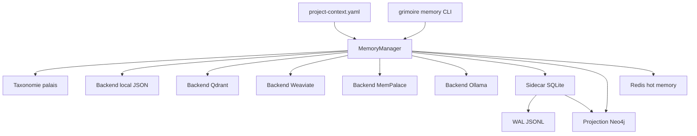

# Système de mémoire

[README](https://github.com/Guilhem-Bonnet/Grimoire-kit)

Ce guide décrit l'architecture mémoire actuelle de Grimoire Kit. La source de vérité applicative n'est plus un script unique historique, mais le couple formé par `MemoryManager` et le backend configuré dans `project-context.yaml`.

Le système combine trois éléments complémentaires :

- un backend principal pour le stockage et la recherche des souvenirs
- une taxonomie de palais pour normaliser les métadonnées et les filtres
- un sidecar SQLite pour les faits temporels et les journaux d'agents
- une projection Neo4j optionnelle pour relier souvenirs, tags, faits et journaux
- une couche Redis optionnelle pour la mémoire chaude TTL, les leases et les flux transitoires

## Vue d'ensemble



## Décisions structurantes

- L'entrée principale est `MemoryManager`, qui résout le backend, enrichit les métadonnées et expose une API unique.
- Le backend configuré reste la source de vérité pour les souvenirs textuels et la recherche.
- Le sidecar `MemorySidecar` ajoute des structures complémentaires sans remplacer le backend principal.
- La projection `Neo4jMemoryGraph` est un write-through optionnel. Elle ne bloque pas le backend principal si Neo4j est indisponible.
- La couche `RedisHotMemory` est optionnelle, TTL-bound et non autoritative. Elle sert aux états de session, aux leases et aux flux transitoires avant promotion explicite vers les stores durables.
- La taxonomie [wing, hall, room] normalise les filtres sur tous les backends qui passent par le manager.
- Le backend `mempalace` est une compatibilité expérimentale avec un stockage de type palais. Il n'embarque pas toute la stack MemPalace.

## Composants

| Composant | Rôle | Implémentation |
| --- | --- | --- |
| Configuration | Déclare le backend, les chemins et le modèle d'embedding | [core/config.py](api-reference.md) |
| API unifiée | Charge le backend, enrichit les métadonnées, expose les opérations | [memory/manager.py](api-reference.md) |
| Taxonomie palais | Normalise `wing`, `hall`, `room`, `palace_key` | [memory/taxonomy.py](api-reference.md) |
| Sidecar structuré | Stocke faits temporels et journaux d'agents | [memory/sidecar.py](api-reference.md) |
| Projection Neo4j | Synchronise souvenirs, tags, faits, journaux, code et tâches | [memory/neo4j_graph.py](api-reference.md) |
| Mémoire chaude Redis | Stocke état transitoire TTL, leases et publications de session | [memory/hot.py](api-reference.md) |
| Projections Agent OS | Alimente Neo4j depuis le code graph, MissionLedger et EvidenceService | [memory/projections.py](api-reference.md) |
| CLI | Expose l'inspection et les opérations d'import/export | [cli/cmd_memory.py](cli-reference.md) |

## Backends disponibles

| Backend | Usage | Dépendances optionnelles | Notes |
| --- | --- | --- | --- |
| `auto` | Résolution automatique | Selon la cible choisie | Sélectionne `weaviate-server` si `weaviate_url` est défini, sinon `ollama`, sinon `qdrant-server`, sinon `local` |
| `local` | Stockage JSON simple | Aucune | Écrit dans `_grimoire/_memory/{collection_prefix}.json` |
| `lexical` | Recherche lexicale sans vecteur | Aucune | sqlite FTS5 (BM25, accent-insensible) dans `_grimoire/_memory/memory-lexical.sqlite`. Zéro DB vectorielle, zéro service, zéro réseau |
| `qdrant-local` | Recherche sémantique locale | `grimoire-kit[qdrant]` | Utilise `qdrant-client` et `sentence-transformers` |
| `qdrant-server` | Recherche sémantique via serveur Qdrant | `grimoire-kit[qdrant]` | Requiert `qdrant_url` |
| `weaviate-server` | Recherche sémantique via serveur Weaviate | `grimoire-kit[weaviate]` | Requiert `weaviate_url`; peut être couplé à Neo4j |
| `mempalace` | Backend palais expérimental | `grimoire-kit[mempalace]` | Repose sur ChromaDB et conserve les métadonnées `wing/hall/room` |
| `ollama` | Embeddings Ollama + stockage Qdrant | `grimoire-kit[qdrant,ollama]` | Utilise Ollama pour les vecteurs et Qdrant pour le stockage |

## Sans base de données vectorielle

Certains environnements (entreprises régulées, air-gapped) interdisent l'usage d'une base
de données vectorielle locale. Deux clés de `project-context.yaml` couvrent ce cas :

```yaml
memory:
  vector_database: false   # désactive toute DB vectorielle
  retrieval_mode: lexical  # vector | lexical
```

Avec `vector_database: false`, `get_backend()` force le backend `lexical` et
court-circuite toute auto-détection réseau (aucune sonde Ollama ou Qdrant). La recherche
repose alors sur sqlite FTS5 (BM25, accent-insensible), un index dérivé reconstructible
stocké dans un unique fichier `.sqlite`.

Compromis : le mode lexical est purement textuel (BM25), sans similarité sémantique
(synonymes, paraphrase). La source de vérité reste le markdown ; un backend vectoriel
approuvé peut être réactivé plus tard sans migration de la source de vérité.

Pour peupler le store à partir de la connaissance déjà sur disque :

```bash
python framework/memory/mem0-bridge.py seed --no-vector
```

## Taxonomie palais

La taxonomie est générée par [memory/taxonomy.py](api-reference.md). Chaque souvenir peut être enrichi automatiquement avec :

- `wing` : portée principale, par exemple `project-grimoire-forge` ou `agent-amelia`
- `hall` : catégorie de haut niveau, par exemple `hall_facts` ou `hall_discoveries`
- `room` : sujet concret, dérivé de `room`, `topic`, `memory_type`, `type` ou du premier tag
- `palace_key` : concaténation stable `wing/hall/room`

Les halls normalisés actuellement sont les suivants :

| Hall | Usage typique |
| --- | --- |
| `hall_facts` | Décisions, contexte partagé, faits stables |
| `hall_events` | Histoires, incidents, failures, événements |
| `hall_discoveries` | Learnings, découvertes, observations |
| `hall_preferences` | Préférences utilisateur ou système |
| `hall_advice` | Conseils opératoires et guidance |

Le manager enrichit automatiquement les écritures via `normalize_palace_metadata()`. Les commandes `search`, `list` et `taxonomy` acceptent ensuite les filtres `--wing`, `--hall` et `--room`.

## Couche chaude Redis

Quand `memory.short_term_backend` vaut `redis`, `MemoryManager` initialise une couche chaude `RedisHotMemory` si `redis_url` est défini et que l'extra Python `grimoire-kit[redis]` est installé.

Cette couche ne remplace pas le backend principal. Elle sert uniquement à :

- stocker des fragments de contexte avec TTL ;
- gérer des leases courts pour coordonner plusieurs agents ou workers ;
- publier des événements transitoires namespacés ;
- exposer son état dans `grimoire memory status` et dans le contrat Memory OS.

Redis doit rester dégradable : si la dépendance ou le service Redis est absent, `grimoire memory status` signale une couche partielle, mais les stores durables Weaviate, Neo4j et SQLite restent la source de vérité.

## Sidecar structuré

Le sidecar vit dans `_grimoire/_memory/palace_sidecar.sqlite3`. Il est créé automatiquement par `MemoryManager.from_config()` et journalise ses écritures dans `_grimoire/_memory/palace_sidecar.wal.jsonl`.

Il contient deux sous-systèmes :

- `facts` : graphe de faits temporels avec `subject`, `predicate`, `object`, `valid_from`, `valid_to` et `confidence`
- `diary` : journal append-only par agent avec `topic`, `entry_format` et lien optionnel vers une mémoire

Quand un fait est créé avec `source_memory_id`, le manager propage `wing`, `hall` et `room` depuis l'entrée source si elle existe. Cela conserve l'ancrage palais entre mémoire sémantique et mémoire structurée.

Quand `knowledge_graph` ou `memory_graph` vaut `neo4j`, le manager crée aussi une projection Neo4j si `neo4j_uri` et l'environnement `neo4j_password_env` sont configurés. Les écritures de souvenirs, les suppressions logiques, les faits et les journaux sont synchronisés après l'écriture principale. Une erreur Neo4j est reportée dans `grimoire memory status`, mais elle ne bloque pas la mémoire vectorielle.

Quand le backend principal est Weaviate, chaque souvenir garde un `source_id`,
un `weaviate_id` et un `neo4j_memory_id`. Neo4j matérialise ces références avec
des noeuds `WeaviateObject` et les relations `VECTORIZED_AS` / `VECTOR_FOR`.

Les couches `code_graph` et `task_memory` utilisent des producteurs explicites :

- `grimoire memory graph sync-code` parse les fichiers Python avec `CodeGraph` puis écrit les `CodeNode` et `CODE_EDGE` dans Neo4j.
- Les arêtes de code sont dédupliquées selon l'identité Neo4j `(source, cible, type)` et écrites par batch pour rester utilisables en gate agentique.
- `grimoire memory graph sync-tasks` projette missions, tâches, événements, incidents, evidence packs et verdicts depuis `MissionLedger` et `EvidenceService`.
- `grimoire memory graph verify` compare les sources locales avec les compteurs Neo4j et sert de gate pour les agents.
- `grimoire memory vector sync-code` écrit un chunk Weaviate déterministe par fichier Python, avec hash de contenu et lien `MEMORY_FOR` vers le `CodeNode` module correspondant.
- `grimoire memory vector sync-tasks` écrit les documents sémantiques déterministes pour missions, tâches, événements, incidents, evidence packs et verdicts.
- `grimoire memory vector verify` compare les projections attendues avec Weaviate via les hashes `content_hash`.
- `grimoire memory gate` orchestre le contrôle Memory OS complet : migration Weaviate/Neo4j, sync optionnel du graphe, vérification des projections vectorielles, puis vérification Neo4j. Utilise `--soft` pour les hooks shadow.

## Flux de données

1. La CLI ou le code Python charge `project-context.yaml` via `GrimoireConfig`.
2. `MemoryManager` résout le backend demandé et initialise le sidecar.
3. Si Redis est configuré, le manager expose une couche chaude TTL séparée pour l'état de session.
4. Lors d'un `store()`, le manager enrichit les métadonnées avec la taxonomie palais.
5. Le backend principal persiste le souvenir et sert les opérations de recherche ou de listing.
6. Si Neo4j est configuré, le manager projette le souvenir et ses tags dans le graphe.
7. Les commandes `facts` et `diary` écrivent dans le sidecar SQLite puis, si disponible, dans Neo4j.
8. Les commandes `memory graph` projettent code, missions, tâches, incidents et preuves vers Neo4j.
9. Les commandes `memory vector` projettent code et task memory vers Weaviate avec des IDs stables et des hashes de contenu.
10. Les commandes `taxonomy`, `search` et `list` réutilisent les champs `wing`, `hall` et `room` pour agréger et filtrer les résultats.

## Progressive search

Le manager expose aussi `progressive_search()` avec trois niveaux de restitution :

- `L1` : aperçu compact
- `L2` : contexte de travail
- `L3` : texte complet ou quasi complet

Ces couches concernent le format de réponse, pas la persistance. Elles ne remplacent ni le backend principal ni le sidecar.

## Commandes CLI

La surface publique passe par `grimoire memory`.

| Domaine | Commandes |
| --- | --- |
| Santé et inspection | `grimoire memory status`, `grimoire memory taxonomy` |
| Recherche et listing | `grimoire memory search`, `grimoire memory list` |
| Échange JSON | `grimoire memory export`, `grimoire memory import` |
| Migration Weaviate + Neo4j | `grimoire memory migrate export-bundle`, `import-weaviate`, `import-neo4j`, `verify` |
| Graphe runtime | `grimoire memory graph sync-code`, `sync-tasks`, `verify` |
| Vecteurs runtime | `grimoire memory vector sync-code`, `sync-tasks`, `verify` |
| Gate Memory OS | `grimoire memory gate` |
| Pont MemPalace | `grimoire memory mempalace-export`, `grimoire memory mempalace-import` |
| Faits structurés | `grimoire memory facts add`, `invalidate`, `query`, `timeline`, `stats` |
| Journaux agents | `grimoire memory diary write`, `read`, `stats` |
| Maintenance locale | `grimoire memory gc`, `grimoire memory delete` |

Exemples :

```bash
grimoire memory status
grimoire memory search "provider qdrant" --wing project-grimoire-forge --hall hall_facts
grimoire memory taxonomy --wing project-grimoire-forge
grimoire memory facts add atlas decided qdrant-local --valid-from 2026-02-24
grimoire memory diary write amelia "Validation de la migration mémoire" --topic memory
grimoire memory mempalace-export --palace ./_grimoire/_memory/mempalace
```

## Configuration

Configuration minimale pour le backend actuellement utilisé dans ce dépôt :

```yaml
memory:
  backend: "weaviate-server"
  collection_prefix: "grimoire_kit"
  embedding_model: "sentence-transformers/all-MiniLM-L6-v2"
  weaviate_url: "http://localhost:8080"
  weaviate_collection: "GrimoireKitMemory"
  neo4j_uri: "bolt://localhost:7687"
  neo4j_user: "neo4j"
  neo4j_password_env: "GRIMOIRE_NEO4J_PASSWORD"
  neo4j_database: "neo4j"
  knowledge_graph: "neo4j"
  memory_graph: "neo4j"
```

Configuration optionnelle Redis pour la mémoire chaude :

```yaml
memory:
  short_term_backend: "redis"
  redis_url: "redis://localhost:6379/0"
  collection_prefix: "grimoire_kit"
```

Configuration pour expérimenter le backend MemPalace :

```yaml
memory:
  backend: "mempalace"
  collection_prefix: "grimoire_forge_meta"
  mempalace_path: "./_grimoire/_memory/mempalace"
```

Extras Python utiles :

```bash
pip install "grimoire-kit[qdrant]"
pip install "grimoire-kit[weaviate]"
pip install "grimoire-kit[neo4j]"
pip install "grimoire-kit[redis]"
pip install "grimoire-kit[mempalace]"
pip install "grimoire-kit[qdrant,ollama]"
```

## Fichiers produits

| Fichier | Rôle |
| --- | --- |
| `_grimoire/_memory/{collection_prefix}.json` | Stockage du backend `local` |
| `_grimoire/_memory/palace_sidecar.sqlite3` | Base SQLite des faits et journaux |
| `_grimoire/_memory/palace_sidecar.wal.jsonl` | Journal append-only du sidecar |
| Répertoire Qdrant local ou serveur Qdrant | Stockage des backends `qdrant-local`, `qdrant-server`, `ollama` |
| Collection Weaviate | Stockage vectoriel du backend `weaviate-server` |
| Base Neo4j | Projection graphe des souvenirs, tags, faits et journaux |
| Redis | Mémoire chaude TTL, leases et événements transitoires |
| `_grimoire/_memory/mempalace/` | Répertoire ChromaDB du backend `mempalace` |

## Compatibilité legacy

Les scripts historiques autour de `mem0-bridge.py` restent pertinents pour certains workflows anciens et certains prompts du runtime, mais ils ne sont plus la meilleure description de l'architecture actuelle.

Pour le nouveau code applicatif :

- utilisez `MemoryManager` comme point d'entrée
- configurez le backend dans `project-context.yaml`
- utilisez `grimoire memory` pour l'inspection et les échanges
- considérez `mempalace` comme un backend et un pont d'import/export, pas comme un remplacement global de tout le runtime Grimoire
