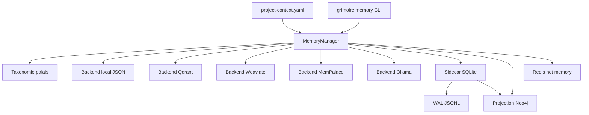

# Système de mémoire

[README](https://github.com/Guilhem-Bonnet/Grimoire-kit)

Ce guide décrit l'architecture mémoire actuelle de Grimoire Kit. La source de vérité applicative n'est plus un script unique historique, mais le couple formé par `MemoryManager` et le backend configuré dans `project-context.yaml`.

Le système combine trois éléments complémentaires :

- un backend principal pour le stockage et la recherche des souvenirs
- une taxonomie de palais pour normaliser les métadonnées et les filtres
- un sidecar SQLite pour les faits temporels et les journaux d'agents
- une projection Neo4j optionnelle pour relier souvenirs, tags, faits et journaux
- une couche Redis optionnelle pour la mémoire chaude TTL, les leases et les flux transitoires

## Vue d'ensemble


```mermaid
flowchart TD
    CFG[project-context.yaml] --> MM[MemoryManager]
    CLI[grimoire memory CLI] --> MM
    MM --> TAX[Taxonomie palais]
    MM --> LOCAL[Backend local JSON]
    MM --> QDRANT[Backend Qdrant]
    MM --> WEAVIATE[Backend Weaviate]
    MM --> MEMP[Backend MemPalace]
    MM --> OLLAMA[Backend Ollama]
    MM --> SIDECAR[Sidecar SQLite]
    MM --> NEO4J[Projection Neo4j]
    MM --> REDIS[Redis hot memory]
    SIDECAR --> WAL[WAL JSONL]
    SIDECAR --> NEO4J
```

## Décisions structurantes

- L'entrée principale est `MemoryManager`, qui résout le backend, enrichit les métadonnées et expose une API unique.
- Le backend configuré reste la source de vérité pour les souvenirs textuels et la recherche.
- Le sidecar `MemorySidecar` ajoute des structures complémentaires sans remplacer le backend principal.
- La projection `Neo4jMemoryGraph` est un write-through optionnel. Elle ne bloque pas le backend principal si Neo4j est indisponible.
- La couche `RedisHotMemory` est optionnelle, TTL-bound et non autoritative. Elle sert aux états de session, aux leases et aux flux transitoires avant promotion explicite vers les stores durables.
- La taxonomie [wing, hall, room] normalise les filtres sur tous les backends qui passent par le manager.
- Le backend `mempalace` est une compatibilité expérimentale avec un stockage de type palais. Il n'embarque pas toute la stack MemPalace.

## Composants

| Composant | Rôle | Implémentation |
| --- | --- | --- |
| Configuration | Déclare le backend, les chemins et le modèle d'embedding | [core/config.py](api-reference.md) |
| API unifiée | Charge le backend, enrichit les métadonnées, expose les opérations | [memory/manager.py](api-reference.md) |
| Taxonomie palais | Normalise `wing`, `hall`, `room`, `palace_key` | [memory/taxonomy.py](api-reference.md) |
| Sidecar structuré | Stocke faits temporels et journaux d'agents | [memory/sidecar.py](api-reference.md) |
| Projection Neo4j | Synchronise souvenirs, tags, faits, journaux, code et tâches | [memory/neo4j_graph.py](api-reference.md) |
| Mémoire chaude Redis | Stocke état transitoire TTL, leases et publications de session | [memory/hot.py](api-reference.md) |
| Projections Agent OS | Alimente Neo4j depuis le code graph, MissionLedger et EvidenceService | [memory/projections.py](api-reference.md) |
| CLI | Expose l'inspection et les opérations d'import/export | [cli/cmd_memory.py](cli-reference.md) |

## Backends disponibles

| Backend | Usage | Dépendances optionnelles | Notes |
| --- | --- | --- | --- |
| `auto` | Résolution automatique | Selon la cible choisie | Sélectionne `weaviate-server` si `weaviate_url` est défini, sinon `ollama`, sinon `qdrant-server`, sinon `local` |
| `local` | Stockage JSON simple | Aucune | Écrit dans `_grimoire/_memory/{collection_prefix}.json` |
| `lexical` | Recherche lexicale sans vecteur | Aucune | sqlite FTS5 (BM25, accent-insensible) dans `_grimoire/_memory/memory-lexical.sqlite`. Zéro DB vectorielle, zéro service, zéro réseau |
| `qdrant-local` | Recherche sémantique locale | `grimoire-kit[qdrant]` | Utilise `qdrant-client` et fastembed |
| `qdrant-server` | Recherche sémantique via serveur Qdrant | `grimoire-kit[qdrant]` | Requiert `qdrant_url` |
| `weaviate-server` | Recherche sémantique via serveur Weaviate | `grimoire-kit[weaviate]` | Requiert `weaviate_url`; peut être couplé à Neo4j |
| `mempalace` | Backend palais expérimental | `grimoire-kit[mempalace]` | Repose sur ChromaDB et conserve les métadonnées `wing/hall/room` |
| `ollama` | Embeddings Ollama + stockage Qdrant | `grimoire-kit[qdrant,ollama]` | Utilise Ollama pour les vecteurs et Qdrant pour le stockage |

## Sans base de données vectorielle

Certains environnements (entreprises régulées, air-gapped) interdisent l'usage d'une base
de données vectorielle locale. Deux clés de `project-context.yaml` couvrent ce cas :

```yaml
memory:
  vector_database: false   # désactive toute DB vectorielle
  retrieval_mode: lexical  # hybrid | vector | lexical | none
```

Avec `vector_database: false`, `get_backend()` force le backend `lexical` et
court-circuite toute auto-détection réseau (aucune sonde Ollama ou Qdrant). La recherche
repose alors sur sqlite FTS5 (BM25, accent-insensible), un index dérivé reconstructible
stocké dans un unique fichier `.sqlite`.

Compromis : le mode lexical est purement textuel (BM25), sans similarité sémantique
(synonymes, paraphrase). La source de vérité reste le markdown ; un backend vectoriel
approuvé peut être réactivé plus tard sans migration de la source de vérité.

Pour peupler le store à partir de la connaissance déjà sur disque, depuis un
clone du dépôt du kit :

```bash
python framework/memory/mem0-bridge.py seed --no-vector
```

> Ce script n'est pas déployé dans un projet : le semis depuis le markdown n'a
> pas encore d'équivalent dans le CLI `grimoire memory`.

## Mise en place et diagnostic

`grimoire init` détecte un backend vectoriel et écrit `memory.backend`, mais il
s'arrête là : les clés de graphe et de mémoire chaude restent commentées dans
le template. `grimoire memory up` comble cet écart.

```bash
grimoire memory up                    # plan, rien n'est écrit
grimoire memory up --apply            # écrit le bloc memory:
grimoire memory up --profile vector   # vecteurs sans graphe
```

| Profil | Couvre |
| --- | --- |
| `lexical` | FTS5 BM25, aucune dépendance, aucun service |
| `vector` | backend vectoriel seul |
| `full` | vecteurs + graphe + code + tâches + mémoire chaude |

**On n'active que ce qui répond.** Écrire `memory_graph: neo4j` alors que Neo4j
est éteint produirait une config qui échoue silencieusement au runtime : un
service injoignable est signalé avec sa commande de démarrage, pas activé. La
commande distingue « service éteint » de « extra pip absent », parce que le
remède diffère.

La comparaison porte sur ce qui est écrit dans le fichier, pas sur les valeurs
par défaut de la configuration. Sans cela `neo4j_password_env` — qui vaut déjà
`GRIMOIRE_NEO4J_PASSWORD` par défaut — ne serait jamais écrit, et rien
n'indiquerait à l'opérateur quelle variable exporter. L'écriture préserve les
commentaires du YAML et est idempotente.

### Ce que `memory status` révèle

`grimoire memory status` ne sort jamais en erreur, même quand le backend ne peut
pas démarrer : un diagnostic qui meurt avec son sujet ne sert à rien. Il affiche
alors le contrat des sept couches, calculé depuis la configuration, et la raison
de l'indisponibilité.

Le bloc `parity` compare trois compteurs :

| Compteur | Source |
| --- | --- |
| `store` | entrées du backend durable |
| `graph` | nœuds `GrimoireMemory` dans Neo4j |
| `vectors` | références `WeaviateObject` dans Neo4j |

Un écart signale un objet écrit d'un côté sans contrepartie de l'autre — le
« lien brisé » que rien ne remontait jusqu'ici. Le remède est
`grimoire memory gate --sync`. La sonde reste légère (trois `COUNT`), là où
`grimoire memory graph verify` reconstruit tout le code graph.

### Sondes d'environnement

`grimoire doctor` sonde Weaviate, Neo4j et Redis en plus de Qdrant et Ollama,
mais **seulement si le projet route réellement la couche** : un projet en
`local` ne récolte pas d'avertissements pour des services qu'il n'utilise pas.

La sonde Neo4j couvre un mode de panne silencieux : quand la socket répond mais
que la variable `neo4j_password_env` est absente, chaque écriture de graphe
échoue à l'authentification sans que rien ne le dise.
## Mémoire transverse entre projets

Un agent spécialiste devrait accumuler du savoir réutilisable d'un projet à
l'autre. Le faire naïvement corrompt la connaissance : confusion entre projets,
fait périmé servi comme vrai, contamination, auto-confirmation, et fuite entre
projets cloisonnés.

```yaml
memory:
  shared_collection: "GrimoireShared"   # vide = désactivé
```

Opt-in délibérément : rien ne traverse la frontière d'un projet sans
déclaration.

### La frontière est physique

Le savoir transverse vit dans un **store séparé**, pas dans une collection
partagée filtrée par métadonnée. Un filtre oublié ne fuit pas un peu : il
mélange deux projets sans rien signaler. Sur les backends serveur, c'est une
autre collection ; sur les backends fichier, une racine au niveau machine
(`~/.grimoire/shared`, ou `GRIMOIRE_SHARED_HOME`).

### La promotion est refusée par défaut

Un souvenir ne monte que s'il reste vrai **quand on efface le nom du projet**.

| Ne monte pas | Peut monter |
| --- | --- |
| « l'app X utilise Postgres 16 » | « les migrations Alembic cassent quand deux heads coexistent » |
| « le endpoint /auth de Y renvoie 401 » | « FastAPI + OAuth2 : le refresh token doit être httponly » |

La garde refuse un texte qui nomme son projet, cite une URL, un chemin absolu
ou une adresse locale — autant de marqueurs d'un état particulier plutôt que
d'un motif reproductible. `--force` passe outre, mais l'inscrit dans la
provenance : un contournement doit rester visible à la relecture.

```bash
grimoire memory shared promote "les migrations Alembic cassent quand deux heads coexistent" -d alembic
grimoire memory shared confirm <id>     # ce motif tient aussi ici
grimoire memory shared recall "alembic heads"
```

### La confiance décroît

| Depuis la dernière confirmation | État | Restitution |
| --- | --- | --- |
| ≤ 90 jours | `current` | servi comme motif établi |
| ≤ 270 jours | `aging` | « appris ailleurs, non revérifié récemment » |
| au-delà, ou contredit | `hypothesis` | « à vérifier avant usage » |

Le calcul se fait **à la lecture**, sans tâche de fond. Une entrée contredite
ailleurs tombe en hypothèse quel que soit son âge. Rien n'est supprimé,
seulement déclassé : une connaissance périmée reste utile à qui sait qu'elle
est périmée. `confirm` est le seul mécanisme qui restaure la confiance.

### Restitution en deux passes

`recall` cherche d'abord dans le projet, puis dans le transverse, et **ne
fusionne jamais sans étiquette**. Le projet passe en premier : la vérité locale
prime sur le motif importé, conformément à l'ordre d'autorité ORC-06 (source
active > preuve vérifiée > mémoire durable > similarité). Chaque résultat
transverse porte sa provenance (`learned_in`, `confirmed_in`) et sa fraîcheur.
## Moteur d'embedding

Les backends `qdrant-*` et `weaviate-server` passent par
[memory/embedding.py](api-reference.md), qui choisit le moteur disponible :

| Moteur | Statut | Poids installé |
| --- | --- | --- |
| `fastembed` | Défaut, tiré par les extras | 203 Mo |
| `sentence-transformers` | Repli, utilisé seulement s'il est déjà présent | 4,8 Go (torch + wheels CUDA) |

Mesure du 2026-08-26, même modèle par défaut dans les deux cas. Les extras
`[qdrant]` et `[weaviate]` ne tirent plus torch.

La bascule ne demande aucun re-index : sur
`sentence-transformers/all-MiniLM-L6-v2`, les deux moteurs produisent des
vecteurs identiques à 2e-7 près par composante, soit un écart de cosinus de
5e-13. L'export ONNX publié par Qdrant est fidèle, pas quantifié. Vérifié sur
un corpus de 40 entrées et 10 requêtes : recouvrement top-1 à top-10 de 1,000
et ordre de classement identique.

La dimension n'est jamais devinée depuis une table de correspondance : elle est
lue sur un vecteur sonde au chargement, donc juste pour n'importe quel modèle.
Si une collection Qdrant existante a une autre largeur que le modèle courant,
le backend refuse de démarrer au lieu d'écrire des vecteurs incohérents.

Clés de `project-context.yaml` :

```yaml
memory:
  embedding_model: "sentence-transformers/all-MiniLM-L6-v2"
  embedding_model_path: ""     # répertoire local, court-circuite tout réseau
  embedding_cache_dir: ""      # où le moteur peut stocker ce qu'il télécharge
  embedding_offline: false     # force les commutateurs hors-ligne du hub
```

Changer de modèle à dimension égale n'est pas détectable côté serveur : cela
demande un ré-index explicite des souvenirs existants.

## Modèle d'embedding sur site fermé

Le mode lexical ci-dessus ne demande aucun modèle. Pour garder la recherche
sémantique sans accès sortant, le modèle d'embedding se transporte dans un
*bundle* : une archive construite sur une machine connectée, vérifiée par
empreinte à l'arrivée.

Qdrant en auto-hébergement ne génère aucun vecteur — l'inférence est toujours
côté client. Un bundle transporte donc le modèle, pas un service.

Sur la machine connectée :

```bash
grimoire memory bundle export \
  --model sentence-transformers/all-MiniLM-L6-v2 \
  --out grimoire-embedding-bundle.tar.gz
```

`--model` accepte aussi un répertoire de modèle déjà téléchargé, ce qui évite
toute dépendance au Hub si le modèle vient d'un miroir interne.

Sur le site fermé :

```bash
grimoire memory bundle install grimoire-embedding-bundle.tar.gz --configure
grimoire memory bundle verify ~/.cache/grimoire/embeddings/<modele>
```

`install` recalcule le SHA-256 de chaque fichier déclaré au manifeste et refuse
l'installation au moindre écart : aucun modèle partiel ou altéré n'atterrit sur
le disque. `--configure` renseigne `memory.embedding_model` dans
`project-context.yaml` en préservant les commentaires du fichier.

`verify` va plus loin que les empreintes : il charge réellement le modèle avec
les sockets sortantes bloquées. Un moteur qui retomberait silencieusement sur un
téléchargement distant échoue au lieu de réussir — c'est ce qui distingue un
chemin hors-ligne prouvé d'un chemin hors-ligne supposé.

| Commande | Rôle |
| --- | --- |
| `memory bundle export` | Construit l'archive depuis un repo Hub ou un répertoire local |
| `memory bundle install` | Vérifie les empreintes et installe, `--configure` câble le projet |
| `memory bundle verify` | Recontrôle les empreintes et prouve le chargement hors-ligne |
| `memory bundle where` | Affiche la racine d'installation par défaut |

La racine d'installation suit `GRIMOIRE_EMBEDDING_CACHE`, puis `XDG_CACHE_HOME`,
et vaut `~/.cache/grimoire/embeddings` par défaut.

Grimoire ne redistribue aucun poids de modèle : l'archive est produite par
l'opérateur, depuis la source de son choix.

## Profils de composition

Un projet ne fait jamais tourner *une* mémoire : il en fait tourner plusieurs,
en couches. Le setup ne demandait pourtant qu'une chose — quel backend ? — si
bien que les six autres couches gardaient leurs valeurs par défaut dans tous
les projets générés.

Un **profil** nomme une composition entière. Il est ce que le setup demande, ce
que `layer_profile` enregistre, et ce contre quoi `grimoire memory status`
rapporte l'état des couches.

| Profil | Sémantique | Récupération | Graphes | Mémoire chaude |
|--------|-----------|--------------|---------|----------------|
| `lexical` | aucune | BM25 (FTS5) | sidecar SQLite | SQLite |
| `standard` | store détecté | vectoriel + BM25 fusionnés (RRF) | sidecar SQLite | SQLite |
| `graphe` | Weaviate | vectoriel + BM25 fusionnés | Neo4j (connaissances, souvenirs, code, tâches) | SQLite |
| `complet` | Weaviate | vectoriel + BM25 fusionnés | Neo4j | Redis (TTL, baux) |

```bash
grimoire init . --memory-profile graphe
```

L'axe du backend reste séparé : `standard` ne fixe pas de store et garde celui
que la détection a trouvé (`qdrant-local`, `ollama`, `mempalace`…), pour que
choisir une composition n'écrase jamais un service que la machine fait déjà
tourner. Les profils qui déclarent leurs propres services (`graphe`, `complet`)
fixent le leur.

Un profil ne s'élargit jamais tout seul : sur un store lexical, `standard` se
rétracte en `retrieval_mode: lexical` plutôt que de déclarer une couche
sémantique inexistante. Et le profil `weaviate-neo4j` des versions antérieures
reste reconnu — il désigne `graphe`.

### Récupération hybride

`retrieval_mode: hybrid` fusionne le classement vectoriel et le classement BM25
par *reciprocal rank fusion*. La fusion est le **chemin par défaut** partout où
il y a deux classements à fusionner — `grimoire memory search`, la recherche du
serveur MCP qu'utilisent les agents. Elle était auparavant derrière un
`--hybrid` optionnel : l'index compagnon était écrit à chaque `store` et
interrogé par personne. `--no-hybrid` force le backend seul.

## Choix à l'initialisation

`grimoire init` ne demande plus « veut-on Qdrant ? » mais « cette machine
a-t-elle un accès réseau sortant ? », puis « quelle composition ? ». La
différence n'est pas cosmétique : proposer un conteneur vectoriel à une machine
qui ne peut pas atteindre un modèle d'embedding produit un store qu'on ne
pourra jamais remplir.

- **Pas d'egress** — le projet est généré en profil `lexical`
  (`vector_database: false`, `retrieval_mode: lexical`). Aucun modèle, aucun
  service, aucun réseau. Le passage au sémantique reste ouvert plus tard via
  `memory bundle install`.
- **Egress disponible** — les compositions que la machine peut réellement
  servir sont proposées ; les autres sont affichées avec ce qui leur manque et
  ne sont pas sélectionnables. Qdrant via Docker reste proposé **par défaut
  non** : démarrer un conteneur et son volume persistant au premier lancement
  n'est pas quelque chose qui se fait dans le dos de l'utilisateur.

`grimoire up` et `grimoire doctor` exposent une sonde `env_embedding_model` qui
ne télécharge rien et ne contacte personne : elle lit ce que le projet déclare
et regarde sur le disque. Elle signale un `embedding_model_path` qui ne pointe
sur rien, un `embedding_offline` sans modèle local, et un bundle installé mais
non câblé.

## Taxonomie palais

La taxonomie est générée par [memory/taxonomy.py](api-reference.md). Chaque souvenir peut être enrichi automatiquement avec :

- `wing` : portée principale, par exemple `project-grimoire-forge` ou `agent-amelia`
- `hall` : catégorie de haut niveau, par exemple `hall_facts` ou `hall_discoveries`
- `room` : sujet concret, dérivé de `room`, `topic`, `memory_type`, `type` ou du premier tag
- `palace_key` : concaténation stable `wing/hall/room`

Les halls normalisés actuellement sont les suivants :

| Hall | Usage typique |
| --- | --- |
| `hall_facts` | Décisions, contexte partagé, faits stables |
| `hall_events` | Histoires, incidents, failures, événements |
| `hall_discoveries` | Learnings, découvertes, observations |
| `hall_preferences` | Préférences utilisateur ou système |
| `hall_advice` | Conseils opératoires et guidance |

Le manager enrichit automatiquement les écritures via `normalize_palace_metadata()`. Les commandes `search`, `list` et `taxonomy` acceptent ensuite les filtres `--wing`, `--hall` et `--room`.

## Couche chaude Redis

Quand `memory.short_term_backend` vaut `redis`, `MemoryManager` initialise une couche chaude `RedisHotMemory` si `redis_url` est défini et que l'extra Python `grimoire-kit[redis]` est installé.

Cette couche ne remplace pas le backend principal. Elle sert uniquement à :

- stocker des fragments de contexte avec TTL ;
- gérer des leases courts pour coordonner plusieurs agents ou workers ;
- publier des événements transitoires namespacés ;
- exposer son état dans `grimoire memory status` et dans le contrat Memory OS.

Redis doit rester dégradable : si la dépendance ou le service Redis est absent, `grimoire memory status` signale une couche partielle, mais les stores durables Weaviate, Neo4j et SQLite restent la source de vérité.

## Sidecar structuré

Le sidecar vit dans `_grimoire/_memory/palace_sidecar.sqlite3`. Il est créé automatiquement par `MemoryManager.from_config()` et journalise ses écritures dans `_grimoire/_memory/palace_sidecar.wal.jsonl`.

Il contient deux sous-systèmes :

- `facts` : graphe de faits temporels avec `subject`, `predicate`, `object`, `valid_from`, `valid_to` et `confidence`
- `diary` : journal append-only par agent avec `topic`, `entry_format` et lien optionnel vers une mémoire

Quand un fait est créé avec `source_memory_id`, le manager propage `wing`, `hall` et `room` depuis l'entrée source si elle existe. Cela conserve l'ancrage palais entre mémoire sémantique et mémoire structurée.

Quand `knowledge_graph` ou `memory_graph` vaut `neo4j`, le manager crée aussi une projection Neo4j si `neo4j_uri` et l'environnement `neo4j_password_env` sont configurés. Les écritures de souvenirs, les suppressions logiques, les faits et les journaux sont synchronisés après l'écriture principale. Une erreur Neo4j est reportée dans `grimoire memory status`, mais elle ne bloque pas la mémoire vectorielle.

Quand le backend principal est Weaviate, chaque souvenir garde un `source_id`,
un `weaviate_id` et un `neo4j_memory_id`. Neo4j matérialise ces références avec
des noeuds `WeaviateObject` et les relations `VECTORIZED_AS` / `VECTOR_FOR`.

Les couches `code_graph` et `task_memory` utilisent des producteurs explicites :

- `grimoire memory graph sync-code` parse les fichiers Python avec `CodeGraph` puis écrit les `CodeNode` et `CODE_EDGE` dans Neo4j.
- Les arêtes de code sont dédupliquées selon l'identité Neo4j `(source, cible, type)` et écrites par batch pour rester utilisables en gate agentique.
- `grimoire memory graph sync-tasks` projette missions, tâches, événements, incidents, evidence packs et verdicts depuis `MissionLedger` et `EvidenceService`.
- `grimoire memory graph verify` compare les sources locales avec les compteurs Neo4j et sert de gate pour les agents.
- `grimoire memory vector sync-code` écrit un chunk Weaviate déterministe par fichier Python, avec hash de contenu et lien `MEMORY_FOR` vers le `CodeNode` module correspondant.
- `grimoire memory vector sync-tasks` écrit les documents sémantiques déterministes pour missions, tâches, événements, incidents, evidence packs et verdicts.
- `grimoire memory vector verify` compare les projections attendues avec Weaviate via les hashes `content_hash`.
- `grimoire memory gate` orchestre le contrôle Memory OS complet : migration Weaviate/Neo4j, sync optionnel du graphe, vérification des projections vectorielles, puis vérification Neo4j. Utilise `--soft` pour les hooks shadow.

## Flux de données

1. La CLI ou le code Python charge `project-context.yaml` via `GrimoireConfig`.
2. `MemoryManager` résout le backend demandé et initialise le sidecar.
3. Si Redis est configuré, le manager expose une couche chaude TTL séparée pour l'état de session.
4. Lors d'un `store()`, le manager enrichit les métadonnées avec la taxonomie palais.
5. Le backend principal persiste le souvenir et sert les opérations de recherche ou de listing.
6. Si Neo4j est configuré, le manager projette le souvenir et ses tags dans le graphe.
7. Les commandes `facts` et `diary` écrivent dans le sidecar SQLite puis, si disponible, dans Neo4j.
8. Les commandes `memory graph` projettent code, missions, tâches, incidents et preuves vers Neo4j.
9. Les commandes `memory vector` projettent code et task memory vers Weaviate avec des IDs stables et des hashes de contenu.
10. Les commandes `taxonomy`, `search` et `list` réutilisent les champs `wing`, `hall` et `room` pour agréger et filtrer les résultats.

## Progressive search

Le manager expose aussi `progressive_search()` avec trois niveaux de restitution :

- `L1` : aperçu compact
- `L2` : contexte de travail
- `L3` : texte complet ou quasi complet

Ces couches concernent le format de réponse, pas la persistance. Elles ne remplacent ni le backend principal ni le sidecar.

## Commandes CLI

La surface publique passe par `grimoire memory`.

| Domaine | Commandes |
| --- | --- |
| Mise en place | `grimoire memory up` |
| Santé et inspection | `grimoire memory status`, `grimoire memory taxonomy` |
| Mémoire transverse | `grimoire memory shared promote`, `confirm`, `recall` |
| Recherche et listing | `grimoire memory search`, `grimoire memory list` |
| Échange JSON | `grimoire memory export`, `grimoire memory import` |
| Migration Weaviate + Neo4j | `grimoire memory migrate export-bundle`, `import-weaviate`, `import-neo4j`, `verify` |
| Graphe runtime | `grimoire memory graph sync-code`, `sync-tasks`, `verify` |
| Vecteurs runtime | `grimoire memory vector sync-code`, `sync-tasks`, `verify` |
| Gate Memory OS | `grimoire memory gate` |
| Pont MemPalace | `grimoire memory mempalace-export`, `grimoire memory mempalace-import` |
| Faits structurés | `grimoire memory facts add`, `invalidate`, `query`, `timeline`, `stats` |
| Journaux agents | `grimoire memory diary write`, `read`, `stats` |
| Maintenance locale | `grimoire memory gc`, `grimoire memory delete` |

Exemples :

```bash
grimoire memory status
grimoire memory search "provider qdrant" --wing project-grimoire-forge --hall hall_facts
grimoire memory taxonomy --wing project-grimoire-forge
grimoire memory facts add atlas decided qdrant-local --valid-from 2026-02-24
grimoire memory diary write amelia "Validation de la migration mémoire" --topic memory
grimoire memory mempalace-export --palace ./_grimoire/_memory/mempalace
```

## Configuration

Configuration minimale pour le backend actuellement utilisé dans ce dépôt :

```yaml
memory:
  backend: "weaviate-server"
  collection_prefix: "grimoire_kit"
  embedding_model: "sentence-transformers/all-MiniLM-L6-v2"
  weaviate_url: "http://localhost:8080"
  weaviate_collection: "GrimoireKitMemory"
  neo4j_uri: "bolt://localhost:7687"
  neo4j_user: "neo4j"
  neo4j_password_env: "GRIMOIRE_NEO4J_PASSWORD"
  neo4j_database: "neo4j"
  knowledge_graph: "neo4j"
  memory_graph: "neo4j"
```

Configuration optionnelle Redis pour la mémoire chaude :

```yaml
memory:
  short_term_backend: "redis"
  redis_url: "redis://localhost:6379/0"
  collection_prefix: "grimoire_kit"
```

Configuration pour expérimenter le backend MemPalace :

```yaml
memory:
  backend: "mempalace"
  collection_prefix: "grimoire_forge_meta"
  mempalace_path: "./_grimoire/_memory/mempalace"
```

Extras Python utiles :

```bash
pip install "grimoire-kit[qdrant]"
pip install "grimoire-kit[weaviate]"
pip install "grimoire-kit[neo4j]"
pip install "grimoire-kit[redis]"
pip install "grimoire-kit[mempalace]"
pip install "grimoire-kit[qdrant,ollama]"
```

## Fichiers produits

| Fichier | Rôle |
| --- | --- |
| `_grimoire/_memory/{collection_prefix}.json` | Stockage du backend `local` |
| `_grimoire/_memory/palace_sidecar.sqlite3` | Base SQLite des faits et journaux |
| `_grimoire/_memory/palace_sidecar.wal.jsonl` | Journal append-only du sidecar |
| Répertoire Qdrant local ou serveur Qdrant | Stockage des backends `qdrant-local`, `qdrant-server`, `ollama` |
| Collection Weaviate | Stockage vectoriel du backend `weaviate-server` |
| Base Neo4j | Projection graphe des souvenirs, tags, faits et journaux |
| Redis | Mémoire chaude TTL, leases et événements transitoires |
| `_grimoire/_memory/mempalace/` | Répertoire ChromaDB du backend `mempalace` |

## Compatibilité legacy

Les scripts historiques autour de `mem0-bridge.py` restent pertinents pour certains workflows anciens et certains prompts du runtime, mais ils ne sont plus la meilleure description de l'architecture actuelle.

Pour le nouveau code applicatif :

- utilisez `MemoryManager` comme point d'entrée
- configurez le backend dans `project-context.yaml`
- utilisez `grimoire memory` pour l'inspection et les échanges
- considérez `mempalace` comme un backend et un pont d'import/export, pas comme un remplacement global de tout le runtime Grimoire
