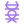

<p align="right"><a href="../README.md">README</a> · <a href="../docs">Docs</a></p>

#  Agent Relationship Graph (ARG) — Registre de Compétences et Relations Inter-Agents

> **BM-57** — Graphe de connaissance mutuelle entre agents : qui sait quoi, qui a travaillé
> avec qui, et qui est le plus fiable pour quel type de tâche.
>
> **Problème résolu** : Les agents ne se connaissent pas. L'orchestrateur choisit les agents
> par capabilities statiques (agent-manifest.csv) sans prendre en compte l'historique réel :
> performance passée, synergies entre agents, spécialisations émergentes.
>
> **Principe** : Un graphe dynamique capture les relations (collaboration, validation, conflit)
> entre agents et enrichit le routage. Le graphe évolue à chaque interaction.
>
> **Implémentation** : S'appuie sur `agent-worker.py` (KNOWN_AGENTS), `agent-caller.py`
> (CALL_HISTORY), `swarm-consensus.py` (AGENT_WEIGHTS), et ELSS (BM-59) pour les événements.


##  Architecture

```
┌──────────────────────────────────────────────────────────────┐
│              AGENT RELATIONSHIP GRAPH (ARG)                   │
│              _bmad-output/.agent-graph.yaml                   │
│                                                               │
│  ┌─────────┐          collaborated(5)        ┌─────────┐    │
│  │ dev/    ├─────────────────────────────────→│ qa/     │    │
│  │ Amelia  │◄────────────────────────────────┤ Quinn   │    │
│  │         │          validated(3)            │         │    │
│  │ trust:87│                                  │ trust:91│    │
│  └────┬────┘                                  └────┬────┘    │
│       │                                            │         │
│       │ delegated(2)                               │         │
│       ▼                                            │         │
│  ┌─────────┐         challenged(1)                 │         │
│  │architect├───────────────────────────────────────┘         │
│  │ Winston │                                                  │
│  │ trust:94│         expertise_match: 0.92                   │
│  └─────────┘         synergy_score: 0.88                     │
│                                                               │
│  Enrichi dynamiquement par :                                 │
│  - ELSS events (BM-59)                                       │
│  - CVTL validations (BM-52)                                 │
│  - Huddles (BM-56)                                           │
│  - A2A calls (BM-32)                                         │
└──────────────────────────────────────────────────────────────┘
```


##  Structure du Graphe

Fichier : `_bmad-output/.agent-graph.yaml`

```yaml
# Auto-enriched from events and interactions — manual edits allowed for bootstrap
# Last updated: 2026-03-05T14:35:30Z

agent_graph:
  version: "1.0"
  
  # ── Nœuds : Profil de chaque agent ────────────────────────
  agents:
    dev:
      persona: "Amelia"
      static_capabilities: ["story-execution", "tdd", "code-implementation"]
      # Compétences émergentes — découvertes via l'historique
      emergent_capabilities:
        - skill: "JWT auth patterns"
          confidence: 0.92
          evidence: ["US-042 impl (trust:91)", "US-038 impl (trust:88)"]
        - skill: "PostgreSQL optimization"
          confidence: 0.78
          evidence: ["US-031 impl (trust:85)"]
      
      # Métriques agrégées
      metrics:
        tasks_completed: 47
        avg_trust_score: 87
        hup_red_count: 3        # fois où HUP ROUGE déclenché
        hup_red_resolved: 3     # dont résolus
        evasion_flags: 0        # flags anti-évitement
        cross_validations_passed: 12
        cross_validations_challenged: 2
      
      # Préférences de routage
      routing_hints:
        best_for: ["implementation", "refactoring", "debugging"]
        avoid_for: ["architecture decisions", "market analysis"]
        preferred_validators: ["qa", "architect"]
        preferred_collaborators: ["architect", "qa"]
    
    qa:
      persona: "Quinn"
      static_capabilities: ["test-automation", "api-testing", "e2e-testing", "coverage-analysis"]
      emergent_capabilities:
        - skill: "Security testing OWASP"
          confidence: 0.85
          evidence: ["Security review sprint-5", "Pentest US-029"]
      metrics:
        tasks_completed: 38
        avg_trust_score: 91
        hup_red_count: 1
        hup_red_resolved: 1
        evasion_flags: 0
        cross_validations_passed: 15
        cross_validations_challenged: 1
      routing_hints:
        best_for: ["testing", "validation", "security-review"]
        avoid_for: ["architecture", "product-decisions"]
        preferred_validators: ["dev"]
        preferred_collaborators: ["dev", "architect"]
    
    architect:
      persona: "Winston"
      static_capabilities: ["distributed-systems", "cloud-infrastructure", "api-design", "scalable-patterns"]
      emergent_capabilities: []
      metrics:
        tasks_completed: 22
        avg_trust_score: 94
        hup_red_count: 0
        hup_red_resolved: 0
        evasion_flags: 0
        cross_validations_passed: 18
        cross_validations_challenged: 0
      routing_hints:
        best_for: ["architecture", "adr-creation", "tech-review", "stack-decisions"]
        avoid_for: ["implementation-details", "ux-decisions"]
        preferred_validators: ["dev"]
        preferred_collaborators: ["dev", "pm"]
    
    # ... (tous les agents du manifest)

  # ── Arêtes : Relations entre agents ────────────────────────
  relationships:
    - from: "dev"
      to: "qa"
      type: "collaboration"
      strength: 0.92      # 0-1, basé sur la fréquence et le succès
      interactions: 23
      avg_outcome_trust: 89
      last_interaction: "2026-03-05T14:33:00Z"
      notes: "Binôme le plus productif — QA toujours rapide sur les PRs d'Amelia"
    
    - from: "dev"
      to: "architect"
      type: "delegation"
      strength: 0.85
      interactions: 12
      avg_outcome_trust: 91
      last_interaction: "2026-03-04T10:15:00Z"
      notes: "Dev demande systématiquement validation arch — bonne dynamique"
    
    - from: "architect"
      to: "qa"
      type: "validation"
      strength: 0.78
      interactions: 8
      avg_outcome_trust: 93
      last_interaction: "2026-03-05T14:35:00Z"
    
    - from: "architect"
      to: "pm"
      type: "challenge"
      strength: 0.65
      interactions: 5
      avg_outcome_trust: 82
      notes: "Tension productive — Winston challenge souvent les priorités de John"

  # ── Synergies détectées ────────────────────────────────────
  synergies:
    - pair: ["dev", "qa"]
      synergy_score: 0.92
      pattern: "Implementation → Validation rapide"
      evidence: "23 interactions, trust moyen 89"
    
    - pair: ["architect", "dev"]
      synergy_score: 0.88
      pattern: "Architecture → Implementation fidèle"
      evidence: "12 interactions, trust moyen 91"
    
    - pair: ["pm", "analyst"]
      synergy_score: 0.80
      pattern: "Requirements → Market validation"
      evidence: "8 interactions, trust moyen 85"

  # ── Anti-patterns détectés ─────────────────────────────────
  anti_patterns:
    - pair: ["dev", "ux-designer"]
      issue: "Peu d'interactions directes — risque de déconnexion UI/code"
      suggestion: "Inclure UX dans les huddles implémentation front-end"
    
    - agent: "tech-writer"
      issue: "Isolé — jamais inclus dans les reviews"
      suggestion: "Ajouter tech-writer comme observateur dans les cross-validations ADR"
```


##  Enrichissement Dynamique

Le graphe se met à jour automatiquement via les événements ELSS :

```yaml
enrichment_rules:
  # Quand un agent complète une tâche
  on_event_task_completed:
    - update: "agents[{agent}].metrics.tasks_completed += 1"
    - check: "Si CC PASS → maintenir trust, sinon → trust -= 2"
  
  # Quand une cross-validation CVTL est effectuée
  on_event_trust_scored:
    - update: "agents[{producer}].metrics.avg_trust_score recalculate"
    - update: "agents[{validator}].metrics.cross_validations_passed += 1"
    - update: "relationships[{producer}→{validator}].interactions += 1"
    - update: "relationships[{producer}→{validator}].avg_outcome_trust recalculate"
    - detect: "Si trust_score > 90 sur 3+ interactions → synergy candidate"
  
  # Quand un huddle a lieu (SHP BM-56)
  on_event_huddle_completed:
    - update: "Pour chaque paire de participants : relationships[].interactions += 1"
    - detect: "Nouveaux patterns de collaboration émergents"
  
  # Quand un conflit est détecté
  on_event_conflict_detected:
    - update: "relationships[{agents}].type adjust toward 'challenge'"
    - flag: "Si >3 conflits en 10 interactions → anti_pattern candidate"
  
  # Quand HUP ROUGE est déclenché
  on_event_uncertainty_raised:
    - update: "agents[{agent}].metrics.hup_red_count += 1"
    - check: "Si resolution rapide → hup_red_resolved += 1"
    - check: "Si pattern d'évitement détecté → evasion_flags += 1"
  
  # Quand un agent est appelé par un autre (A2A)
  on_a2a_call:
    - update: "relationships[{caller}→{callee}].interactions += 1"
    - update: "agents[{callee}].emergent_capabilities update si nouveau domaine"
```


##  Usage par l'Orchestrateur (SOG)

Le SOG utilise le graphe pour améliorer le routage :

```yaml
routing_enhancement:
  # 1. Sélection d'agent optimisée
  agent_selection:
    factors:
      static_capability_match: 0.30    # capabilities de l'agent-manifest
      emergent_capability_match: 0.25  # compétences émergentes du graphe
      trust_score_history: 0.25        # fiabilité passée
      synergy_with_context: 0.20       # synergie avec les autres agents impliqués
    
    formula: |
      score = (static × 0.30) + (emergent × 0.25) + (trust × 0.25) + (synergy × 0.20)
      select: agent with max(score) parmi les éligibles
  
  # 2. Sélection de validateur CVTL
  validator_selection:
    prefer: "Agent avec synergy_score élevée ET type='validation' dans relationships"
    avoid: "Agent avec anti_pattern détecté avec le producteur"
  
  # 3. Formation d'équipes (pour huddles et party mode)
  team_formation:
    optimize_for: "diversité de perspectives + synergie"
    include: "Au moins 1 agent avec relationship.type='challenge'"
    avoid: "Équipes composées uniquement d'agents en forte synergie (echo chamber)"
  
  # 4. Détection proactive de besoins
  proactive_detection:
    - "Si agent A demande souvent expertise de B → suggérer un huddle permanent"
    - "Si agent isolé (peu de relationships) → forcer inclusion dans reviews"
    - "Si anti_pattern récurrent → alerter l'utilisateur"
```


##  Bootstrap — Initialisation du Graphe

Pour un nouveau projet, le graphe est initialisé depuis les sources statiques :

```yaml
bootstrap:
  sources:
    - agent-manifest.csv: "capabilities statiques"
    - agent-worker.py/KNOWN_AGENTS: "suggested_model_tier, capabilities"
    - agent-caller.py/KNOWN_AGENTS: "suggested_model_tier"
    - swarm-consensus.py/AGENT_WEIGHTS: "poids d'expertise par domaine"
    - team-manifest.yaml: "compositions d'équipes prédéfinies"
  
  process:
    1: "Créer un nœud par agent avec capabilities statiques"
    2: "Créer des arêtes initiales depuis team-manifest (type='team-member')"
    3: "Initialiser les métriques à zéro"
    4: "Importer AGENT_WEIGHTS comme base des routing_hints"
    5: "Marquer le graphe comme 'bootstrapped' — l'enrichissement dynamique prend le relais"
```


##  Commandes d'Introspection

L'utilisateur ou l'orchestrateur peut interroger le graphe :

```markdown
## Commandes ARG

- `[GRAPH-STATUS]` — Résumé du graphe : agents actifs, synergies, anti-patterns
- `[GRAPH-AGENT dev]` — Profil détaillé d'un agent : capabilities, métriques, relations
- `[GRAPH-SYNERGY]` — Top synergies et anti-patterns détectés
- `[GRAPH-SUGGEST topic]` — Suggérer la meilleure équipe pour un sujet
- `[GRAPH-REBUILD]` — Reconstruire le graphe depuis l'historique des événements
```


##  Intégration BMAD Trace

```
[timestamp] [orchestrator]   [ARG:bootstrap]   agents=8 | relationships=12 | source=static
[timestamp] [orchestrator]   [ARG:enrich]      dev→qa strength: 0.88→0.92 | event=trust_scored
[timestamp] [orchestrator]   [ARG:synergy]     new synergy detected: dev+qa (score: 0.92)
[timestamp] [orchestrator]   [ARG:antipattern] tech-writer isolated | suggestion: include in reviews
[timestamp] [orchestrator]   [ARG:route]       selected dev (score:0.87) over pm (score:0.62) for task
```


##  Référence Croisée

- Agent Manifest : `_bmad/_config/agent-manifest.csv` — source statique des capabilities
- Agent Worker : [framework/tools/agent-worker.py](tools/agent-worker.py) — KNOWN_AGENTS
- Agent Caller : [framework/tools/agent-caller.py](tools/agent-caller.py) — CALL_HISTORY
- Swarm Consensus : [framework/tools/swarm-consensus.py](tools/swarm-consensus.py) — AGENT_WEIGHTS
- Event Log : [framework/event-log-shared-state.md](event-log-shared-state.md) (BM-59)
- Cross-Validation : [framework/cross-validation-trust.md](cross-validation-trust.md) (BM-52)
- Orchestrator Gateway : [framework/orchestrator-gateway.md](orchestrator-gateway.md) (BM-53)
- Selective Huddle : [framework/selective-huddle-protocol.md](selective-huddle-protocol.md) (BM-56)


*BM-57 Agent Relationship Graph | framework/agent-relationship-graph.md*
