<!-- PROVENANCE
Source amont : projet "Standard de structure agentique" (processus-developpement-agentique).
Ce document est bundlé dans grimoire-kit comme connaissance de domaine (game-dev) pour usage self-contained.
La source amont reste la source de vérité normative ; grimoire-kit consomme et trace, ne redéfinit pas.
-->

# Catalogue des skills jeu vidéo (l'épicerie)

Ce catalogue est une **épicerie de compétences** : on y choisit, par besoin, le skill à activer pour une tâche de production de jeu. Chaque skill est un **capability pack** (gouverné par RUN-06 Capability marketplace et RUN-07 Skill/capability lifecycle), aux **permissions bornées** (GOV-05, GOV-07), qui **produit une preuve** et **compose un use-case socle**. Il complète le [guide jeu vidéo](guide-jeux-video.md) et les fiches use-cases UC-08 à UC-50.

Un skill n'est jamais autonome : il s'exécute sous un use-case (UC-xx), respecte un contrat de sortie et laisse une trace vérifiable. Le routage du palier modèle est opérationnalisé par MOD-01 (model router) et le choix du skill par COG-04 (sélecteur de compétence).

## Comment choisir

```mermaid
flowchart TD
    NEED["Besoin de production"] --> ART["Art - rayons B C D E F"]
    NEED --> GAMEPLAY["Gameplay et IA - rayons I J"]
    NEED --> AUDIOCINE["Audio et cinematiques - rayons G H"]
    NEED --> PRESENTATION["UI et VR - rayons K M"]
    NEED --> PERF["Optimisation - rayon L"]
    NEED --> FOUND["Direction et pipeline - rayons A N"]
    NEED --> CODE["Programmation et maths - rayon O"]
    NEED --> ENGINE["Moteur et MCP - rayon P"]
    NEED --> ARTDIR["Direction artistique et UI UX - rayon Q"]
    NEED --> ONLINE["Reseau services et securite - rayon R"]
    NEED --> IMAGE["Eclairage et image finale - rayon S"]
    NEED --> CODEARCH["Architecture tests et prog systeme - rayon T"]
    NEED --> LOC["Localisation et i18n - rayon U"]
    NEED --> CAPABILITY["Capacites modalites et outils - rayon V"]
    NEED --> AMBIANCE["Ambiance et atmosphere - rayon W"]
    NEED --> NARRATIVE["Narration interactive - rayon X"]
    NEED --> BUSINESS["Monetisation analytics conformite - rayon Y"]
    NEED --> PROCEDURAL["Generation procedurale et monde ouvert - rayon Z"]
    NEED --> MARKETING["Edition et go-to-market - rayon AA"]
    NEED --> COMMUNITY["Operations communautaires et support - rayon AB"]
    NEED --> SPECTATOR["Spectateur esports et replay - rayon AC"]
    ART --> SKILL["Choisir un skill"]
    GAMEPLAY --> SKILL
    AUDIOCINE --> SKILL
    PRESENTATION --> SKILL
    PERF --> SKILL
    FOUND --> SKILL
    CODE --> SKILL
    ENGINE --> SKILL
    ARTDIR --> SKILL
    ONLINE --> SKILL
    IMAGE --> SKILL
    CODEARCH --> SKILL
    LOC --> SKILL
    CAPABILITY --> SKILL
    AMBIANCE --> SKILL
    NARRATIVE --> SKILL
    BUSINESS --> SKILL
    PROCEDURAL --> SKILL
    MARKETING --> SKILL
    COMMUNITY --> SKILL
    SPECTATOR --> SKILL
    SKILL --> UC["Composer le use-case socle"]
    UC --> PROOF["Produire la preuve"]
```

Le schéma source est disponible dans [diagrammes/epicerie-skills-jeux-video.mmd](diagrammes/epicerie-skills-jeux-video.mmd).

Pour lire une carte : repérer l'**Intention** (ce que le skill produit), vérifier **Quand l'utiliser / Éviter quand**, puis lire les recommandations d'exécution (**Palier modèle / Taille de contexte / Niveau de réflexion / Format d'artefact**) et la **preuve** attendue. La ligne **UC / socle lié** indique sous quel use-case l'activer.

## Paliers de recommandation

| Aspect | Valeurs et sens |
| --- | --- |
| Palier modèle | `Économique` (transformer/valider, schéma strict) · `Standard` (raisonnement structuré, code, composition) · `Frontier` (création ouverte, architecture, arbitrage ambigu, multimodal lourd). |
| Taille de contexte | `Court` (1 artefact / 1 fichier) · `Moyen` (section de projet) · `Large` (lore/système global, multi-fichiers). |
| Niveau de réflexion | `Bas` (transformer/valider) · `Moyen` (planifier/composer) · `Haut` (concevoir/arbitrer). |
| Format d'artefact | Le format de sortie concret attendu (ex. glTF/FBX, .shadergraph, PNG/EXR, .wav/.bank, navmesh, timeline, profil de perf, table de frame data). |
| Modalité / cible | La cible compétente pour la modalité : LLM texte, modèle de génération d'image, outil 3D/audio dédié, ou humain. Hors du cœur de compétence d'un LLM, router (MOD-03) plutôt que produire. |

Quand un skill sort du cœur de compétence d'un LLM généraliste (illustration, audio, 3D, vidéo), le palier modèle ne suffit pas : **MOD-03** route vers la cible capable, **GOV-15** escalade à l'utilisateur si aucune cible interne n'est disponible, et **RUN-15** acquiert l'outil manquant (adopter, commander ou faire soi-même). Ne jamais forcer un modèle hors de sa maîtrise au risque d'un résultat médiocre.

---

## Rayon A — Direction & design

Cadrer l'intention de jeu et la traduire en design vérifiable avant toute production.

#### game-design-decomposer

| Aspect | Détail |
| --- | --- |
| Intention | Décomposer une intention de jeu en mécaniques, systèmes et boucles vérifiables. |
| Quand l'utiliser | Au démarrage d'une feature ou d'un système à concevoir. |
| Éviter quand | Le design est figé et seul l'ajustement de chiffres est en jeu (voir balance). |
| Format d'artefact | Arbre de mécaniques, fiches de système, boucles de gameplay (Markdown/JSON). |
| Palier modèle | Frontier — conception ouverte et arbitrage de mécaniques. |
| Taille de contexte | Large. |
| Niveau de réflexion | Haut. |
| Preuve produite | Décomposition tracée et hypothèses de design (assumption ledger). |
| UC / socle lié | UC-09 ; COG-01, QUA-16. |

#### level-design-planner

| Aspect | Détail |
| --- | --- |
| Intention | Planifier un niveau (objectifs, rythme, jalons, contraintes spatiales). |
| Quand l'utiliser | Avant le blockout d'un niveau ou d'une zone. |
| Éviter quand | Le niveau est en pur ajustement esthétique post-validation. |
| Format d'artefact | Plan de niveau, courbe de rythme, liste d'objectifs (Markdown/diagramme). |
| Palier modèle | Standard — composition spatiale et de rythme. |
| Taille de contexte | Moyen. |
| Niveau de réflexion | Moyen. |
| Preuve produite | Plan validé contre les objectifs de design. |
| UC / socle lié | UC-09 ; COG-01, QUA-14. |

#### narrative-lore-writer

| Aspect | Détail |
| --- | --- |
| Intention | Écrire du lore et des arcs narratifs ancrés sur le canon. |
| Quand l'utiliser | Pour étendre l'univers en restant cohérent avec la bible. |
| Éviter quand | Aucun canon n'existe encore (établir d'abord le GDD, UC-08). |
| Format d'artefact | Fiches de lore, arcs narratifs, références sourcées (Markdown). |
| Palier modèle | Frontier — création narrative ouverte. |
| Taille de contexte | Large. |
| Niveau de réflexion | Haut. |
| Preuve produite | Cohérence lore vérifiée, sources tracées. |
| UC / socle lié | UC-08, UC-22 ; KNO-10, QUA-16. |

#### quest-designer

| Aspect | Détail |
| --- | --- |
| Intention | Concevoir des quêtes structurées (objectifs, états, récompenses) validables. |
| Quand l'utiliser | Pour produire des quêtes cohérentes avec design et lore. |
| Éviter quand | Le contenu est de la génération de masse non scénarisée (voir UC-09). |
| Format d'artefact | Graphe de quête, états, conditions (JSON schématisé). |
| Palier modèle | Standard — structuration logique de quête. |
| Taille de contexte | Moyen. |
| Niveau de réflexion | Moyen. |
| Preuve produite | Quête validée contre schéma et canon. |
| UC / socle lié | UC-09 ; QUA-14, KNO-10. |

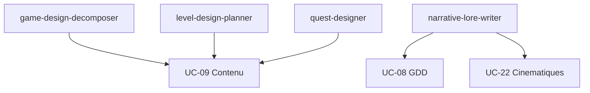

---

## Rayon B — Art 2D

Produire les images 2D : concepts, sprites, art d'UI et textures peintes.

#### concept-art-prompter

| Aspect | Détail |
| --- | --- |
| Intention | Produire des concepts visuels cadrés par la direction artistique. |
| Quand l'utiliser | En préproduction, pour explorer un style ou un asset. |
| Éviter quand | L'asset final de production est attendu (passer à la 3D, UC-17). |
| Format d'artefact | Planches de concept PNG, moodboards, notes de style. |
| Palier modèle | Frontier — exploration visuelle multimodale. |
| Taille de contexte | Moyen. |
| Niveau de réflexion | Haut. |
| Preuve produite | Capture validée contre la bible artistique (QUA-12). |
| UC / socle lié | UC-09, UC-17 ; QUA-12. |

#### sprite-generator

| Aspect | Détail |
| --- | --- |
| Intention | Produire des sprites et atlas conformes (taille, marges, palette). |
| Quand l'utiliser | Pour des assets 2D de jeu à volume, sous contrat. |
| Éviter quand | L'asset est un one-shot artisanal hors pipeline. |
| Format d'artefact | PNG, atlas, métadonnées de découpe (JSON). |
| Palier modèle | Standard — génération sous contraintes. |
| Taille de contexte | Court. |
| Niveau de réflexion | Bas. |
| Preuve produite | Atlas validé contre le contrat (QUA-14). |
| UC / socle lié | UC-12 ; QUA-14, GOV-08. |

#### ui-art-producer

| Aspect | Détail |
| --- | --- |
| Intention | Produire les éléments graphiques d'UI (icônes, cadres, états). |
| Quand l'utiliser | Pour habiller un HUD ou des menus définis. |
| Éviter quand | Le flux d'UI n'est pas encore spécifié (voir UC-26). |
| Format d'artefact | PNG/SVG, 9-slices, jeux d'icônes, états. |
| Palier modèle | Standard — production cadrée par guidelines. |
| Taille de contexte | Court. |
| Niveau de réflexion | Bas. |
| Preuve produite | Capture multi-état validée (QUA-12). |
| UC / socle lié | UC-26 ; QUA-12, QUA-14. |

#### texture-2d-painter

| Aspect | Détail |
| --- | --- |
| Intention | Peindre des textures 2D (albedo, masques) au format et résolution cible. |
| Quand l'utiliser | Pour alimenter des matériaux PBR ou des surfaces 2D. |
| Éviter quand | La texture doit être bakée depuis la 3D (voir texture-baker). |
| Format d'artefact | PNG/EXR/TGA, canaux séparés, tiling vérifié. |
| Palier modèle | Standard — production sous contrainte de canal. |
| Taille de contexte | Court. |
| Niveau de réflexion | Bas. |
| Preuve produite | Texture validée (canaux, résolution, tiling). |
| UC / socle lié | UC-18 ; QUA-14, GOV-08. |

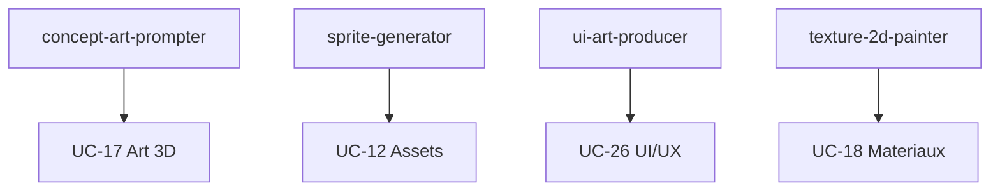

---

## Rayon C — Art 3D

Produire la géométrie : blockout, hard-surface, sculpt, retopo/UV, décor, props, personnages.

#### blockout-modeler

| Aspect | Détail |
| --- | --- |
| Intention | Produire un blockout d'espaces et de volumes pour valider l'échelle. |
| Quand l'utiliser | Avant la modélisation détaillée d'un niveau ou d'un asset. |
| Éviter quand | Le high-poly final est attendu directement. |
| Format d'artefact | Meshes low-poly (FBX/glTF), notes d'échelle. |
| Palier modèle | Standard — composition spatiale simple. |
| Taille de contexte | Court. |
| Niveau de réflexion | Moyen. |
| Preuve produite | Échelle validée (capture + métriques). |
| UC / socle lié | UC-17 ; COG-01, QUA-12. |

#### hard-surface-modeler

| Aspect | Détail |
| --- | --- |
| Intention | Modéliser des objets manufacturés (armes, véhicules, machines). |
| Quand l'utiliser | Pour des props mécaniques au budget de polygones défini. |
| Éviter quand | L'asset est organique (voir organic-sculptor). |
| Format d'artefact | Meshes (FBX/glTF), normales propres, budget tris. |
| Palier modèle | Standard — modélisation contrainte. |
| Taille de contexte | Court. |
| Niveau de réflexion | Moyen. |
| Preuve produite | Mesh validé (budget, normales, UV). |
| UC / socle lié | UC-17 ; QUA-14, GOV-08. |

#### organic-sculptor

| Aspect | Détail |
| --- | --- |
| Intention | Sculpter des formes organiques (personnages, créatures, terrain). |
| Quand l'utiliser | Pour du high-poly à retopologiser ensuite. |
| Éviter quand | L'objet est hard-surface ou un simple prop. |
| Format d'artefact | High-poly (sculpt), maps de détail à baker. |
| Palier modèle | Frontier — forme organique ouverte. |
| Taille de contexte | Court. |
| Niveau de réflexion | Haut. |
| Preuve produite | Capture validée contre la référence (QUA-12). |
| UC / socle lié | UC-17 ; QUA-12. |

#### retopo-uv-optimizer

| Aspect | Détail |
| --- | --- |
| Intention | Retopologiser et déplier les UV dans le budget cible. |
| Quand l'utiliser | Après un sculpt ou un scan, avant export. |
| Éviter quand | Le mesh est déjà low-poly et UV propres. |
| Format d'artefact | Mesh retopo, UV maps, densité de texels. |
| Palier modèle | Standard — optimisation sous contrainte. |
| Taille de contexte | Court. |
| Niveau de réflexion | Moyen. |
| Preuve produite | UV non chevauchantes, densité validée (QUA-14). |
| UC / socle lié | UC-17 ; GOV-08, QUA-14. |

#### environment-set-dresser

| Aspect | Détail |
| --- | --- |
| Intention | Habiller un environnement par instanciation et composition. |
| Quand l'utiliser | Pour peupler un niveau avec des assets validés. |
| Éviter quand | Les assets de base ne sont pas encore validés. |
| Format d'artefact | Scène/level, instances, budgets de draw calls. |
| Palier modèle | Standard — composition de scène. |
| Taille de contexte | Moyen. |
| Niveau de réflexion | Moyen. |
| Preuve produite | Capture de scène + budget de draw calls (QUA-12). |
| UC / socle lié | UC-17 ; QUA-12, GOV-08. |

#### prop-modeler

| Aspect | Détail |
| --- | --- |
| Intention | Produire des props à fort volume dans un budget serré. |
| Quand l'utiliser | Pour du set dressing à grande échelle. |
| Éviter quand | L'asset est un héros nécessitant un soin particulier. |
| Format d'artefact | Meshes (glTF/FBX), LOD, budgets tris. |
| Palier modèle | Économique — production répétitive cadrée. |
| Taille de contexte | Court. |
| Niveau de réflexion | Bas. |
| Preuve produite | Lot validé (budget, nommage, LOD). |
| UC / socle lié | UC-17 ; QUA-14, GOV-08. |

#### character-modeler

| Aspect | Détail |
| --- | --- |
| Intention | Modéliser des personnages avec une topologie d'animation. |
| Quand l'utiliser | Pour des personnages destinés au rigging (UC-20). |
| Éviter quand | L'asset est statique et non animé. |
| Format d'artefact | Mesh personnage, topologie d'animation, UV. |
| Palier modèle | Standard — topologie contrainte par l'animation. |
| Taille de contexte | Court. |
| Niveau de réflexion | Moyen. |
| Preuve produite | Topologie validée pour skinning (QUA-14). |
| UC / socle lié | UC-17, UC-20 ; QUA-14. |

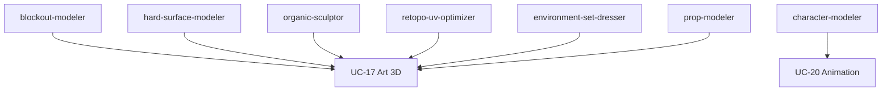

---

## Rayon D — Matériaux & rendu

Produire matériaux PBR, shaders, et bakes, dans un budget GPU.

#### pbr-material-author

| Aspect | Détail |
| --- | --- |
| Intention | Composer des matériaux PBR conformes et instanciables. |
| Quand l'utiliser | Pour habiller des surfaces avec un workflow PBR. |
| Éviter quand | Un shader procédural complexe est requis (voir shader-graph-author). |
| Format d'artefact | Matériaux (.mat), instances, jeux de textures. |
| Palier modèle | Standard — composition sous contrat de canal. |
| Taille de contexte | Court. |
| Niveau de réflexion | Moyen. |
| Preuve produite | Matériau validé (canaux, instances) (QUA-14). |
| UC / socle lié | UC-18 ; QUA-14. |

#### shader-graph-author

| Aspect | Détail |
| --- | --- |
| Intention | Composer un shader-graph dans un budget d'instructions. |
| Quand l'utiliser | Pour un effet de surface non couvert par un matériau standard. |
| Éviter quand | Un matériau PBR standard suffit. |
| Format d'artefact | .shadergraph / réseau de nœuds, mots-clés de variantes. |
| Palier modèle | Standard — logique de graphe contrainte. |
| Taille de contexte | Moyen. |
| Niveau de réflexion | Moyen. |
| Preuve produite | Shader validé (contrat, budget d'instructions). |
| UC / socle lié | UC-18 ; GOV-08, QUA-14. |

#### shader-perf-profiler

| Aspect | Détail |
| --- | --- |
| Intention | Mesurer le coût GPU d'un shader par plateforme. |
| Quand l'utiliser | Avant validation d'un shader ou en chasse de régression. |
| Éviter quand | Aucun budget GPU n'est défini. |
| Format d'artefact | Profil d'instructions, mesures par plateforme. |
| Palier modèle | Économique — mesure et comparaison. |
| Taille de contexte | Court. |
| Niveau de réflexion | Bas. |
| Preuve produite | Profil GPU comparé au budget (QUA-08). |
| UC / socle lié | UC-18, UC-27 ; QUA-08. |

#### texture-baker

| Aspect | Détail |
| --- | --- |
| Intention | Baker des maps (normales, AO, courbure) depuis le high-poly. |
| Quand l'utiliser | Pour transférer le détail d'un sculpt vers un low-poly. |
| Éviter quand | Les textures sont peintes à la main (voir texture-2d-painter). |
| Format d'artefact | Maps PNG/EXR, cage de bake, rapport d'erreurs. |
| Palier modèle | Économique — opération déterministe paramétrée. |
| Taille de contexte | Court. |
| Niveau de réflexion | Bas. |
| Preuve produite | Maps validées (absence d'artefact, résolution). |
| UC / socle lié | UC-18 ; QUA-14. |

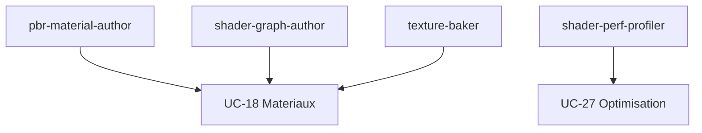

---

## Rayon E — VFX

Produire les effets temps réel dans des budgets d'overdraw et de particules.

#### particle-fx-author

| Aspect | Détail |
| --- | --- |
| Intention | Composer des systèmes de particules dans un budget. |
| Quand l'utiliser | Pour des effets d'impact, d'ambiance ou de feedback. |
| Éviter quand | L'effet relève d'une simulation lourde (voir realtime-sim-author). |
| Format d'artefact | Systèmes de particules, atlas/flipbooks. |
| Palier modèle | Standard — composition d'effet. |
| Taille de contexte | Court. |
| Niveau de réflexion | Moyen. |
| Preuve produite | Effet validé (budget particules, capture). |
| UC / socle lié | UC-19 ; GOV-08, QUA-12. |

#### realtime-sim-author

| Aspect | Détail |
| --- | --- |
| Intention | Produire des simulations temps réel (fluides, destruction) bornées. |
| Quand l'utiliser | Pour des effets dynamiques au coût maîtrisé. |
| Éviter quand | Un système de particules simple suffit. |
| Format d'artefact | Setups de simulation, caches, budgets. |
| Palier modèle | Standard — paramétrage de simulation. |
| Taille de contexte | Court. |
| Niveau de réflexion | Moyen. |
| Preuve produite | Simulation déterministe si gameplay (RUN-13). |
| UC / socle lié | UC-19 ; RUN-13, QUA-08. |

#### vfx-budget-profiler

| Aspect | Détail |
| --- | --- |
| Intention | Mesurer overdraw et fillrate des effets en scène. |
| Quand l'utiliser | Avant validation d'un VFX ou en chasse de régression. |
| Éviter quand | Aucun budget de rendu n'est défini. |
| Format d'artefact | Profil de fillrate, carte d'overdraw. |
| Palier modèle | Économique — mesure et comparaison. |
| Taille de contexte | Court. |
| Niveau de réflexion | Bas. |
| Preuve produite | Profil d'overdraw comparé au budget (QUA-08). |
| UC / socle lié | UC-19, UC-27 ; QUA-08. |

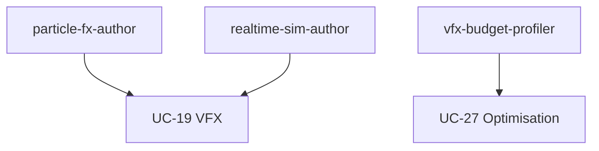

---

## Rayon F — Animation & rigging

Construire rigs et animations conformes, retargetables et déterministes.

#### rig-author

| Aspect | Détail |
| --- | --- |
| Intention | Construire un rig conforme à la convention de squelette. |
| Quand l'utiliser | Pour préparer un personnage à l'animation. |
| Éviter quand | Le squelette standard existe et suffit. |
| Format d'artefact | Rig/squelette, contrôleurs, convention de bones. |
| Palier modèle | Standard — construction structurée. |
| Taille de contexte | Court. |
| Niveau de réflexion | Moyen. |
| Preuve produite | Rig validé contre la convention (QUA-14). |
| UC / socle lié | UC-20 ; QUA-14, GOV-08. |

#### skinning-checker

| Aspect | Détail |
| --- | --- |
| Intention | Vérifier le skinning (poids, déformations limites). |
| Quand l'utiliser | Après skinning, avant validation d'un personnage. |
| Éviter quand | L'asset n'est pas déformable. |
| Format d'artefact | Rapport de poids, captures de poses limites. |
| Palier modèle | Économique — vérification paramétrée. |
| Taille de contexte | Court. |
| Niveau de réflexion | Bas. |
| Preuve produite | Déformations validées sur poses clés (QUA-12). |
| UC / socle lié | UC-20 ; QUA-14, QUA-12. |

#### anim-clip-author

| Aspect | Détail |
| --- | --- |
| Intention | Produire des clips d'animation dans le budget mémoire. |
| Quand l'utiliser | Pour créer locomotion, actions ou réactions. |
| Éviter quand | L'animation doit être procédurale (voir procedural-anim-author). |
| Format d'artefact | Clips (FBX), courbes, budget mémoire. |
| Palier modèle | Standard — production cadrée. |
| Taille de contexte | Court. |
| Niveau de réflexion | Moyen. |
| Preuve produite | Clip validé (budget, capture) (QUA-12). |
| UC / socle lié | UC-20 ; QUA-12, GOV-08. |

#### mocap-cleanup

| Aspect | Détail |
| --- | --- |
| Intention | Nettoyer et retargeter de la capture de mouvement. |
| Quand l'utiliser | Pour exploiter du mocap brut. |
| Éviter quand | L'animation est entièrement keyframée. |
| Format d'artefact | Clips nettoyés, rapport de retargeting. |
| Palier modèle | Standard — nettoyage et adaptation. |
| Taille de contexte | Court. |
| Niveau de réflexion | Moyen. |
| Preuve produite | Retargeting validé par dry-run (GOV-02). |
| UC / socle lié | UC-20 ; QUA-14, GOV-02. |

#### anim-state-machine-author

| Aspect | Détail |
| --- | --- |
| Intention | Composer des state machines d'animation (transitions, blends). |
| Quand l'utiliser | Pour piloter l'animation par l'état de jeu. |
| Éviter quand | Un simple clip joué suffit. |
| Format d'artefact | Animation state machine, blend trees (JSON/asset). |
| Palier modèle | Standard — logique d'états. |
| Taille de contexte | Moyen. |
| Niveau de réflexion | Moyen. |
| Preuve produite | Transitions validées contre contrat (QUA-14). |
| UC / socle lié | UC-20, UC-14 ; QUA-14. |

#### procedural-anim-author

| Aspect | Détail |
| --- | --- |
| Intention | Produire de l'animation procédurale (IK, ragdoll, look-at) bornée. |
| Quand l'utiliser | Pour de l'adaptation dynamique au terrain ou à la cible. |
| Éviter quand | Une animation jouée fixe suffit. |
| Format d'artefact | Setups IK/contraintes, paramètres bornés. |
| Palier modèle | Standard — composition contrainte. |
| Taille de contexte | Court. |
| Niveau de réflexion | Moyen. |
| Preuve produite | Comportement déterministe vérifié (RUN-13). |
| UC / socle lié | UC-20 ; RUN-13, QUA-14. |

#### skeletal-2d-animator

| Aspect | Détail |
| --- | --- |
| Intention | Animer en 2D squelettique (Spine, Live2D) : os, maillage de déformation, découpage cutout. |
| Quand l'utiliser | Personnages ou éléments 2D animés par squelette et déformation. |
| Éviter quand | L'animation est en sprites image par image ou entièrement en 3D. |
| Format d'artefact | Rig 2D, clips d'animation, atlas de découpage. |
| Palier modèle | Standard — composition d'animation guidée. |
| Taille de contexte | Court. |
| Niveau de réflexion | Moyen. |
| Preuve produite | Animations 2D validées en jeu (QUA-12). |
| UC / socle lié | UC-20 ; QUA-12. |

#### facial-lipsync-animator

| Aspect | Détail |
| --- | --- |
| Intention | Animer le visage : synchronisation labiale, blendshapes/morph targets, visèmes et expressions. |
| Quand l'utiliser | Personnages parlants nécessitant lip-sync et expressions. |
| Éviter quand | Aucune animation faciale ni dialogue visible. |
| Format d'artefact | Jeux de blendshapes, mappage de visèmes, clips faciaux. |
| Palier modèle | Standard ; média final routé vers l'outil compétent (MOD-03). |
| Taille de contexte | Moyen. |
| Niveau de réflexion | Moyen. |
| Preuve produite | Lip-sync et expressions validés en mouvement (QUA-12). |
| UC / socle lié | UC-20 ; MOD-03, QUA-12. |

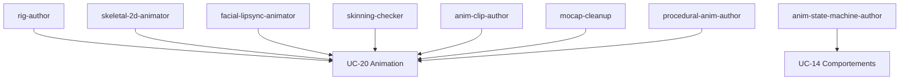

---

## Rayon G — Audio

Produire SFX, musique, voix et mix dans des cibles de loudness et de mémoire.

#### sfx-designer

| Aspect | Détail |
| --- | --- |
| Intention | Concevoir des effets sonores conformes au format et à la loudness. |
| Quand l'utiliser | Pour le feedback d'actions et l'ambiance. |
| Éviter quand | Le besoin est musical (voir music-composer). |
| Format d'artefact | .wav/.ogg, événements, métadonnées. |
| Palier modèle | Standard — design sous contrainte. |
| Taille de contexte | Court. |
| Niveau de réflexion | Bas. |
| Preuve produite | SFX validé (format, loudness) (QUA-14). |
| UC / socle lié | UC-21 ; QUA-14. |

#### music-composer

| Aspect | Détail |
| --- | --- |
| Intention | Composer des pistes musicales adaptées au ton et aux états. |
| Quand l'utiliser | Pour l'identité musicale d'un niveau ou d'un moment. |
| Éviter quand | Seul un SFX ponctuel est requis. |
| Format d'artefact | Pistes .wav/.ogg, stems, points de boucle. |
| Palier modèle | Frontier — création musicale ouverte. |
| Taille de contexte | Moyen. |
| Niveau de réflexion | Haut. |
| Preuve produite | Piste validée (loudness, boucle) (QUA-14). |
| UC / socle lié | UC-21 ; QUA-14. |

#### voice-dialogue-manager

| Aspect | Détail |
| --- | --- |
| Intention | Gérer les voix et dialogues, et déclencher leur localisation. |
| Quand l'utiliser | Pour des dialogues multilingues ancrés au scénario. |
| Éviter quand | Le jeu n'a pas de voix. |
| Format d'artefact | Banques de voix, scripts, table de localisation. |
| Palier modèle | Standard — orchestration de dialogues. |
| Taille de contexte | Moyen. |
| Niveau de réflexion | Moyen. |
| Preuve produite | Cohérence et localisation tracées (UC-01). |
| UC / socle lié | UC-21, UC-01 ; KNO-10. |

#### audio-mix-loudness

| Aspect | Détail |
| --- | --- |
| Intention | Mesurer et ajuster le mix (loudness intégrée, crête, plage). |
| Quand l'utiliser | Avant validation du mix d'un niveau ou du jeu. |
| Éviter quand | Aucune cible de loudness n'est définie. |
| Format d'artefact | Rapport LUFS, réglages de bus. |
| Palier modèle | Économique — mesure et ajustement. |
| Taille de contexte | Court. |
| Niveau de réflexion | Bas. |
| Preuve produite | Mesure LUFS dans la cible (QUA-08). |
| UC / socle lié | UC-21 ; QUA-08. |

#### adaptive-audio-author

| Aspect | Détail |
| --- | --- |
| Intention | Composer la logique d'audio adaptatif (couches, transitions). |
| Quand l'utiliser | Pour une nappe sonore réagissant à l'état de jeu. |
| Éviter quand | Une musique linéaire suffit. |
| Format d'artefact | Graphe d'événements adaptatifs, états. |
| Palier modèle | Standard — logique d'états audio. |
| Taille de contexte | Moyen. |
| Niveau de réflexion | Moyen. |
| Preuve produite | Transitions reproductibles tracées (QUA-04). |
| UC / socle lié | UC-21 ; COG-01, QUA-04. |

#### procedural-audio-designer

| Aspect | Détail |
| --- | --- |
| Intention | Concevoir la synthèse procédurale de son (moteurs, impacts, vent, foules) paramétrée et générée en temps réel sous budget. |
| Quand l'utiliser | Quand le son doit varier en continu avec l'état physique ou simulé plutôt que rejouer des échantillons figés. |
| Éviter quand | Quelques échantillons préenregistrés suffisent. |
| Format d'artefact | Graphe de synthèse, paramètres temps réel, budget DSP. |
| Palier modèle | Standard pour la logique ; Frontier pour la conception de synthèse. |
| Taille de contexte | Moyen. |
| Niveau de réflexion | Moyen. |
| Preuve produite | Sons générés reproductibles et dans le budget DSP (QUA-04). |
| UC / socle lié | UC-21 ; COG-01, QUA-04. |

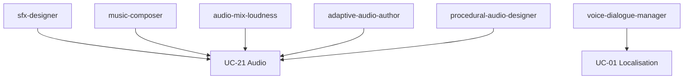

---

## Rayon H — Cinématiques & mise en scène

Composer scénario, storyboard, caméra et séquences in-engine cohérents avec le lore.

#### scenario-writer

| Aspect | Détail |
| --- | --- |
| Intention | Écrire le scénario d'une séquence ancré sur le canon. |
| Quand l'utiliser | Avant le storyboard d'une cinématique. |
| Éviter quand | Aucun canon n'est établi (voir UC-08). |
| Format d'artefact | Script de séquence, beats narratifs. |
| Palier modèle | Frontier — écriture narrative. |
| Taille de contexte | Large. |
| Niveau de réflexion | Haut. |
| Preuve produite | Cohérence lore vérifiée (KNO-10). |
| UC / socle lié | UC-22 ; KNO-10. |

#### storyboard-author

| Aspect | Détail |
| --- | --- |
| Intention | Produire un storyboard (plans, cadrages, intentions). |
| Quand l'utiliser | Pour planifier le découpage avant le blocking. |
| Éviter quand | La séquence est triviale sans valeur narrative. |
| Format d'artefact | Planches de storyboard, liste de plans. |
| Palier modèle | Standard — découpage visuel. |
| Taille de contexte | Moyen. |
| Niveau de réflexion | Moyen. |
| Preuve produite | Découpage validé contre le scénario (QUA-12). |
| UC / socle lié | UC-22 ; QUA-12. |

#### camera-blocking

| Aspect | Détail |
| --- | --- |
| Intention | Définir le placement et le mouvement de caméra par plan. |
| Quand l'utiliser | Pour mettre en scène une cinématique. |
| Éviter quand | La caméra est gameplay et non scénarisée. |
| Format d'artefact | Pistes de caméra, paramètres de cadrage. |
| Palier modèle | Standard — composition de cadrage. |
| Taille de contexte | Moyen. |
| Niveau de réflexion | Moyen. |
| Preuve produite | Plans validés (durée, cadrage) (QUA-14). |
| UC / socle lié | UC-22 ; QUA-14. |

#### in-engine-sequence-author

| Aspect | Détail |
| --- | --- |
| Intention | Assembler une séquence in-engine (timeline, déclencheurs). |
| Quand l'utiliser | Pour des cinématiques temps réel intégrées au jeu. |
| Éviter quand | La cinématique est une vidéo précalculée. |
| Format d'artefact | Timeline/séquence, pistes, événements. |
| Palier modèle | Standard — assemblage de timeline. |
| Taille de contexte | Moyen. |
| Niveau de réflexion | Moyen. |
| Preuve produite | Séquence validée et capturée (QUA-12). |
| UC / socle lié | UC-22 ; QUA-14, QUA-12. |

#### edit-pacing-reviewer

| Aspect | Détail |
| --- | --- |
| Intention | Réviser le rythme et le montage d'une séquence. |
| Quand l'utiliser | Avant validation finale d'une cinématique. |
| Éviter quand | La séquence n'est pas encore montée. |
| Format d'artefact | Notes de montage, recommandations de coupe. |
| Palier modèle | Standard — revue critique. |
| Taille de contexte | Moyen. |
| Niveau de réflexion | Haut. |
| Preuve produite | Revue indépendante documentée (QUA-15). |
| UC / socle lié | UC-22 ; QUA-15. |

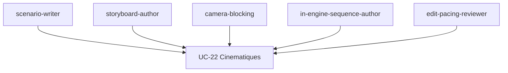

---

## Rayon I — Gameplay (combat, physique, collisions, navigation)

Concevoir et régler les systèmes jouables, en s'appuyant sur le déterminisme.

#### combat-system-designer

| Aspect | Détail |
| --- | --- |
| Intention | Concevoir un système de combat et son équilibrage. |
| Quand l'utiliser | Pour structurer mouvements, dégâts et interactions. |
| Éviter quand | Le jeu n'a pas de combat chiffré. |
| Format d'artefact | Tables de mouvements, règles de dégâts. |
| Palier modèle | Standard — conception de système. |
| Taille de contexte | Moyen. |
| Niveau de réflexion | Haut. |
| Preuve produite | Équilibrage non régressif prouvé (QUA-04). |
| UC / socle lié | UC-23 ; COG-03, QUA-04. |

#### hitbox-framedata-author

| Aspect | Détail |
| --- | --- |
| Intention | Spécifier hitbox/hurtbox et frame data par mouvement. |
| Quand l'utiliser | Pour définir le timing et les volumes de combat. |
| Éviter quand | Le combat n'a pas de notion de frames. |
| Format d'artefact | Table de frame data, volumes de collision. |
| Palier modèle | Économique — spécification structurée. |
| Taille de contexte | Court. |
| Niveau de réflexion | Bas. |
| Preuve produite | Frame data validée et versionnée (QUA-14). |
| UC / socle lié | UC-23 ; QUA-14. |

#### physics-tuner

| Aspect | Détail |
| --- | --- |
| Intention | Régler la physique (pas fixe, matériaux, contraintes). |
| Quand l'utiliser | Pour une simulation stable et déterministe. |
| Éviter quand | La physique est purement cosmétique. |
| Format d'artefact | Réglages physiques, matériaux, logs de rejeu. |
| Palier modèle | Économique — réglage paramétrique. |
| Taille de contexte | Court. |
| Niveau de réflexion | Moyen. |
| Preuve produite | Simulation déterministe rejouée (RUN-13). |
| UC / socle lié | UC-25 ; RUN-13, QUA-08. |

#### collision-layer-designer

| Aspect | Détail |
| --- | --- |
| Intention | Définir la matrice de couches et de filtres de collision. |
| Quand l'utiliser | Pour éviter les interactions fantômes. |
| Éviter quand | Une seule couche suffit. |
| Format d'artefact | Matrice de collision, filtres. |
| Palier modèle | Économique — spécification déterministe. |
| Taille de contexte | Court. |
| Niveau de réflexion | Bas. |
| Preuve produite | Matrice validée contre contrat (QUA-14). |
| UC / socle lié | UC-25 ; QUA-14. |

#### navmesh-builder

| Aspect | Détail |
| --- | --- |
| Intention | Construire et valider un navmesh et ses liens. |
| Quand l'utiliser | Pour la navigation des PNJ. |
| Éviter quand | Aucun agent ne se déplace. |
| Format d'artefact | Navmesh, liens, paramètres d'agent. |
| Palier modèle | Économique — génération paramétrée. |
| Taille de contexte | Court. |
| Niveau de réflexion | Bas. |
| Preuve produite | Chemins valides, aucun blocage (QUA-04). |
| UC / socle lié | UC-24 ; QUA-14, QUA-04. |

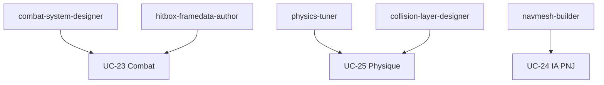

---

## Rayon J — IA & PNJ

Produire la logique de décision et de perception des PNJ, déterministe et bornée.

#### behavior-tree-authoring

| Aspect | Détail |
| --- | --- |
| Intention | Composer des behavior trees lisibles et bornés. |
| Quand l'utiliser | Pour des comportements réactifs hiérarchiques. |
| Éviter quand | La décision relève d'un score continu (voir utility-ai-author). |
| Format d'artefact | Behavior tree (asset/JSON), nœuds. |
| Palier modèle | Standard — logique de décision. |
| Taille de contexte | Moyen. |
| Niveau de réflexion | Moyen. |
| Preuve produite | Comportement validé et déterministe (QUA-04). |
| UC / socle lié | UC-24, UC-14 ; COG-04, QUA-04. |

#### fsm-author

| Aspect | Détail |
| --- | --- |
| Intention | Composer des machines à états finis claires. |
| Quand l'utiliser | Pour des comportements à états bien séparés. |
| Éviter quand | Les états explosent en nombre (préférer BT/utility). |
| Format d'artefact | FSM (asset/JSON), transitions. |
| Palier modèle | Standard — logique d'états. |
| Taille de contexte | Court. |
| Niveau de réflexion | Moyen. |
| Preuve produite | Transitions validées contre contrat (QUA-14). |
| UC / socle lié | UC-24 ; COG-04, QUA-14. |

#### utility-ai-author

| Aspect | Détail |
| --- | --- |
| Intention | Concevoir une IA par score d'utilité (curves, considerations). |
| Quand l'utiliser | Pour une décision pondérée et nuancée. |
| Éviter quand | Une logique binaire suffit (FSM/BT). |
| Format d'artefact | Tables d'utility, courbes, poids. |
| Palier modèle | Standard — conception pondérée. |
| Taille de contexte | Moyen. |
| Niveau de réflexion | Haut. |
| Preuve produite | Décisions tracées et reproductibles (QUA-04). |
| UC / socle lié | UC-24 ; COG-04, QUA-04. |

#### goap-planner

| Aspect | Détail |
| --- | --- |
| Intention | Mettre en place une planification d'actions (GOAP). |
| Quand l'utiliser | Pour des PNJ planifiant vers des buts. |
| Éviter quand | Le comportement est simple et réactif. |
| Format d'artefact | Définitions d'actions, buts, préconditions. |
| Palier modèle | Standard — planification structurée. |
| Taille de contexte | Moyen. |
| Niveau de réflexion | Haut. |
| Preuve produite | Plans valides et bornés (QUA-04). |
| UC / socle lié | UC-24 ; COG-01, QUA-04. |

#### perception-system-author

| Aspect | Détail |
| --- | --- |
| Intention | Concevoir la perception (vue, ouïe) bornée des PNJ. |
| Quand l'utiliser | Pour des réactions crédibles aux stimuli. |
| Éviter quand | Les PNJ n'ont pas besoin de percevoir. |
| Format d'artefact | Paramètres de perception, stimuli, mémoire courte. |
| Palier modèle | Standard — modélisation bornée. |
| Taille de contexte | Court. |
| Niveau de réflexion | Moyen. |
| Preuve produite | Perception bornée vérifiée (GOV-08). |
| UC / socle lié | UC-24 ; GOV-08. |

#### director-ai-author

| Aspect | Détail |
| --- | --- |
| Intention | Réguler le rythme global (spawns, intensité) par un director. |
| Quand l'utiliser | Pour piloter la difficulté et la tension d'ensemble. |
| Éviter quand | Le jeu n'a pas de régulation globale. |
| Format d'artefact | Règles de director, courbes d'intensité. |
| Palier modèle | Standard — régulation systémique. |
| Taille de contexte | Moyen. |
| Niveau de réflexion | Haut. |
| Preuve produite | Régulation bornée et tracée (GOV-08). |
| UC / socle lié | UC-24, UC-16 ; GOV-08. |

#### crowd-simulation-author

| Aspect | Détail |
| --- | --- |
| Intention | Simuler des foules : boids/flocking, évitement, densité et variété, dans le budget de performance. |
| Quand l'utiliser | Scènes peuplées exigeant un comportement de masse crédible. |
| Éviter quand | Peu d'agents, gérés par l'IA de PNJ standard. |
| Format d'artefact | Règles de foule, paramètres d'évitement, budget d'agents. |
| Palier modèle | Standard — réglage systémique de masse. |
| Taille de contexte | Moyen. |
| Niveau de réflexion | Moyen. |
| Preuve produite | Foule crédible et fluide dans le budget (QUA-08, GOV-08). |
| UC / socle lié | UC-24 ; UC-27, GOV-08. |

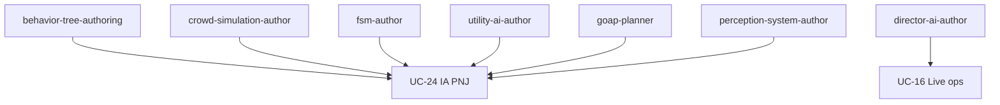

---

## Rayon K — UI/UX & accessibilité

Produire HUD, menus, options et accessibilité conformes et prouvés.

#### hud-author

| Aspect | Détail |
| --- | --- |
| Intention | Composer un HUD lisible et non encombrant. |
| Quand l'utiliser | Pour afficher l'état de jeu en temps réel. |
| Éviter quand | L'information relève d'un menu (voir menu-flow-designer). |
| Format d'artefact | Layout HUD, ancrages, états. |
| Palier modèle | Standard — composition d'affichage. |
| Taille de contexte | Court. |
| Niveau de réflexion | Moyen. |
| Preuve produite | HUD validé et capturé (QUA-12). |
| UC / socle lié | UC-26 ; QUA-14, QUA-12. |

#### menu-flow-designer

| Aspect | Détail |
| --- | --- |
| Intention | Concevoir les flux de menus (navigation, états, erreurs). |
| Quand l'utiliser | Pour structurer les écrans et leurs transitions. |
| Éviter quand | Un seul écran sans navigation. |
| Format d'artefact | Arbre de flux, écrans, états d'erreur. |
| Palier modèle | Standard — conception de flux. |
| Taille de contexte | Moyen. |
| Niveau de réflexion | Moyen. |
| Preuve produite | Flux validé contre contrat (QUA-14). |
| UC / socle lié | UC-26 ; QUA-14. |

#### a11y-auditor

| Aspect | Détail |
| --- | --- |
| Intention | Auditer l'accessibilité (daltonisme, sous-titres, échelle). |
| Quand l'utiliser | À chaque jalon d'UI, et avant certification. |
| Éviter quand | Aucun critère d'accessibilité n'est défini (les définir d'abord). |
| Format d'artefact | Rapport d'accessibilité, captures par mode. |
| Palier modèle | Économique — vérification de critères. |
| Taille de contexte | Court. |
| Niveau de réflexion | Bas. |
| Preuve produite | Critères a11y attestés (GOV-08, QUA-04). |
| UC / socle lié | UC-26 ; GOV-08, QUA-04. |

#### input-remap-designer

| Aspect | Détail |
| --- | --- |
| Intention | Concevoir le remap d'entrées complet et cohérent. |
| Quand l'utiliser | Pour offrir une configuration des contrôles. |
| Éviter quand | Les contrôles sont figés et non configurables. |
| Format d'artefact | Schéma d'entrées, table de remap, conflits. |
| Palier modèle | Économique — structuration de mapping. |
| Taille de contexte | Court. |
| Niveau de réflexion | Bas. |
| Preuve produite | Remap validé sans conflit (QUA-14). |
| UC / socle lié | UC-26 ; QUA-14. |

#### graphics-options-designer

| Aspect | Détail |
| --- | --- |
| Intention | Concevoir le menu d'options graphiques et ses presets. |
| Quand l'utiliser | Pour exposer la scalability au joueur. |
| Éviter quand | Une seule configuration figée existe. |
| Format d'artefact | Table d'options, presets, dépendances. |
| Palier modèle | Standard — mapping options vers budgets. |
| Taille de contexte | Moyen. |
| Niveau de réflexion | Moyen. |
| Preuve produite | Presets reliés aux budgets (GOV-10). |
| UC / socle lié | UC-26, UC-27 ; GOV-10. |

#### input-device-specialist

| Aspect | Détail |
| --- | --- |
| Intention | Gérer manettes et périphériques : détection, hot-swap, mappage avancé, glyphes par plateforme. |
| Quand l'utiliser | Support multi-manettes et périphériques variés. |
| Éviter quand | Une seule entrée fixe et triviale. |
| Format d'artefact | Table de mappage, profils de périphériques, glyphes. |
| Palier modèle | Standard — configuration guidée. |
| Taille de contexte | Court. |
| Niveau de réflexion | Moyen. |
| Preuve produite | Entrées fiables sur tous les périphériques cibles (QUA-14). |
| UC / socle lié | UC-26 ; UC-28, QUA-14. |

#### haptics-feedback-designer

| Aspect | Détail |
| --- | --- |
| Intention | Concevoir le retour haptique : vibrations, gâchettes adaptatives, retours VR, au service du ressenti. |
| Quand l'utiliser | Quand le toucher renforce l'immersion et le feedback. |
| Éviter quand | Aucun matériel haptique ni besoin de retour tactile. |
| Format d'artefact | Courbes haptiques, profils par manette, règles d'événement. |
| Palier modèle | Standard — composition de feedback. |
| Taille de contexte | Court. |
| Niveau de réflexion | Moyen. |
| Preuve produite | Haptique cohérent et non fatigant validé (QUA-12). |
| UC / socle lié | UC-26 ; UC-28. |

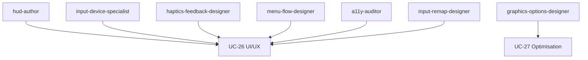

---

## Rayon L — Optimisation & perf

Tenir les budgets par profilage et optimisations gouvernées et prouvées.

#### frame-budget-profiler

| Aspect | Détail |
| --- | --- |
| Intention | Mesurer le frame time CPU/GPU et identifier les points chauds. |
| Quand l'utiliser | Au début et à chaque jalon d'optimisation. |
| Éviter quand | Aucun budget de frame n'est défini. |
| Format d'artefact | Captures de profil, points chauds, budget. |
| Palier modèle | Économique — mesure et analyse. |
| Taille de contexte | Moyen. |
| Niveau de réflexion | Bas. |
| Preuve produite | Profil comparé au budget (QUA-08). |
| UC / socle lié | UC-27 ; QUA-08. |

#### occlusion-culling-tuner

| Aspect | Détail |
| --- | --- |
| Intention | Régler l'occlusion culling pour réduire le rendu inutile. |
| Quand l'utiliser | Pour des scènes GPU-bound avec occlusion. |
| Éviter quand | La scène est ouverte sans occlusion exploitable. |
| Format d'artefact | Réglages d'occlusion, zones, mesures. |
| Palier modèle | Standard — réglage et arbitrage. |
| Taille de contexte | Moyen. |
| Niveau de réflexion | Moyen. |
| Preuve produite | Gain prouvé sans régression (QUA-05). |
| UC / socle lié | UC-27 ; QUA-05. |

#### lod-generator

| Aspect | Détail |
| --- | --- |
| Intention | Générer des chaînes de LOD dans des seuils contrôlés. |
| Quand l'utiliser | Pour réduire le coût des objets distants. |
| Éviter quand | Les objets sont toujours vus de près. |
| Format d'artefact | Chaînes de LOD, seuils de transition. |
| Palier modèle | Économique — génération paramétrée. |
| Taille de contexte | Court. |
| Niveau de réflexion | Bas. |
| Preuve produite | LOD validés sans pop-in visible (QUA-14). |
| UC / socle lié | UC-27 ; QUA-14. |

#### lighting-shadow-baker

| Aspect | Détail |
| --- | --- |
| Intention | Baker éclairage et ombres statiques pour alléger le runtime. |
| Quand l'utiliser | Pour des scènes à éclairage majoritairement statique. |
| Éviter quand | L'éclairage est entièrement dynamique. |
| Format d'artefact | Lightmaps, sondes, rapport de bake. |
| Palier modèle | Économique — opération paramétrée. |
| Taille de contexte | Moyen. |
| Niveau de réflexion | Bas. |
| Preuve produite | Gain prouvé sans artefact (QUA-05). |
| UC / socle lié | UC-27 ; QUA-05. |

#### draw-call-batcher

| Aspect | Détail |
| --- | --- |
| Intention | Réduire les draw calls (batching, instancing, atlas). |
| Quand l'utiliser | Pour des scènes CPU-bound côté rendu. |
| Éviter quand | Le coût est GPU-bound (voir autres skills). |
| Format d'artefact | Stratégie de batching, mesures de draw calls. |
| Palier modèle | Standard — optimisation de rendu. |
| Taille de contexte | Moyen. |
| Niveau de réflexion | Moyen. |
| Preuve produite | Réduction de draw calls mesurée (QUA-08). |
| UC / socle lié | UC-27 ; QUA-08. |

#### texture-mesh-optimizer

| Aspect | Détail |
| --- | --- |
| Intention | Optimiser textures et meshes (compression, budgets mémoire). |
| Quand l'utiliser | Pour tenir un budget mémoire. |
| Éviter quand | Les assets sont déjà sous budget. |
| Format d'artefact | Réglages de compression, budgets, rapport. |
| Palier modèle | Économique — optimisation paramétrée. |
| Taille de contexte | Court. |
| Niveau de réflexion | Bas. |
| Preuve produite | Budgets mémoire tenus (QUA-14). |
| UC / socle lié | UC-27 ; QUA-14. |

#### scalability-settings-author

| Aspect | Détail |
| --- | --- |
| Intention | Définir les presets de qualité par environnement et machine. |
| Quand l'utiliser | Pour couvrir un parc matériel hétérogène. |
| Éviter quand | Une seule cible matérielle existe. |
| Format d'artefact | Presets, mapping options vers budgets. |
| Palier modèle | Standard — déclinaison par environnement. |
| Taille de contexte | Moyen. |
| Niveau de réflexion | Moyen. |
| Preuve produite | Presets validés par environnement (GOV-10). |
| UC / socle lié | UC-27 ; GOV-10. |

#### code-hotpath-optimizer

| Aspect | Détail |
| --- | --- |
| Intention | Optimiser les chemins chauds du code (allocations, boucles). |
| Quand l'utiliser | Pour un coût CPU localisé et mesuré. |
| Éviter quand | Aucun profil ne désigne de hotpath. |
| Format d'artefact | Diff de code, mesures avant/après. |
| Palier modèle | Standard — optimisation de code mesurée. |
| Taille de contexte | Moyen. |
| Niveau de réflexion | Haut. |
| Preuve produite | Gain CPU prouvé sans régression (QUA-08). |
| UC / socle lié | UC-27, UC-06 ; QUA-08. |

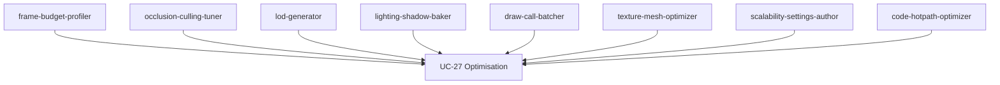

---

## Rayon M — VR/XR

Produire des expériences immersives confortables tenant un plancher de framerate.

#### vr-comfort-auditor

| Aspect | Détail |
| --- | --- |
| Intention | Auditer le confort VR (motion sickness, vection). |
| Quand l'utiliser | À chaque jalon d'une expérience VR. |
| Éviter quand | L'expérience n'est pas immersive. |
| Format d'artefact | Protocole et rapport de comfort testing. |
| Palier modèle | Standard — analyse de signaux de confort. |
| Taille de contexte | Moyen. |
| Niveau de réflexion | Haut. |
| Preuve produite | Verdict de comfort testing (QUA-05). |
| UC / socle lié | UC-28 ; QUA-05. |

#### vr-locomotion-designer

| Aspect | Détail |
| --- | --- |
| Intention | Concevoir une locomotion VR confortable et configurable. |
| Quand l'utiliser | Pour le déplacement en VR. |
| Éviter quand | L'expérience est assise sans déplacement. |
| Format d'artefact | Modes de locomotion, options anti-nausée. |
| Palier modèle | Standard — conception ergonomique. |
| Taille de contexte | Moyen. |
| Niveau de réflexion | Moyen. |
| Preuve produite | Options de confort vérifiées (GOV-08). |
| UC / socle lié | UC-28 ; GOV-08. |

#### vr-interaction-author

| Aspect | Détail |
| --- | --- |
| Intention | Concevoir les interactions en main (saisie, portée, retours). |
| Quand l'utiliser | Pour manipuler des objets en VR. |
| Éviter quand | Une UI écran plat suffit. |
| Format d'artefact | Schémas d'interaction, zones de saisie. |
| Palier modèle | Standard — ergonomie d'interaction. |
| Taille de contexte | Court. |
| Niveau de réflexion | Moyen. |
| Preuve produite | Interaction validée et capturée (QUA-14). |
| UC / socle lié | UC-28, UC-26 ; QUA-14. |

#### vr-perf-tuner

| Aspect | Détail |
| --- | --- |
| Intention | Tenir le plancher de framerate et la latence VR. |
| Quand l'utiliser | Pour atteindre la cible (ex. 90 fps) au casque. |
| Éviter quand | L'expérience n'est pas VR. |
| Format d'artefact | Profils de frame VR, mesures de latence. |
| Palier modèle | Standard — optimisation ciblée VR. |
| Taille de contexte | Moyen. |
| Niveau de réflexion | Haut. |
| Preuve produite | Plancher framerate prouvé (QUA-08). |
| UC / socle lié | UC-28, UC-27 ; QUA-08. |

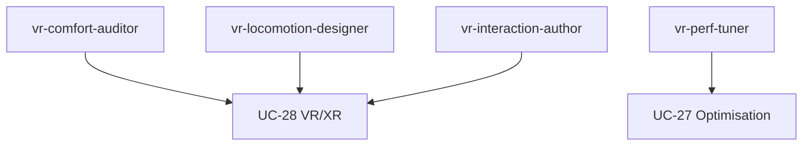

---

## Rayon N — Outils & pipeline

Ordonner le projet : structure, nommage, formats, import/export et version control.

#### project-structure-architect

| Aspect | Détail |
| --- | --- |
| Intention | Définir la taxonomie de dossiers et les zones du projet. |
| Quand l'utiliser | Au démarrage ou lors d'une remise en ordre. |
| Éviter quand | Le projet est jetable et solo. |
| Format d'artefact | Arborescence, charte de structure. |
| Palier modèle | Standard — conception d'organisation. |
| Taille de contexte | Moyen. |
| Niveau de réflexion | Moyen. |
| Preuve produite | Structure validée et opposable (GOV-08). |
| UC / socle lié | UC-29 ; GOV-08. |

#### asset-naming-enforcer

| Aspect | Détail |
| --- | --- |
| Intention | Imposer et vérifier les conventions de nommage. |
| Quand l'utiliser | À chaque ajout d'asset au dépôt. |
| Éviter quand | Aucune convention n'est définie (la définir d'abord). |
| Format d'artefact | Règles de nommage, rapport de conformité. |
| Palier modèle | Économique — vérification déterministe. |
| Taille de contexte | Court. |
| Niveau de réflexion | Bas. |
| Preuve produite | Conformité de nommage attestée (QUA-14). |
| UC / socle lié | UC-29 ; QUA-14. |

#### format-convention-author

| Aspect | Détail |
| --- | --- |
| Intention | Fixer les formats par usage (source vs cooked). |
| Quand l'utiliser | Pour homogénéiser les formats d'assets. |
| Éviter quand | Le projet n'a pas d'assets lourds. |
| Format d'artefact | Table formats-par-usage, règles d'export. |
| Palier modèle | Économique — spécification de règles. |
| Taille de contexte | Court. |
| Niveau de réflexion | Bas. |
| Preuve produite | Formats conformes vérifiés (QUA-14). |
| UC / socle lié | UC-29 ; QUA-14. |

#### import-export-pipeline

| Aspect | Détail |
| --- | --- |
| Intention | Automatiser et gouverner l'import/export d'assets. |
| Quand l'utiliser | Pour fiabiliser le passage outil-vers-moteur. |
| Éviter quand | Les imports sont rares et manuels. |
| Format d'artefact | Scripts de pipeline, logs d'import, validations. |
| Palier modèle | Standard — automatisation gouvernée. |
| Taille de contexte | Moyen. |
| Niveau de réflexion | Moyen. |
| Preuve produite | Sorties gouvernées et tracées (RUN-02). |
| UC / socle lié | UC-12, UC-29 ; RUN-02. |

#### version-control-lfs-manager

| Aspect | Détail |
| --- | --- |
| Intention | Gouverner la version (LFS, ignore, séparation des artefacts). |
| Quand l'utiliser | Dès qu'il y a de gros binaires partagés. |
| Éviter quand | Le dépôt est purement textuel et léger. |
| Format d'artefact | Config LFS/ignore, politique de version. |
| Palier modèle | Économique — application de règles. |
| Taille de contexte | Court. |
| Niveau de réflexion | Bas. |
| Preuve produite | Binaires en LFS, dépôt propre (GOV-08). |
| UC / socle lié | UC-29 ; GOV-08. |

#### modding-api-designer

| Aspect | Détail |
| --- | --- |
| Intention | Concevoir des API d'extension stables et versionnées : points d'extension, hooks, compatibilité ascendante. |
| Quand l'utiliser | Quand le jeu s'ouvre au modding. |
| Éviter quand | Le jeu reste fermé et figé. |
| Format d'artefact | Contrat d'API versionné, points d'extension, guide de migration. |
| Palier modèle | Standard ; Frontier sur la stratégie de compatibilité. |
| Taille de contexte | Moyen. |
| Niveau de réflexion | Haut. |
| Preuve produite | API stable, mods conformes survivant aux mises à jour (GOV-08). |
| UC / socle lié | UC-46 ; KNO-10, GOV-08. |

#### ugc-pipeline-architect

| Aspect | Détail |
| --- | --- |
| Intention | Concevoir l'ingestion, la modération, le bac à sable et le partage du contenu joueur. |
| Quand l'utiliser | Quand les joueurs créent et partagent du contenu. |
| Éviter quand | Aucun contenu joueur n'est accepté. |
| Format d'artefact | Pipeline UGC, politique de modération, règles de bac à sable. |
| Palier modèle | Standard ; modération routée (MOD-03). |
| Taille de contexte | Moyen. |
| Niveau de réflexion | Haut. |
| Preuve produite | UGC isolé, modéré et tracé (GOV-07, GOV-09). |
| UC / socle lié | UC-46 ; UC-45, GOV-07. |

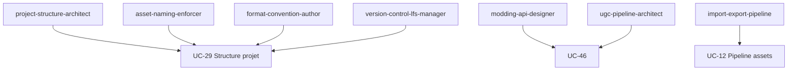

---

## Rayon O — Fondations programmation & mathématiques

Ce rayon équipe les agents de développement avec la maîtrise mathématique et informatique nécessaire au gameplay, à la physique, à l'IA et à l'optimisation.

#### linear-algebra-advisor

| Aspect | Détail |
| --- | --- |
| Intention | Fournir des conseils et des exemples corrects sur les vecteurs, matrices, quaternions, transformations et changements de repères/espaces utilisés en jeu. |
| Quand l'utiliser | Lors de l'implémentation de mouvements 3D, de rotations, de caméras, d'animations skelettales ou de shaders nécessitant des maths vectorielles. |
| Éviter quand | Le besoin est purement 2D sans rotations complexes ni transformations hiérarchiques. |
| Format d'artefact | Notes de référence avec formules annotées, exemples de code, schémas de repères. |
| Palier modèle | Frontier — les erreurs d'algèbre linéaire sont subtiles ; la rigueur formelle est indispensable. |
| Taille de contexte | Moyen. |
| Niveau de réflexion | Haut. |
| Preuve produite | Formules validées et cas de test couvrant les dégénérescences (QUA-14). |
| UC / socle lié | UC-06 ; UC-25 ; COG-02, QUA-14. |

#### geometry-trajectory-solver

| Aspect | Détail |
| --- | --- |
| Intention | Résoudre les problèmes de géométrie analytique : intersections (rayon/plan, AABB, sphère), courbes de Bézier/splines, balistique et trajectoires paramétriques. |
| Quand l'utiliser | Lors de l'implémentation de détection de collision, de projectiles, de chemins de caméra ou de mouvements guidés par des courbes. |
| Éviter quand | Le moteur fournit déjà des utilitaires couvrant exactement le cas, sans besoin de personnalisation. |
| Format d'artefact | Dérivations étape par étape, formules prêtes à l'emploi, tests unitaires de cas limites. |
| Palier modèle | Standard — géométrie classique bien bornée, raisonnement systématique suffisant. |
| Taille de contexte | Moyen. |
| Niveau de réflexion | Moyen. |
| Preuve produite | Cas de test couvrant intersections, dégénérescences et précision numérique (QUA-14). |
| UC / socle lié | UC-23 ; UC-25 ; COG-02, QUA-14. |

#### numerical-stability-checker

| Aspect | Détail |
| --- | --- |
| Intention | Auditer le code pour détecter les problèmes d'arithmétique flottante : accumulation d'erreurs, comparaisons sans epsilon, non-déterminisme entre plateformes, catastrophic cancellation. |
| Quand l'utiliser | Lors de l'intégration physique, de la simulation de réseau (déterminisme), ou quand des tests flottants échouent de façon intermittente. |
| Éviter quand | Le code ne manipule que des entiers ou opère dans des domaines où la précision flottante n'a pas d'impact observable. |
| Format d'artefact | Rapport d'analyse annoté, liste de correctifs priorisés, règles d'epsilon documentées. |
| Palier modèle | Économique — vérification systématique de patterns connus ; Standard si simulation complexe. |
| Taille de contexte | Court. |
| Niveau de réflexion | Moyen. |
| Preuve produite | Rapport de stabilité numérique avec résultats de tests avant/après (RUN-13, QUA-14). |
| UC / socle lié | UC-13 ; UC-25 ; RUN-13, QUA-14. |

#### data-structures-advisor

| Aspect | Détail |
| --- | --- |
| Intention | Recommander la structure de données optimale pour un besoin donné : spatial hashing, quadtree/octree, BVH, graphes, files de priorité, etc., avec analyse mémoire et complexité. |
| Quand l'utiliser | Lors de la conception d'un système de requête spatiale, d'un graphe de navigation, d'un inventaire ou d'un système nécessitant des recherches fréquentes. |
| Éviter quand | La structure est déjà imposée par le moteur ou la librairie utilisée et n'est pas modifiable. |
| Format d'artefact | Tableau comparatif des structures candidates, complexité Big-O, recommandation motivée, schéma de principe. |
| Palier modèle | Standard — raisonnement de conception structuré nécessitant une connaissance CS solide. |
| Taille de contexte | Moyen. |
| Niveau de réflexion | Moyen. |
| Preuve produite | Recommandation documentée et validée par benchmarks ou preuves de complexité (QUA-14). |
| UC / socle lié | UC-06 ; UC-27 ; COG-02, QUA-14. |

#### algorithm-complexity-analyst

| Aspect | Détail |
| --- | --- |
| Intention | Analyser la complexité algorithmique (Big-O temps/espace), identifier les points chauds algorithmiques et proposer des algorithmes mieux adaptés à la contrainte de performance. |
| Quand l'utiliser | Lors d'un profiling révélant des goulots d'étranglement, ou avant d'implémenter une boucle critique nécessitant une garantie de performance. |
| Éviter quand | Le volume de données est négligeable et la performance n'est pas une contrainte mesurée. |
| Format d'artefact | Analyse Big-O annotée, comparaison d'alternatives, recommandation d'algorithme avec justification. |
| Palier modèle | Standard — analyse formelle de complexité, raisonnement structuré. |
| Taille de contexte | Court. |
| Niveau de réflexion | Haut. |
| Preuve produite | Analyse de complexité vérifiable et benchmarks comparatifs (QUA-08). |
| UC / socle lié | UC-27 ; COG-02, QUA-08. |

#### design-pattern-advisor

| Aspect | Détail |
| --- | --- |
| Intention | Conseiller sur les design patterns logiciels (GoF) et les patterns spécifiques au jeu (ECS/component, state machine, observer, command, object pool, service locator) : quand les appliquer, comment les implémenter et quand les éviter. |
| Quand l'utiliser | Lors de la conception d'un système (entités, événements, IA, audio) ou d'une refactorisation visant à réduire le couplage et améliorer la maintenabilité. |
| Éviter quand | L'ajout d'un pattern introduit une complexité disproportionnée par rapport au gain sur un projet de petite taille. |
| Format d'artefact | Fiche de pattern : contexte, structure (schéma UML simplifié), exemple de code, avantages/inconvénients, alternatives. |
| Palier modèle | Frontier — jugement nuancé requis pour arbitrer entre patterns selon le contexte du jeu. |
| Taille de contexte | Moyen. |
| Niveau de réflexion | Haut. |
| Preuve produite | Fiche de pattern validée, code de démonstration exécutable (COG-01, QUA-14). |
| UC / socle lié | UC-06 ; COG-01, QUA-14. |

#### game-ai-algorithms

| Aspect | Détail |
| --- | --- |
| Intention | Implémenter ou conseiller sur les algorithmes d'IA de jeu : pathfinding (A*, navmesh), machines à états finis, behavior trees, GOAP, utility AI, steering behaviors, influence maps. |
| Quand l'utiliser | Lors de la conception ou du débogage du comportement d'agents (ennemis, PNJ, alliés) nécessitant déplacement, prise de décision ou perception. |
| Éviter quand | Le comportement est trivial (ennemi statique) ou entièrement scriptable sans logique de décision dynamique. |
| Format d'artefact | Schéma de l'architecture AI choisie, pseudo-code ou implémentation commentée, analyse des compromis. |
| Palier modèle | Frontier — les architectures AI de jeu sont complexes ; choisir et combiner correctement requiert expertise. |
| Taille de contexte | Large. |
| Niveau de réflexion | Haut. |
| Preuve produite | Architecture documentée et scénarios de test comportementaux validés (COG-01, COG-04). |
| UC / socle lié | UC-24 ; COG-01, COG-04. |

#### gameplay-math-reviewer

| Aspect | Détail |
| --- | --- |
| Intention | Effectuer une revue indépendante de la justesse mathématique du gameplay : formules de dégâts, courbes de progression de niveaux/statistiques, probabilités de loot, équilibrage économique. |
| Quand l'utiliser | Avant la validation d'un système de gameplay quantitatif, ou quand des tests révèlent des comportements inattendus (dégâts aberrants, progression trop rapide/lente). |
| Éviter quand | Le système est purement qualitatif (narration, puzzles non numériques) sans mécanique quantitative à auditer. |
| Format d'artefact | Rapport de revue mathématique : formules reproduites, vérifications par simulation ou calcul, anomalies identifiées, recommandations. |
| Palier modèle | Standard — vérification formelle de formules et simulations ; pas de créativité requise. |
| Taille de contexte | Moyen. |
| Niveau de réflexion | Moyen. |
| Preuve produite | Rapport de revue opposable avec simulations ou preuves de calcul (QUA-15, QUA-14). |
| UC / socle lié | UC-23 ; UC-10 ; QUA-15, QUA-14. |

```mermaid
flowchart TD
    LINALG["linear-algebra-advisor"] --> UC06A["UC-06 Architecture systeme"]
    LINALG --> UC25A["UC-25 Physique moteur"]
    GEO["geometry-trajectory-solver"] --> UC23A["UC-23 Combat mecanique"]
    GEO --> UC25B["UC-25 Physique moteur"]
    NUMSTAB["numerical-stability-checker"] --> UC13["UC-13 Integration physique"]
    DS["data-structures-advisor"] --> UC06B["UC-06 Architecture systeme"]
    DS --> UC27A["UC-27 Performance"]
    ALGO["algorithm-complexity-analyst"] --> UC27B["UC-27 Performance"]
    PATTERN["design-pattern-advisor"] --> UC06C["UC-06 Architecture systeme"]
    GAIA["game-ai-algorithms"] --> UC24["UC-24 Comportement IA"]
    MATHREV["gameplay-math-reviewer"] --> UC23B["UC-23 Equilibrage gameplay"]
    MATHREV --> UC10["UC-10 Progression joueur"]
```

---

## Rayon P — Maîtrise moteur & intégration (MCP)

Ce rayon donne la maîtrise du moteur cible (quel qu'il soit), de son langage dédié et de l'intégration outillée via MCP quand elle est disponible.

#### engine-architecture-advisor

| Aspect | Détail |
| --- | --- |
| Intention | Conseiller et documenter l'architecture moteur-agnostique : scene graph, ECS, boucle de jeu, lifecycle et pipeline de build. |
| Quand l'utiliser | Au démarrage d'un projet ou lors d'un audit d'architecture moteur pour poser les fondations structurelles. |
| Éviter quand | Le moteur est déjà choisi, stabilisé et l'équipe maîtrise ses patterns ; inutile de re-analyser à chaque sprint. |
| Format d'artefact | Document d'architecture, diagrammes de scene graph/ECS, checklist de lifecycle. |
| Palier modèle | Frontier — raisonnement cross-moteur complexe et comparaisons architecturales profondes. |
| Taille de contexte | Large. |
| Niveau de réflexion | Haut. |
| Preuve produite | Document d'architecture versionné conforme aux conventions (RUN-05) et validé par COG-01. |
| UC / socle lié | UC-06 ; RUN-05, COG-01. |

---

#### engine-language-specialist

| Aspect | Détail |
| --- | --- |
| Intention | Maîtriser le langage dédié du moteur cible (C#, C++, GDScript, Blueprint visuel, etc.) et appliquer ses idiomes propres. |
| Quand l'utiliser | Pour tout développement de gameplay, système ou outillage nécessitant du code idiomatique dans le langage du moteur. |
| Éviter quand | La tâche ne requiert pas de code moteur (ex. : documentation pure, assets, configuration JSON). |
| Format d'artefact | Fichiers source annotés, extraits de code idiomatiques, guide de style langage. |
| Palier modèle | Standard — génération et révision de code langage-moteur courant. |
| Taille de contexte | Moyen. |
| Niveau de réflexion | Moyen. |
| Preuve produite | Code compilant et passant les linters du projet, conforme aux règles QUA-14 et aux conventions RUN-05. |
| UC / socle lié | UC-06 ; QUA-14, RUN-05. |

---

#### engine-mcp-integrator

| Aspect | Détail |
| --- | --- |
| Intention | Intégrer l'agent au moteur via MCP/outillage quand disponible ; si indisponible, proposer des alternatives et router vers la bonne cible de compétence ou modalité. |
| Quand l'utiliser | Dès qu'un agent doit piloter le moteur en direct (scènes, assets, builds) via un serveur MCP ou un pont outillé. |
| Éviter quand | Aucun outillage MCP n'existe et aucune alternative raisonnable n'est faisable ; préférer alors un workflow manuel documenté. |
| Format d'artefact | Configuration MCP, scripts de connexion, rapport de routage, fallback documenté. |
| Palier modèle | Standard — orchestration outillée avec routage et gouvernance. |
| Taille de contexte | Moyen. |
| Niveau de réflexion | Moyen. |
| Preuve produite | Connexion MCP tracée ou rapport de routage alternatif conforme à GOV-09, MOD-03 et RUN-15. |
| UC / socle lié | UC-06 ; GOV-09, MOD-03, RUN-15. |

---

#### engine-profiler-specialist

| Aspect | Détail |
| --- | --- |
| Intention | Utiliser les outils de profiling natifs du moteur (CPU, GPU, mémoire) et analyser les captures de frames pour identifier les goulots d'étranglement. |
| Quand l'utiliser | Lors de sessions d'optimisation performance ou quand des cibles de framerate/mémoire ne sont pas atteintes. |
| Éviter quand | Le jeu est en phase de prototypage précoce où les performances ne sont pas encore un critère bloquant. |
| Format d'artefact | Rapports de profiling, captures annotées, liste hiérarchisée des hotspots. |
| Palier modèle | Standard — analyse de données de profiling structurées. |
| Taille de contexte | Moyen. |
| Niveau de réflexion | Moyen. |
| Preuve produite | Rapport de profiling annoté avec hotspots identifiés, conforme à QUA-08 et aux seuils GOV-08. |
| UC / socle lié | UC-27 ; QUA-08, GOV-08. |

---

#### shader-language-specialist

| Aspect | Détail |
| --- | --- |
| Intention | Maîtriser le langage de shader du moteur cible (HLSL, GLSL, ShaderGraph, etc.) et les conventions du pipeline de rendu associé. |
| Quand l'utiliser | Pour l'écriture, l'optimisation ou la débogage de shaders custom dans le cadre du pipeline graphique du projet. |
| Éviter quand | Les shaders sont entièrement gérés par des solutions no-code ou des assets tiers sans besoin de personnalisation. |
| Format d'artefact | Fichiers shader commentés, benchmarks de rendu, documentation des passes et conventions. |
| Palier modèle | Frontier — raisonnement graphique avancé et optimisation multi-cibles (plateformes, API graphiques). |
| Taille de contexte | Moyen. |
| Niveau de réflexion | Haut. |
| Preuve produite | Shader fonctionnel et optimisé respectant les conventions QUA-14 et les seuils de performance GOV-08. |
| UC / socle lié | UC-18 ; QUA-14, GOV-08. |

---

#### build-cook-specialist

| Aspect | Détail |
| --- | --- |
| Intention | Produire des builds et cooks reproductibles, gérer le packaging par plateforme cible via les outils natifs du moteur. |
| Quand l'utiliser | Pour toute livraison, QA ou CI/CD nécessitant un artefact déployable sur une plateforme donnée. |
| Éviter quand | Le projet est un prototype local sans contrainte de packaging ni de déploiement multi-plateforme. |
| Format d'artefact | Scripts de build/cook, logs d'exécution, artefacts packageés, matrice de plateforme. |
| Palier modèle | Standard — automatisation de pipeline de build gouvernée. |
| Taille de contexte | Moyen. |
| Niveau de réflexion | Moyen. |
| Preuve produite | Build reproductible tracé (RUN-02) avec logs archivés et conformité GOV-10 vérifiée. |
| UC / socle lié | UC-15 ; RUN-02, GOV-10. |

---

#### engine-api-mastery

| Aspect | Détail |
| --- | --- |
| Intention | Maîtriser les API gameplay, physique, animation et UI du moteur cible pour en exploiter pleinement les capacités dans le code. |
| Quand l'utiliser | Pour implémenter des systèmes complexes (combat, physique, UI dynamique) qui s'appuient sur les subsystèmes du moteur. |
| Éviter quand | La fonctionnalité est triviale ou déjà couverte par un composant haut-niveau sans nécessiter l'API bas-niveau. |
| Format d'artefact | Modules de code, wrappers d'API, documentation d'intégration, tests unitaires moteur. |
| Palier modèle | Standard — exploitation approfondie mais documentée des API moteur. |
| Taille de contexte | Large. |
| Niveau de réflexion | Moyen. |
| Preuve produite | Code intégrant les API moteur, compilant et conforme aux règles QUA-14 et aux conventions RUN-05. |
| UC / socle lié | UC-06 ; QUA-14, RUN-05. |

---

#### plugin-tool-bridge

| Aspect | Détail |
| --- | --- |
| Intention | Établir des ponts entre outils tiers et le moteur ; arbitrer la décision faire/adopter/commander un outil manquant. |
| Quand l'utiliser | Quand un outil externe doit s'intégrer au moteur (DCC, middleware, SDK) ou quand un besoin outillage sans solution existante émerge. |
| Éviter quand | L'outil tiers dispose déjà d'un plugin officiel stable et aucun arbitrage n'est nécessaire. |
| Format d'artefact | Décision d'outillage documentée, scripts de pont, configuration d'intégration, rapport d'acquisition. |
| Palier modèle | Standard — arbitrage outillage et intégration structurée. |
| Taille de contexte | Moyen. |
| Niveau de réflexion | Moyen. |
| Preuve produite | Pont opérationnel ou décision outillage tracée, conforme à RUN-15 (acquisition) et à l'évaluation de blast-radius GOV-07. |
| UC / socle lié | UC-29 ; RUN-15, GOV-07. |

#### platform-cert-specialist

| Aspect | Détail |
| --- | --- |
| Intention | Traduire les exigences de certification console (TRC/TCR, lotcheck) en contrats vérifiables et préparer la soumission. |
| Quand l'utiliser | Quand une sortie console exige une certification plateforme. |
| Éviter quand | Distribution sans exigence de certification. |
| Format d'artefact | Check-list TRC/TCR, contrats vérifiables, dossier de soumission. |
| Palier modèle | Frontier — interprétation d'exigences plateforme. |
| Taille de contexte | Moyen. |
| Niveau de réflexion | Haut. |
| Preuve produite | Exigences plateforme satisfaites avant soumission (QUA-04, QUA-14). |
| UC / socle lié | UC-15 ; UC-47, GOV-08. |

---

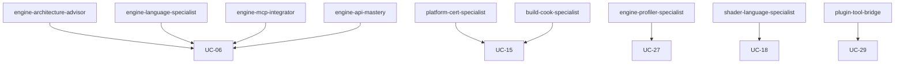

---

## Rayon Q — Direction artistique & idéation UI/UX

Ce rayon couvre la direction artistique (mood board, charte graphique, piliers visuels) et l'idéation UI/UX (brainstorm, wireframes, tests d'utilisabilité) ; les tâches de génération visuelle routent vers la bonne cible modale (MOD-03) ou escaladent vers l'utilisateur (GOV-15) plutôt que de forcer un LLM généraliste à produire des illustrations.

#### mood-board-curator

| Aspect | Détail |
| --- | --- |
| Intention | Rassembler des références visuelles et définir l'ambiance du projet ; si un modèle de génération d'image est disponible, y router la production (MOD-03) ; sinon proposer des options de références et demander à l'utilisateur de les fournir (GOV-15). |
| Quand l'utiliser | En tout début de pré-production artistique, avant la rédaction de la charte graphique. |
| Éviter quand | La charte graphique est déjà validée et figée ; le mood board ne doit pas remettre en cause un corpus accepté. |
| Format d'artefact | Liste commentée de références (URLs, descriptions textuelles), brief d'ambiance, grille de mots-clés visuels, prompt-seeds pour modèle image si disponible. |
| Palier modèle | Dépend de la cible — curation textuelle : Économique suffit ; génération d'images : route vers un modèle image dédié (MOD-03) ; si indisponible : escalade GOV-15. |
| Taille de contexte | Moyen. |
| Niveau de réflexion | Moyen. |
| Preuve produite | Brief d'ambiance validé par l'utilisateur ; galerie de références horodatée (QUA-12). |
| UC / socle lié | UC-30 ; KNO-10, QUA-12, MOD-03, GOV-15. |

---

#### style-guide-author

| Aspect | Détail |
| --- | --- |
| Intention | Rédiger la charte graphique complète : palette de couleurs, typographie, iconographie, règles d'usage et exemples do/don't. |
| Quand l'utiliser | Après validation du mood board, avant tout démarrage de production d'assets. |
| Éviter quand | Le projet est un prototype jetable ou un jam de moins de 48 h où une charte formelle ralentirait inutilement. |
| Format d'artefact | Document Markdown structuré avec sections palette (codes HEX/HSL), specimens typographiques, grille iconographique et tableau de règles do/don't. |
| Palier modèle | Standard — rédaction structurée sous contraintes éditoriales ; Frontier si la charte doit intégrer une analyse de cohérence cross-références complexe. |
| Taille de contexte | Moyen. |
| Niveau de réflexion | Moyen. |
| Preuve produite | Charte versionnée relue par le directeur artistique ; delta de modifications tracé (QUA-14). |
| UC / socle lié | UC-30 ; QUA-14, KNO-06. |

---

#### art-direction-pillars

| Aspect | Détail |
| --- | --- |
| Intention | Définir les piliers visuels et l'intention artistique globale du projet ; garantir la cohérence cross-discipline (3D, 2D, VFX, UI) en fournissant un référentiel décisionnel partagé. |
| Quand l'utiliser | En kick-off artistique, dès que l'univers narratif est suffisamment stabilisé pour ancrer des choix visuels durables. |
| Éviter quand | L'univers est encore exploratoire ; forcer des piliers prématurément crée une dette de cohérence difficile à corriger. |
| Format d'artefact | Document de piliers (3 à 5 axes) avec rationale, exemples de références, anti-patterns à éviter, et matrice de décision cross-discipline. |
| Palier modèle | Frontier — synthèse stratégique multi-référentiels, raisonnement long sur des compromis esthétiques et narratifs complexes. |
| Taille de contexte | Large. |
| Niveau de réflexion | Haut. |
| Preuve produite | Piliers validés en revue d'équipe ; trace de consensus documentée (QUA-12) ; alignement cognitif vérifié (COG-01). |
| UC / socle lié | UC-30 ; COG-01, KNO-10. |

---

#### concept-art-router

| Aspect | Détail |
| --- | --- |
| Intention | Reconnaître explicitement qu'un LLM texte n'est PAS compétent pour produire des croquis ou illustrations ; router la demande vers un modèle de génération d'image (MOD-03) ; si aucun n'est disponible, présenter les options (modèle image payant, gratuit, open-source, outil tiers, ou travail humain) et demander un retour utilisateur avant de continuer (GOV-15) ; provisionner l'outil si nécessaire (RUN-15). |
| Quand l'utiliser | Dès qu'une tâche requiert la production d'un visuel original (personnage, environnement, props, UI illustration). |
| Éviter quand | La tâche est purement descriptive ou éditoriale (rédiger un brief de concept art) ; dans ce cas, une skill texte suffit. |
| Format d'artefact | Rapport de routage : cible choisie, prompt transmis, résultat obtenu ou options présentées à l'utilisateur si cible indisponible. |
| Palier modèle | Dépend de la cible — le LLM orchestrateur peut être Économique pour le routage ; la génération elle-même dépend du modèle image sélectionné (MOD-03). |
| Taille de contexte | Court. |
| Niveau de réflexion | Bas. |
| Preuve produite | Trace de routage horodatée ; confirmation utilisateur si escalade (QUA-12). |
| UC / socle lié | UC-30 ; MOD-03, RUN-15, GOV-15. |

---

#### ui-ideation-facilitator

| Aspect | Détail |
| --- | --- |
| Intention | Animer une session d'idéation UI/UX structurée en appliquant des méthodes éprouvées (double diamond, crazy-8s, How-Might-We) pour générer et prioriser des concepts d'interface. |
| Quand l'utiliser | En phase de découverte ou de conception, avant tout wireframing, lorsque le problème UX à résoudre n'est pas encore clairement formulé. |
| Éviter quand | Les contraintes UX sont déjà figées et documentées ; l'idéation ouverte n'apporterait que du bruit. |
| Format d'artefact | Rapport d'idéation : HMW questions, matrice de votes, top concepts retenus avec rationale, prochaines étapes proposées. |
| Palier modèle | Standard — facilitation créative structurée, production de synthèses argumentées. |
| Taille de contexte | Moyen. |
| Niveau de réflexion | Moyen. |
| Preuve produite | Top concepts documentés et validés par l'équipe (QUA-14) ; trace de la méthode appliquée (COG-01). |
| UC / socle lié | UC-31 ; COG-01, QUA-14. |

---

#### wireframe-author

| Aspect | Détail |
| --- | --- |
| Intention | Produire des wireframes et des flux basse fidélité décrivant l'architecture des écrans, la hiérarchie de l'information et les interactions principales, sans préjuger du style visuel final. |
| Quand l'utiliser | Après idéation, avant la conception haute fidélité ou le prototypage interactif. |
| Éviter quand | Les flux sont triviaux (un seul écran, interaction évidente) ou quand le projet impose directement des composants de UI existants sans liberté de conception. |
| Format d'artefact | Wireframes Markdown/ASCII ou description structurée d'écrans, flux de navigation, annotations fonctionnelles. |
| Palier modèle | Standard — production structurée sous contraintes UX et fonctionnelles. |
| Taille de contexte | Moyen. |
| Niveau de réflexion | Moyen. |
| Preuve produite | Wireframes relus en walkthrough ; critères d'acceptation UX documentés (QUA-14) ; couverture des flux principaux tracée (QUA-12). |
| UC / socle lié | UC-31 ; QUA-14, QUA-12. |

---

#### ux-usability-tester

| Aspect | Détail |
| --- | --- |
| Intention | Concevoir et analyser des tests d'utilisabilité en s'appuyant sur les heuristiques de Nielsen, les protocoles de test à pensée à voix haute et les grilles d'évaluation structurées pour identifier les frictions de l'interface. |
| Quand l'utiliser | Après production de wireframes ou de prototypes ; avant ou après un sprint de développement pour valider ou corriger l'expérience. |
| Éviter quand | Aucun prototype ni maquette n'est disponible ; les tests d'utilisabilité à ce stade seraient purement hypothétiques et peu actionnables. |
| Format d'artefact | Plan de test (objectifs, participants, scénarios), grille d'évaluation heuristique, rapport de résultats avec sévérités et recommandations priorisées. |
| Palier modèle | Standard — analyse structurée de retours qualitatifs et quantitatifs. |
| Taille de contexte | Moyen. |
| Niveau de réflexion | Moyen. |
| Preuve produite | Rapport de test avec issues classées par sévérité et recommandations traçables (QUA-15) ; couverture des scénarios validée (QUA-12). |
| UC / socle lié | UC-31, UC-26 ; QUA-15, QUA-12. |

---

#### visual-identity-reviewer

| Aspect | Détail |
| --- | --- |
| Intention | Conduire une revue indépendante de cohérence visuelle entre disciplines (3D, 2D, VFX, UI) en confrontant les productions à la charte graphique et aux piliers de direction artistique validés. |
| Quand l'utiliser | À chaque milestone de production artistique ; avant intégration d'un lot d'assets en moteur. |
| Éviter quand | La charte n'est pas encore finalisée ; une revue prématurée générerait des non-conformités contre un référentiel instable. |
| Format d'artefact | Rapport de revue : liste d'items conformes/non-conformes, captures annotées (descriptions textuelles si pas d'outil image), recommandations correctives avec priorité. |
| Palier modèle | Standard — analyse comparative structurée contre un référentiel documenté. |
| Taille de contexte | Moyen. |
| Niveau de réflexion | Moyen. |
| Preuve produite | Rapport de conformité horodaté (QUA-15) ; liste d'items corrigés tracée (QUA-12). |
| UC / socle lié | UC-30 ; QUA-15, QUA-12. |

---

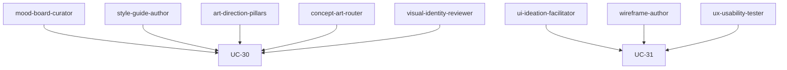

---

## Rayon R — Réseau, services en ligne & sécurité

Ce rayon équipe les agents pour le multijoueur, le backend de jeu et la protection de l'intégrité : architecture réseau, services en ligne, sauvegardes, anti-triche et réponse aux incidents. Ces skills relèvent du cœur de compétence d'un LLM (conception, code, analyse) ; la cible reste le texte, l'autorité serveur fait foi.

#### netcode-architect

| Aspect | Détail |
| --- | --- |
| Intention | Concevoir l'architecture réseau : topologie (client-serveur autoritaire, lockstep, rollback), modèle d'autorité, réplication et interest management. |
| Quand l'utiliser | Au démarrage d'un projet multijoueur, ou lorsqu'une refonte réseau est nécessaire pour la cohérence ou la triche. |
| Éviter quand | Le jeu est solo hors-ligne, ou la topologie est imposée par le moteur sans marge de conception. |
| Format d'artefact | Document d'architecture réseau, schéma de réplication, choix de topologie justifié. |
| Palier modèle | Frontier — les arbitrages de topologie sont subtils et coûteux à corriger tard. |
| Taille de contexte | Large. |
| Niveau de réflexion | Haut. |
| Preuve produite | Décision d'architecture documentée et validée contre les contraintes (GOV-08, QUA-04). |
| UC / socle lié | UC-32 ; UC-13, GOV-08. |

#### replication-prediction-engineer

| Aspect | Détail |
| --- | --- |
| Intention | Implémenter prédiction client, interpolation et réconciliation sur correction serveur pour masquer la latence sans diverger. |
| Quand l'utiliser | Lors de l'implémentation d'un netcode temps réel où la latence dégrade la jouabilité. |
| Éviter quand | Le jeu est par tours sans contrainte de latence perçue. |
| Format d'artefact | Code de prédiction/réconciliation, scénarios de test sous latence, journal de divergence. |
| Palier modèle | Standard — implémentation structurée d'un schéma connu ; Frontier si rollback complexe. |
| Taille de contexte | Moyen. |
| Niveau de réflexion | Haut. |
| Preuve produite | Convergence d'état prouvée sous latence et perte (QUA-05, QUA-04). |
| UC / socle lié | UC-32 ; RUN-13, QUA-05. |

#### netcode-determinism-tester

| Aspect | Détail |
| --- | --- |
| Intention | Construire un harnais de test réseau : simulation de latence, gigue et perte, rejeu à seed, mesure de divergence et détection de désync. |
| Quand l'utiliser | Pour valider un netcode ou reproduire un bug réseau intermittent. |
| Éviter quand | La simulation n'est pas déterministe et le prérequis UC-13 n'est pas tenu. |
| Format d'artefact | Harnais de test réseau, scénarios de conditions dégradées, rapports de divergence. |
| Palier modèle | Standard — méthodologie de test systématique. |
| Taille de contexte | Moyen. |
| Niveau de réflexion | Moyen. |
| Preuve produite | Désyncs reproductibles à seed et rapports de convergence (UC-13, QUA-04). |
| UC / socle lié | UC-32 ; UC-13, QUA-05. |

#### matchmaking-integrator

| Aspect | Détail |
| --- | --- |
| Intention | Intégrer matchmaking, lobbies et sessions : appariement par compétence/latence, création de partie, gestion de flotte de sessions. |
| Quand l'utiliser | Lorsque les joueurs doivent être réunis en parties équilibrées et à faible latence. |
| Éviter quand | Le jeu n'a pas de mise en relation de joueurs. |
| Format d'artefact | Spécification de matchmaking, règles d'appariement, schéma de cycle de session. |
| Palier modèle | Standard — intégration de service avec règles d'appariement. |
| Taille de contexte | Moyen. |
| Niveau de réflexion | Moyen. |
| Preuve produite | Métriques d'appariement (latence, temps d'attente, qualité) observées (QUA-08). |
| UC / socle lié | UC-33 ; GOV-08, QUA-08. |

#### backend-services-integrator

| Aspect | Détail |
| --- | --- |
| Intention | Intégrer comptes, authentification, sauvegardes cloud, classements et achievements derrière des contrats d'API et un trust gate. |
| Quand l'utiliser | Lorsque le jeu a des comptes joueur, de la persistance distante ou des classements. |
| Éviter quand | Le jeu est hors-ligne sans persistance ni identité distante. |
| Format d'artefact | Spécifications d'API, schéma d'états autoritaires, contrats d'intégration. |
| Palier modèle | Standard — intégration de services et définition de contrats. |
| Taille de contexte | Large. |
| Niveau de réflexion | Moyen. |
| Preuve produite | Contrats validés, opérations idempotentes et SLO observés (RUN-13, QUA-08). |
| UC / socle lié | UC-33 ; GOV-09, RUN-13. |

#### save-system-designer

| Aspect | Détail |
| --- | --- |
| Intention | Concevoir la sérialisation, le versioning des sauvegardes et la migration des données entre patchs, avec résolution de conflit local/cloud. |
| Quand l'utiliser | Dès qu'un jeu persiste une progression, surtout s'il sera mis à jour après sortie. |
| Éviter quand | Aucune donnée joueur n'est persistée. |
| Format d'artefact | Schéma de sauvegarde versionné, scripts de migration, tests de compatibilité ascendante. |
| Palier modèle | Standard — conception structurée de format et de migration. |
| Taille de contexte | Moyen. |
| Niveau de réflexion | Moyen. |
| Preuve produite | Migration testée d'anciennes saves sans perte ni corruption (QUA-14, RUN-14). |
| UC / socle lié | UC-33 ; RUN-14, QUA-14. |

#### anti-cheat-strategist

| Aspect | Détail |
| --- | --- |
| Intention | Modéliser les menaces et concevoir la stratégie anti-triche : validation autoritaire serveur, détection d'anomalies, anti-tamper, protection des assets. |
| Quand l'utiliser | Pour un jeu compétitif, monétisé ou à classements, où la triche dégrade l'expérience ou les revenus. |
| Éviter quand | Le jeu est solo sans état de valeur exploitable. |
| Format d'artefact | Modèle de menaces, règles de détection, plan de durcissement client. |
| Palier modèle | Frontier — la modélisation de menaces demande un raisonnement adverse poussé. |
| Taille de contexte | Large. |
| Niveau de réflexion | Haut. |
| Preuve produite | Modèle de menaces documenté et règles de détection mesurées (GOV-08, QUA-08). |
| UC / socle lié | UC-34 ; GOV-08, GOV-07. |

#### live-incident-responder

| Aspect | Détail |
| --- | --- |
| Intention | Définir et exécuter la réponse aux incidents et exploits en production : runbook, rollback, compensation des effets et communication. |
| Quand l'utiliser | Lorsqu'un exploit, une triche ou un incident de service survient en live. |
| Éviter quand | Le jeu n'a ni composante en ligne ni état de valeur. |
| Format d'artefact | Runbook d'incident, journal de réponse, evidence pack post-incident. |
| Palier modèle | Standard — exécution structurée d'une politique de réponse ; Frontier sur arbitrage critique. |
| Taille de contexte | Moyen. |
| Niveau de réflexion | Haut. |
| Preuve produite | Incident tracé, effets compensés et verdict (GOV-17, RUN-14, QUA-04). |
| UC / socle lié | UC-34 ; GOV-17, RUN-14. |

#### social-systems-engineer

| Aspect | Détail |
| --- | --- |
| Intention | Concevoir amis, présence, groupes, salons et invitations sûrs et fiables. |
| Quand l'utiliser | Quand les joueurs se regroupent et interagissent socialement. |
| Éviter quand | Le jeu est strictement solo hors ligne. |
| Format d'artefact | Modèle de graphe social, API de présence, flux d'invitation. |
| Palier modèle | Standard — conception de services sociaux. |
| Taille de contexte | Moyen. |
| Niveau de réflexion | Moyen. |
| Preuve produite | Fonctions sociales fiables et sûres (GOV-08, QUA-04). |
| UC / socle lié | UC-45 ; UC-33, GOV-08. |

#### voice-text-chat-integrator

| Aspect | Détail |
| --- | --- |
| Intention | Intégrer chat texte et vocal avec modération, filtres, signalement et silence. |
| Quand l'utiliser | Quand les joueurs communiquent par texte ou voix. |
| Éviter quand | Les échanges se limitent à des emotes prédéfinies. |
| Format d'artefact | Pipeline de chat, politique de modération, parcours de signalement. |
| Palier modèle | Standard pour la masse ; Frontier sur les cas ambigus. |
| Taille de contexte | Moyen. |
| Niveau de réflexion | Moyen à haut. |
| Preuve produite | Échanges modérés, contenu non fiable maîtrisé (MOD-03, GOV-09). |
| UC / socle lié | UC-45 ; GOV-15, MOD-03. |

---

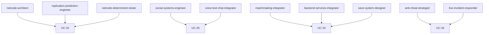

---

## Rayon S — Éclairage, rendu final & technical art

Ce rayon couvre l'image finale (éclairage artistique, illumination globale, post-traitement, étalonnage, look-dev) et la discipline-pont du technical art entre l'art et le moteur. La création d'images relève de cibles dédiées : router (MOD-03) plutôt que produire au format texte.

#### lighting-artist

| Aspect | Détail |
| --- | --- |
| Intention | Concevoir l'éclairage artistique d'une scène (key/fill/rim, température de couleur, lumière narrative) au service de l'ambiance et de la lisibilité. |
| Quand l'utiliser | Lorsqu'une scène ou un niveau doit transmettre une ambiance et guider le regard du joueur. |
| Éviter quand | La scène est un gris-boîte sans intention visuelle, ou l'éclairage est un preset figé. |
| Format d'artefact | Intentions de lumière, setup d'éclairage par scène, captures de référence. |
| Palier modèle | Frontier — l'intention artistique et l'ambiance demandent un jugement esthétique fort. |
| Taille de contexte | Moyen. |
| Niveau de réflexion | Haut. |
| Preuve produite | Lisibilité et cohérence prouvées par captures (QUA-12) sous budget (GOV-08). |
| UC / socle lié | UC-35 ; KNO-10, QUA-12. |

#### global-illumination-setup

| Aspect | Détail |
| --- | --- |
| Intention | Paramétrer l'illumination globale (GI temps réel ou bakée, sondes, occlusion ambiante) pour un rendu cohérent et performant. |
| Quand l'utiliser | Lorsque l'éclairage indirect conditionne le réalisme ou l'ambiance de la scène. |
| Éviter quand | La direction artistique impose un rendu plat sans éclairage indirect. |
| Format d'artefact | Configuration GI, placement de sondes, rapport de bake. |
| Palier modèle | Standard — paramétrage technique guidé par l'intention. |
| Taille de contexte | Moyen. |
| Niveau de réflexion | Moyen. |
| Preuve produite | Rendu cohérent validé et coût mesuré (QUA-08, QUA-05). |
| UC / socle lié | UC-35 ; UC-27, QUA-08. |

#### post-process-stack-author

| Aspect | Détail |
| --- | --- |
| Intention | Composer la pile de post-traitement (tonemapping, bloom, profondeur de champ, flou de mouvement, occlusion ambiante) dans un budget GPU. |
| Quand l'utiliser | Pour finaliser l'image et renforcer l'ambiance sans casser la lisibilité ni le framerate. |
| Éviter quand | La cible matérielle ne supporte pas le post-traitement visé. |
| Format d'artefact | Presets de post-process, profil GPU avant/après, captures comparatives. |
| Palier modèle | Standard — composition technique avec arbitrage coût/rendu. |
| Taille de contexte | Court. |
| Niveau de réflexion | Moyen. |
| Preuve produite | Effets validés sous budget GPU mesuré (QUA-08, QUA-12). |
| UC / socle lié | UC-35 ; UC-27, GOV-08. |

#### color-grading-artist

| Aspect | Détail |
| --- | --- |
| Intention | Définir l'étalonnage (LUT, color script par ambiance ou séquence) pour une direction de couleur cohérente. |
| Quand l'utiliser | Lorsque la palette finale doit varier par zone, séquence ou émotion. |
| Éviter quand | Le jeu impose des couleurs brutes sans étalonnage (style délibéré). |
| Format d'artefact | LUT, color script, captures étalonnées. |
| Palier modèle | Frontier pour la direction de couleur ; Standard pour l'application. |
| Taille de contexte | Court. |
| Niveau de réflexion | Moyen à haut. |
| Preuve produite | Cohérence de palette validée contre la charte (KNO-10, QUA-12). |
| UC / socle lié | UC-35 ; KNO-10, QUA-12. |

#### look-dev-artist

| Aspect | Détail |
| --- | --- |
| Intention | Calibrer matériaux, éclairage et post-process contre des références pour fixer le « look » cible reproductible. |
| Quand l'utiliser | En amont de la production pour verrouiller un look-target partagé par l'équipe. |
| Éviter quand | Le look est déjà figé et documenté. |
| Format d'artefact | Scène de look-dev, planche de calibration, comparaison référence/rendu. |
| Palier modèle | Frontier — la calibration look exige un jugement visuel fin. |
| Taille de contexte | Moyen. |
| Niveau de réflexion | Haut. |
| Preuve produite | Écart au référentiel mesuré et look validé (QUA-12, QUA-15). |
| UC / socle lié | UC-35 ; UC-18, QUA-15. |

#### technical-artist-bridge

| Aspect | Détail |
| --- | --- |
| Intention | Faire le pont art↔moteur : contraintes techniques d'assets, optimisation de shaders/VFX, conventions d'import, look-dev intégré moteur. |
| Quand l'utiliser | Lorsque des assets artistiques doivent entrer dans le moteur sous contraintes de perf et de pipeline. |
| Éviter quand | L'équipe n'a ni contrainte moteur ni pipeline (proto isolé). |
| Format d'artefact | Spécifications techniques d'assets, guide d'intégration, checklist de budget. |
| Palier modèle | Standard — traduction des contraintes techniques en règles actionnables. |
| Taille de contexte | Moyen. |
| Niveau de réflexion | Moyen à haut. |
| Preuve produite | Assets conformes aux budgets et conventions, intégration validée (QUA-14, GOV-08). |
| UC / socle lié | UC-17 ; UC-18, GOV-08. |

#### art-tooling-developer

| Aspect | Détail |
| --- | --- |
| Intention | Spécifier ou développer des outils d'aide aux artistes (scripts DCC, automatisations d'export, validateurs d'assets) pour fiabiliser le pipeline. |
| Quand l'utiliser | Lorsqu'une tâche artistique répétitive ou source d'erreurs gagne à être outillée. |
| Éviter quand | Un outil mûr existe déjà : l'évaluer et l'adopter (RUN-15) plutôt que réécrire. |
| Format d'artefact | Spécification d'outil, script, validateur d'assets automatisé. |
| Palier modèle | Standard — conception d'outil ciblée ; collaborer avec le dev si nécessaire. |
| Taille de contexte | Moyen. |
| Niveau de réflexion | Moyen. |
| Preuve produite | Outil testé réduisant l'erreur humaine, gain tracé (RUN-15, QUA-14). |
| UC / socle lié | UC-12 ; RUN-15, QUA-14. |

---

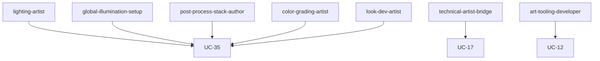

---

## Rayon T — Architecture, tests & programmation système

Ce rayon équipe le développement de jeu : architecture des systèmes, tests automatisés et programmation système (rendu, audio middleware, débogage). Ces skills relèvent du cœur de compétence d'un LLM (conception, code, analyse).

#### systems-architecture-advisor

| Aspect | Détail |
| --- | --- |
| Intention | Concevoir l'architecture des systèmes de jeu : frontières de modules, sens des dépendances, découplage, conception data-driven. |
| Quand l'utiliser | Au démarrage ou lors d'une refonte, quand plusieurs systèmes doivent évoluer sans se casser. |
| Éviter quand | Un prototype jetable d'un seul système trivial. |
| Format d'artefact | Document d'architecture, diagrammes de dépendances, ADR. |
| Palier modèle | Frontier — les arbitrages d'architecture sont structurants et coûteux à corriger tard. |
| Taille de contexte | Large. |
| Niveau de réflexion | Haut. |
| Preuve produite | Dépendances saines, contrats validés et ADR tracés (QUA-14, KNO-03). |
| UC / socle lié | UC-36 ; COG-02, KNO-03. |

#### ecs-data-oriented-advisor

| Aspect | Détail |
| --- | --- |
| Intention | Concevoir une organisation ECS / data-oriented (layout des données, systèmes, cache-friendliness) pour la performance à grande échelle. |
| Quand l'utiliser | Lorsque le jeu gère de nombreuses entités ou vise une performance soutenue. |
| Éviter quand | Le nombre d'entités est faible et l'objet classique suffit. |
| Format d'artefact | Schéma de composants/systèmes, layout mémoire, justification de choix. |
| Palier modèle | Frontier — la conception data-oriented demande une expertise CS pointue. |
| Taille de contexte | Moyen. |
| Niveau de réflexion | Haut. |
| Preuve produite | Gain de performance prouvé par benchmark et invariants validés (QUA-08, QUA-14). |
| UC / socle lié | UC-36 ; UC-27, QUA-08. |

#### automated-test-engineer

| Aspect | Détail |
| --- | --- |
| Intention | Concevoir et écrire des tests automatisés (unitaires, intégration, fumée, fonctionnels) déterministes pour le code de jeu. |
| Quand l'utiliser | Dès que du code de jeu doit rester non régressif au fil des évolutions. |
| Éviter quand | Un jam jetable sans suite ni maintenance. |
| Format d'artefact | Suites de tests, fixtures déterministes, rapport de couverture. |
| Palier modèle | Standard — écriture systématique ; Économique pour les cas répétitifs. |
| Taille de contexte | Moyen. |
| Niveau de réflexion | Moyen. |
| Preuve produite | Suite verte déterministe et couverture tracée (QUA-05, RUN-13). |
| UC / socle lié | UC-37 ; QUA-14, RUN-13. |

#### ci-test-gate-author

| Aspect | Détail |
| --- | --- |
| Intention | Brancher des portes de qualité en intégration continue : exécution de la suite, blocage sur échec, traitement des tests instables. |
| Quand l'utiliser | Lorsque l'équipe intègre en continu et veut empêcher les régressions de passer. |
| Éviter quand | Aucun pipeline d'intégration n'existe ni n'est prévu. |
| Format d'artefact | Configuration CI, règles de portes de qualité, journal d'instabilité. |
| Palier modèle | Standard — automatisation de pipeline gouvernée. |
| Taille de contexte | Court. |
| Niveau de réflexion | Moyen. |
| Preuve produite | CI bloquant la suite rouge, métriques de fiabilité (GOV-08, QUA-08). |
| UC / socle lié | UC-37 ; GOV-08, QUA-08. |

#### render-pipeline-programmer

| Aspect | Détail |
| --- | --- |
| Intention | Concevoir et implémenter le pipeline de rendu (passes, render graph, rendu GPU-driven, modèles d'éclairage personnalisés) au-delà de l'authoring de shaders. |
| Quand l'utiliser | Lorsque le rendu exige des passes personnalisées ou une architecture graphique spécifique. |
| Éviter quand | Le pipeline du moteur couvre déjà le besoin sans personnalisation. |
| Format d'artefact | Architecture de pipeline de rendu, schéma de passes, profil GPU. |
| Palier modèle | Frontier — la programmation graphique est pointue et sensible à la performance. |
| Taille de contexte | Large. |
| Niveau de réflexion | Haut. |
| Preuve produite | Pipeline validé visuellement et profilé par plateforme (QUA-08, QUA-12). |
| UC / socle lié | UC-18 ; UC-27, QUA-08. |

#### audio-middleware-integrator

| Aspect | Détail |
| --- | --- |
| Intention | Intégrer le middleware audio (bus, RTPC/paramètres temps réel, zones de réverbération et d'occlusion, événements) entre le sound design et le moteur. |
| Quand l'utiliser | Lorsque le son conçu (UC-21) doit s'implémenter dynamiquement dans le moteur. |
| Éviter quand | Le jeu n'a que quelques sons statiques sans logique dynamique. |
| Format d'artefact | Schéma de routage audio, configuration RTPC/bus, événements documentés. |
| Palier modèle | Standard — intégration technique structurée. |
| Taille de contexte | Moyen. |
| Niveau de réflexion | Moyen. |
| Preuve produite | Audio dynamique validé en jeu et budget mémoire tenu (QUA-14, GOV-08). |
| UC / socle lié | UC-21 ; GOV-08, QUA-14. |

#### debug-repro-methodologist

| Aspect | Détail |
| --- | --- |
| Intention | Conduire un débogage systématique : reproduction déterministe, réduction (bisect), isolement de cause racine et test de non-régression. |
| Quand l'utiliser | Face à un bug difficile, intermittent ou de régression. |
| Éviter quand | Le défaut est trivial et la correction évidente et prouvée. |
| Format d'artefact | Repro minimal, journal de bisect, cause racine, test de non-régression. |
| Palier modèle | Standard à Frontier selon la difficulté du bug. |
| Taille de contexte | Moyen. |
| Niveau de réflexion | Haut. |
| Preuve produite | Cause racine prouvée et verrouillée par un test (UC-37, QUA-01). |
| UC / socle lié | UC-05 ; UC-37, QUA-01. |

---

```mermaid
flowchart TD
    systemsArchitectureAdvisor["systems-architecture-advisor"] --> UC36["UC-36"]
    ecsDataOrientedAdvisor["ecs-data-oriented-advisor"] --> UC36
    automatedTestEngineer["automated-test-engineer"] --> UC37["UC-37"]
    ciTestGateAuthor["ci-test-gate-author"] --> UC37
    renderPipelineProgrammer["render-pipeline-programmer"] --> UC18["UC-18"]
    audioMiddlewareIntegrator["audio-middleware-integrator"] --> UC21["UC-21"]
    debugReproMethodologist["debug-repro-methodologist"] --> UC05["UC-05"]
```

---

## Rayon U — Localisation & internationalisation

Ce rayon outille la sortie multilingue et multi-région du jeu (UC-38), en spécialisant l'orchestration de traduction d'UC-01. Le texte relève du cœur de compétence d'un LLM ; la voix et le doublage sont routés hors texte (voir la [matrice capacités/modalités](matrice-capacites-modalites-jeux-video.md)).

#### localization-pipeline-architect

| Aspect | Détail |
| --- | --- |
| Intention | Concevoir le pipeline d'internationalisation : externalisation des chaînes, schéma d'identifiants, intégration au build, pseudo-localisation. |
| Quand l'utiliser | Dès qu'une sortie multilingue est envisagée, avant d'écrire la moindre chaîne en dur. |
| Éviter quand | Un prototype mono-langue jetable sans suite. |
| Format d'artefact | Schéma d'i18n, convention d'identifiants, plan de pseudo-localisation. |
| Palier modèle | Standard — conception structurée et systématique. |
| Taille de contexte | Moyen. |
| Niveau de réflexion | Moyen. |
| Preuve produite | Chaînes externalisées, pseudo-loc passante, intégration build validée (QUA-14). |
| UC / socle lié | UC-38 ; KNO-10, QUA-14. |

#### translation-orchestrator

| Aspect | Détail |
| --- | --- |
| Intention | Orchestrer la traduction : glossaire et termbase, segmentation, routage modèle par langue, arbitrage de cohérence inter-langues. |
| Quand l'utiliser | Pour traduire un volume de chaînes vers plusieurs langues sous coût et cohérence maîtrisés. |
| Éviter quand | Une traduction brute exploratoire d'un seul fragment. |
| Format d'artefact | Glossaire verrouillé, segments routés, rapport de cohérence par langue. |
| Palier modèle | Économique par langue pour le volume ; Frontier pour l'arbitrage et les langues sensibles. |
| Taille de contexte | Moyen. |
| Niveau de réflexion | Moyen à Haut selon la langue. |
| Preuve produite | Couverture par langue et écarts corrigés tracés (QUA-01, MOD-01). |
| UC / socle lié | UC-38 ; UC-01, MOD-01. |

#### culturalization-lqa-reviewer

| Aspect | Détail |
| --- | --- |
| Intention | Mener la LQA en contexte et la culturalisation : sens, ton, symboles, couleurs, contenus sensibles et classifications par marché. |
| Quand l'utiliser | Avant livraison d'une langue, surtout sur des marchés à contraintes culturelles ou légales. |
| Éviter quand | Aucune distribution régionale sensible n'est prévue. |
| Format d'artefact | Rapport LQA, liste d'écarts culturels, décisions de classification. |
| Palier modèle | Frontier — jugement culturel et juridique fin. |
| Taille de contexte | Moyen. |
| Niveau de réflexion | Haut. |
| Preuve produite | LQA indépendante et exceptions culturelles arbitrées (QUA-15, GOV-15). |
| UC / socle lié | UC-38 ; QUA-15, GOV-15. |

#### locale-format-engineer

| Aspect | Détail |
| --- | --- |
| Intention | Gérer les formats locale : dates, nombres, monnaie, pluriels, genre, RTL/bidi et couverture de polices. |
| Quand l'utiliser | Dès que l'interface affiche du texte variable ou cible des langues à règles de format ou de sens de lecture distinctes. |
| Éviter quand | Une seule locale sans variable ni contrainte de format. |
| Format d'artefact | Règles de format par locale, rapport RTL, audit de couverture de polices. |
| Palier modèle | Standard — application de règles vérifiables. |
| Taille de contexte | Court. |
| Niveau de réflexion | Moyen. |
| Preuve produite | Format, pluriels et RTL validés sans débordement (QUA-14). |
| UC / socle lié | UC-38 ; QUA-14, GOV-08. |

---

```mermaid
flowchart TD
    localizationPipelineArchitect["localization-pipeline-architect"] --> UC38["UC-38"]
    translationOrchestrator["translation-orchestrator"] --> UC38
    culturalizationLqaReviewer["culturalization-lqa-reviewer"] --> UC38
    localeFormatEngineer["locale-format-engineer"] --> UC38
    translationOrchestrator --> UC01["UC-01"]
```

---

## Rayon V — Capacités, modalités & arbitrage d'outils

Ce rayon opérationnalise pour le jeu vidéo les patterns socle de routage et d'acquisition : MOD-03 (router vers la cible compétente), RUN-15 (acquérir le bon outil) et GOV-15 (escalader vers l'humain). Il porte la connaissance du domaine — quelles modalités et quels outils conviennent à quelles tâches de jeu — et garde l'agent dans son cœur de maîtrise. Référence centrale : la [matrice capacités/modalités](matrice-capacites-modalites-jeux-video.md).

#### capability-modality-mapper

| Aspect | Détail |
| --- | --- |
| Intention | Tenir la matrice capacités/modalités du projet : par tâche, déclarer la modalité, la cible compétente et ce que l'agent ne doit pas tenter seul. |
| Quand l'utiliser | Au cadrage d'une tâche dont la modalité (image, audio, 3D, vidéo) sort du cœur de compétence du LLM. |
| Éviter quand | La tâche est clairement texte ou code dans le cœur de compétence. |
| Format d'artefact | Matrice de routage à jour, capability routing record. |
| Palier modèle | Standard — cadrage et décision de routage. |
| Taille de contexte | Court. |
| Niveau de réflexion | Moyen. |
| Preuve produite | Routage tracé et limites assumées déclarées (MOD-03). |
| UC / socle lié | UC-30 ; MOD-03, GOV-08. |

#### tool-sourcing-advisor

| Aspect | Détail |
| --- | --- |
| Intention | Produire un dossier make-or-buy pour combler un manque d'outil : adopter (gratuit, open-source, payant), commander un build, ou faire soi-même si trivial. |
| Quand l'utiliser | Quand une capacité manque et qu'un outil mûr existe peut-être déjà. |
| Éviter quand | L'outillage en place couvre déjà le besoin. |
| Format d'artefact | Dossier d'options chiffré (coût, risque, maintenance), tool sourcing decision record. |
| Palier modèle | Standard — analyse comparative gouvernée. |
| Taille de contexte | Moyen. |
| Niveau de réflexion | Moyen. |
| Preuve produite | Options tracées et choix utilisateur enregistré (RUN-15, GOV-15). |
| UC / socle lié | UC-29 ; RUN-15, GOV-15. |

#### human-handoff-coordinator

| Aspect | Détail |
| --- | --- |
| Intention | Préparer un passage de relais propre vers un spécialiste humain (illustrateur, compositeur, comédien, juriste, sensitivity reader) avec brief, contraintes et critères d'acceptation. |
| Quand l'utiliser | Quand une tâche relève d'un cœur artistique, juridique ou culturel hors maîtrise de l'agent. |
| Éviter quand | La tâche est dans le cœur de compétence et produit une preuve interne. |
| Format d'artefact | Brief de handoff, contraintes, critères d'acceptation, escalation record. |
| Palier modèle | Standard — synthèse et cadrage de brief. |
| Taille de contexte | Court. |
| Niveau de réflexion | Moyen. |
| Preuve produite | Brief traçable et décision humaine enregistrée (GOV-15). |
| UC / socle lié | UC-30 ; GOV-15, MOD-03. |

---

```mermaid
flowchart TD
    capabilityModalityMapper["capability-modality-mapper"] --> UC30["UC-30"]
    toolSourcingAdvisor["tool-sourcing-advisor"] --> UC29["UC-29"]
    humanHandoffCoordinator["human-handoff-coordinator"] --> UC30
    capabilityModalityMapper --> MOD03["MOD-03"]
    toolSourcingAdvisor --> RUN15["RUN-15"]
```

---

## Rayon W — Ambiance & atmosphère

Ce rayon outille la création d'ambiance (UC-39) : la convergence de la lumière, de l'atmosphère, du son et du décor vers un mood ressenti. Ces skills orientent et jugent ; le média final (audio, VFX, 3D) est routé vers la cible compétente (voir la [matrice capacités/modalités](matrice-capacites-modalites-jeux-video.md)).

#### mood-ambiance-director

| Aspect | Détail |
| --- | --- |
| Intention | Dériver l'intention d'ambiance de chaque scène des piliers, arbitrer la convergence des leviers (lumière, son, atmosphère, décor) et la courbe de tension. |
| Quand l'utiliser | Quand plusieurs disciplines doivent converger vers un même mood ressenti. |
| Éviter quand | Une seule discipline isolée suffit, sans cohérence d'ensemble visée. |
| Format d'artefact | Intention d'ambiance par scène, carte des leviers, courbe de tension. |
| Palier modèle | Frontier — synthèse multi-modale sensible à la cohérence. |
| Taille de contexte | Moyen. |
| Niveau de réflexion | Haut. |
| Preuve produite | Convergence prouvée en mouvement et lisibilité tenue (QUA-12, QUA-15). |
| UC / socle lié | UC-39 ; COG-01, KNO-10. |

#### atmosphere-systems-artist

| Aspect | Détail |
| --- | --- |
| Intention | Régler les systèmes d'atmosphère : brouillard, volumétrie, ciel, cycle jour-nuit et météo, au service du mood et dans le budget GPU. |
| Quand l'utiliser | Quand l'ambiance repose sur l'air, la lumière diffuse, la météo ou le temps qui passe. |
| Éviter quand | Une scène d'intérieur figée sans atmosphère ni variation. |
| Format d'artefact | Réglages d'atmosphère, profils jour-nuit/météo, profil GPU. |
| Palier modèle | Standard — réglage technique guidé par l'intention ; Frontier si pipeline custom. |
| Taille de contexte | Moyen. |
| Niveau de réflexion | Moyen. |
| Preuve produite | Atmosphère validée visuellement et budget GPU tenu (QUA-12, GOV-08). |
| UC / socle lié | UC-39 ; UC-35, QUA-08. |

#### ambient-soundscape-designer

| Aspect | Détail |
| --- | --- |
| Intention | Composer le lit sonore d'ambiance : room tone, sons distants, zones de réverbération et d'occlusion, pour le sentiment de lieu (distinct des SFX d'événement). |
| Quand l'utiliser | Quand le sentiment de lieu et l'immersion reposent sur un soundscape continu. |
| Éviter quand | Le jeu n'a que des sons d'événement ponctuels sans lit d'ambiance. |
| Format d'artefact | Carte de soundscape, zones de réverbération, budget mémoire audio. |
| Palier modèle | Standard pour la conception ; média audio final routé hors LLM (MOD-03). |
| Taille de contexte | Moyen. |
| Niveau de réflexion | Moyen. |
| Preuve produite | Sentiment de lieu validé en jeu et budget mémoire tenu (QUA-15, GOV-08). |
| UC / socle lié | UC-39 ; UC-21, MOD-03. |

#### environmental-storytelling-artist

| Aspect | Détail |
| --- | --- |
| Intention | Raconter par le décor : placement de props, traces, décrépitude et mise en scène spatiale qui suggèrent une histoire sans texte. |
| Quand l'utiliser | Quand le lieu doit porter un récit implicite et renforcer l'ambiance. |
| Éviter quand | Le décor est purement fonctionnel sans intention narrative. |
| Format d'artefact | Intentions narratives par zone, plan de placement, références. |
| Palier modèle | Frontier — narration implicite cohérente avec le lore. |
| Taille de contexte | Moyen. |
| Niveau de réflexion | Haut. |
| Preuve produite | Récit lu par des testeurs et cohérence avec le canon (QUA-15, KNO-10). |
| UC / socle lié | UC-39 ; UC-17, KNO-10. |

---

```mermaid
flowchart TD
    moodAmbianceDirector["mood-ambiance-director"] --> UC39["UC-39"]
    atmosphereSystemsArtist["atmosphere-systems-artist"] --> UC39
    ambientSoundscapeDesigner["ambient-soundscape-designer"] --> UC39
    environmentalStorytellingArtist["environmental-storytelling-artist"] --> UC39
    atmosphereSystemsArtist --> UC35["UC-35"]
    ambientSoundscapeDesigner --> UC21["UC-21"]
    environmentalStorytellingArtist --> UC17["UC-17"]
```

---

## Rayon X — Narration interactive & dialogue

Ce rayon outille la narration interactive (UC-40) : dialogues à embranchements, arcs, état narratif persistant et conséquences. Les skills conçoivent et jugent la cohérence ; la génération de masse reste sous contrat de canon (KNO-10) et revue (QUA-15).

#### dialogue-system-designer

| Aspect | Détail |
| --- | --- |
| Intention | Définir la structure des dialogues : nœuds, conditions, réponses contextuelles, barks et grammaire de dialogue. |
| Quand l'utiliser | Quand les conversations sont ramifiées et conditionnelles. |
| Éviter quand | Les dialogues sont linéaires, courts et sans variable. |
| Format d'artefact | Schéma de dialogue, table de nœuds et conditions, règles de barks. |
| Palier modèle | Standard pour la structure ; Frontier sur les conversations complexes. |
| Taille de contexte | Moyen. |
| Niveau de réflexion | Moyen. |
| Preuve produite | Dialogues atteignables et cohérents vérifiés par harnais (QUA-04). |
| UC / socle lié | UC-40 ; COG-01, GOV-08. |

#### branching-narrative-designer

| Aspect | Détail |
| --- | --- |
| Intention | Concevoir les arcs, bifurcations et fins multiples en garantissant l'atteignabilité et l'absence d'impasse. |
| Quand l'utiliser | Quand l'histoire se ramifie en branches et en fins. |
| Éviter quand | Le récit est strictement linéaire. |
| Format d'artefact | Graphe d'arcs, carte des branches et fins, matrice d'atteignabilité. |
| Palier modèle | Frontier — cohérence d'arc et arbitrage narratif. |
| Taille de contexte | Moyen. |
| Niveau de réflexion | Haut. |
| Preuve produite | Toutes les branches et fins atteignables, prouvées par parcours (QUA-15). |
| UC / socle lié | UC-40 ; KNO-10, COG-01. |

#### narrative-state-manager

| Aspect | Détail |
| --- | --- |
| Intention | Modéliser drapeaux, variables narratives et conséquences persistantes comme une source de vérité partagée. |
| Quand l'utiliser | Quand des choix conditionnent des contenus ultérieurs. |
| Éviter quand | Aucun état narratif ne persiste entre les scènes. |
| Format d'artefact | Modèle d'état narratif, table de variables, règles de conséquence. |
| Palier modèle | Standard — modélisation d'état guidée par l'arc. |
| Taille de contexte | Moyen. |
| Niveau de réflexion | Haut. |
| Preuve produite | Cohérence des variables prouvée entre branches (QUA-04). |
| UC / socle lié | UC-40 ; ORC-05. |

#### choice-consequence-designer

| Aspect | Détail |
| --- | --- |
| Intention | Rendre les choix significatifs, télégraphiés et équitables, avec des conséquences lisibles et justes. |
| Quand l'utiliser | Quand le jeu repose sur des décisions à enjeu. |
| Éviter quand | Les choix sont cosmétiques et sans effet. |
| Format d'artefact | Table choix-conséquences, règles de télégraphie, grille d'équité. |
| Palier modèle | Frontier — équilibrer enjeu, équité et lisibilité. |
| Taille de contexte | Moyen. |
| Niveau de réflexion | Haut. |
| Preuve produite | Conséquences testées et perçues comme justes (QUA-15). |
| UC / socle lié | UC-40 ; GOV-08. |

---

```mermaid
flowchart TD
    dialogueSystemDesigner["dialogue-system-designer"] --> UC40["UC-40"]
    branchingNarrativeDesigner["branching-narrative-designer"] --> UC40
    narrativeStateManager["narrative-state-manager"] --> UC40
    choiceConsequenceDesigner["choice-consequence-designer"] --> UC40
```

---

## Rayon Y — Monétisation, analytics & conformité

Ce rayon couvre l'économie live (UC-41), la mesure et l'expérimentation (UC-42) et la conformité légale (UC-47). Les skills conçoivent, mesurent et tracent ; les décisions sensibles sont escaladées à l'humain (GOV-15) et les médias finaux restent hors LLM.

#### monetization-designer

| Aspect | Détail |
| --- | --- |
| Intention | Concevoir des modèles de monétisation soutenables et équitables (F2P, passe, premium), sans dark patterns. |
| Quand l'utiliser | Quand le jeu intègre achats, passes ou monnaies. |
| Éviter quand | Le jeu est un achat unique sans commerce in-game. |
| Format d'artefact | Modèle économique, grille de prix, note d'équité et d'éthique. |
| Palier modèle | Frontier — arbitrage revenu, santé économique et éthique. |
| Taille de contexte | Moyen. |
| Niveau de réflexion | Haut. |
| Preuve produite | Modèle soutenable et sans dark pattern, validé (QUA-15, GOV-08). |
| UC / socle lié | UC-41 ; UC-10, GOV-15. |

#### storefront-commerce-designer

| Aspect | Détail |
| --- | --- |
| Intention | Structurer le catalogue, les bundles, la page boutique et un parcours d'achat fiable et transparent. |
| Quand l'utiliser | Quand une boutique in-game expose des objets ou des passes. |
| Éviter quand | Aucune transaction n'existe dans le produit. |
| Format d'artefact | Structure de catalogue, parcours d'achat, contrat d'idempotence. |
| Palier modèle | Standard — configuration guidée par le modèle. |
| Taille de contexte | Moyen. |
| Niveau de réflexion | Moyen. |
| Preuve produite | Achats idempotents sans double débit (RUN-13, RUN-14). |
| UC / socle lié | UC-41 ; UC-33. |

#### product-analytics-engineer

| Aspect | Détail |
| --- | --- |
| Intention | Définir schéma d'événements, funnels, rétention, cohortes et dashboards exploitables. |
| Quand l'utiliser | Quand des décisions dépendent de mesures fiables du comportement joueur. |
| Éviter quand | Aucune décision n'attend de mesure. |
| Format d'artefact | Schéma d'événements, dashboards, définitions de métriques. |
| Palier modèle | Standard pour l'instrumentation ; Frontier pour l'analyse causale. |
| Taille de contexte | Moyen — données agrégées, jamais d'identifiant personnel. |
| Niveau de réflexion | Haut. |
| Preuve produite | Métriques sous contrat et conformes à la vie privée (QUA-08, GOV-08). |
| UC / socle lié | UC-42 ; UC-16. |

#### experimentation-ab-designer

| Aspect | Détail |
| --- | --- |
| Intention | Concevoir des A/B et feature flags dimensionnés, avec seuils de décision et critères d'arrêt. |
| Quand l'utiliser | Quand des variantes doivent être comparées sur cohortes. |
| Éviter quand | Le volume de joueurs n'offre aucune puissance statistique. |
| Format d'artefact | Plan d'expérience, calcul de puissance, seuils de décision. |
| Palier modèle | Frontier — robustesse statistique et anti-biais. |
| Taille de contexte | Moyen. |
| Niveau de réflexion | Haut. |
| Preuve produite | Expériences dimensionnées lues à leurs seuils (QUA-13, QUA-15). |
| UC / socle lié | UC-42 ; GOV-10, QUA-16. |

#### ratings-compliance-advisor

| Aspect | Détail |
| --- | --- |
| Intention | Cartographier classification d'âge (ESRB/PEGI/USK), loot box et accessibilité légale par région. |
| Quand l'utiliser | Quand le jeu vise des classements d'âge ou des régions régulées. |
| Éviter quand | Un prototype interne jamais distribué. |
| Format d'artefact | Matrice d'exigences par région, dossier de classification. |
| Palier modèle | Frontier — interprétation réglementaire. |
| Taille de contexte | Moyen. |
| Niveau de réflexion | Haut. |
| Preuve produite | Evidence pack de conformité par région (QUA-04, GOV-08). |
| UC / socle lié | UC-47 ; UC-41, GOV-15. |

#### privacy-data-compliance-advisor

| Aspect | Détail |
| --- | --- |
| Intention | Garantir consentement, minimisation et rétention des données (RGPD, COPPA), notamment pour les mineurs. |
| Quand l'utiliser | Quand le jeu collecte de la télémétrie ou des données joueur. |
| Éviter quand | Aucune donnée personnelle n'est collectée. |
| Format d'artefact | Registre de traitement, politique de rétention, parcours de consentement. |
| Palier modèle | Frontier — conformité données et arbitrage. |
| Taille de contexte | Moyen. |
| Niveau de réflexion | Haut. |
| Preuve produite | Consentement et minimisation prouvés (QUA-04, GOV-08). |
| UC / socle lié | UC-47 ; UC-42, GOV-15. |

---

```mermaid
flowchart TD
    monetizationDesigner["monetization-designer"] --> UC41["UC-41"]
    storefrontCommerceDesigner["storefront-commerce-designer"] --> UC41
    productAnalyticsEngineer["product-analytics-engineer"] --> UC42["UC-42"]
    experimentationAbDesigner["experimentation-ab-designer"] --> UC42
    ratingsComplianceAdvisor["ratings-compliance-advisor"] --> UC47["UC-47"]
    privacyDataComplianceAdvisor["privacy-data-compliance-advisor"] --> UC47
```

---

## Rayon Z — Génération procédurale & monde ouvert

Ce rayon couvre la génération procédurale (UC-43) et le streaming de monde ouvert (UC-44). Les skills conçoivent et valident sous contrainte de solvabilité, de reproductibilité et de budget ; la validation lourde est déléguée au harnais déterministe (UC-13).

#### procedural-content-generator

| Aspect | Détail |
| --- | --- |
| Intention | Concevoir règles, grammaires et distributions de génération (WFC, donjons, terrain, placement). |
| Quand l'utiliser | Quand le volume ou la rejouabilité exige du contenu généré. |
| Éviter quand | Quelques niveaux faits main suffisent. |
| Format d'artefact | Grammaire de génération, règles de distribution, schéma de contenu. |
| Palier modèle | Standard pour les règles ; Frontier pour la conception de grammaires. |
| Taille de contexte | Moyen. |
| Niveau de réflexion | Haut. |
| Preuve produite | Contenu généré conforme au schéma (QUA-14). |
| UC / socle lié | UC-43 ; UC-09, KNO-10. |

#### pcg-validator

| Aspect | Détail |
| --- | --- |
| Intention | Vérifier solvabilité, anti-soft-lock, diversité et reproductibilité par seed du contenu généré. |
| Quand l'utiliser | Dès qu'un générateur produit du contenu jouable. |
| Éviter quand | Le contenu est entièrement scénarisé et fixe. |
| Format d'artefact | Harnais de validation, rapport de solvabilité et de diversité. |
| Palier modèle | Standard — validation déléguée au harnais déterministe. |
| Taille de contexte | Moyen. |
| Niveau de réflexion | Haut. |
| Preuve produite | Solvabilité et reproductibilité prouvées par seed (QUA-04, GOV-08). |
| UC / socle lié | UC-43 ; UC-13. |

#### world-streaming-architect

| Aspect | Détail |
| --- | --- |
| Intention | Modéliser partition, cellules, distances et priorités de chargement d'un grand monde. |
| Quand l'utiliser | Quand le monde dépasse la mémoire et exige du chargement continu. |
| Éviter quand | Des niveaux fermés tiennent entièrement en mémoire. |
| Format d'artefact | Graphe de cellules, politique de streaming, plan de préchargement. |
| Palier modèle | Standard pour le réglage ; Frontier pour la partition complexe. |
| Taille de contexte | Moyen. |
| Niveau de réflexion | Haut. |
| Preuve produite | Exploration sans couture sous budget (QUA-12, GOV-08). |
| UC / socle lié | UC-44 ; UC-36. |

#### streaming-budget-profiler

| Aspect | Détail |
| --- | --- |
| Intention | Mesurer hitches, pop-in, empreinte mémoire et débit IO, et tenir les budgets de streaming. |
| Quand l'utiliser | Quand la fluidité d'exploration et la mémoire sont contraintes. |
| Éviter quand | Aucun streaming dynamique n'est en jeu. |
| Format d'artefact | Traces de parcours, rapport de hitch et de mémoire, budgets. |
| Palier modèle | Standard — profilage technique guidé par les budgets. |
| Taille de contexte | Moyen. |
| Niveau de réflexion | Moyen. |
| Preuve produite | Hitch et pop-in sous seuil, mémoire dans le budget (QUA-08). |
| UC / socle lié | UC-44 ; UC-27. |

---

```mermaid
flowchart TD
    proceduralContentGenerator["procedural-content-generator"] --> UC43["UC-43"]
    pcgValidator["pcg-validator"] --> UC43
    worldStreamingArchitect["world-streaming-architect"] --> UC44["UC-44"]
    streamingBudgetProfiler["streaming-budget-profiler"] --> UC44
```

---

## Rayon AA — Go-to-market & assets marketing

Ce rayon couvre la mise sur le marché (UC-48) : key art, trailer, page boutique et press kit. Les modalités hors-LLM (illustration, vidéo) sont routées vers la cible compétente (MOD-03) ; chaque allégation est vérifiée contre le jeu réel (KNO-10).

#### key-art-director

| Aspect | Détail |
| --- | --- |
| Intention | Cadrer l'intention du key art, de la capsule et de la cover, et router la production d'illustration hors LLM. |
| Quand l'utiliser | Pour l'identité visuelle de mise sur le marché. |
| Éviter quand | Aucune sortie commerciale n'est prévue. |
| Format d'artefact | Brief de direction, références, contrat de routage modalité. |
| Palier modèle | Frontier pour l'intention ; production finale routée hors LLM. |
| Taille de contexte | Moyen. |
| Niveau de réflexion | Haut. |
| Preuve produite | Key art validé, cohérent avec la charte, routage tracé (QUA-15, MOD-03). |
| UC / socle lié | UC-48 ; MOD-03, GOV-15. |

#### trailer-editor

| Aspect | Détail |
| --- | --- |
| Intention | Scénariser et structurer le trailer (beat sheet, storyboard), puis déléguer montage et rendu à un outil vidéo. |
| Quand l'utiliser | Pour un trailer d'annonce, de gameplay ou de lancement. |
| Éviter quand | Aucune vidéo promotionnelle n'est requise. |
| Format d'artefact | Beat sheet, storyboard, liste de plans, brief de montage. |
| Palier modèle | Standard pour le script ; rendu vidéo par outil dédié. |
| Taille de contexte | Moyen. |
| Niveau de réflexion | Moyen. |
| Preuve produite | Trailer conforme aux allégations vérifiées contre le jeu réel (KNO-10). |
| UC / socle lié | UC-48 ; MOD-03, KNO-10. |

#### store-page-optimizer

| Aspect | Détail |
| --- | --- |
| Intention | Rédiger la page boutique, sélectionner les captures et optimiser la conversion et le format plateforme. |
| Quand l'utiliser | Pour publier ou améliorer une fiche boutique. |
| Éviter quand | Le jeu n'a pas de page de distribution. |
| Format d'artefact | Copy de page, sélection de captures, métadonnées et tags. |
| Palier modèle | Standard — rédaction sous contrainte de format. |
| Taille de contexte | Court. |
| Niveau de réflexion | Moyen. |
| Preuve produite | Page conforme au format plateforme et aux allégations vérifiées (QUA-14, KNO-10). |
| UC / socle lié | UC-48 ; QUA-14, KNO-10. |

#### press-kit-builder

| Aspect | Détail |
| --- | --- |
| Intention | Constituer le press kit : fact sheet, assets, embargo et liste de diffusion. |
| Quand l'utiliser | Pour une campagne presse ou créateurs. |
| Éviter quand | Aucune relation presse n'est prévue. |
| Format d'artefact | Fact sheet, dossier d'assets, calendrier d'embargo. |
| Palier modèle | Économique à Standard — assemblage factuel. |
| Taille de contexte | Court. |
| Niveau de réflexion | Bas. |
| Preuve produite | Kit complet, factuel et daté (QUA-04). |
| UC / socle lié | UC-48 ; QUA-04. |

---

```mermaid
flowchart TD
    keyArtDirector["key-art-director"] --> UC48["UC-48"]
    trailerEditor["trailer-editor"] --> UC48
    storePageOptimizer["store-page-optimizer"] --> UC48
    pressKitBuilder["press-kit-builder"] --> UC48
```

---

## Rayon AB — Opérations communautaires & support

Ce rayon couvre les opérations communautaires et le support joueur (UC-49) : engagement, taxonomie de tickets, base de connaissances, events live et protection des données joueurs (GOV-09).

#### community-manager

| Aspect | Détail |
| --- | --- |
| Intention | Définir le plan d'engagement, le calendrier de comms, la comms de crise et la veille de sentiment. |
| Quand l'utiliser | Pour animer une communauté active. |
| Éviter quand | Le jeu n'a ni communauté ni service vivant. |
| Format d'artefact | Plan d'engagement, calendrier éditorial, procédure de crise. |
| Palier modèle | Standard ; Frontier pour la comms de crise. |
| Taille de contexte | Moyen. |
| Niveau de réflexion | Moyen à haut. |
| Preuve produite | Plan tracé et sentiment suivi (GOV-10). |
| UC / socle lié | UC-49 ; GOV-08, GOV-10. |

#### player-support-engineer

| Aspect | Détail |
| --- | --- |
| Intention | Structurer le support : taxonomie de tickets, base de connaissances, workflows et escalade. |
| Quand l'utiliser | Dès que des demandes joueurs doivent être tracées et résolues. |
| Éviter quand | Aucune relation joueur post-achat n'existe. |
| Format d'artefact | Taxonomie de tickets, base de connaissances, runbooks d'escalade. |
| Palier modèle | Standard — workflows et rédaction ancrée. |
| Taille de contexte | Moyen. |
| Niveau de réflexion | Moyen. |
| Preuve produite | Taxonomie et base de connaissances ancrées et tracées (KNO-10, GOV-09). |
| UC / socle lié | UC-49 ; KNO-10, GOV-09. |

#### live-event-coordinator

| Aspect | Détail |
| --- | --- |
| Intention | Planifier les events live in-game et communautaires et les coordonner avec le live ops. |
| Quand l'utiliser | Pour rythmer la vie du jeu par des temps forts. |
| Éviter quand | Le contenu est figé et sans opérations. |
| Format d'artefact | Calendrier d'events, brief de coordination, check-list de lancement. |
| Palier modèle | Standard — planification et coordination. |
| Taille de contexte | Moyen. |
| Niveau de réflexion | Moyen. |
| Preuve produite | Event planifié et coordonné avec le live ops (compose UC-16). |
| UC / socle lié | UC-49 ; GOV-08. |

---

```mermaid
flowchart TD
    communityManager["community-manager"] --> UC49["UC-49"]
    playerSupportEngineer["player-support-engineer"] --> UC49
    liveEventCoordinator["live-event-coordinator"] --> UC49
```

---

## Rayon AC — Spectateur, esports & replay

Ce rayon couvre le mode spectateur, l'esports et le partage de replay (UC-50) : observation à information bornée (GOV-17), lecture déterministe (RUN-13) et intégrité compétitive.

#### spectator-mode-engineer

| Aspect | Détail |
| --- | --- |
| Intention | Concevoir le mode observateur : caméra réalisateur, overlays, délai de diffusion et information bornée. |
| Quand l'utiliser | Pour observer ou diffuser des parties compétitives. |
| Éviter quand | Aucune observation ni diffusion n'est prévue. |
| Format d'artefact | Spécification d'observateur, politique de délai, règles d'information visible. |
| Palier modèle | Standard ; Frontier pour la réalisation broadcast. |
| Taille de contexte | Moyen. |
| Niveau de réflexion | Haut. |
| Preuve produite | Observateur sans fuite d'information cachée (GOV-17). |
| UC / socle lié | UC-50 ; GOV-08, GOV-17. |

#### replay-sharing-architect

| Aspect | Détail |
| --- | --- |
| Intention | Concevoir la capture, la lecture déterministe, le partage, l'export et les clips de replay. |
| Quand l'utiliser | Pour rejouer, partager ou analyser des parties. |
| Éviter quand | La relecture déterministe n'apporte rien. |
| Format d'artefact | Format de replay, politique de capture, système de clips. |
| Palier modèle | Standard — déterminisme délégué au harnais. |
| Taille de contexte | Moyen. |
| Niveau de réflexion | Haut. |
| Preuve produite | Replay rejoué à l'identique par seed et entrées (RUN-13). |
| UC / socle lié | UC-50 ; RUN-13. |

#### esports-tooling-specialist

| Aspect | Détail |
| --- | --- |
| Intention | Outiller les brackets de tournoi, l'intégration anti-triche compétitif et les hooks de diffusion. |
| Quand l'utiliser | Pour organiser des tournois et de la diffusion compétitive. |
| Éviter quand | Aucun enjeu compétitif ni de spectacle n'existe. |
| Format d'artefact | Outillage de brackets, hooks de diffusion, intégration anti-triche. |
| Palier modèle | Standard — outillage et intégration. |
| Taille de contexte | Moyen. |
| Niveau de réflexion | Moyen. |
| Preuve produite | Tournoi outillé et intègre, charge tenue (GOV-17, QUA-08). |
| UC / socle lié | UC-50 ; QUA-08, GOV-17. |

---

```mermaid
flowchart TD
    spectatorModeEngineer["spectator-mode-engineer"] --> UC50["UC-50"]
    replaySharingArchitect["replay-sharing-architect"] --> UC50
    esportsToolingSpecialist["esports-tooling-specialist"] --> UC50
```

---

## Règle finale

Un skill n'entre dans l'épicerie que s'il déclare son intention, ses déclencheurs, son format de sortie, ses recommandations d'exécution (palier modèle, contexte, réflexion), la preuve qu'il produit et le use-case socle qu'il compose. Sans cela, ce n'est pas un capability pack gouvernable, mais une recette implicite.
