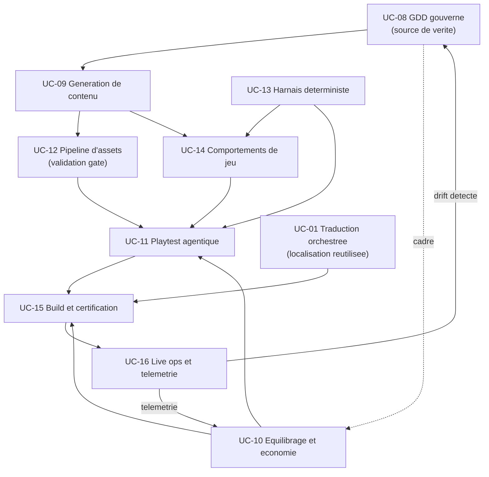

<!-- PROVENANCE
Source amont : projet "Standard de structure agentique" (processus-developpement-agentique).
Ce document est bundlé dans grimoire-kit comme connaissance de domaine (game-dev) pour usage self-contained.
La source amont reste la source de vérité normative ; grimoire-kit consomme et trace, ne redéfinit pas.
-->

# Guide du domaine : création de jeux vidéo

> **Statut : annexe pédagogique de domaine.** Ce guide enseigne comment appliquer le catalogue à la création de jeux vidéo. Il ne crée pas d'obligation normative au-delà de ce que définissent les use-cases jeu vidéo ([UC-08 à UC-50](use-cases-jeux-video.md)) et les patterns socle qu'ils composent.

Ce guide répond à une question : **comment construire un système agentique fiable pour créer un jeu vidéo ?** La réponse n'est pas une nouvelle famille de patterns. Les familles classent par **responsabilité** (organisation, orchestration, gouvernance, preuve, mémoire, runtime, cognition) ; un domaine métier comme le jeu vidéo vit comme un **cluster de use-cases** qui composent le noyau, plus le présent guide.

Il complète trois documents : la [classification socle / use-cases](classification-socle-use-cases.md) (ce qui est obligatoire), le [guide du noyau](guide-noyau.md) (les huit responsabilités de base) et les [use-cases](use-cases-jeux-video.md) (les fiches UC-08 à UC-16).

## Pourquoi un guide dédié au jeu vidéo ?

Le développement de jeu est un domaine de **missions long-horizon** : il compose des tâches sur des mois, avec des jalons (concept, prototype, vertical slice, alpha, beta, gold) et un cycle de vie qui continue après la sortie. Quatre spécificités justifient des patterns dédiés, là où la traduction ou le résumé n'en avaient pas besoin.

1. **Contenu créatif massif et interdépendant.** Niveaux, quêtes, dialogues, objets, assets : généré en volume, ce contenu doit rester cohérent avec le design et le lore, sans références cassées. → génération gouvernée et gate de validation.
2. **Déterminisme de simulation.** Multijoueur, replays, tests de régression et reproduction de bugs exigent une exécution rejouable (seed, pas fixe, hash d'état). → harnais déterministe.
3. **Certification plateforme et classification d'âge.** TRC / XR / Lotcheck côté plateformes, ESRB / PEGI / IARC côté rating : ce sont des portes de preuve, pas des formalités. → gates de certification pilotées par preuve.
4. **Live ops pilotée par la télémétrie.** Saisons, patchs, hotfixes et économie ajustée en direct ne se décident pas à l'aveugle. → décisions sourcées, canary et rollback.

## Le cycle de vie mappé au socle

On part d'une phase, on nomme les risques typiques (failure modes), puis les use-cases et patterns qui les couvrent et la preuve attendue.

| Phase | Risques typiques | Use-cases / patterns | Preuve attendue |
| --- | --- | --- | --- |
| Concept et pré-production | GDD obsolète, vérité divergente, lore contradictoire | UC-08 (KNO-06, QUA-16, KNO-03) | GDD comme source versionnée + claim ledger |
| Production — contenu | Contenu hors-design, refs cassées, incohérence lore | UC-09, UC-12 (RUN-01, GOV-02, QUA-14) | Content validation record |
| Production — systèmes et IA | IA dégénérée, pathfinding cassé, non-déterminisme | UC-14, UC-13 (COG-01, RUN-13) | Replay / simulation record |
| Équilibrage et économie | Exploit OP, inflation, dérive de la méta | UC-10 (COG-03, QUA-08, GOV-14) | Balance regression evidence |
| QA et playtest | Soft-locks, blocages de progression, fun détecté tard | UC-11 (QUA-11, QUA-12, QUA-10) | Playtest evidence pack |
| Jalons (alpha, beta, gold) | Jalon « papier » déclaré sans preuve | UC-15 (QUA-05, GOV-02) | Evidence-driven transition par jalon |
| Certification et rating | Échec cert, mauvais rating, contenu non déclaré | UC-15 (GOV-10, GOV-13, GOV-02) | Certification record + cert dry-run vert |
| Lancement et live ops | Patch régressif, server meltdown, backlash économique | UC-16 (QUA-08, RUN-14, GOV-17) | Telemetry decision record + canary |

## Les disciplines comme rôles agentiques

Chaque discipline du studio devient un rôle agentique gouverné, branché sur le socle.

| Discipline | Rôle agentique | Socle et use-cases mobilisés |
| --- | --- | --- |
| Game design | Gardien du GDD et décomposeur d'objectifs | UC-08, COG-01, QUA-16 |
| Narrative design | Vérificateur de cohérence du lore | UC-09 (variante lore), KNO-10 |
| Level design | Générateur et valideur de niveaux | UC-09, UC-12 |
| Programmation gameplay | Auteur de comportements + harnais déterministe | UC-14, UC-13 |
| Systems / économie | Simulateur d'équilibrage et d'économie | UC-10, COG-03 |
| Art et tech art | Pipeline d'assets gouverné | UC-12, RUN-02 |
| QA | Playtest agentique et préparation à la certification | UC-11, UC-15 |
| Build / release engineering | Build et cook gouvernés, reproductibles | UC-15, QUA-05 |
| Live ops et data | Analyste de télémétrie et pilote de déploiement | UC-16, QUA-08 |
| Localisation | Traduction multilingue orchestrée | UC-01 (réutilisé) |

## Catalogue des use-cases jeu vidéo

| ID | Use-case | Niveau | Intention |
| --- | --- | --- | --- |
| [UC-08](use-cases-jeux-video.md#uc-08--game-design-document-gouverné-source-de-vérité) | GDD gouverné, source de vérité | Mission-fondation | Faire du GDD/bible la source de vérité versionnée à laquelle tout contenu se rattache. |
| [UC-09](use-cases-jeux-video.md#uc-09--génération-de-contenu-de-jeu-gouvernée) | Génération de contenu de jeu gouvernée | Mission | Générer niveaux, quêtes, items et dialogues sous contrat, cohérents avec le design et le lore. |
| [UC-10](use-cases-jeux-video.md#uc-10--équilibrage-et-économie-gouvernés) | Équilibrage et économie gouvernés | Mission | Ajuster équilibrage et économie via simulation et télémétrie, avec non-régression. |
| [UC-11](use-cases-jeux-video.md#uc-11--playtest-agentique-gouverné) | Playtest agentique gouverné | Mission | Faire jouer des agents pour produire des preuves de jouabilité (atteignabilité, soft-locks, courbe de difficulté). |
| [UC-12](use-cases-jeux-video.md#uc-12--pipeline-dassets-gouverné) | Pipeline d'assets gouverné | Tâche | Importer, optimiser et valider les assets via une gate (budgets, refs, naming, orphelins). |
| [UC-13](use-cases-jeux-video.md#uc-13--harnais-de-simulation-déterministe) | Harnais de simulation déterministe | Tâche | Exécuter la simulation de façon rejouable (seed, pas fixe, hash d'état) pour des tests reproductibles. |
| [UC-14](use-cases-jeux-video.md#uc-14--authoring-de-comportements-de-jeu-gouverné) | Authoring de comportements de jeu gouverné | Tâche / Mission | Produire l'IA de jeu (behavior trees, FSM) conforme au design et vérifiée sur harnais déterministe. |
| [UC-15](use-cases-jeux-video.md#uc-15--build-et-certification-gouvernés) | Build et certification gouvernés | Mission | Piloter build de jalon, certification plateforme et rating comme transitions pilotées par preuve. |
| [UC-16](use-cases-jeux-video.md#uc-16--live-ops-et-télémétrie-gouvernés) | Live ops et télémétrie gouvernés | Mission | Décider patchs, saisons et ajustements live à partir de télémétrie, avec canary et rollback. |

La localisation réutilise [UC-01](use-cases-jeux-video.md#uc-01--traduction-multilingue-orchestrée) ; le narratif et le dialogue sont une variante d'UC-09.

## Règles normatives du domaine

Ces règles sont les invariants du domaine. Chacune est portée par un use-case et des patterns socle ; les enfreindre rend le système non gouvernable.

1. **Le GDD est l'unique source de vérité.** Tout contenu généré s'y rattache explicitement ; une divergence est un défaut, pas une variante. *(UC-08, QUA-01, ORC-06)*
2. **Aucun contenu hors classification d'âge.** Le contenu est scanné contre le rating déclaré avant intégration et avant soumission. *(UC-15, GOV-08)*
3. **La simulation testée est déterministe.** Seed, pas de temps fixe et hash d'état sont obligatoires pour tout test rejouable. *(UC-13, RUN-13)*
4. **La certification est une gate de preuve.** Pas de date de soumission sans cert dry-run vert et evidence pack. *(UC-15, GOV-02, QUA-05)*
5. **Pas d'ajustement live sans télémétrie ni canary.** Aucune mise au point d'équilibrage ou d'économie en production sans données et déploiement progressif. *(UC-16, UC-10, GOV-10)*
6. **Pas de changement d'équilibrage sans non-régression.** Toute modification de balance passe un test de régression d'équilibrage. *(UC-10, QUA-05)*
7. **Gate de validation de contenu avant merge.** Budgets, références, naming et cohérence lore sont vérifiés avant intégration. *(UC-12, UC-09, GOV-08)*
8. **Build reproductible et jalon prouvé.** Le build est tagué et reproductible ; un jalon n'est atteint que par preuve, jamais par déclaration. *(UC-15, QUA-05)*
9. **Tout patch live est rejouable ou compensable.** Un déploiement en production prévoit son rollback ou sa compensation. *(UC-16, RUN-14, GOV-17)*

## Skills et capability packs nécessaires

Les compétences spécialisées du domaine sont des **capability packs** déclarés au marketplace ([RUN-06](06-runtime-evolution/README.md)) et gérés par le cycle de vie des compétences ([RUN-07](06-runtime-evolution/README.md)). Chaque pack a des permissions bornées ([GOV-05](03-gouvernance-controles/README.md), [GOV-07](03-gouvernance-controles/README.md)) et produit une preuve.

Le tableau ci-dessous liste les **packs fondateurs** (use-cases UC-08 à UC-16). Le **catalogue complet — l'épicerie de skills** par discipline (art 2D/3D, matériaux et rendu, VFX, animation, audio, cinématiques, gameplay, IA de PNJ, UI/UX et accessibilité, optimisation, VR/XR, outils et pipeline), où chaque skill précise son **format d'artefact**, son **palier modèle**, sa **taille de contexte**, son **niveau de réflexion** et sa **preuve**, est détaillé dans [Catalogue des skills jeu vidéo](catalogue-skills-jeux-video.md).

| Skill / pack | Ce qu'il fait | Permissions typiques | Preuve produite | Use-case |
| --- | --- | --- | --- | --- |
| gdd-parser | Indexe le GDD/bible et expose une vue requêtable | Lecture docs design | Index + claims | UC-08 |
| lore-consistency-checker | Détecte les contradictions de lore et de canon | Lecture bible + contenu | Rapport d'incohérences | UC-08, UC-09 |
| content-validator | Valide niveaux, quêtes et dialogues contre le design | Lecture contenu + schémas | Content validation record | UC-09, UC-12 |
| asset-budget-checker | Vérifie polycount, textures, formats, naming, refs | Lecture assets | Rapport de budget | UC-12 |
| balance-simulator | Simule combats / progression pour détecter exploits | Exécution simulation bornée | Balance regression evidence | UC-10 |
| economy-modeler | Modélise sources/puits et détecte inflation | Lecture télémétrie économie | Modèle + alertes | UC-10 |
| playtest-bot | Joue automatiquement et trace la trajectoire | Exécution jeu en bac à sable | Playtest evidence pack | UC-11 |
| determinism-harness | Exécute en seed + pas fixe et hashe l'état | Exécution rejouable | Replay / sim record | UC-13 |
| behavior-tree-authoring | Produit et révise behavior trees / FSM | Écriture comportements bornée | Diff + tests déterministes | UC-14 |
| cert-checklist-runner | Déroule les checklists TRC/XR/Lotcheck | Lecture build + checklists | Certification record | UC-15 |
| rating-content-scanner | Scanne le contenu contre ESRB/PEGI/IARC | Lecture contenu | Rapport de conformité rating | UC-15 |
| telemetry-analyst | Analyse la télémétrie live et propose des décisions | Lecture télémétrie | Telemetry decision record | UC-16 |
| build-cook-runner | Lance build et cook reproductibles | Exécution pipeline build | Build tagué + manifeste | UC-15 |
| localization | Traduit le contenu vers plusieurs langues | Lecture/écriture chaînes | Evidence pack traduction | UC-01 |

## Arbre de décision : quel symptôme, quel use-case

On part d'un symptôme observé en production de jeu, on remonte au use-case et aux patterns de départ.

| Symptôme observé | Use-case | Patterns de départ |
| --- | --- | --- |
| Le contenu contredit le design ou le lore. | UC-08, UC-09 | KNO-06, QUA-14 |
| Des références d'assets cassent ou les budgets explosent. | UC-12 | GOV-02, QUA-14 |
| Un bug ne se reproduit pas ou le multijoueur désynchronise. | UC-13 | RUN-13, QUA-10 |
| L'IA de jeu se comporte de façon dégénérée. | UC-14 | COG-01, COG-04 |
| Une arme ou une monnaie casse l'équilibre. | UC-10 | COG-03, QUA-08 |
| Des joueurs restent bloqués ou un soft-lock apparaît. | UC-11 | QUA-11, QUA-12 |
| La certification ou le rating échoue tard. | UC-15 | GOV-02, GOV-13 |
| Un patch dégrade l'expérience après déploiement. | UC-16 | QUA-08, RUN-14 |
| Un asset explose son budget ou casse une convention. | UC-17, UC-29 | GOV-08, QUA-14 |
| Un shader, un VFX ou la scène font chuter le framerate. | UC-18, UC-19, UC-27 | QUA-08, GOV-08 |
| Une animation ou une cinématique casse la cohérence. | UC-20, UC-22 | QUA-14, KNO-10 |
| Le son sature ou explose le budget mémoire. | UC-21 | QUA-14, GOV-08 |
| Le combat ou la physique est injouable ou non déterministe. | UC-23, UC-25 | RUN-13, QUA-08 |
| L'IA de PNJ ou la navigation se dégrade. | UC-24 | COG-01, COG-04 |
| L'UI est inaccessible ou peu lisible. | UC-26 | QUA-14, GOV-08 |
| La VR provoque de l'inconfort ou chute sous le plancher de framerate. | UC-28 | QUA-05, QUA-08 |
| L'identité visuelle diverge entre disciplines, ou une illustration est demandée au mauvais modèle. | UC-30 | MOD-03, GOV-08 |
| L'UI est conçue sans idéation ni test d'utilisabilité. | UC-31 | QUA-12, QUA-15 |
| Les joueurs se désynchronisent en multijoueur ou les bugs réseau ne se reproduisent pas. | UC-32 | UC-13, RUN-13 |
| Les services en ligne (comptes, sauvegardes, classements) sont peu fiables ou permettent des doubles effets. | UC-33 | RUN-13, RUN-14 |
| La triche, la duplication d'objets ou un exploit économique apparaissent. | UC-34 | GOV-08, GOV-17 |
| L'éclairage ou l'image finale est réglé au ressenti, divergent de la charte ou hors budget GPU. | UC-35 | KNO-10, QUA-12 |
| Les systèmes du jeu se couplent, les dépendances tournent en rond, l'évolution casse tout. | UC-36 | GOV-08, QUA-14 |
| Les régressions reviennent et le code n'a pas de tests automatisés ni de portes de qualité. | UC-37 | QUA-05, RUN-13 |
| Le jeu doit sortir en plusieurs langues ou régions avec interface, voix et culture cohérentes. | UC-38 | MOD-03, QUA-14 |
| L'atmosphère (lumière, son, brouillard, décor) est réglée au ressenti, sans converger ni rester lisible. | UC-39 | QUA-12, GOV-08 |
| Les dialogues et embranchements narratifs deviennent incohérents, les variables d'histoire se contredisent. | UC-40 | KNO-10, COG-01 |
| La monétisation, la boutique ou l'économie live sont conçues au jugé, sans garde-fou ni équité. | UC-41 | GOV-10, GOV-15 |
| Les décisions produit se prennent sans funnel, rétention ni expérimentation fiable. | UC-42 | QUA-08, GOV-10 |
| Le contenu généré proceduralement n'est pas validé (jouable, cohérent, dans les budgets). | UC-43 | QUA-04, QUA-14 |
| Le monde ouvert se charge par streaming et le budget mémoire ou perf dérape (pop-in, pics). | UC-44 | QUA-08, QUA-12 |
| Le chat, les groupes ou les fonctions sociales exposent les joueurs sans modération ni sécurité. | UC-45 | GOV-08, GOV-15 |
| Le modding ou le contenu joueur (UGC) s'exécute sans bac à sable ni modération. | UC-46 | GOV-07, GOV-09 |
| La conformité légale, la classification d'âge et la certification sont traitées tard, à la soumission. | UC-47 | QUA-14, GOV-15 |
| Les assets marketing (key art, trailer, page boutique) sont produits hors maîtrise ou promettent un gameplay non livré. | UC-48 | MOD-03, KNO-10 |
| La communauté et le support joueur sont improvisés, sans taxonomie ni protection des données. | UC-49 | GOV-09, KNO-10 |
| Le mode spectateur ou le replay sont non déterministes ou laissent fuir l'information cachée. | UC-50 | RUN-13, GOV-17 |

## Flux d'une mission jeu vidéo

Le GDD gouverne la génération de contenu ; le contenu passe par le pipeline d'assets et l'authoring de comportements ; le harnais déterministe sous-tend l'IA et le playtest ; playtest et économie alimentent le build et la certification ; le live ops boucle sur l'économie et détecte la dérive du GDD.

Le schéma source est disponible dans [diagrammes/patterns-jeux-video.mmd](diagrammes/patterns-jeux-video.mmd).

## Comment continuer

- Pour **le détail de chaque capacité**, ouvrir les fiches [UC-08 à UC-50](use-cases-jeux-video.md).
- Pour **choisir un skill par besoin** (avec format d'artefact, palier modèle, contexte, niveau de réflexion et preuve), parcourir le [catalogue des skills jeu vidéo](catalogue-skills-jeux-video.md).
- Pour **savoir ce qui est obligatoire** sous chaque use-case, lire la [classification socle / use-cases](classification-socle-use-cases.md).
- Pour **comprendre le noyau** que ces missions composent, lire le [guide du noyau](guide-noyau.md).
- Pour **composer une mission** sur le noyau cognitif, voir les archétypes dans [Noyau, extensions et archétypes](noyau-extensions-archetypes.md).
