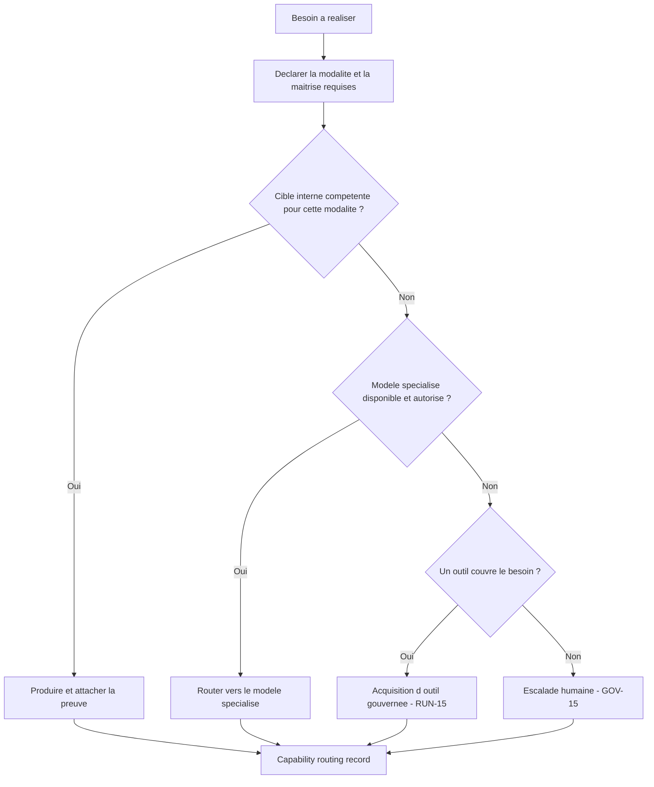

<!-- PROVENANCE
Source amont : projet "Standard de structure agentique" (processus-developpement-agentique).
Ce document est bundlé dans grimoire-kit comme connaissance de domaine (game-dev) pour usage self-contained.
La source amont reste la source de vérité normative ; grimoire-kit consomme et trace, ne redéfinit pas.
-->

# Matrice capacités et modalités — création de jeux vidéo

> **Statut : annexe de référence de domaine.** Ce document instancie pour le jeu vidéo le pattern socle [MOD-03 — Routage par compétence et modalité (limites assumées)](03-gouvernance-controles/README.md). Il n'ajoute aucune obligation normative nouvelle : il rend concrète la *capability/modality matrix* que MOD-03 exige comme contrôle, afin que l'agent route chaque tâche vers la cible réellement compétente plutôt que de simuler une maîtrise absente.

## Pourquoi cette matrice

Un LLM généraliste accepte toute demande et produit un résultat médiocre hors de son cœur de compétence (illustration, audio, 3D, vidéo), ce qui entache un projet dès ses fondations. La règle du domaine est simple : **assumer ses limites et router vers la bonne cible**. Cette matrice sert de table de décision partagée : pour chaque famille de tâche, elle déclare la modalité dominante, la cible recommandée, le palier de modèle utile, ce que l'agent ne doit **pas** tenter seul, et le repli déclaré.

## Légende

| Modalité | Description |
| --- | --- |
| Texte / raisonnement | Conception, analyse, planification, rédaction structurée. |
| Code | Implémentation, tests, scripts, shaders, outils. |
| Image | Illustration, concept art, textures peintes, retouche. |
| Audio | Musique, effets sonores, voix, doublage. |
| 3D | Modélisation, sculpt, retopologie, animation clé, VFX. |
| Vidéo | Montage, rendu cinématique final, captation. |

| Cible | Quand l'employer |
| --- | --- |
| LLM frontier | Décisions structurantes, code sensible, arbitrages coûteux à corriger tard. |
| LLM standard | Travail systématique, code courant, intégration. |
| LLM économique | Volume répétitif, première passe à vérifier. |
| Modèle spécialisé | Modalité hors texte : génération d'image, d'audio, de voix. |
| Outil / DCC | Logiciel métier (moteur, Blender, Substance, ZBrush, FMOD, profiler). |
| Humain | Cœur artistique, juridique, culturel ou décision sensible (via GOV-15). |

## Matrice de routage par famille de tâche

| Famille de tâche | Modalité dominante | Cible recommandée | Palier / maîtrise | À ne pas tenter seul | Repli déclaré | UC / Rayon |
| --- | --- | --- | --- | --- | --- | --- |
| Game design, GDD, quêtes, lore | Texte / raisonnement | LLM frontier ou standard | Cœur de compétence | — | — | UC-08, UC-09 / A |
| Équilibrage, économie, maths de gameplay | Code + raisonnement | LLM frontier | Cœur de compétence | — | Outil de simulation pour la preuve | UC-10 / O |
| Architecture et code des systèmes | Code | LLM frontier ou standard | Cœur de compétence | — | — | UC-36 / T |
| Shaders et pipeline de rendu | Code | LLM frontier | Cœur de compétence | Juger « beau » sans mesurer | Profilage par outil obligatoire | UC-18 / S, T |
| Tests automatisés, fiabilité du code | Code | LLM standard | Cœur de compétence | — | — | UC-37 / T |
| Concept art, illustration | Image | Modèle de génération d'image ou illustrateur humain | Hors cœur LLM texte | Produire l'illustration finale avec un LLM texte | Router vers modèle image ; sinon humain (GOV-15) | UC-30 / B, Q |
| Textures peintes, matériaux | Image + outil | Modèle image + Substance/DCC + artiste | Hors cœur LLM texte | Peindre la texture finale à la main via LLM | Outil DCC ou humain | UC-18 / D |
| Modélisation 3D, sculpt, retopologie | 3D | DCC (Blender, Maya, ZBrush) + artiste 3D | Hors cœur LLM | Générer le mesh final « à la main » via LLM | Outil DCC ; humain (GOV-15) | UC-17 / C |
| VFX temps réel | 3D / outil | Moteur + artiste VFX | Hors cœur LLM | — | Outil et profilage VFX | UC-19 / E |
| Animation — clé artistique | 3D | DCC + animateur | Hors cœur LLM | Produire l'animation clé finale via LLM | Outil ; humain | UC-20 / F |
| Animation — runtime / procédurale | Code | LLM standard | Cœur de compétence | — | — | UC-20 / F |
| Audio — SFX, musique, voix | Audio | Modèle audio spécialisé, compositeur, comédien | Hors cœur LLM texte | Produire le son ou la voix finale via LLM texte | Modèle audio ; humain (GOV-15) | UC-21 / G |
| Cinématiques, mise en scène | Texte + outil | LLM (storyboard, blocking) + séquenceur moteur | Mixte | Rendre la vidéo finale via LLM | Outil de séquençage et de montage | UC-22 / H |
| Localisation — texte | Texte | Petits modèles par langue + relecteur fort | Cœur de compétence | Langues sensibles ou juridiques sans relecture | Relecteur humain (GOV-15) sur segments à risque | UC-38 / U |
| Localisation — voix, doublage | Audio | Studio, comédiens, outil | Hors cœur LLM | Synthétiser la voix finale sans accord | Humain (GOV-15) | UC-38 / U, G |
| Optimisation, profilage | Code + outil | LLM + profiler | Cœur de compétence | Optimiser au ressenti sans mesure | Profiler obligatoire pour la preuve | UC-27 / L |
| Acquisition d'un outil manquant | Décision | Utilisateur via RUN-15 | Gouvernance | Installer un outil tiers sans accord | Dossier d'options ; choix utilisateur (RUN-15, GOV-15) | — / V |

## Limites assumées d'un LLM généraliste

Un LLM texte (Claude, GPT et équivalents) ne doit **pas** livrer comme final, seul :

- une **illustration ou un concept art** — router vers un modèle de génération d'image ou un illustrateur humain ;
- une **texture peinte à la main** ou un **asset 3D final** — passer par un outil DCC et un artiste ;
- une **piste audio, musique ou voix finale** — passer par un modèle audio spécialisé ou un humain ;
- un **montage ou rendu vidéo final** — passer par un outil dédié.

Dans tous ces cas, l'agent **déclare la limite**, propose des options et route vers la cible capable. S'il n'existe aucune cible interne, il escalade vers l'humain (GOV-15) ou ouvre une acquisition d'outil (RUN-15). Il ne « bouche pas le trou » avec une production hors maîtrise.

## Arbre de décision

## Règle d'or

> Mieux vaut **router et assumer une limite** que produire un livrable médiocre hors maîtrise. Chaque routage produit un *capability routing record* traçable ; chaque refus hors maîtrise est explicite.

## Liens

- Pattern socle : [MOD-03 — Routage par compétence et modalité](03-gouvernance-controles/README.md), [GOV-15 — Human escalation gate](03-gouvernance-controles/README.md), [RUN-15 — Acquisition d'outils et provisioning](06-runtime-evolution/README.md).
- Use-case : [UC-38 — Localisation et internationalisation du jeu gouvernées](use-cases-jeux-video.md).
- Skills : [Rayon U et Rayon V du catalogue jeu vidéo](catalogue-skills-jeux-video.md).
- Anti-patterns évités : Maîtrise simulée, Réinvention de la roue, Outil adopté sans accord (voir [anti-patterns](anti-patterns-agentiques.md)).
