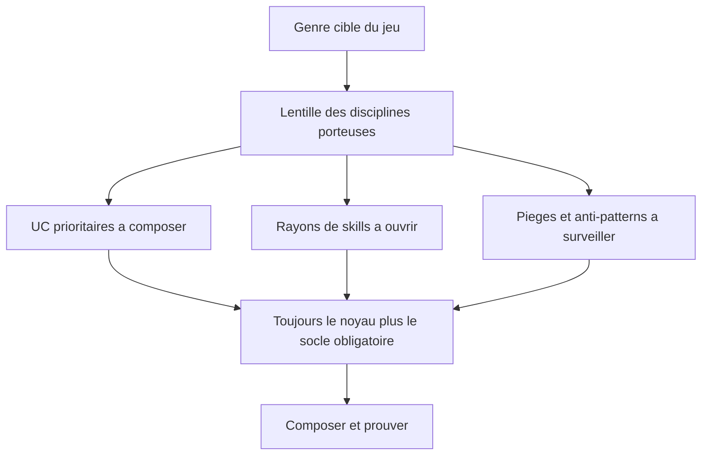

<!-- PROVENANCE
Source amont : projet "Standard de structure agentique" (processus-developpement-agentique).
Ce document est bundlé dans grimoire-kit comme connaissance de domaine (game-dev) pour usage self-contained.
La source amont reste la source de vérité normative ; grimoire-kit consomme et trace, ne redéfinit pas.
-->

# Profils par genre — lentilles de jeu vidéo

> **Statut : annexe de navigation de domaine.** Ce document n'ajoute aucune obligation normative. C'est une **lentille** : pour un genre de jeu donné, il indique quels use-cases ([UC-08 à UC-50](use-cases-jeux-video.md)), quels rayons de skills ([catalogue](catalogue-skills-jeux-video.md)) et quels patterns socle sont les plus porteurs, quelle est la signature d'ambiance attendue, et quels pièges surveiller. Il aide à composer son « panier » dans l'épicerie sans tout relire.

## Comment lire une lentille

Une lentille **priorise**, elle ne restreint pas. Tout jeu compose le noyau cognitif et le socle obligatoire ; le genre ne fait que déplacer le centre de gravité vers certaines disciplines. Un jeu hybride additionne plusieurs lentilles.

## Lentilles par genre

| Genre | UC clés (porteurs) | Rayons prioritaires | Socle critique | Signature d'ambiance | Pièges fréquents |
| --- | --- | --- | --- | --- | --- |
| **FPS / TPS (tir)** | UC-23, UC-24, UC-25, UC-27, UC-32 | I, J, L, R, S | UC-13, QUA-08, GOV-08 | Tension, lisibilité de la menace, feedback de tir, impact | Netcode sans réconciliation ; hit registration non déterministe ; perf sous le plancher fps |
| **RPG / Action-RPG** | UC-08, UC-09, UC-10, UC-23, UC-38, UC-40 | A, J, U, W, X | KNO-10, QUA-01, QUA-15 | Monde cohérent, mood narratif, identité régionale | GDD/lore fantôme ; économie déséquilibrée ; localisation tardive ; narration sans état |
| **Stratégie (RTS / 4X)** | UC-10, UC-13, UC-24, UC-27, UC-36 | J, O, T | UC-13, QUA-08, QUA-14 | Lisibilité macro, sentiment d'échelle | Simulation non déterministe (désync lockstep) ; perf à grande échelle ; architecture émergente |
| **MOBA / arène** | UC-10, UC-16, UC-23, UC-33, UC-34, UC-41, UC-42, UC-50 | I, R, Y, AC | QUA-08, GOV-08, GOV-07 | Clarté compétitive, équité | Déséquilibrage ; triche ; backend permissif ; monétisation prédatrice |
| **Puzzle / réflexion** | UC-08, UC-09, UC-11, UC-26 | A, K | COG-01, QUA-12 | Clarté, satisfaction du « déclic » | Difficulté mal calibrée ; génération de niveaux incohérente |
| **Plateforme / Metroidvania** | UC-09, UC-11, UC-20, UC-25, UC-35 | F, I, S | QUA-12, UC-13 | Réactivité, game feel, lisibilité du saut | Game feel au ressenti non mesuré ; collisions imprécises |
| **Survie / horreur** | UC-21, UC-24, UC-35, UC-39 | G, S, W | QUA-12, MOD-03, GOV-08 | **Tension, peur, obscurité, soundscape** — le genre de l'ambiance | Ambiance au ressenti ; audio non spatialisé ; éclairage hors budget |
| **Simulation / gestion** | UC-10, UC-13, UC-26, UC-36 | K, O, T | UC-13, QUA-14, KNO-03 | Lisibilité des données, profondeur systémique | Architecture émergente subie ; simulation non déterministe ; UI data illisible |
| **Monde ouvert / bac à sable** | UC-09, UC-12, UC-27, UC-29, UC-39, UC-43, UC-44 | L, N, W, Z | QUA-08, KNO-10, GOV-08 | Météo, cycle jour/nuit, atmosphère vivante | Streaming/budget non tenu ; dépôt ingérable ; pop-in et dérive de canon ; PCG non validée |
| **Course (racing)** | UC-23, UC-25, UC-27, UC-32, UC-35 | I, L, S | UC-13, QUA-08 | Sensation de vitesse, lisibilité de trajectoire | Physique véhicule non déterministe ; perf sous le plancher fps |
| **Combat (fighting)** | UC-11, UC-13, UC-23, UC-32 | I, R | UC-13, QUA-05, GOV-08 | Impact, lisibilité des coups, timing | Frame data incohérente ; rollback netcode fragile |
| **Rogue-like / rogue-lite** | UC-09, UC-10, UC-11, UC-13, UC-43 | A, O, Z | RUN-13, UC-13, QUA-01 | Variété maîtrisée, tension de run | Génération procédurale incohérente ; runs déséquilibrées ; seed non reproductible ; PCG non validée |
| **Narratif / visual novel / aventure** | UC-08, UC-21, UC-22, UC-38, UC-39, UC-40 | A, H, U, W, X | KNO-10, QUA-15, MOD-03 | Ton narratif, mood, mise en scène | Bible/lore fantôme ; voix finale via LLM texte ; localisation tardive ; narration sans état |
| **Compétitif en ligne / battle royale** | UC-16, UC-27, UC-32, UC-33, UC-34, UC-41, UC-42, UC-50 | L, R, Y, AC | QUA-08, GOV-08, GOV-07 | Équité, lisibilité sous pression | Triche ; backend permissif ; netcode à grande échelle ; patch live à l'aveugle ; mesure sans hypothèse |
| **Rythme / musical** | UC-11, UC-13, UC-21, UC-26 | G, K | UC-13, QUA-05 | Synchronisation audio-visuelle, groove | Latence/désync audio ; timing non déterministe |

## Notes d'usage

- **Le genre déplace le centre de gravité, pas les fondations.** Le socle obligatoire et le noyau cognitif s'appliquent partout ; les colonnes ci-dessus indiquent où investir en premier.
- **Les jeux hybrides additionnent les lentilles.** Un action-RPG en monde ouvert combine RPG + monde ouvert : on prend l'union des UC porteurs et on arbitre les budgets.
- **L'ambiance est transversale mais inégalement critique.** Elle est centrale pour la survie/horreur, le narratif et le monde ouvert (voir [UC-39](use-cases-jeux-video.md) et le Rayon W) ; secondaire mais utile ailleurs.
- **Le multijoueur change la donne dès qu'il apparaît.** Tout genre avec réseau hérite des pièges de netcode, services et anti-triche (UC-32, UC-33, UC-34).

## Liens

- Use-cases jeu vidéo : [UC-08 à UC-39](use-cases-jeux-video.md).
- Skills par besoin : [catalogue (l'épicerie)](catalogue-skills-jeux-video.md).
- Routage par compétence/modalité : [matrice capacités et modalités](matrice-capacites-modalites-jeux-video.md).
- Cycle de vie et disciplines : [guide du domaine](guide-jeux-video.md).
