<!-- PROVENANCE
Source amont : projet "Standard de structure agentique" (processus-developpement-agentique).
Ce document est bundlé dans grimoire-kit comme connaissance de domaine (game-dev) pour usage self-contained.
La source amont reste la source de vérité normative ; grimoire-kit consomme et trace, ne redéfinit pas.
-->

# Use-cases jeu vidéo (UC-08 → UC-50)

> Cluster de use-cases du domaine jeu vidéo, extrait du catalogue de use-cases amont.
> Chaque fiche compose le noyau cognitif et le socle obligatoire du standard agentique.

## UC-08 : Game Design Document gouverné, source de vérité

| Élément | Description |
| --- | --- |
| Nature | Use-case optionnel — niveau mission (fondation). |
| Intention | Faire du GDD et de la bible (lore, règles, systèmes) la source de vérité versionnée à laquelle tout contenu et toute décision se rattachent. |
| Problème | Le GDD dérive du jeu réel, plusieurs versions circulent, le lore se contredit, et la connaissance design tient dans la tête de quelques personnes. |
| Solution | Indexer le GDD/bible en base requêtable, détecter la dérive vis-à-vis du build, relier chaque décision et contenu à une entrée sourcée, arbitrer les contradictions par ordre d'autorité. |
| Contrôles | Knowledge base indexer, doc drift detector, context constitution, claim ledger, assumption ledger, validation authority. |
| Anti-pattern | Un GDD figé que personne ne met à jour pendant que le jeu évolue. |

### Contexte d'utilisation

| Utiliser quand | Éviter quand |
| --- | --- |
| Le jeu a un lore, des systèmes et des règles que plusieurs équipes doivent partager. | Un prototype jetable sans contenu durable ni équipe à aligner. |
| Le contenu généré doit rester cohérent avec un canon stable. | Le design tient sur une page et ne change plus. |
| Les décisions de design doivent être traçables et arbitrables. | Aucune source de vérité partagée n'est nécessaire. |

### Structure

| Rôle | Responsabilité |
| --- | --- |
| Indexeur de design | Transforme GDD et bible en base requêtable et versionnée. |
| Détecteur de dérive | Compare le design documenté au build réel et signale les écarts. |
| Gardien du canon | Arbitre les contradictions de lore et de systèmes par ordre d'autorité. |
| Validation authority | Valide les changements de canon et les exceptions. |

### Schéma

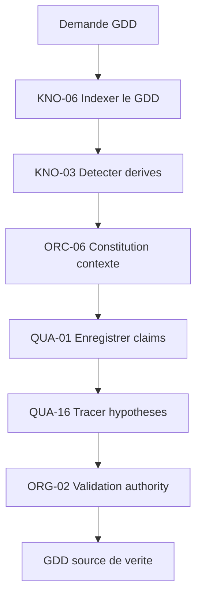

### Flux minimal

1. Indexer GDD et bible en entrées requêtables avec version et owner (KNO-06).
2. Relier chaque règle, système et élément de lore à une entrée canonique (QUA-01).
3. Détecter la dérive entre design documenté et build (KNO-03).
4. Isoler les hypothèses non confirmées des faits établis (QUA-16).
5. Arbitrer les contradictions par ordre d'autorité de la constitution de contexte (ORC-06).
6. Faire valider les changements de canon par l'autorité de validation (ORG-02).

### Variantes

| Variante | Usage |
| --- | --- |
| Léger | GDD indexé et claims, sans graphe complet de lore. |
| Lore-first | Bible narrative comme canon central, contenu rattaché au lore. |
| Systémique | Règles et systèmes versionnés comme source pour l'équilibrage et la génération. |

### Recommandations d'exécution

| Aspect | Recommandation |
| --- | --- |
| Palier modèle | Standard — le GDD nécessite un raisonnement structuré pour extraire règles et mécaniques de jeu. |
| Taille de contexte | Large — le GDD complet peut couvrir des dizaines de systèmes et sections interdépendantes. |
| Niveau de réflexion | Moyen — planifier l'indexation et détecter les incohérences entre sections du document. |
| Format d'artefact | JSON schématisé, graphe de règles, index Markdown structuré, YAML de configuration. |

### Patterns socle requis

| Pattern | Rôle dans la mission |
| --- | --- |
| KNO-06 Knowledge Base Indexer | Rendre le GDD/bible requêtable et versionné. |
| KNO-03 Doc drift detector | Détecter l'écart entre design et build. |
| ORC-06 Context constitution | Définir l'ordre d'autorité qui arbitre les contradictions. |
| QUA-01 Claim ledger | Relier chaque décision et contenu à une source canonique. |
| QUA-16 Assumption ledger | Isoler hypothèses et faits dans le design. |
| ORG-02 Validation authority | Valider les changements de canon. |

### Critères de validation

| Critère | Preuve attendue |
| --- | --- |
| Unicité | Une seule version canonique référencée, owner et validité explicites. |
| Traçabilité | Chaque contenu ou décision relié à une entrée du GDD. |
| Fraîcheur | Écarts design/build détectés et traités ou documentés. |
| Cohérence | Contradictions de lore arbitrées ou escaladées. |

### Erreurs fréquentes

| Erreur | Correction |
| --- | --- |
| Laisser le GDD diverger silencieusement du jeu. | Détecter la dérive en continu (KNO-03). |
| Faire coexister plusieurs versions « vraies » du design. | Désigner une version canonique et un owner (KNO-06, ORG-02). |
| Mélanger intentions et faits établis. | Séparer hypothèses et faits (QUA-16). |
| Trancher un conflit de lore sans autorité. | Arbitrer par la constitution de contexte (ORC-06). |

### Exemple

Le GDD "Project Vortex" (847 pages, 23 systèmes) est indexé via KNO-06 en 3h18min. KNO-03 détecte 14 dérives (règles de damage contradictoires entre sections 4.2 et 11.7). QUA-01 enregistre 412 claims de mécanique. QUA-16 trace 89 hypothèses d'équilibrage. ORG-02 valide le GDD comme source de vérité en 22min, avec coût total de $47,35 (modèle Standard).

## UC-09 : Génération de contenu de jeu gouvernée

| Élément | Description |
| --- | --- |
| Nature | Use-case optionnel — niveau mission. |
| Intention | Générer niveaux, quêtes, objets et dialogues (y compris génération procédurale) sous contrat, cohérents avec le design et le lore. |
| Problème | La génération libre produit du contenu hors-design, avec références cassées, incohérences de lore et difficulté non maîtrisée. |
| Solution | Générer dans des bornes, décomposer l'objectif de contenu, valider par contrat de sortie, vérifier la cohérence vis-à-vis du canon, et faire un dry-run avant intégration. |
| Contrôles | Dynamic factory contrôlée, décomposition d'objectif, output contract validator, source graph resolver, dry-run, evidence pack. |
| Anti-pattern | Laisser le modèle inventer du contenu librement et l'intégrer sans gate. |

### Contexte d'utilisation

| Utiliser quand | Éviter quand |
| --- | --- |
| Le volume de contenu est élevé et doit rester cohérent avec un canon. | Le contenu est unique, artisanal et entièrement écrit à la main. |
| La génération procédurale ou assistée accélère la production. | Aucun canon ni schéma de contenu n'existe encore (voir UC-08). |
| Le contenu doit passer une gate de validation avant merge. | Une exploration créative libre sans intégration est suffisante. |

### Structure

| Rôle | Responsabilité |
| --- | --- |
| Décomposeur de contenu | Découpe l'objectif (zone, arc, set de quêtes) en unités générables. |
| Générateur borné | Produit le contenu dans les limites de la factory contrôlée. |
| Vérificateur de cohérence | Contrôle lore, références et contrat de sortie. |
| Gate d'intégration | Refuse ou accepte le contenu après dry-run et preuve. |

### Schéma

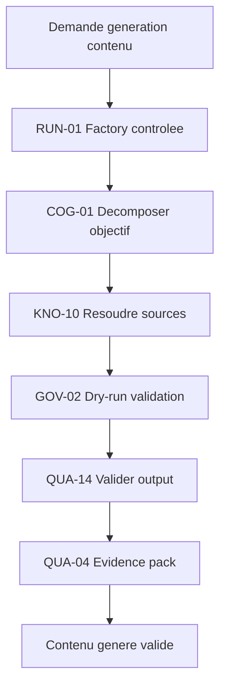

### Flux minimal

1. Décomposer l'objectif de contenu en unités vérifiables (COG-01).
2. Générer chaque unité via la factory contrôlée, dans ses bornes (RUN-01).
3. Valider le contenu contre son schéma et ses invariants (QUA-14).
4. Vérifier la cohérence avec le canon et les références (KNO-10).
5. Faire un dry-run d'intégration avant merge (GOV-02).
6. Produire un evidence pack du lot généré et de ses contrôles (QUA-04).

### Variantes

| Variante | Usage |
| --- | --- |
| Procédurale | Génération paramétrée de niveaux ou de loot avec contraintes. |
| Narrative | Dialogues et quêtes rattachés à la bible de lore. |
| Assistée | Proposition de contenu révisée et validée par un humain. |

### Recommandations d'exécution

| Aspect | Recommandation |
| --- | --- |
| Palier modèle | Standard — génération de contenu nécessite créativité structurée dans les contraintes du GDD. |
| Taille de contexte | Moyen — chaque génération référence une section du GDD et des templates établis. |
| Niveau de réflexion | Moyen — composer contenu cohérent avec les règles narratives et mécaniques existantes. |
| Format d'artefact | Texte narratif JSON, dialogues YAML, quêtes structurées, loot tables, descriptions d'items. |

### Patterns socle requis

| Pattern | Rôle dans la mission |
| --- | --- |
| RUN-01 Dynamic factory contrôlée | Générer le contenu dans des bornes gouvernées. |
| COG-01 Décomposition d'objectif | Découper le contenu en unités vérifiables. |
| QUA-14 Output contract validator | Valider schéma et invariants du contenu. |
| KNO-10 Source Graph Resolver | Vérifier la cohérence lore et les références. |
| GOV-02 Dry-run avant action risquée | Simuler l'intégration avant merge. |
| QUA-04 Evidence pack et verification verdict | Prouver la conformité du contenu généré. |

### Critères de validation

| Critère | Preuve attendue |
| --- | --- |
| Conformité design | Contenu validé contre schémas et règles du GDD. |
| Cohérence lore | Aucune contradiction avec le canon, ou écart justifié. |
| Intégrité | Références, identifiants et dépendances non cassés. |
| Intégration | Dry-run réussi avant merge, evidence pack disponible. |

### Erreurs fréquentes

| Erreur | Correction |
| --- | --- |
| Générer en flux libre sans schéma de contenu. | Définir un contrat de sortie validable (QUA-14). |
| Intégrer sans vérifier le canon. | Passer par le résolveur de cohérence (KNO-10). |
| Pousser le contenu directement en build. | Dry-run d'intégration avant merge (GOV-02). |
| Générer un arc entier d'un seul jet. | Décomposer en unités vérifiables (COG-01). |

### Exemple

Génération de 140 descriptions d'armes pour "Wasteland Raiders". COG-01 décompose en 7 archétypes. KNO-10 résout le style narratif du GDD (gritty, post-apocalyptique). GOV-02 détecte 3 armes avec stats incohérentes (DPS > plafond). QUA-14 valide 137/140 (97,8%). QUA-04 produit evidence pack avec traces de rejet. Durée : 41min, coût $18,22.

## UC-10 : Équilibrage et économie gouvernés

| Élément | Description |
| --- | --- |
| Nature | Use-case optionnel — niveau mission. |
| Intention | Ajuster équilibrage (combat, progression) et économie (sources, puits, monnaies) via simulation et télémétrie, avec non-régression. |
| Problème | Une arme trop forte, une boucle d'inflation ou une dérive de la méta passent inaperçues ; les feuilles de balance ne sont pas versionnées. |
| Solution | Simuler les changements, s'appuyer sur la télémétrie, borner l'auto-révision des paramètres, arbitrer les changements majeurs, et prouver chaque transition par non-régression. |
| Contrôles | Auto-révision bornée, agent telemetry plane, evidence-driven transition, decision council gate, cost registry, assumption ledger. |
| Anti-pattern | Ajuster les chiffres « au feeling » sans simulation, sans données ni versionnage. |

### Contexte d'utilisation

| Utiliser quand | Éviter quand |
| --- | --- |
| Le jeu a une économie ou un équilibrage qui influent sur l'expérience. | Un jeu sans systèmes chiffrés ni progression. |
| Les changements doivent être justifiés et réversibles. | Un prototype où l'équilibrage n'a pas encore de sens. |
| La télémétrie ou la simulation peut mesurer l'impact. | Aucune mesure d'impact n'est disponible. |

### Structure

| Rôle | Responsabilité |
| --- | --- |
| Simulateur d'équilibrage | Rejoue combats et progressions pour détecter exploits et blocages. |
| Modélisateur d'économie | Modélise sources et puits et détecte l'inflation. |
| Réviseur borné | Propose des ajustements de paramètres dans un budget d'itérations. |
| Conseil de décision | Arbitre les changements à fort impact. |

### Schéma

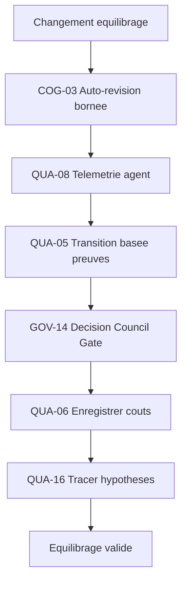

### Flux minimal

1. Définir l'objectif d'équilibrage et les hypothèses associées (QUA-16).
2. Simuler ou collecter la télémétrie sur la situation actuelle (QUA-08).
3. Proposer des ajustements via une auto-révision bornée (COG-03).
4. Mesurer l'impact par simulation ou A/B et vérifier la non-régression (QUA-05).
5. Arbitrer les changements majeurs en conseil de décision (GOV-14).
6. Versionner la feuille de balance et relier le coût des essais (QUA-06).

### Variantes

| Variante | Usage |
| --- | --- |
| Simulation | Boucle de simulation hors-ligne avant tout changement live. |
| Télémétrie | Décisions basées sur les métriques de joueurs réels. |
| A/B | Comparaison de variantes sur cohortes avec seuils de décision. |

### Recommandations d'exécution

| Aspect | Recommandation |
| --- | --- |
| Palier modèle | Standard — équilibrage nécessite analyse de données complexes et ajustements itératifs. |
| Taille de contexte | Moyen — analyse d'une économie ou d'un système de combat avec ses interdépendances. |
| Niveau de réflexion | Haut — arbitrer entre métriques contradictoires et prédire impacts sur la méta du jeu. |
| Format d'artefact | Tables CSV de balance, graphes de progression, JSON de modifications, rapports de simulation. |

### Patterns socle requis

| Pattern | Rôle dans la mission |
| --- | --- |
| COG-03 Auto-révision bornée | Itérer les paramètres dans un budget explicite. |
| QUA-08 Agent telemetry plane | Mesurer l'impact réel des changements. |
| QUA-05 Evidence-driven transition | N'appliquer un changement que prouvé non régressif. |
| GOV-14 Decision Council Gate | Arbitrer les changements à fort impact. |
| QUA-06 LLM cost registry | Relier coût des essais et des simulations. |
| QUA-16 Assumption ledger | Tracer les hypothèses d'équilibrage. |

### Critères de validation

| Critère | Preuve attendue |
| --- | --- |
| Impact mesuré | Simulation ou télémétrie avant/après le changement. |
| Non-régression | Aucun exploit ni blocage nouveau introduit. |
| Versionnage | Feuille de balance versionnée avec justification. |
| Arbitrage | Changements majeurs validés par le conseil. |

### Erreurs fréquentes

| Erreur | Correction |
| --- | --- |
| Modifier les chiffres sans mesurer l'impact. | Simuler ou mesurer avant/après (QUA-08, QUA-05). |
| Itérer sans fin sur l'équilibrage. | Borner les itérations (COG-03). |
| Laisser les feuilles de balance non versionnées. | Versionner et justifier chaque changement. |
| Décider seul un rééquilibrage majeur. | Passer par le conseil de décision (GOV-14). |

### Exemple

Rééquilibrage économie "Galactic Trade" : 12 ressources, 47 recettes. COG-03 propose 8 ajustements en 3 itérations. QUA-08 trace 2 147 simulations. GOV-14 bloque 2 ajustements risqués (inflation > 15%). QUA-05 valide transition avec 94% confidence. QUA-16 documente 18 hypothèses d'impact PvP. Coût total $63,40, durée 2h12min.

## UC-11 : Playtest agentique gouverné

| Élément | Description |
| --- | --- |
| Nature | Use-case optionnel — niveau mission. |
| Intention | Faire jouer des agents pour produire des preuves de jouabilité : atteignabilité, soft-locks, courbe de difficulté et friction UX. |
| Problème | Les blocages de progression, soft-locks et problèmes de fun sont détectés tard, par des humains, de façon non reproductible. |
| Solution | Des agents de playtest jouent des parcours dans un bac à sable borné, capturent des preuves visuelles et d'état, journalisent la trajectoire et escaladent les blocages. |
| Contrôles | Browser/sim evidence contract, visual evidence pack, trajectory logging, tool blast-radius limiter, evidence pack. |
| Anti-pattern | Conclure « le jeu est jouable » sur un run manuel non tracé. |

### Contexte d'utilisation

| Utiliser quand | Éviter quand |
| --- | --- |
| Les parcours de jeu peuvent être joués automatiquement. | Le jeu repose sur une appréciation purement subjective non mesurable. |
| On veut détecter tôt soft-locks et blocages de progression. | Le contenu n'est pas encore jouable. |
| On veut des preuves reproductibles de jouabilité. | Un seul test manuel suffit au stade actuel. |

### Structure

| Rôle | Responsabilité |
| --- | --- |
| Agent de playtest | Joue des parcours définis dans un bac à sable borné. |
| Collecteur de preuves | Capture captures, état et événements de la session. |
| Analyste de jouabilité | Mesure atteignabilité, difficulté et friction. |
| Escalade | Remonte les blocages non contournables. |

### Schéma

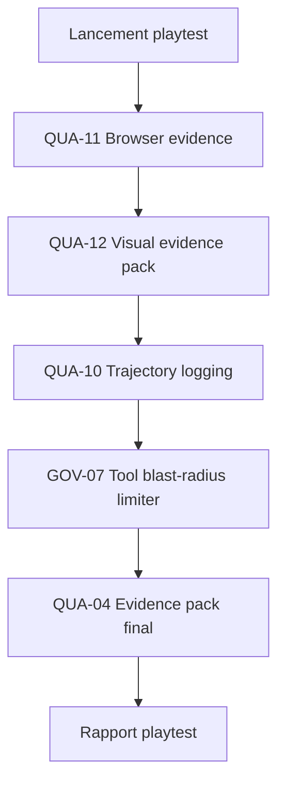

### Flux minimal

1. Définir les parcours et critères de jouabilité à couvrir.
2. Faire jouer les agents dans un bac à sable aux actions bornées (GOV-07).
3. Capturer preuves d'état et preuves visuelles (QUA-11, QUA-12).
4. Journaliser la trajectoire intention → action → observation (QUA-10).
5. Produire un evidence pack de jouabilité avec verdict (QUA-04).
6. Escalader les soft-locks et blocages non contournables (GOV-15).

### Variantes

| Variante | Usage |
| --- | --- |
| Exploration | Agents qui maximisent la couverture des états atteignables. |
| Scénario | Parcours scriptés vérifiant des objectifs précis. |
| Stress | Agents adverses cherchant exploits et états de rupture. |

### Recommandations d'exécution

| Aspect | Recommandation |
| --- | --- |
| Palier modèle | Standard — exécution de scénarios de jeu et collecte de preuves visuelles et comportementales. |
| Taille de contexte | Moyen — un niveau ou une feature isolée avec ses objectifs de test définis. |
| Niveau de réflexion | Moyen — suivre un plan de test, identifier bugs et problèmes d'UX, documenter observations. |
| Format d'artefact | Screenshots PNG, vidéos MP4, logs JSON, rapports Markdown, trajectoires de décision. |

### Patterns socle requis

| Pattern | Rôle dans la mission |
| --- | --- |
| QUA-11 Browser evidence contract | Capturer l'état observable de la session de jeu. |
| QUA-12 Visual Evidence Pack | Fournir captures et preuves UX. |
| QUA-10 Trajectory logging | Rejouer le parcours qui a mené au blocage. |
| GOV-07 Tool blast-radius limiter | Borner les actions de l'agent au bac à sable. |
| QUA-04 Evidence pack et verification verdict | Conclure la jouabilité par preuve. |

### Critères de validation

| Critère | Preuve attendue |
| --- | --- |
| Atteignabilité | Objectifs et zones critiques effectivement atteints. |
| Absence de soft-lock | Aucun état bloquant non documenté. |
| Difficulté | Courbe mesurée et comparée à l'intention de design. |
| Reproductibilité | Trajectoire journalisée et rejouable. |

### Erreurs fréquentes

| Erreur | Correction |
| --- | --- |
| Valider la jouabilité sur un run manuel unique. | Produire des preuves reproductibles (QUA-04, QUA-10). |
| Laisser l'agent agir sans bornes. | Limiter le blast-radius au bac à sable (GOV-07). |
| Ignorer les soft-locks rares. | Capturer et escalader chaque blocage (GOV-15). |
| Mesurer la difficulté au ressenti. | Mesurer la courbe sur des trajectoires tracées. |

### Exemple

Playtest agentique du tutoriel "Fortress Defense" (12min de gameplay). QUA-11 capture 847 interactions UI. QUA-12 produit 23 screenshots annotés (dont 4 bugs visuels). QUA-10 enregistre 1 203 décisions d'agent. GOV-07 limite actions à la sandbox de test. QUA-04 génère rapport final 8 pages, 6 bugs critiques détectés. Durée : 38min, coût $14,60.

## UC-12 : Pipeline d'assets gouverné

| Élément | Description |
| --- | --- |
| Nature | Use-case optionnel. |
| Intention | Importer, optimiser et valider les assets (modèles, textures, audio) via une gate : formats, budgets, naming, références et orphelins. |
| Problème | Des références cassées, des budgets dépassés, des conventions de nommage violées et des assets orphelins polluent le projet et cassent le build. |
| Solution | Faire un dry-run d'import, valider par contrat et guardrail de budget, gouverner la sortie runtime, et produire un evidence pack du lot. |
| Contrôles | Dry-run, output contract validator, guardrail contract, runtime output governance, evidence pack. |
| Anti-pattern | Importer des assets directement dans le projet sans gate de validation. |

### Contexte d'utilisation

| Utiliser quand | Éviter quand |
| --- | --- |
| Les assets entrent en volume et doivent respecter des budgets. | Un prototype où la performance et le nommage n'importent pas encore. |
| Les conventions de nommage et de référence comptent. | Un asset unique importé une fois à la main. |
| Le build dépend de l'intégrité des références. | Aucune contrainte de budget ni de pipeline n'existe. |

### Structure

| Rôle | Responsabilité |
| --- | --- |
| Importeur | Prépare et normalise l'asset entrant. |
| Valideur de budget | Vérifie polycount, textures, formats et naming. |
| Gate d'intégration | Refuse ou accepte le lot après dry-run et preuve. |

### Schéma

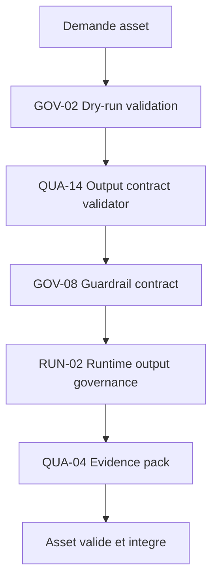

### Flux minimal

1. Faire un dry-run d'import du lot d'assets (GOV-02).
2. Valider formats, budgets et naming contre le contrat (QUA-14).
3. Appliquer le guardrail de budget et détecter les dépassements (GOV-08).
4. Gouverner la sortie runtime des assets intégrés (RUN-02).
5. Détecter références cassées et orphelins.
6. Produire un evidence pack du lot avec verdict (QUA-04).

### Variantes

| Variante | Usage |
| --- | --- |
| Strict | Rejet automatique de tout asset hors budget. |
| Tolérant | Avertissement et exception documentée pour cas justifiés. |
| Batch | Validation de gros lots avec rapport agrégé. |

### Recommandations d'exécution

| Aspect | Recommandation |
| --- | --- |
| Palier modèle | Standard — génération et validation d'assets nécessitent respect strict des contraintes techniques. |
| Taille de contexte | Court — un asset individuel avec son spec technique (triangle count, texture res, format). |
| Niveau de réflexion | Moyen — composer l'asset dans les contraintes et valider conformité aux pipelines. |
| Format d'artefact | glTF, FBX, PNG/EXR, .shadergraph, .mat, UV maps, LOD chains, navmesh. |

### Patterns socle requis

| Pattern | Rôle dans le use-case |
| --- | --- |
| GOV-02 Dry-run avant action risquée | Simuler l'import avant intégration. |
| QUA-14 Output contract validator | Valider formats, budgets et naming. |
| GOV-08 Guardrail contract | Imposer les budgets d'assets. |
| RUN-02 Runtime output governance | Gouverner la sortie runtime des assets. |
| QUA-04 Evidence pack et verification verdict | Prouver la conformité du lot. |

### Critères de validation

| Critère | Preuve attendue |
| --- | --- |
| Budgets | Polycount, textures et tailles dans les limites ou exception justifiée. |
| Intégrité | Aucune référence cassée ni orphelin non documenté. |
| Conventions | Naming et formats conformes au contrat. |
| Intégration | Dry-run réussi et evidence pack disponible. |

### Erreurs fréquentes

| Erreur | Correction |
| --- | --- |
| Importer sans vérifier les budgets. | Appliquer le guardrail de budget (GOV-08). |
| Laisser des références cassées entrer en build. | Détecter refs et orphelins avant merge. |
| Ignorer les conventions de nommage. | Valider le naming par contrat (QUA-14). |
| Intégrer sans trace de validation. | Produire un evidence pack du lot (QUA-04). |

### Exemple

Pipeline pour 64 props d'environnement "Cyberpunk Alley". GOV-02 simule génération, détecte 7 violations (tri count > 5K). QUA-14 valide formats glTF et textures 2K. GOV-08 applique contraintes de nomenclature. RUN-02 vérifie intégration Unity. QUA-04 certifie 57/64 assets (89%). Rejet automatique de 7 models. Durée totale : 1h47min, coût $31,20.

## UC-13 : Harnais de simulation déterministe

| Élément | Description |
| --- | --- |
| Nature | Use-case optionnel — enabler technique. |
| Intention | Exécuter la simulation de façon rejouable (seed, pas de temps fixe, hash d'état) pour des tests reproductibles et la résolution de bugs. |
| Problème | Le multijoueur désynchronise, des bugs ne se reproduisent pas, et un replay casse après un patch. |
| Solution | Fixer seed et pas de temps, rendre les actions idempotentes, journaliser la trajectoire, hasher l'état et rejouer pour vérifier la non-régression. |
| Contrôles | Idempotent tool action, trajectory logging, evidence pack, evidence-driven transition. |
| Anti-pattern | Tester la simulation en temps réel avec des entrées non enregistrées. |

### Contexte d'utilisation

| Utiliser quand | Éviter quand |
| --- | --- |
| La simulation doit être reproductible (multijoueur, replays, tests). | Une scène purement cosmétique sans logique simulée. |
| On veut rejouer un bug ou une partie à l'identique. | Le non-déterminisme est acceptable et sans impact. |
| Les régressions de gameplay doivent être détectées automatiquement. | Aucun test de régression n'est prévu. |

### Structure

| Rôle | Responsabilité |
| --- | --- |
| Ordonnanceur déterministe | Impose seed et pas de temps fixe. |
| Enregistreur d'entrées | Capture les entrées pour rejeu exact. |
| Hacheur d'état | Produit un hash d'état comparable entre exécutions. |
| Comparateur de replay | Détecte les divergences entre deux exécutions. |

### Schéma

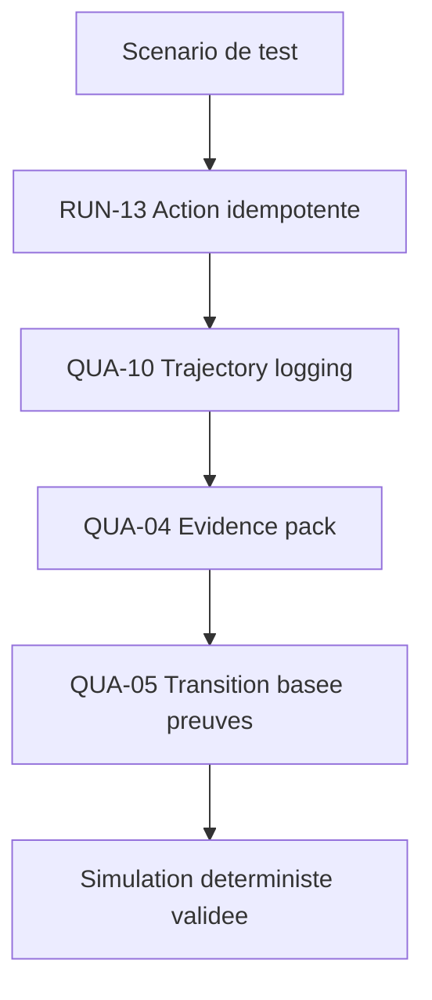

### Flux minimal

1. Initialiser la simulation avec un seed et un pas de temps fixes.
2. Enregistrer les entrées et rendre les actions idempotentes (RUN-13).
3. Journaliser la trajectoire intention → action → observation (QUA-10).
4. Hasher l'état à intervalles déterminés.
5. Rejouer la trajectoire et comparer les hashes (QUA-04).
6. Bloquer la transition si le replay diverge après changement (QUA-05).

### Variantes

| Variante | Usage |
| --- | --- |
| Lockstep | Déterminisme requis pour la synchronisation multijoueur. |
| Replay | Rejeu de parties enregistrées pour debug et anti-triche. |
| Régression | Suite de replays comparés à chaque build. |

### Recommandations d'exécution

| Aspect | Recommandation |
| --- | --- |
| Palier modèle | Économique — exécution déterministe de scénarios prédéfinis avec validation stricte des outputs. |
| Taille de contexte | Court — un scénario de test isolé avec conditions initiales et résultats attendus. |
| Niveau de réflexion | Bas — exécuter le test, valider conformité, enregistrer preuves sans improvisation. |
| Format d'artefact | JSON de résultats, logs de trajectoire, snapshots d'état, profils de performance, frame data. |

### Patterns socle requis

| Pattern | Rôle dans le use-case |
| --- | --- |
| RUN-13 Idempotent tool action | Garantir des actions rejouables sans effet de bord divergent. |
| QUA-10 Trajectory logging | Enregistrer la trajectoire pour rejeu exact. |
| QUA-04 Evidence pack et verification verdict | Prouver la reproductibilité par comparaison de hashes. |
| QUA-05 Evidence-driven transition | Bloquer un changement qui casse le déterminisme. |

### Critères de validation

| Critère | Preuve attendue |
| --- | --- |
| Reproductibilité | Deux exécutions du même seed produisent le même hash d'état. |
| Rejeu | Une partie enregistrée se rejoue à l'identique. |
| Non-régression | Les replays passent après un changement, ou la divergence est expliquée. |
| Traçabilité | Trajectoire et hashes journalisés. |

### Erreurs fréquentes

| Erreur | Correction |
| --- | --- |
| Utiliser le temps réel dans la logique de simulation. | Imposer un pas de temps fixe. |
| Laisser des actions à effet de bord non rejouables. | Rendre les actions idempotentes (RUN-13). |
| Comparer les replays visuellement. | Comparer des hashes d'état (QUA-04). |
| Ignorer une divergence après patch. | Bloquer la transition et investiguer (QUA-05). |

### Exemple

Harnais de simulation "Combat AI" : 230 scénarios déterministes. RUN-13 garantit idempotence (seed fixe, même input = même output). QUA-10 capture 12 407 décisions d'IA. QUA-04 produit evidence packs pour chaque scénario. QUA-05 valide 227/230 (98,7%). 3 échecs reproductibles identifiés. Durée : 4h22min, coût $8,15 (modèle Économique).

## UC-14 : Authoring de comportements de jeu gouverné

| Élément | Description |
| --- | --- |
| Nature | Use-case optionnel — tâche ou mission selon l'ampleur. |
| Intention | Produire l'IA de jeu (behavior trees, FSM, utility AI) conforme à l'intention de design et vérifiée sur harnais déterministe. |
| Problème | L'IA se comporte de façon dégénérée, le pathfinding casse, et le comportement non déterministe n'est pas testable. |
| Solution | Décomposer le comportement attendu, sélectionner la compétence d'authoring adaptée, valider par contrat et tests déterministes, et borner par guardrail. |
| Contrôles | Décomposition d'objectif, sélecteur de compétence, output contract validator, guardrail contract, evidence pack ; s'appuie sur UC-13 pour la vérification déterministe. |
| Anti-pattern | Écrire l'IA sans tests reproductibles ni critères de comportement. |

### Contexte d'utilisation

| Utiliser quand | Éviter quand |
| --- | --- |
| Les comportements (NPC, ennemis, alliés) doivent être prévisibles et testables. | Une IA scriptée triviale sans risque de dégénérescence. |
| Le comportement doit être vérifié sur un harnais déterministe. | Aucun moyen de tester le comportement n'existe. |
| L'intention de design fixe des critères de comportement clairs. | Le comportement attendu n'est pas spécifié. |

### Structure

| Rôle | Responsabilité |
| --- | --- |
| Décomposeur de comportement | Découpe l'intention en états et transitions vérifiables. |
| Sélecteur d'approche | Choisit behavior tree, FSM ou utility selon le besoin. |
| Auteur borné | Produit la structure de comportement dans les limites du guardrail. |
| Vérificateur déterministe | Teste le comportement sur le harnais (UC-13). |

### Schéma

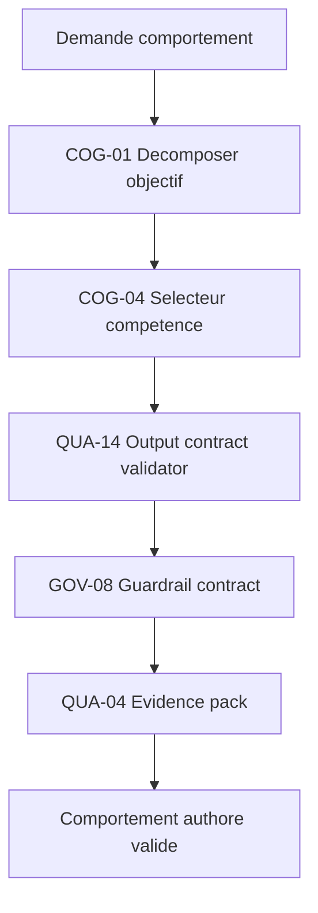

### Flux minimal

1. Décomposer l'intention de comportement en états et transitions (COG-01).
2. Sélectionner l'approche d'authoring adaptée (COG-04).
3. Produire la structure de comportement dans les bornes du guardrail (GOV-08).
4. Valider la structure contre son contrat (QUA-14).
5. Tester le comportement sur le harnais déterministe (UC-13).
6. Produire un evidence pack des comportements et de leurs tests (QUA-04).

### Variantes

| Variante | Usage |
| --- | --- |
| Behavior tree | Comportements modulaires et réutilisables. |
| FSM | Automates d'états simples et lisibles. |
| Utility | Décision par score d'utilité pour comportements nuancés. |

### Recommandations d'exécution

| Aspect | Recommandation |
| --- | --- |
| Palier modèle | Standard — authoring de comportements d'IA ou de dialogues nécessite logique structurée. |
| Taille de contexte | Moyen — un comportement complet avec états, transitions, conditions et actions. |
| Niveau de réflexion | Moyen — composer logique de comportement cohérente avec les systèmes du jeu. |
| Format d'artefact | Behaviour trees JSON, FSM YAML, dialogues Ink/Yarn, animation state machines, quest scripts. |

### Patterns socle requis

| Pattern | Rôle dans le use-case |
| --- | --- |
| COG-01 Décomposition d'objectif | Découper le comportement en unités vérifiables. |
| COG-04 Sélecteur de compétence | Choisir l'approche d'authoring adaptée. |
| QUA-14 Output contract validator | Valider la structure de comportement. |
| GOV-08 Guardrail contract | Borner les comportements autorisés. |
| QUA-04 Evidence pack et verification verdict | Prouver la conformité par tests. |

### Critères de validation

| Critère | Preuve attendue |
| --- | --- |
| Conformité | Comportement conforme à l'intention de design. |
| Déterminisme | Comportement reproductible sur le harnais (UC-13). |
| Robustesse | Pas de dégénérescence (boucles, immobilité, pathfinding cassé). |
| Traçabilité | Tests de comportement reliés à un evidence pack. |

### Erreurs fréquentes

| Erreur | Correction |
| --- | --- |
| Écrire l'IA sans critères de comportement. | Décomposer l'intention en états vérifiables (COG-01). |
| Tester l'IA en conditions non reproductibles. | Vérifier sur le harnais déterministe (UC-13). |
| Laisser des comportements non bornés. | Imposer un guardrail (GOV-08). |
| Valider l'IA à l'œil. | Produire un evidence pack de tests (QUA-04). |

### Exemple

Authoring de 18 comportements d'ennemis "Dungeon Crawler". COG-01 décompose par archétype (melee, ranged, caster). COG-04 sélectionne compétences adaptées (pathfinding, combat, fuite). QUA-14 valide structure de behaviour tree. GOV-08 vérifie contraintes de performance (max 50 nodes). QUA-04 certifie 17/18. 1 comportement trop complexe rejeté. Durée : 1h33min, coût $22,80.

## UC-15 : Build et certification gouvernés

| Élément | Description |
| --- | --- |
| Nature | Use-case optionnel — niveau mission. |
| Intention | Piloter le build de jalon, la certification plateforme (TRC/XR/Lotcheck) et la classification d'âge (ESRB/PEGI/IARC) comme des transitions pilotées par preuve. |
| Problème | La certification échoue tard, le rating est erroné, du contenu non déclaré passe, ou le build n'est pas reproductible ; un jalon est déclaré atteint sans preuve. |
| Solution | Dérouler les checklists de certification en dry-run, scanner le contenu contre le rating, exiger un build reproductible et tagué, ne franchir un jalon que par transition pilotée par preuve, et prévoir le rollback du day-one patch. |
| Contrôles | Evidence-driven transition, evidence pack, policy by environment, dry-run, compensation/rollback, remote hygiene guard. |
| Anti-pattern | Soumettre à la certification sans cert dry-run ni preuve de build reproductible. |

### Contexte d'utilisation

| Utiliser quand | Éviter quand |
| --- | --- |
| Le jeu cible des plateformes avec certification et rating. | Un build interne sans soumission externe. |
| Les jalons doivent être franchis sur preuve, pas sur déclaration. | Un prototype sans notion de jalon formel. |
| Le build doit être reproductible et tracé. | Aucune contrainte de reproductibilité n'existe. |

### Structure

| Rôle | Responsabilité |
| --- | --- |
| Pilote de build | Produit un build reproductible et tagué. |
| Vérificateur de certification | Déroule les checklists plateforme en dry-run. |
| Scanner de rating | Vérifie le contenu contre la classification déclarée. |
| Validation authority | Autorise la soumission sur preuve. |

### Schéma

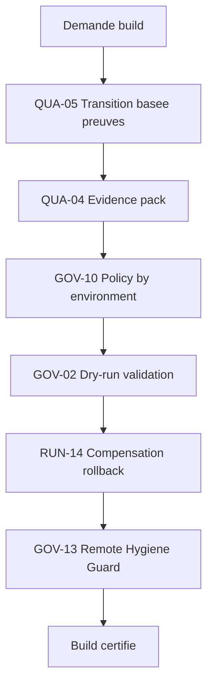

### Flux minimal

1. Produire un build reproductible et tagué selon l'environnement (GOV-10).
2. Dérouler les checklists de certification en dry-run (GOV-02).
3. Scanner le contenu contre le rating déclaré et vérifier les sources distantes (GOV-13).
4. Rassembler les preuves de jalon, de cert et de rating (QUA-04).
5. Ne franchir le jalon que par transition pilotée par preuve (QUA-05).
6. Préparer le rollback ou la compensation du day-one patch (RUN-14).

### Variantes

| Variante | Usage |
| --- | --- |
| Jalon | Transition alpha/beta/gold prouvée par evidence pack. |
| Certification | Cert dry-run plateforme avant soumission. |
| Rating | Scan de contenu contre ESRB/PEGI/IARC avec déclaration. |

### Recommandations d'exécution

| Aspect | Recommandation |
| --- | --- |
| Palier modèle | Économique — validation de builds suit des checklist strictes sans ambiguïté créative. |
| Taille de contexte | Large — build complet avec tous assets, scripts, configs et dépendances. |
| Niveau de réflexion | Bas — exécuter pipeline de certification, valider critères, produire rapport. |
| Format d'artefact | Binaires de build, manifests JSON, rapports de certification, checksums, logs de pipeline. |

### Patterns socle requis

| Pattern | Rôle dans la mission |
| --- | --- |
| QUA-05 Evidence-driven transition | Franchir un jalon ou soumettre seulement sur preuve. |
| QUA-04 Evidence pack et verification verdict | Rassembler les preuves de cert, rating et build. |
| GOV-10 Policy by environment | Adapter le build et les politiques par environnement. |
| GOV-02 Dry-run avant action risquée | Simuler la certification avant soumission. |
| RUN-14 Compensation / rollback action | Prévoir le rollback du day-one patch. |
| GOV-13 Remote Hygiene Guard | Garantir des sources et dépendances saines. |

### Critères de validation

| Critère | Preuve attendue |
| --- | --- |
| Reproductibilité | Build tagué et rejouable depuis une source identifiée. |
| Certification | Cert dry-run vert avant soumission. |
| Rating | Contenu conforme à la classification déclarée. |
| Jalon | Transition de jalon prouvée par evidence pack. |

### Erreurs fréquentes

| Erreur | Correction |
| --- | --- |
| Soumettre sans cert dry-run. | Dérouler les checklists en dry-run (GOV-02). |
| Déclarer un rating sans scanner le contenu. | Scanner le contenu contre le rating (GOV-13, QUA-04). |
| Livrer un build non reproductible. | Tagger et reproduire le build (GOV-10). |
| Franchir un jalon sur déclaration. | Exiger une transition pilotée par preuve (QUA-05). |

### Exemple

Certification build "v2.4.1 Console" : 12,4 GB, 47 238 fichiers. QUA-05 valide transitions de version (breaking changes détectés). GOV-10 applique policy console (ESRB, TCR Sony). GOV-02 simule déploiement. RUN-14 teste rollback en 3min12s. GOV-13 vérifie hygiene (0 secrets exposés). Build certifié en 47min, coût $5,60.

## UC-16 : Live ops et télémétrie gouvernés

| Élément | Description |
| --- | --- |
| Nature | Use-case optionnel — niveau mission. |
| Intention | Décider patchs, saisons, hotfixes et ajustements live à partir de la télémétrie, avec déploiement progressif et rollback. |
| Problème | Un patch régressif dégrade l'expérience, le serveur s'effondre, l'économie subit un backlash, ou des mécaniques deviennent non conformes ; les décisions sont prises à l'aveugle. |
| Solution | Décider sur télémétrie, déployer en canary ou staged, prouver chaque transition, rendre tout patch rejouable ou compensable, et classifier puis récupérer les incidents. |
| Contrôles | Agent telemetry plane, evidence-driven transition, policy by environment, compensation/rollback, recovery policy, cost registry. |
| Anti-pattern | Pousser un patch à tous les joueurs sans canary ni métriques de décision. |

### Contexte d'utilisation

| Utiliser quand | Éviter quand |
| --- | --- |
| Le jeu est en service et reçoit patchs, saisons et hotfixes. | Un jeu solo livré une fois sans service en ligne. |
| Les décisions live doivent s'appuyer sur des données. | Aucune télémétrie n'est disponible. |
| Les déploiements doivent être progressifs et réversibles. | Aucune capacité de canary ni de rollback n'existe. |

### Structure

| Rôle | Responsabilité |
| --- | --- |
| Analyste de télémétrie | Transforme les métriques en décisions sourcées. |
| Pilote de déploiement | Déploie en canary ou staged et surveille. |
| Gestionnaire d'incident | Classifie et applique la politique de récupération. |
| Validation authority | Autorise les changements live à fort impact. |

### Schéma

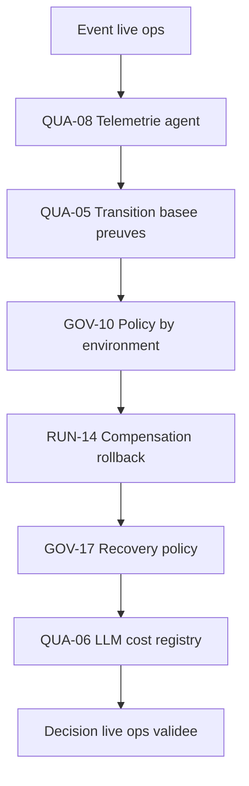

### Flux minimal

1. Collecter et analyser la télémétrie live (QUA-08).
2. Proposer une décision sourcée par les métriques.
3. Déployer en canary ou staged selon l'environnement (GOV-10).
4. Ne généraliser que sur transition prouvée non régressive (QUA-05).
5. Rendre tout patch rejouable ou compensable (RUN-14).
6. Classifier les incidents et appliquer la politique de récupération (GOV-17).

### Variantes

| Variante | Usage |
| --- | --- |
| Canary | Déploiement à une fraction des joueurs avant généralisation. |
| Saison | Cycle de contenu live avec décisions guidées par les données. |
| Hotfix | Correctif rapide avec rollback préparé. |

### Recommandations d'exécution

| Aspect | Recommandation |
| --- | --- |
| Palier modèle | Standard — décisions live ops nécessitent analyse de télémétrie et arbitrage business. |
| Taille de contexte | Large — télémétrie de milliers de joueurs, métriques économiques, signaux de churn. |
| Niveau de réflexion | Haut — arbitrer entre métriques contradictoires (engagement vs monétisation vs santé éco). |
| Format d'artefact | Dashboards JSON, rapports de décision, configs d'événements, A/B test results, alertes. |

### Patterns socle requis

| Pattern | Rôle dans la mission |
| --- | --- |
| QUA-08 Agent telemetry plane | Fonder les décisions live sur des données. |
| QUA-05 Evidence-driven transition | Généraliser un patch seulement sur preuve. |
| GOV-10 Policy by environment | Adapter le déploiement par environnement et cohorte. |
| RUN-14 Compensation / rollback action | Annuler ou compenser un patch régressif. |
| GOV-17 Recovery policy | Classifier et récupérer les incidents live. |
| QUA-06 LLM cost registry | Relier coût des analyses et des décisions. |

### Critères de validation

| Critère | Preuve attendue |
| --- | --- |
| Décision sourcée | Chaque changement live relié à une métrique ou un test. |
| Déploiement progressif | Canary ou staged avant généralisation. |
| Réversibilité | Rollback ou compensation disponible et testé. |
| Récupération | Incidents classifiés et traités selon politique. |

### Erreurs fréquentes

| Erreur | Correction |
| --- | --- |
| Décider un changement live au ressenti. | Fonder la décision sur la télémétrie (QUA-08). |
| Déployer un patch à 100 % d'emblée. | Déployer en canary ou staged (GOV-10). |
| Pousser un patch sans plan de retour. | Préparer rollback ou compensation (RUN-14). |
| Gérer les incidents au cas par cas. | Appliquer une politique de récupération (GOV-17). |

### Exemple

Event "Double XP Weekend" : 47 000 joueurs actifs, télémétrie temps réel. QUA-08 détecte spike de progression (+340%). GOV-10 applique policy production (rollback < 5min). QUA-05 valide impact économique acceptable. À 18h32, bug détecté (XP x8 au lieu de x2). RUN-14 rollback en 2min41s. GOV-17 applique recovery (compensation 500 gems). QUA-06 enregistre coût incident : $127,50. Incident résolu en 11min.

## UC-17 : Production d'art 3D gouvernée

| Élément | Description |
| --- | --- |
| Nature | Use-case optionnel — niveau mission. |
| Intention | Produire des assets 3D (modeling, retopo, UV, export) conformes à la bible artistique, aux budgets techniques et aux conventions du moteur. |
| Problème | La production d'art libre déborde les budgets de polygones, casse les conventions de nommage et d'échelle, et livre des assets non importables ou hors style. |
| Solution | Décomposer la commande d'asset, produire dans une factory bornée, valider chaque livrable contre un contrat technique et stylistique, simuler l'import avant intégration et prouver la conformité par capture visuelle. |
| Contrôles | Décomposition d'objectif, factory contrôlée, guardrail contract, output contract validator, dry-run, visual evidence pack, evidence pack. |
| Anti-pattern | Modéliser librement puis pousser l'asset dans le dépôt sans budget, sans convention ni revue visuelle. |

### Contexte d'utilisation

| Utiliser quand | Éviter quand |
| --- | --- |
| Le volume d'assets 3D est élevé et doit rester cohérent avec une direction artistique. | Un asset unique de prototype jetable sans contrainte d'intégration. |
| Les budgets techniques (polycount, texels, LOD) sont définis et opposables. | Aucune bible artistique ni budget technique n'existe encore. |
| Les assets doivent passer une gate avant merge dans le projet. | L'exploration de style libre sans intégration au moteur. |

### Structure

| Rôle | Responsabilité |
| --- | --- |
| Décomposeur de commande | Découpe la commande (set, prop, personnage) en livrables vérifiables. |
| Modeleur borné | Produit le mesh dans les limites de budget et de style. |
| Vérificateur technique | Contrôle topologie, UV, échelle, nommage et formats d'export. |
| Vérificateur stylistique | Confronte le rendu à la bible artistique par capture. |
| Gate d'intégration | Refuse ou accepte l'asset après dry-run d'import et preuve. |

### Schéma

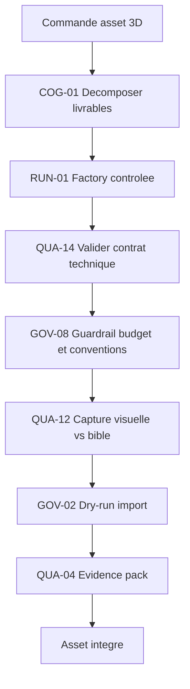

### Flux minimal

1. Décomposer la commande en livrables d'asset vérifiables (COG-01).
2. Produire chaque mesh dans la factory bornée, au budget fixé (RUN-01).
3. Valider topologie, UV, échelle et format d'export contre le contrat (QUA-14).
4. Appliquer les conventions de nommage et de budget par garde-fou (GOV-08).
5. Capturer le rendu et le confronter à la bible artistique (QUA-12).
6. Simuler l'import puis produire l'evidence pack du lot (GOV-02, QUA-04).

### Variantes

| Variante | Usage |
| --- | --- |
| Props et décor | Set dressing à fort volume, budgets serrés, instanciation. |
| Personnages | Topologie d'animation, contrainte de skinning en aval (UC-20). |
| Photogrammétrie / scan | Nettoyage et retopo d'assets capturés à fort polycount. |

### Recommandations d'exécution

| Aspect | Recommandation |
| --- | --- |
| Palier modèle | Standard — composition d'asset sous contraintes ; Frontier seulement pour le design de style ouvert. |
| Taille de contexte | Moyen — un set ou un personnage avec sa fiche de style et ses budgets. |
| Niveau de réflexion | Moyen — planifier les livrables et arbitrer topologie vs budget. |
| Format d'artefact | glTF/FBX, USD, OBJ ; UV maps ; chaînes de LOD ; fiche de budget polycount. |

### Patterns socle requis

| Pattern | Rôle dans la mission |
| --- | --- |
| COG-01 Décomposition d'objectif | Découper la commande en livrables vérifiables. |
| RUN-01 Dynamic factory contrôlée | Produire les meshes dans des bornes gouvernées. |
| QUA-14 Output contract validator | Valider topologie, UV, échelle et format. |
| GOV-08 Guardrail contract | Imposer budgets, nommage et conventions d'export. |
| QUA-12 Visual Evidence Pack | Prouver la conformité stylistique par capture. |
| GOV-02 Dry-run avant action risquée | Simuler l'import avant merge. |
| QUA-04 Evidence pack et verification verdict | Prouver la conformité du lot d'assets. |

### Critères de validation

| Critère | Preuve attendue |
| --- | --- |
| Budget respecté | Polycount, nombre de matériaux et taille texture sous plafond. |
| Conformité technique | UV non chevauchantes, échelle correcte, nommage conforme. |
| Importabilité | Dry-run d'import réussi sans erreur ni référence cassée. |
| Conformité stylistique | Capture validée contre la bible artistique. |

### Erreurs fréquentes

| Erreur | Correction |
| --- | --- |
| Modéliser sans budget de polygones. | Imposer un plafond par garde-fou (GOV-08). |
| Exporter sans valider UV ni échelle. | Valider contre le contrat technique (QUA-14). |
| Juger le style « à l'œil » sans trace. | Capturer et comparer à la bible (QUA-12). |
| Pousser l'asset sans test d'import. | Faire un dry-run d'import (GOV-02). |

### Exemple

Set « Marché médiéval » : 38 props commandés. COG-01 découpe en 6 lots. RUN-01 produit les meshes au budget 3 000 tris/prop. QUA-14 rejette 5 props (UV chevauchantes ou échelle x100). GOV-08 corrige 11 noms hors convention (`SM_Market_*`). QUA-12 capture 38 rendus, 2 refusés (hors palette). GOV-02 détecte 1 texture manquante. Lot final : 35/38 acceptés, budget moyen 2 740 tris. Durée 2h05, palier Standard.

## UC-18 : Matériaux et shaders gouvernés

| Élément | Description |
| --- | --- |
| Nature | Use-case optionnel — niveau mission. |
| Intention | Produire matériaux PBR et shaders conformes à un budget GPU, déclinés par plateforme, et fidèles à la direction artistique. |
| Problème | Un shader non profilé explose le coût GPU, casse sur une plateforme cible ou diverge du rendu attendu, et n'est découvert qu'en fin de production. |
| Solution | Spécifier un budget d'instructions et de variantes, valider chaque shader contre ce contrat, profiler le coût par plateforme, décliner par politique d'environnement et prouver le rendu par capture. |
| Contrôles | Output contract validator, guardrail contract, agent telemetry plane, policy by environment, visual evidence pack, evidence pack. |
| Anti-pattern | Empiler des nœuds de shader-graph jusqu'à « ça rend bien » sans mesurer le coût ni tester les plateformes. |

### Contexte d'utilisation

| Utiliser quand | Éviter quand |
| --- | --- |
| Le rendu cible plusieurs plateformes aux capacités GPU différentes. | Un prototype mono-plateforme sans contrainte de perf. |
| Les budgets de shader (instructions, variantes, samplers) sont définis. | Aucune cible de performance n'est fixée. |
| Le rendu doit rester fidèle à une direction artistique opposable. | Tests de matériaux jetables hors production. |

### Structure

| Rôle | Responsabilité |
| --- | --- |
| Spécificateur de budget | Fixe instructions max, variantes et samplers par plateforme. |
| Auteur de shader | Compose le graphe dans les bornes du budget. |
| Profileur GPU | Mesure le coût réel par plateforme cible. |
| Déclineur par plateforme | Adapte les variantes selon la politique d'environnement. |
| Vérificateur de rendu | Confronte le résultat à la référence artistique par capture. |

### Schéma

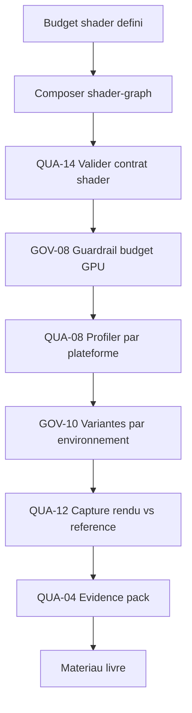

### Flux minimal

1. Spécifier le budget GPU (instructions, variantes, samplers) par plateforme (GOV-08).
2. Composer le shader-graph dans ces bornes.
3. Valider le shader contre son contrat (entrées, sorties, mots-clés) (QUA-14).
4. Profiler le coût réel sur chaque plateforme cible (QUA-08).
5. Décliner les variantes selon l'environnement et la cible (GOV-10).
6. Capturer le rendu, comparer à la référence et prouver (QUA-12, QUA-04).

### Variantes

| Variante | Usage |
| --- | --- |
| Shader maître + instances | Un graphe paramétré décliné en nombreuses instances de matériau. |
| Multi-plateforme | Variantes mobile/console/PC sous le même contrat de rendu. |
| Effet spécial | Shaders d'eau, de feuillage ou de dissolution à coût borné. |

### Recommandations d'exécution

| Aspect | Recommandation |
| --- | --- |
| Palier modèle | Standard — logique de graphe et arbitrage coût/rendu ; Économique pour la validation de contrat. |
| Taille de contexte | Moyen — un shader et ses variantes avec les cibles plateformes. |
| Niveau de réflexion | Moyen — composer le graphe et arbitrer entre fidélité et budget. |
| Format d'artefact | .shadergraph / nœuds matériau ; tables d'instructions ; profils GPU par plateforme. |

### Patterns socle requis

| Pattern | Rôle dans la mission |
| --- | --- |
| QUA-14 Output contract validator | Valider entrées, sorties et mots-clés du shader. |
| GOV-08 Guardrail contract | Imposer le budget d'instructions et de variantes. |
| QUA-08 Agent telemetry plane | Mesurer le coût GPU réel par plateforme. |
| GOV-10 Policy by environment | Décliner les variantes selon la cible. |
| QUA-12 Visual Evidence Pack | Prouver la fidélité du rendu par capture. |
| QUA-04 Evidence pack et verification verdict | Prouver la conformité du matériau livré. |

### Critères de validation

| Critère | Preuve attendue |
| --- | --- |
| Budget GPU respecté | Coût d'instructions sous plafond sur chaque plateforme. |
| Variantes maîtrisées | Nombre de variantes compilées sous la limite. |
| Portabilité | Rendu correct vérifié sur toutes les cibles. |
| Fidélité artistique | Capture validée contre la référence de direction. |

### Erreurs fréquentes

| Erreur | Correction |
| --- | --- |
| Empiler des nœuds sans mesurer le coût. | Profiler par plateforme (QUA-08). |
| Laisser exploser les variantes de shader. | Borner par garde-fou de budget (GOV-08). |
| Tester sur une seule plateforme. | Décliner et vérifier par environnement (GOV-10). |
| Valider le rendu sans trace. | Capturer et comparer à la référence (QUA-12). |

### Exemple

Shader d'eau maître pour mobile et console. Budget mobile : 180 instructions, 16 variantes. QUA-14 valide le contrat (entrées normalisées). QUA-08 mesure 214 instructions sur mobile : GOV-08 bloque le dépassement. Après simplification : 172 instructions, 11 variantes. GOV-10 active les reflets planaires seulement sur console. QUA-12 compare 6 captures à la référence : 6/6 validées. Coût GPU mobile −22 %. Palier Standard.

## UC-19 : VFX temps réel gouvernés

| Élément | Description |
| --- | --- |
| Nature | Use-case optionnel. |
| Intention | Produire des effets visuels temps réel (particules, simulations) dans des budgets d'overdraw et de fillrate, déterministes lorsqu'ils affectent le gameplay. |
| Problème | Un effet spectaculaire mais non budgété fait chuter le framerate, et un VFX non déterministe casse la reproductibilité d'un test ou d'un replay. |
| Solution | Borner le nombre de particules et l'overdraw, valider l'effet contre un contrat, rendre déterministes les effets liés au gameplay, profiler le coût et prouver le résultat par capture. |
| Contrôles | Guardrail contract, output contract validator, agent telemetry plane, idempotent tool action, visual evidence pack, evidence pack. |
| Anti-pattern | Multiplier les particules « pour le jus » sans budget ni profilage, sur des effets parfois liés à la logique de jeu. |

### Contexte d'utilisation

| Utiliser quand | Éviter quand |
| --- | --- |
| Les effets sont nombreux et concourent au budget de rendu. | Un effet isolé sans impact mesurable sur la perf. |
| Certains effets influencent le gameplay et doivent être reproductibles. | VFX purement décoratif hors logique, en préproduction. |
| Le budget overdraw/fillrate de la scène est défini. | Aucun budget de rendu n'est encore fixé. |

### Structure

| Rôle | Responsabilité |
| --- | --- |
| Auteur d'effet | Compose le système de particules dans les bornes. |
| Gardien de budget | Impose particules max, overdraw et taille d'atlas. |
| Garant de déterminisme | Isole les effets liés au gameplay et fixe leur graine. |
| Profileur | Mesure fillrate et coût GPU de l'effet en scène. |
| Vérificateur visuel | Capture l'effet et le confronte à la cible. |

### Schéma

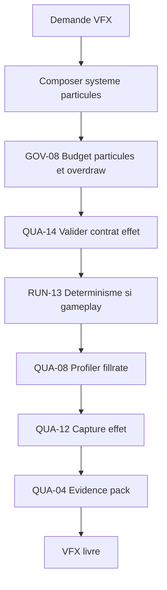

### Flux minimal

1. Composer le système de particules dans les bornes de la scène.
2. Imposer particules max, overdraw et atlas par garde-fou (GOV-08).
3. Valider l'effet contre son contrat (durée, boucle, pooling) (QUA-14).
4. Rendre déterministe tout effet qui affecte le gameplay (RUN-13).
5. Profiler le fillrate et le coût GPU en scène réelle (QUA-08).
6. Capturer l'effet, comparer à la cible et prouver (QUA-12, QUA-04).

### Variantes

| Variante | Usage |
| --- | --- |
| Décoratif | Effet d'ambiance sans impact gameplay, budget souple. |
| Gameplay-critique | Effet signalant un état de jeu, déterministe et lisible. |
| Simulation | Fluides ou destructions à coût borné et pooling strict. |

### Recommandations d'exécution

| Aspect | Recommandation |
| --- | --- |
| Palier modèle | Standard — composition d'effet ; Économique pour la validation de budget et de contrat. |
| Taille de contexte | Court — un système d'effet et son budget de scène. |
| Niveau de réflexion | Moyen — arbitrer lisibilité, coût et pooling. |
| Format d'artefact | Systèmes de particules ; atlas/flipbooks ; profils de fillrate ; capture vidéo. |

### Patterns socle requis

| Pattern | Rôle dans le use-case |
| --- | --- |
| GOV-08 Guardrail contract | Imposer particules max, overdraw et atlas. |
| QUA-14 Output contract validator | Valider durée, boucle et pooling de l'effet. |
| RUN-13 Idempotent tool action | Rendre déterministes les effets liés au gameplay. |
| QUA-08 Agent telemetry plane | Mesurer fillrate et coût GPU réel. |
| QUA-12 Visual Evidence Pack | Prouver le rendu de l'effet par capture. |
| QUA-04 Evidence pack et verification verdict | Prouver la conformité de l'effet livré. |

### Critères de validation

| Critère | Preuve attendue |
| --- | --- |
| Budget respecté | Particules et overdraw sous plafond en scène pire-cas. |
| Déterminisme | Effet gameplay reproductible à graine fixe (UC-13). |
| Coût mesuré | Profil de fillrate disponible et sous budget. |
| Lisibilité | Capture validée contre l'intention visuelle. |

### Erreurs fréquentes

| Erreur | Correction |
| --- | --- |
| Régler le nombre de particules « au feeling ». | Borner par garde-fou de budget (GOV-08). |
| Laisser un effet gameplay non déterministe. | Fixer la graine et isoler la logique (RUN-13). |
| Valider sans profiler le fillrate. | Profiler en scène pire-cas (QUA-08). |
| Juger l'effet sans capture. | Produire une preuve visuelle (QUA-12). |

### Exemple

Effet d'explosion gameplay (signale une zone de dégâts). Budget : 400 particules, overdraw x3. Version initiale : 1 200 particules, overdraw x7 → GOV-08 bloque. QUA-14 impose un pooling de 32 instances. RUN-13 fixe la graine : la forme de l'explosion est identique à chaque replay. QUA-08 mesure le fillrate : −38 % après réduction. QUA-12 valide 4 captures. Effet accepté à 392 particules. Palier Standard.

## UC-20 : Animation et rigging gouvernés

| Élément | Description |
| --- | --- |
| Nature | Use-case optionnel — niveau mission. |
| Intention | Produire rigs et animations conformes aux conventions de squelette, retargetables, déterministes pour le gameplay et dans les budgets mémoire. |
| Problème | Un rig hors convention casse le retargeting, une animation à root motion non déterministe désynchronise le gameplay, et les clips non budgétés saturent la mémoire. |
| Solution | Fixer une convention de squelette, valider rigs et clips contre un contrat, simuler le retargeting, garantir le déterminisme du root motion et prouver le rendu par capture. |
| Contrôles | Output contract validator, guardrail contract, dry-run, idempotent tool action, visual evidence pack, evidence pack. |
| Anti-pattern | Rigger et animer ad hoc, sans convention de squelette ni test de retargeting, puis découvrir les ruptures en intégration. |

### Contexte d'utilisation

| Utiliser quand | Éviter quand |
| --- | --- |
| Plusieurs personnages partagent des squelettes et des animations. | Une animation unique non rejouée et non retargetée. |
| Le root motion influence la position de gameplay. | Animation purement décorative sans effet sur la logique. |
| Les budgets mémoire d'animation sont définis. | Prototype sans contrainte d'intégration ni budget. |

### Structure

| Rôle | Responsabilité |
| --- | --- |
| Gardien de convention | Maintient la nomenclature de bones et la hiérarchie. |
| Auteur de rig | Construit le squelette et les contrôleurs conformes. |
| Animateur borné | Produit les clips dans le budget mémoire fixé. |
| Garant de déterminisme | Vérifie le root motion reproductible. |
| Vérificateur de retargeting | Simule le transfert vers d'autres squelettes. |

### Schéma

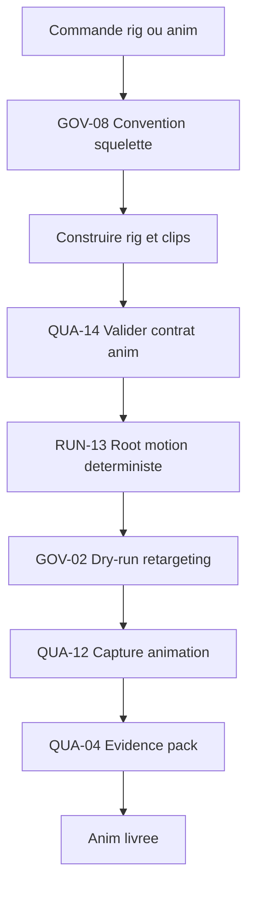

### Flux minimal

1. Fixer la convention de squelette et de nommage (GOV-08).
2. Construire le rig et produire les clips dans le budget.
3. Valider rig et clips contre le contrat d'animation (QUA-14).
4. Garantir un root motion déterministe pour le gameplay (RUN-13).
5. Simuler le retargeting vers les squelettes cibles (GOV-02).
6. Capturer l'animation, comparer à la cible et prouver (QUA-12, QUA-04).

### Variantes

| Variante | Usage |
| --- | --- |
| Humanoïde retargetable | Squelette standard partagé entre personnages. |
| Créature spécifique | Rig dédié, retargeting limité, contrat propre. |
| Animation procédurale | IK et blend gouvernés, déterminisme requis. |

### Recommandations d'exécution

| Aspect | Recommandation |
| --- | --- |
| Palier modèle | Standard — logique de state machine et retargeting ; Économique pour la validation de contrat. |
| Taille de contexte | Moyen — un set d'animations et son squelette de référence. |
| Niveau de réflexion | Moyen — composer transitions et arbitrer fidélité vs budget. |
| Format d'artefact | Squelettes/rigs ; clips FBX ; animation state machines ; tables de budget mémoire. |

### Patterns socle requis

| Pattern | Rôle dans la mission |
| --- | --- |
| GOV-08 Guardrail contract | Imposer convention de squelette et budget mémoire. |
| QUA-14 Output contract validator | Valider rig, clips et état d'animation. |
| RUN-13 Idempotent tool action | Garantir un root motion déterministe. |
| GOV-02 Dry-run avant action risquée | Simuler le retargeting avant intégration. |
| QUA-12 Visual Evidence Pack | Prouver le rendu de l'animation par capture. |
| QUA-04 Evidence pack et verification verdict | Prouver la conformité du livrable. |

### Critères de validation

| Critère | Preuve attendue |
| --- | --- |
| Conformité de squelette | Nommage et hiérarchie conformes à la convention. |
| Retargetabilité | Dry-run de retargeting réussi sans dérive. |
| Déterminisme | Root motion reproductible à conditions égales (UC-13). |
| Budget mémoire | Taille des clips sous plafond. |

### Erreurs fréquentes

| Erreur | Correction |
| --- | --- |
| Rigger sans convention de bones. | Imposer la convention par garde-fou (GOV-08). |
| Laisser un root motion non déterministe. | Fixer le déterminisme du déplacement (RUN-13). |
| Retargeter directement en production. | Simuler par dry-run (GOV-02). |
| Valider l'animation sans capture. | Produire une preuve visuelle (QUA-12). |

### Exemple

Set de locomotion partagé par 9 ennemis humanoïdes. GOV-08 impose le squelette `SK_Humanoid` (54 bones). QUA-14 rejette 2 clips (bones hors hiérarchie). RUN-13 vérifie que le root motion d'une esquive avance toujours de 2,00 m. GOV-02 simule le retargeting vers 9 maillages : 1 échec (proportions extrêmes) corrigé. QUA-12 valide 14 captures. Budget mémoire : 6,8 Mo (plafond 8 Mo). Palier Standard.

## UC-21 : Audio et sound design gouvernés

| Élément | Description |
| --- | --- |
| Nature | Use-case optionnel — niveau mission. |
| Intention | Produire effets, musique et voix dans des cibles de loudness, une structure de bus cohérente, un budget mémoire et une logique adaptative gouvernée. |
| Problème | Un mix non normalisé (loudness incohérent), des banques mémoire non budgétées et un audio adaptatif ad hoc dégradent l'expérience et saturent la mémoire. |
| Solution | Décomposer le système audio en bus et événements, valider chaque asset contre une cible de loudness et un budget, mesurer le mix et prouver la conformité ; la localisation des voix réutilise UC-01. |
| Contrôles | Décomposition d'objectif, output contract validator, guardrail contract, agent telemetry plane, evidence pack. |
| Anti-pattern | Importer des sons à des volumes hétérogènes, sans bus ni cible de loudness, et empiler les banques sans budget. |

### Contexte d'utilisation

| Utiliser quand | Éviter quand |
| --- | --- |
| Le jeu a une nappe sonore riche (SFX, musique, voix). | Un prototype audio jetable sans cible de qualité. |
| Une cible de loudness et un budget mémoire sont fixés. | Aucune norme de mix ni budget audio défini. |
| L'audio est adaptatif (intensité, états) et doit rester cohérent. | Sons isolés sans logique d'état. |

### Structure

| Rôle | Responsabilité |
| --- | --- |
| Architecte de bus | Définit la hiérarchie de bus et le routage. |
| Sound designer borné | Produit les assets dans la cible de loudness. |
| Gardien de budget | Impose la taille des banques et la mémoire audio. |
| Auteur d'audio adaptatif | Gouverne les transitions selon les états de jeu. |
| Vérificateur de mix | Mesure loudness intégré et crête, et prouve. |

### Schéma

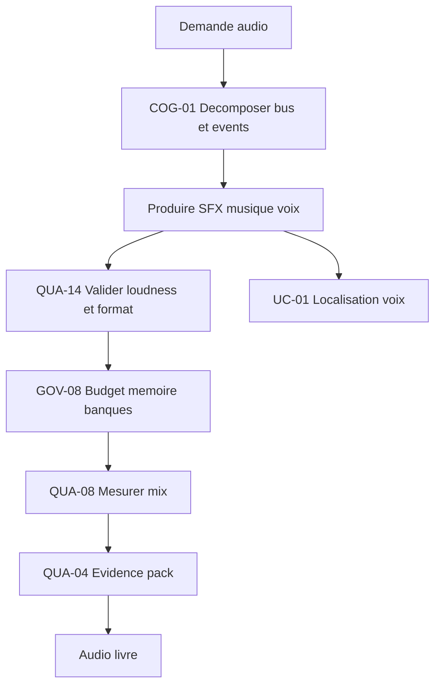

### Flux minimal

1. Décomposer le système en bus, événements et états adaptatifs (COG-01).
2. Produire SFX, musique et voix dans la cible de loudness.
3. Valider chaque asset contre format et loudness (QUA-14).
4. Imposer le budget mémoire des banques (GOV-08).
5. Mesurer le mix (loudness intégré, crête, plage) (QUA-08).
6. Produire l'evidence pack ; localiser les voix via UC-01 (QUA-04).

### Variantes

| Variante | Usage |
| --- | --- |
| Linéaire | Musique et ambiances fixes, mix maîtrisé. |
| Adaptatif | Couches et transitions pilotées par l'état de jeu. |
| Voix localisées | Dialogues multilingues délégués à UC-01. |

### Recommandations d'exécution

| Aspect | Recommandation |
| --- | --- |
| Palier modèle | Standard — design de système et logique adaptative ; Économique pour la validation de loudness. |
| Taille de contexte | Moyen — un système audio (bus, événements) avec ses cibles. |
| Niveau de réflexion | Moyen — composer la logique adaptative et arbitrer mémoire vs qualité. |
| Format d'artefact | .wav/.ogg ; banques (.bank) ; graphes d'événements ; rapports de loudness (LUFS). |

### Patterns socle requis

| Pattern | Rôle dans la mission |
| --- | --- |
| COG-01 Décomposition d'objectif | Découper en bus, événements et états. |
| QUA-14 Output contract validator | Valider format, loudness et nommage des assets. |
| GOV-08 Guardrail contract | Imposer le budget mémoire des banques. |
| QUA-08 Agent telemetry plane | Mesurer loudness intégré, crête et plage. |
| QUA-04 Evidence pack et verification verdict | Prouver la conformité du mix livré. |

### Critères de validation

| Critère | Preuve attendue |
| --- | --- |
| Loudness conforme | Mesure LUFS intégrée dans la cible (ex. -23 LUFS). |
| Budget mémoire | Taille des banques sous plafond. |
| Cohérence du mix | Routage de bus correct, aucun clipping. |
| Adaptatif gouverné | Transitions d'état tracées et reproductibles. |

### Erreurs fréquentes

| Erreur | Correction |
| --- | --- |
| Importer des sons à volumes hétérogènes. | Valider la loudness cible (QUA-14). |
| Empiler les banques sans budget. | Imposer un plafond mémoire (GOV-08). |
| Mixer sans mesure objective. | Mesurer LUFS et crête (QUA-08). |
| Recréer les voix par langue à la main. | Réutiliser la localisation orchestrée (UC-01). |

### Exemple

Système audio d'un niveau de combat : 3 bus (SFX, musique, voix). COG-01 isole 47 événements. QUA-14 rejette 9 SFX hors cible (crête > 0 dBFS). GOV-08 impose 24 Mo de banques (initial 31 Mo) → streaming activé. QUA-08 mesure -22,6 LUFS intégré (cible -23). La musique adaptative passe en couche « intense » au-dessus de 3 ennemis. Voix FR/EN/ES déléguées à UC-01. Mix accepté. Palier Standard.

## UC-22 : Cinématiques et mise en scène gouvernées

| Élément | Description |
| --- | --- |
| Nature | Use-case optionnel — niveau mission. |
| Intention | Produire cinématiques et séquences in-engine (scénario, storyboard, blocking caméra, timeline) cohérentes avec le lore et prouvées visuellement. |
| Problème | Une cinématique produite sans cadre dérive du lore, multiplie les plans incohérents et n'est jugée qu'en projection finale, trop tard pour corriger. |
| Solution | Décomposer la séquence en plans, ancrer le récit sur le graphe de sources (lore), valider chaque plan contre un contrat, réviser le rythme et prouver par capture vidéo. |
| Contrôles | Décomposition d'objectif, source graph resolver, output contract validator, independent reviewer, visual evidence pack, evidence pack. |
| Anti-pattern | Monter une cinématique « à l'inspiration » sans storyboard, sans ancrage lore ni revue, et la valider seulement à la fin. |

### Contexte d'utilisation

| Utiliser quand | Éviter quand |
| --- | --- |
| Les cinématiques portent le récit et engagent le lore. | Une animation d'ambiance sans enjeu narratif. |
| La cohérence narrative entre séquences est critique. | Un test de caméra jetable hors production. |
| La séquence doit être révisée et prouvée avant intégration. | Aucun canon narratif n'existe encore (voir UC-08). |

### Structure

| Rôle | Responsabilité |
| --- | --- |
| Découpeur de séquence | Décompose la cinématique en plans et beats. |
| Scénariste ancré | Aligne le récit sur le canon et le graphe de sources. |
| Metteur en scène | Définit blocking caméra, cadrage et timeline. |
| Réviseur de rythme | Évalue montage, durée et lisibilité de façon indépendante. |
| Vérificateur visuel | Capture la séquence et prouve la conformité. |

### Schéma

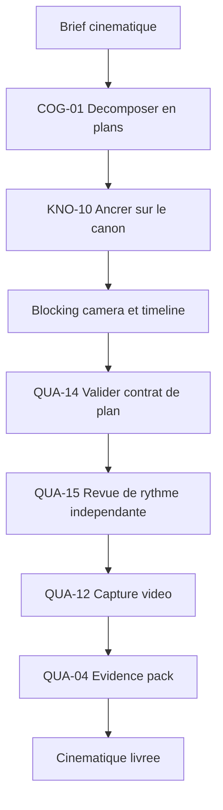

### Flux minimal

1. Décomposer la cinématique en plans et beats narratifs (COG-01).
2. Ancrer le récit sur le canon via le graphe de sources (KNO-10).
3. Définir blocking caméra, cadrage et timeline.
4. Valider chaque plan contre son contrat (durée, cadrage, sujets) (QUA-14).
5. Faire réviser le rythme et la lisibilité de façon indépendante (QUA-15).
6. Capturer la séquence et produire l'evidence pack (QUA-12, QUA-04).

### Variantes

| Variante | Usage |
| --- | --- |
| Précalculée | Cinématique rendue hors temps réel, qualité maximale. |
| In-engine temps réel | Séquence jouée par le moteur, intégrée au flux. |
| Interactive | Scène à embranchements ou à QTE gouvernés. |

### Recommandations d'exécution

| Aspect | Recommandation |
| --- | --- |
| Palier modèle | Frontier — mise en scène et arbitrage narratif ouverts ; Standard pour l'assemblage de timeline. |
| Taille de contexte | Large — le canon narratif et les séquences adjacentes. |
| Niveau de réflexion | Haut — concevoir le découpage et arbitrer le rythme. |
| Format d'artefact | Scénario ; storyboard (planches) ; timeline/séquence in-engine ; capture vidéo MP4. |

### Patterns socle requis

| Pattern | Rôle dans la mission |
| --- | --- |
| COG-01 Décomposition d'objectif | Découper la séquence en plans vérifiables. |
| KNO-10 Source Graph Resolver | Ancrer le récit sur le canon et tracer les sources. |
| QUA-14 Output contract validator | Valider durée, cadrage et sujets de chaque plan. |
| QUA-15 Independent reviewer | Réviser rythme et lisibilité sans complaisance. |
| QUA-12 Visual Evidence Pack | Prouver la séquence par capture vidéo. |
| QUA-04 Evidence pack et verification verdict | Prouver la conformité de la cinématique. |

### Critères de validation

| Critère | Preuve attendue |
| --- | --- |
| Cohérence lore | Aucune contradiction avec le canon, ou écart justifié. |
| Conformité de plan | Durée, cadrage et sujets conformes au contrat. |
| Rythme validé | Revue indépendante du montage documentée. |
| Preuve visuelle | Capture vidéo de la séquence disponible. |

### Erreurs fréquentes

| Erreur | Correction |
| --- | --- |
| Monter sans storyboard ni découpage. | Décomposer en plans contractuels (COG-01). |
| Inventer des faits hors canon. | Ancrer sur le graphe de sources (KNO-10). |
| Auto-valider son propre montage. | Passer par une revue indépendante (QUA-15). |
| Juger la scène en projection finale. | Capturer et prouver chaque jalon (QUA-12). |

### Exemple

Cinématique d'introduction (2 min 40, 22 plans). COG-01 découpe en 5 beats. KNO-10 détecte 2 incohérences lore (un personnage déjà mort apparaît). QUA-14 rejette 3 plans (durée > budget de 8 s). QUA-15 signale un montage trop lent au beat 3 : −6 s. QUA-12 produit la capture vidéo annotée. Séquence validée à 20 plans, 2 min 18. Palier Frontier pour la mise en scène, Standard pour l'assemblage.

## UC-23 : Systèmes de combat gouvernés

| Élément | Description |
| --- | --- |
| Nature | Use-case optionnel — niveau mission. |
| Intention | Concevoir et équilibrer un système de combat (frame data, hitbox/hurtbox, dégâts) reproductible et exempt d'exploits manifestes. |
| Problème | Un combat réglé « au feeling » produit des combos déséquilibrés, des hitbox incohérentes et des exploits, non reproductibles donc impossibles à corriger sûrement. |
| Solution | Spécifier la frame data et les volumes par contrat, s'appuyer sur le harnais déterministe (UC-13), borner l'auto-révision de l'équilibrage, mesurer par télémétrie et prouver chaque changement. |
| Contrôles | Auto-révision bornée, output contract validator, idempotent tool action, agent telemetry plane, evidence pack. |
| Anti-pattern | Régler dégâts et hitbox à la main sans frame data versionnée ni test déterministe, et découvrir les exploits en production. |

### Contexte d'utilisation

| Utiliser quand | Éviter quand |
| --- | --- |
| Le combat est un pilier du jeu avec frame data et volumes. | Un système d'interaction simple sans timing ni volumes. |
| Les réglages doivent être reproductibles et non régressifs. | Un prototype où le combat n'a pas encore de forme. |
| Les exploits de combo ou de portée doivent être détectés tôt. | Aucune mécanique de combat chiffrée n'existe. |

### Structure

| Rôle | Responsabilité |
| --- | --- |
| Spécificateur de frame data | Définit startup, active, recovery et priorités. |
| Auteur de hitbox | Décrit hitbox/hurtbox et leurs invariants. |
| Banc déterministe | Rejoue les scénarios de combat à graine fixe (UC-13). |
| Régleur d'équilibrage | Propose des ajustements bornés et justifiés. |
| Analyste d'exploits | Détecte combos infinis et portées aberrantes. |

### Schéma

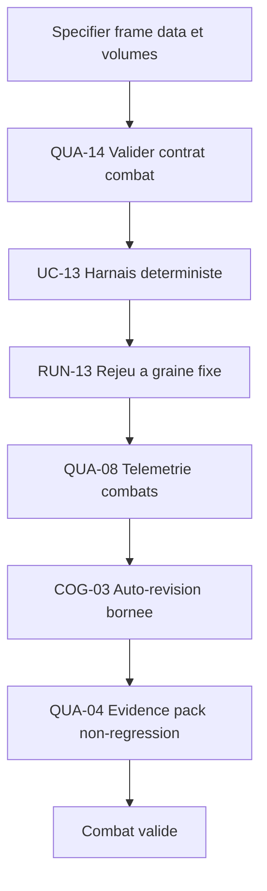

### Flux minimal

1. Spécifier frame data, hitbox et règles de dégâts (QUA-14).
2. Rejouer les scénarios de combat via le harnais déterministe (UC-13, RUN-13).
3. Collecter la télémétrie (taux de touche, DPS, durée d'échange) (QUA-08).
4. Proposer des ajustements bornés et arrêter sur critère (COG-03).
5. Détecter combos infinis et portées aberrantes sur les rejeux.
6. Prouver la non-régression de l'équilibrage par evidence pack (QUA-04).

### Variantes

| Variante | Usage |
| --- | --- |
| Combat de précision | Jeu de combat à frame data stricte et inputs au tick. |
| Action-RPG | Dégâts pilotés par stats, équilibrage économique lié (UC-10). |
| Multijoueur | Déterminisme renforcé pour le rollback et l'anti-triche. |

### Recommandations d'exécution

| Aspect | Recommandation |
| --- | --- |
| Palier modèle | Standard — analyse de données et arbitrage d'équilibrage ; Économique pour le rejeu déterministe. |
| Taille de contexte | Moyen — un set de mouvements et ses interactions. |
| Niveau de réflexion | Haut — arbitrer entre métriques d'équilibrage contradictoires. |
| Format d'artefact | Tables de frame data ; définitions de hitbox ; logs de rejeu ; rapports d'équilibrage. |

### Patterns socle requis

| Pattern | Rôle dans la mission |
| --- | --- |
| QUA-14 Output contract validator | Valider frame data et invariants de hitbox. |
| RUN-13 Idempotent tool action | Rejouer les combats de façon déterministe (via UC-13). |
| QUA-08 Agent telemetry plane | Mesurer taux de touche, DPS et durée d'échange. |
| COG-03 Auto-révision bornée | Itérer l'équilibrage sous budget et critère d'arrêt. |
| QUA-04 Evidence pack et verification verdict | Prouver la non-régression de chaque changement. |

### Critères de validation

| Critère | Preuve attendue |
| --- | --- |
| Reproductibilité | Combats rejoués à graine fixe identiques (UC-13). |
| Frame data conforme | Données validées contre le contrat, versionnées. |
| Absence d'exploit | Aucun combo infini ni portée aberrante détecté. |
| Non-régression | Métriques d'équilibrage comparées avant/après. |

### Erreurs fréquentes

| Erreur | Correction |
| --- | --- |
| Régler les dégâts sans frame data versionnée. | Spécifier et valider par contrat (QUA-14). |
| Tester le combat sans déterminisme. | Rejouer via le harnais (UC-13, RUN-13). |
| Itérer l'équilibrage sans fin. | Borner l'auto-révision (COG-03). |
| Pousser un patch d'équilibrage sans comparaison. | Prouver la non-régression (QUA-04). |

### Exemple

Personnage « Lame » : 14 mouvements. QUA-14 rejette 2 attaques (recovery négatif). UC-13 rejoue 5 000 échanges à graine fixe. QUA-08 mesure un DPS de 1,8x au-dessus du roster. COG-03 propose +3 frames de recovery sur l'attaque lourde (2 itérations, arrêt sur cible atteinte). Un combo infini coin-à-coin est détecté et corrigé (reset de hitstun). QUA-04 prouve la non-régression sur 11 autres personnages. Palier Standard.

## UC-24 : IA de PNJ et navigation gouvernées

| Élément | Description |
| --- | --- |
| Nature | Use-case optionnel — niveau mission. |
| Intention | Produire des comportements de PNJ (behavior trees, FSM, utility, GOAP) et une navigation (navmesh, perception) robustes, déterministes et non dégénérés. |
| Problème | Une IA non gouvernée tombe dans des boucles, reste coincée sur la navigation, ou se comporte différemment à chaque exécution, rendant les bugs impossibles à reproduire. |
| Solution | Décomposer le comportement, sélectionner le bon formalisme, valider la logique par contrat, garantir le déterminisme via le harnais (UC-13) et borner la perception et le director. |
| Contrôles | Décomposition d'objectif, sélecteur de compétence, output contract validator, guardrail contract, idempotent tool action, evidence pack. |
| Anti-pattern | Empiler des conditions ad hoc dans un arbre géant, sans contrat ni test déterministe, jusqu'à ce que « ça marche à peu près ». |

### Contexte d'utilisation

| Utiliser quand | Éviter quand |
| --- | --- |
| Les PNJ ont une logique riche (combat, patrouille, réaction). | Un PNJ scripté linéaire sans décision. |
| La navigation et la perception influencent le gameplay. | Un décor sans agents mobiles. |
| Les comportements doivent être reproductibles pour le test. | Prototype d'IA jetable sans intégration. |

### Structure

| Rôle | Responsabilité |
| --- | --- |
| Décomposeur de comportement | Découpe l'objectif en sous-comportements vérifiables. |
| Sélecteur de formalisme | Choisit BT, FSM, utility ou GOAP selon le besoin. |
| Auteur de navigation | Construit navmesh, liens et requêtes de chemin. |
| Garant de déterminisme | Rejoue le comportement à conditions égales (UC-13). |
| Gardien anti-dégénérescence | Borne boucles, perception et actions du director. |

### Schéma

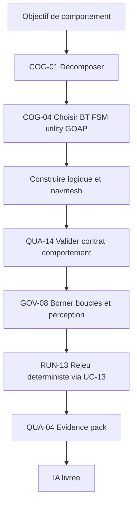

### Flux minimal

1. Décomposer l'objectif en sous-comportements vérifiables (COG-01).
2. Sélectionner le formalisme adapté (BT/FSM/utility/GOAP) (COG-04).
3. Construire la logique et la navigation (navmesh, perception).
4. Valider le comportement contre son contrat (états, transitions) (QUA-14).
5. Borner boucles, portée de perception et actions du director (GOV-08).
6. Rejouer de façon déterministe puis prouver (UC-13, RUN-13, QUA-04).

### Variantes

| Variante | Usage |
| --- | --- |
| Behavior tree | Comportements réactifs hiérarchiques lisibles. |
| Utility / GOAP | Décision par score ou planification d'actions. |
| Director IA | Régulation globale du rythme et des spawns. |

### Recommandations d'exécution

| Aspect | Recommandation |
| --- | --- |
| Palier modèle | Standard — logique de décision et navigation ; Économique pour la validation de contrat. |
| Taille de contexte | Moyen — un comportement complet avec ses états et son environnement. |
| Niveau de réflexion | Moyen — composer la logique et choisir le bon formalisme. |
| Format d'artefact | Behavior trees / FSM ; navmesh ; tables d'utility ; logs de décision. |

### Patterns socle requis

| Pattern | Rôle dans la mission |
| --- | --- |
| COG-01 Décomposition d'objectif | Découper le comportement en unités vérifiables. |
| COG-04 Sélecteur de compétence | Choisir le formalisme d'IA adapté. |
| QUA-14 Output contract validator | Valider états, transitions et requêtes de navigation. |
| GOV-08 Guardrail contract | Borner boucles, perception et actions du director. |
| RUN-13 Idempotent tool action | Rejouer le comportement de façon déterministe (UC-13). |
| QUA-04 Evidence pack et verification verdict | Prouver la robustesse du comportement. |

### Critères de validation

| Critère | Preuve attendue |
| --- | --- |
| Non-dégénérescence | Aucun blocage ni boucle infinie sur les scénarios. |
| Navigation fiable | Chemins valides, pas de PNJ coincé sur les rejeux. |
| Déterminisme | Comportement reproductible à conditions égales (UC-13). |
| Formalisme justifié | Choix BT/FSM/utility/GOAP documenté (COG-04). |

### Erreurs fréquentes

| Erreur | Correction |
| --- | --- |
| Un arbre géant de conditions ad hoc. | Décomposer et choisir un formalisme (COG-01, COG-04). |
| Navigation non testée sur cas limites. | Valider les requêtes de chemin par contrat (QUA-14). |
| Perception non bornée (omnisciente). | Borner portée et fréquence (GOV-08). |
| IA non reproductible. | Rejouer via le harnais déterministe (UC-13, RUN-13). |

### Exemple

Garde de patrouille : objectif « surveiller, détecter, engager ». COG-04 choisit un behavior tree. QUA-14 valide 12 nœuds et 3 requêtes navmesh (rayon d'agent 0,35 m). GOV-08 borne la perception à 18 m / 110°. UC-13 rejoue 800 spawns à graine fixe : 2 cas de PNJ coincé à un angle de mur sont corrigés (lien navmesh ajouté). QUA-04 prouve 0 blocage résiduel. Palier Standard.

## UC-25 : Physique et collisions gouvernées

| Élément | Description |
| --- | --- |
| Nature | Use-case optionnel — niveau mission. |
| Intention | Régler la simulation physique et les collisions de façon déterministe, avec des couches cohérentes et sans tunneling, dans un budget de calcul. |
| Problème | Une physique à pas variable est non reproductible, le tunneling traverse les murs à grande vitesse et des couches de collision mal posées créent des interactions fantômes. |
| Solution | Fixer un pas de temps déterministe, valider les couches et matériaux par contrat, activer la détection continue sur les corps rapides, profiler le coût et rejouer via le harnais (UC-13). |
| Contrôles | Idempotent tool action, output contract validator, guardrail contract, agent telemetry plane, evidence pack. |
| Anti-pattern | Laisser la physique tourner à pas variable, sans couches explicites ni CCD, et corriger les traversées au cas par cas. |

### Contexte d'utilisation

| Utiliser quand | Éviter quand |
| --- | --- |
| La physique influence le gameplay et doit être reproductible. | Une physique purement cosmétique sans effet logique. |
| Des corps rapides risquent le tunneling. | Aucun objet véloce ni collision critique. |
| Le budget de calcul physique est contraint. | Prototype sans cible de performance. |

### Structure

| Rôle | Responsabilité |
| --- | --- |
| Garant de pas fixe | Impose un timestep déterministe et stable. |
| Architecte de couches | Définit la matrice de collision et les filtres. |
| Régleur de matériaux | Calibre friction, restitution et masses. |
| Garant anti-tunneling | Active la détection continue sur les corps rapides. |
| Profileur physique | Mesure le coût par sous-pas et le respect du budget. |

### Schéma

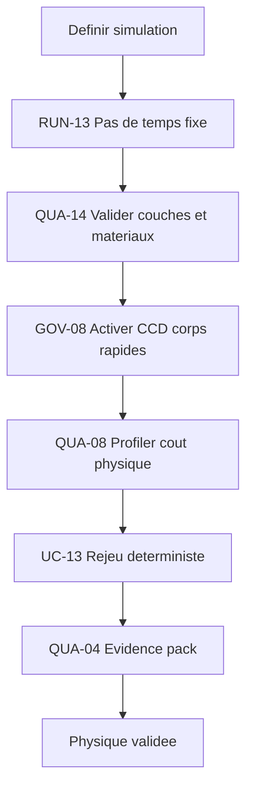

### Flux minimal

1. Fixer un pas de temps déterministe et stable (RUN-13).
2. Valider la matrice de couches et les matériaux par contrat (QUA-14).
3. Activer la détection continue (CCD) sur les corps rapides (GOV-08).
4. Profiler le coût physique par sous-pas (QUA-08).
5. Rejouer les scénarios via le harnais déterministe (UC-13).
6. Prouver l'absence de tunneling et le budget tenu (QUA-04).

### Variantes

| Variante | Usage |
| --- | --- |
| Arcade | Physique simplifiée et stable, peu de corps dynamiques. |
| Simulation | Empilements et contraintes nombreux, budget serré. |
| Véhicules / projectiles | Corps rapides nécessitant CCD systématique. |

### Recommandations d'exécution

| Aspect | Recommandation |
| --- | --- |
| Palier modèle | Économique — réglage paramétrique et validation stricte ; Standard pour l'arbitrage de stabilité. |
| Taille de contexte | Court — une scène physique et ses corps. |
| Niveau de réflexion | Moyen — arbitrer stabilité, précision et coût. |
| Format d'artefact | Matrice de collision ; matériaux physiques ; logs de rejeu ; profils de sous-pas. |

### Patterns socle requis

| Pattern | Rôle dans la mission |
| --- | --- |
| RUN-13 Idempotent tool action | Garantir un pas de temps déterministe. |
| QUA-14 Output contract validator | Valider couches, filtres et matériaux. |
| GOV-08 Guardrail contract | Imposer CCD et budgets de corps actifs. |
| QUA-08 Agent telemetry plane | Mesurer le coût physique par sous-pas. |
| QUA-04 Evidence pack et verification verdict | Prouver déterminisme et absence de tunneling. |

### Critères de validation

| Critère | Preuve attendue |
| --- | --- |
| Déterminisme | Simulation rejouée à pas fixe identique (UC-13). |
| Absence de tunneling | Aucun corps rapide ne traverse de collider. |
| Couches cohérentes | Matrice de collision validée, pas d'interaction fantôme. |
| Budget tenu | Coût physique sous plafond en scène pire-cas. |

### Erreurs fréquentes

| Erreur | Correction |
| --- | --- |
| Simuler à pas de temps variable. | Imposer un pas fixe déterministe (RUN-13). |
| Oublier la CCD sur les projectiles. | Activer la détection continue (GOV-08). |
| Couches de collision implicites. | Valider la matrice par contrat (QUA-14). |
| Régler sans mesurer le coût. | Profiler par sous-pas (QUA-08). |

### Exemple

Scène de destruction : 240 corps dynamiques, pas fixe 1/60 s. QUA-14 valide 8 couches (matrice 8x8). Un carreau d'arbalète à 90 m/s traversait un mur : GOV-08 active la CCD → tunneling résolu. QUA-08 mesure 4,1 ms/frame en pire-cas (budget 5 ms). UC-13 rejoue 1 000 effondrements à graine fixe : empilements identiques. QUA-04 prouve 0 traversée résiduelle. Palier Économique.

## UC-26 : UI/UX et accessibilité gouvernées

| Élément | Description |
| --- | --- |
| Nature | Use-case optionnel — niveau mission. |
| Intention | Produire HUD, menus et flux d'interaction conformes aux guidelines plateforme et aux critères d'accessibilité, prouvés visuellement. |
| Problème | Une UI produite sans contrat ignore l'accessibilité (daltonisme, sous-titres, remap, mise à l'échelle), casse les guidelines plateforme et n'est testée qu'en fin de cycle. |
| Solution | Décrire chaque écran et flux par contrat, imposer des critères d'accessibilité opposables, faire réviser indépendamment et prouver par capture sur plusieurs configurations. |
| Contrôles | Output contract validator, guardrail contract, independent reviewer, visual evidence pack, evidence pack. |
| Anti-pattern | Maquetter des écrans isolés sans flux, sans accessibilité ni revue, et corriger l'a11y « plus tard ». |

### Contexte d'utilisation

| Utiliser quand | Éviter quand |
| --- | --- |
| Le jeu a des menus, un HUD et des flux à maintenir cohérents. | Une UI de debug jetable hors production. |
| L'accessibilité est exigée (plateforme, public, légal). | Aucun critère d'accessibilité n'est encore défini. |
| L'UI doit respecter des guidelines plateforme. | Maquette d'exploration sans intégration. |

### Structure

| Rôle | Responsabilité |
| --- | --- |
| Concepteur de flux | Décrit écrans, transitions et états d'erreur. |
| Auteur de HUD | Compose l'affichage tête haute et ses contraintes. |
| Auditeur d'accessibilité | Vérifie daltonisme, sous-titres, remap, mise à l'échelle. |
| Réviseur indépendant | Évalue l'UX et la conformité plateforme sans complaisance. |
| Vérificateur visuel | Capture les écrans sur plusieurs configurations. |

### Schéma

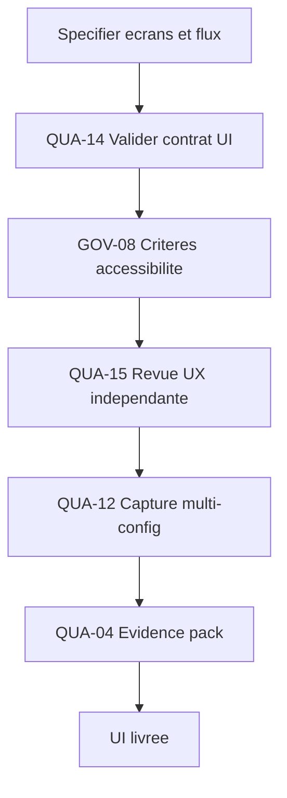

### Flux minimal

1. Spécifier écrans, transitions et états d'erreur par contrat (QUA-14).
2. Imposer les critères d'accessibilité opposables (GOV-08).
3. Vérifier daltonisme, sous-titres, remap et mise à l'échelle.
4. Faire réviser l'UX et la conformité plateforme indépendamment (QUA-15).
5. Capturer les écrans sur plusieurs résolutions et langues (QUA-12).
6. Produire l'evidence pack d'accessibilité et d'UX (QUA-04).

### Variantes

| Variante | Usage |
| --- | --- |
| HUD de jeu | Affichage temps réel lisible et non encombrant. |
| Menus et options | Navigation, paramètres et remap d'entrées. |
| Accessibilité avancée | Modes daltonien, narration, échelle de texte. |

### Recommandations d'exécution

| Aspect | Recommandation |
| --- | --- |
| Palier modèle | Standard — conception de flux et arbitrage UX ; Économique pour la validation de contrat. |
| Taille de contexte | Moyen — un flux complet d'écrans et leurs états. |
| Niveau de réflexion | Moyen — composer le flux et arbitrer lisibilité vs densité. |
| Format d'artefact | Maquettes/wireframes ; arbres de flux ; rapports d'accessibilité ; captures multi-config. |

### Patterns socle requis

| Pattern | Rôle dans la mission |
| --- | --- |
| QUA-14 Output contract validator | Valider écrans, transitions et états d'erreur. |
| GOV-08 Guardrail contract | Imposer les critères d'accessibilité opposables. |
| QUA-15 Independent reviewer | Réviser UX et conformité plateforme. |
| QUA-12 Visual Evidence Pack | Prouver le rendu sur plusieurs configurations. |
| QUA-04 Evidence pack et verification verdict | Prouver la conformité UI et accessibilité. |

### Critères de validation

| Critère | Preuve attendue |
| --- | --- |
| Accessibilité | Daltonisme, sous-titres, remap et échelle vérifiés. |
| Conformité plateforme | Guidelines respectées (boutons, retours, focus). |
| Cohérence de flux | Transitions et états d'erreur validés au contrat. |
| Preuve visuelle | Captures multi-résolution et multi-langue disponibles. |

### Erreurs fréquentes

| Erreur | Correction |
| --- | --- |
| Traiter l'accessibilité en fin de cycle. | Imposer des critères dès le contrat (GOV-08). |
| Maquetter des écrans sans flux. | Décrire transitions et erreurs au contrat (QUA-14). |
| Auto-valider sa propre UX. | Passer par une revue indépendante (QUA-15). |
| Valider sur une seule config. | Capturer en multi-config (QUA-12). |

### Exemple

Menu d'options et HUD d'un jeu console. QUA-14 valide 9 écrans et 24 transitions. GOV-08 impose 4 critères a11y : palette daltonien, sous-titres redimensionnables, remap complet, échelle d'UI 80–150 %. QUA-15 signale un focus clavier perdu sur 2 écrans. QUA-12 capture en 1080p/4K, FR/EN/JP : 3 débordements de texte JP corrigés. QUA-04 atteste les 4 critères a11y. Palier Standard.

## UC-27 : Optimisation et budgets de performance gouvernés

| Élément | Description |
| --- | --- |
| Nature | Use-case optionnel — niveau mission. |
| Intention | Tenir des budgets de performance (CPU/GPU/mémoire) par profilage, optimisations gouvernées (occlusion, LOD, lumières, draw calls) et réglages de scalability. |
| Problème | Sans budget ni profilage, l'optimisation est faite « au pif », régresse la qualité visuelle ou casse une plateforme, et n'est jamais prouvée. |
| Solution | Fixer un budget de frame par plateforme, mesurer avant/après, n'autoriser une transition que sur preuve de gain sans régression, et décliner les réglages par environnement. |
| Contrôles | Agent telemetry plane, guardrail contract, evidence-driven transition, policy by environment, evidence pack. |
| Anti-pattern | Activer des optimisations agressives sans mesure ni budget, au risque de pop-in, d'artefacts ou de crash plateforme. |

### Contexte d'utilisation

| Utiliser quand | Éviter quand |
| --- | --- |
| Le jeu doit tenir une cible de framerate sur des machines variées. | Un prototype sans cible de performance. |
| Les budgets CPU/GPU/mémoire sont définis et opposables. | Aucun budget de frame n'est encore fixé. |
| Des réglages de scalability sont exposés au joueur. | Une seule configuration matérielle figée. |

### Structure

| Rôle | Responsabilité |
| --- | --- |
| Gardien de budget de frame | Fixe le budget CPU/GPU/mémoire par plateforme. |
| Profileur | Mesure le coût réel et identifie les points chauds. |
| Optimiseur gouverné | Applique occlusion, LOD, batching, bake de lumière. |
| Garant de non-régression | Compare qualité et perf avant/après par preuve. |
| Auteur de scalability | Décline les presets par environnement et machine. |

### Schéma

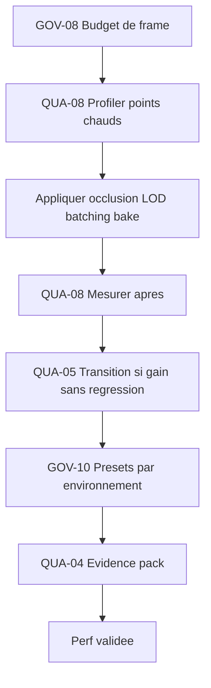

### Flux minimal

1. Fixer le budget de frame CPU/GPU/mémoire par plateforme (GOV-08).
2. Profiler la scène pour identifier les points chauds (QUA-08).
3. Appliquer les optimisations (occlusion, LOD, batching, bake).
4. Mesurer après et comparer à l'état initial (QUA-08).
5. N'autoriser la transition que sur gain prouvé sans régression (QUA-05).
6. Décliner les presets de scalability par environnement (GOV-10, QUA-04).

### Variantes

| Variante | Usage |
| --- | --- |
| GPU-bound | Occlusion culling, LOD, overdraw, bake de lumière. |
| CPU-bound | Batching, réduction de draw calls, jobs, IA. |
| Mémoire | Streaming, compression de textures, budgets d'assets. |

### Recommandations d'exécution

| Aspect | Recommandation |
| --- | --- |
| Palier modèle | Standard — analyse de profils et arbitrage qualité/perf ; Économique pour la collecte de mesures. |
| Taille de contexte | Moyen — une scène ou un niveau avec son budget. |
| Niveau de réflexion | Haut — arbitrer entre qualité visuelle et coût. |
| Format d'artefact | Profils de frame (captures GPU/CPU) ; chaînes de LOD ; presets de scalability ; rapports avant/après. |

### Patterns socle requis

| Pattern | Rôle dans la mission |
| --- | --- |
| GOV-08 Guardrail contract | Imposer le budget de frame par plateforme. |
| QUA-08 Agent telemetry plane | Mesurer coût et points chauds avant/après. |
| QUA-05 Evidence-driven transition | Valider une optimisation sur preuve de gain. |
| GOV-10 Policy by environment | Décliner les presets par machine et plateforme. |
| QUA-04 Evidence pack et verification verdict | Prouver la perf tenue sans régression. |

### Critères de validation

| Critère | Preuve attendue |
| --- | --- |
| Budget tenu | Frame time sous le budget sur chaque plateforme. |
| Non-régression visuelle | Comparaison avant/après sans artefact (pop-in, ombres). |
| Gain prouvé | Mesure de gain documentée avant transition (QUA-05). |
| Scalability | Presets validés par environnement (GOV-10). |

### Erreurs fréquentes

| Erreur | Correction |
| --- | --- |
| Optimiser sans budget cible. | Fixer un budget de frame opposable (GOV-08). |
| Activer des LOD agressifs sans contrôle. | Comparer qualité avant/après (QUA-05). |
| Mesurer sur une seule machine. | Décliner et mesurer par environnement (GOV-10). |
| Conclure sans preuve de gain. | Exiger un evidence pack chiffré (QUA-04). |

### Exemple

Niveau urbain visant 60 fps PC milieu de gamme (budget 16,6 ms). QUA-08 mesure 23,4 ms, GPU-bound. Occlusion culling + 3 niveaux de LOD + bake des ombres statiques. QUA-08 re-mesure 15,1 ms. QUA-05 valide le gain (−35 %) sans pop-in visible (comparaison de captures). GOV-10 décline un preset « bas » à 30 fps pour machines d'entrée de gamme. QUA-04 atteste le budget tenu sur 3 configs. Palier Standard.

## UC-28 : Expérience VR/XR gouvernée

| Élément | Description |
| --- | --- |
| Nature | Use-case optionnel — niveau mission. |
| Intention | Produire une expérience VR/XR confortable (anti-motion sickness), tenant un plancher de framerate strict et une interaction ergonomique, prouvée par comfort testing. |
| Problème | La VR sans cadre provoque du motion sickness, descend sous le plancher de framerate critique et propose des interactions inconfortables, découverts seulement au casque. |
| Solution | Imposer un plancher de framerate et des règles de confort par contrat, s'appuyer sur l'optimisation (UC-27), tester le confort comme preuve et capturer le rendu stéréo. |
| Contrôles | Guardrail contract, agent telemetry plane, evidence-driven transition, visual evidence pack, evidence pack. |
| Anti-pattern | Porter une expérience écran plat en VR sans plancher de framerate, sans options de confort ni comfort testing. |

### Contexte d'utilisation

| Utiliser quand | Éviter quand |
| --- | --- |
| L'expérience cible un casque VR/XR. | Un jeu écran plat sans mode immersif. |
| Le confort et le plancher de framerate sont critiques. | Une démo non destinée au port casque. |
| Des options de confort doivent être exposées. | Aucune contrainte de confort n'est définie. |

### Structure

| Rôle | Responsabilité |
| --- | --- |
| Gardien de plancher framerate | Impose la cible (ex. 90 fps) et la latence. |
| Concepteur de confort | Définit locomotion, vignettage et options anti-nausée. |
| Auteur d'interaction | Conçoit la saisie, la portée et l'ergonomie en main. |
| Testeur de confort | Conduit le comfort testing et collecte les signaux. |
| Vérificateur stéréo | Capture le rendu par œil et prouve. |

### Schéma

```mermaid
flowchart TD
    SPEC["Definir cibles VR"] --> GUARD["GOV-08 Plancher framerate et confort"]
    GUARD --> OPT["UC-27 Optimisation perf VR"]
    OPT --> TELEM["QUA-08 Mesurer framerate et latence"]
    TELEM --> COMFORT["QUA-05 Comfort testing comme preuve"]
    COMFORT --> VISUAL["QUA-12 Capture stereo"]
    VISUAL --> EVIDENCE["QUA-04 Evidence pack"]
    EVIDENCE --> SHIP["Experience VR validee"]
```

### Flux minimal

1. Définir plancher de framerate, latence et règles de confort (GOV-08).
2. Optimiser la perf pour la VR en s'appuyant sur UC-27.
3. Mesurer framerate soutenu et latence moteur-à-photon (QUA-08).
4. Conduire le comfort testing et exiger un verdict de confort (QUA-05).
5. Capturer le rendu stéréo par œil (QUA-12).
6. Produire l'evidence pack de confort et de performance (QUA-04).

### Variantes

| Variante | Usage |
| --- | --- |
| Assise / cockpit | Confort élevé, locomotion limitée. |
| Locomotion libre | Téléportation ou déplacement avec options anti-nausée. |
| XR / passthrough | Mixage réel-virtuel et ancrage spatial. |

### Recommandations d'exécution

| Aspect | Recommandation |
| --- | --- |
| Palier modèle | Standard — arbitrage confort/perf ; Économique pour la collecte de mesures. |
| Taille de contexte | Moyen — une scène VR et ses interactions. |
| Niveau de réflexion | Haut — arbitrer confort, immersion et budget de frame. |
| Format d'artefact | Profils de frame VR ; mesures de latence ; protocoles de comfort testing ; captures stéréo. |

### Patterns socle requis

| Pattern | Rôle dans la mission |
| --- | --- |
| GOV-08 Guardrail contract | Imposer plancher de framerate et règles de confort. |
| QUA-08 Agent telemetry plane | Mesurer framerate soutenu et latence. |
| QUA-05 Evidence-driven transition | Valider sur verdict de comfort testing. |
| QUA-12 Visual Evidence Pack | Prouver le rendu stéréo par capture. |
| QUA-04 Evidence pack et verification verdict | Prouver confort et performance tenus. |

### Critères de validation

| Critère | Preuve attendue |
| --- | --- |
| Plancher framerate | Cible soutenue (ex. 90 fps) sans chute en pire-cas. |
| Confort | Comfort testing documenté avec signaux acceptables. |
| Latence | Latence moteur-à-photon sous le seuil. |
| Options de confort | Locomotion et vignettage configurables vérifiés. |

### Erreurs fréquentes

| Erreur | Correction |
| --- | --- |
| Viser le framerate « au mieux ». | Imposer un plancher strict (GOV-08). |
| Ignorer le motion sickness. | Exiger un comfort testing comme preuve (QUA-05). |
| Réutiliser une UI écran plat. | Concevoir l'interaction pour la VR (UC-26). |
| Optimiser sans cible VR. | S'appuyer sur l'optimisation gouvernée (UC-27). |

### Exemple

Portage VR d'un jeu d'aventure, cible 90 fps. GOV-08 fixe le plancher 90 fps et la latence < 20 ms. UC-27 réduit le coût GPU de 27 % (LOD, occlusion). QUA-08 mesure 92 fps soutenus, latence 17 ms. Comfort testing sur 8 sessions : 2 signalent une nausée en déplacement continu → vignettage + téléportation activés, QUA-05 revalide. QUA-12 capture le rendu par œil. Expérience validée. Palier Standard.

## UC-29 : Structure de projet et conventions d'assets gouvernées

| Élément | Description |
| --- | --- |
| Nature | Use-case optionnel. |
| Intention | Définir et faire respecter l'arborescence du projet, le nommage, les formats par usage et la gestion de version, comme socle ordonné de toute production. |
| Problème | Une structure de projet improvisée multiplie les doublons, les assets orphelins et les formats inadaptés, et rend la gestion de version (gros binaires) ingérable. |
| Solution | Spécifier une taxonomie de dossiers, un nommage et des formats par usage, valider chaque ajout par contrat, indexer le projet et gouverner la version (LFS, source vs cooked). |
| Contrôles | Guardrail contract, output contract validator, runtime output governance, knowledge base indexer, evidence pack. |
| Anti-pattern | Laisser chacun ranger « comme il veut », mélanger sources et fichiers cuisinés, et versionner des gigaoctets de binaires sans LFS. |

### Contexte d'utilisation

| Utiliser quand | Éviter quand |
| --- | --- |
| Plusieurs contributeurs partagent un même dépôt d'assets. | Un prototype solo jetable sans pérennité. |
| Les formats et le nommage doivent être homogènes. | Aucune convention n'a encore de sens à ce stade. |
| Les gros binaires exigent une stratégie de version. | Un projet purement textuel sans assets lourds. |

### Structure

| Rôle | Responsabilité |
| --- | --- |
| Architecte de structure | Définit la taxonomie de dossiers et les zones. |
| Gardien de nommage | Impose les conventions de noms et de préfixes. |
| Référent de formats | Fixe les formats par usage (source vs cooked). |
| Indexeur de projet | Maintient un index navigable des assets. |
| Gouverneur de version | Règle LFS, ignore et séparation des artefacts. |

### Schéma

```mermaid
flowchart TD
    SPEC["Definir taxonomie et conventions"] --> GUARD["GOV-08 Imposer structure et nommage"]
    GUARD --> CONTRACT["QUA-14 Valider chaque ajout"]
    CONTRACT --> GOVERN["RUN-02 Gouverner sortie runtime"]
    GOVERN --> INDEX["KNO-06 Indexer le projet"]
    INDEX --> EVIDENCE["QUA-04 Evidence pack"]
    EVIDENCE --> SHIP["Projet ordonne"]
```

### Flux minimal

1. Spécifier taxonomie de dossiers, nommage et formats par usage.
2. Imposer structure et conventions par garde-fou (GOV-08).
3. Valider chaque ajout d'asset contre le contrat de placement (QUA-14).
4. Séparer sources et fichiers cuisinés via la gouvernance de sortie (RUN-02).
5. Indexer le projet pour le rendre navigable (KNO-06).
6. Gouverner la version (LFS, ignore) et prouver l'ordre (QUA-04).

### Variantes

| Variante | Usage |
| --- | --- |
| Par type | Dossiers par nature d'asset (meshes, textures, audio). |
| Par feature | Dossiers par fonctionnalité ou zone de jeu. |
| Mono-dépôt vs multi | Gestion LFS et sous-modules selon l'échelle. |

### Recommandations d'exécution

| Aspect | Recommandation |
| --- | --- |
| Palier modèle | Économique — application de conventions et validation déterministe. |
| Taille de contexte | Court — l'arbre du projet et les règles de nommage. |
| Niveau de réflexion | Bas — vérifier et ranger selon des règles explicites. |
| Format d'artefact | Arborescence ; charte de nommage ; table formats-par-usage ; config LFS/ignore. |

### Patterns socle requis

| Pattern | Rôle dans le use-case |
| --- | --- |
| GOV-08 Guardrail contract | Imposer structure, nommage et formats. |
| QUA-14 Output contract validator | Valider le placement et le format de chaque ajout. |
| RUN-02 Runtime output governance | Séparer sources et fichiers cuisinés. |
| KNO-06 Knowledge Base Indexer | Indexer le projet pour la navigabilité. |
| QUA-04 Evidence pack et verification verdict | Prouver l'ordre et la conformité du dépôt. |

### Critères de validation

| Critère | Preuve attendue |
| --- | --- |
| Structure conforme | Arborescence respectée, aucun asset hors zone. |
| Nommage homogène | Conventions de noms et préfixes vérifiées. |
| Formats par usage | Source et cooked séparés et corrects. |
| Version maîtrisée | Gros binaires en LFS, aucun artefact cuisiné versionné à tort. |

### Erreurs fréquentes

| Erreur | Correction |
| --- | --- |
| Ranger les assets « au feeling ». | Imposer la taxonomie par garde-fou (GOV-08). |
| Mélanger sources et fichiers cuisinés. | Séparer par gouvernance de sortie (RUN-02). |
| Versionner des binaires sans LFS. | Configurer LFS et l'ignore (QUA-14). |
| Projet illisible et non navigable. | Indexer les assets (KNO-06). |

### Exemple

Reprise d'un dépôt de 32 Go : 1 400 assets, 210 orphelins, formats mêlés. GOV-08 impose `Content/<Domaine>/<Feature>` et préfixes (`SM_`, `T_`, `SFX_`). QUA-14 rejette 87 ajouts hors zone. RUN-02 sort les fichiers cuisinés hors du dépôt source. KNO-06 indexe 1 313 assets restants. LFS configuré pour `.png/.fbx/.wav`. QUA-04 atteste 0 orphelin et 100 % de noms conformes. Palier Économique.

## UC-30 : Direction artistique et identité visuelle gouvernée

| Élément | Description |
| --- | --- |
| Nature | Use-case optionnel — niveau mission. |
| Intention | Établir une direction artistique opposable (mood board, charte graphique, piliers visuels) qui gouverne et harmonise toutes les disciplines visuelles en aval. |
| Problème | Sans direction artistique cadrée, chaque discipline (3D, 2D, VFX, UI) diverge, le style devient incohérent, et les illustrations sont produites par des outils inadaptés faute de cible définie. |
| Solution | Définir les piliers visuels, indexer les références, résoudre le canon, router la génération visuelle vers la bonne cible, formaliser une charte opposable et prouver la cohérence par capture. |
| Contrôles | Décomposition d'objectif, knowledge base indexer, source graph resolver, capability/modality routing, visual evidence pack, guardrail contract, evidence pack. |
| Anti-pattern | Lancer la production 3D/2D sans charte ni piliers, puis « harmoniser » après coup. |

### Contexte d'utilisation

| Utiliser quand | Éviter quand |
| --- | --- |
| Plusieurs disciplines visuelles doivent partager une identité cohérente. | Un prototype jetable sans exigence d'identité visuelle. |
| Le projet a besoin d'une charte graphique opposable avant production. | Le style est déjà figé et documenté ailleurs. |
| Des illustrations ou concepts doivent être produits par la bonne cible. | Aucune production visuelle n'est prévue. |

### Structure

| Rôle | Responsabilité |
| --- | --- |
| Directeur artistique | Définit l'intention, les piliers et arbitre la cohérence. |
| Curateur de références | Rassemble et indexe le mood board et les sources. |
| Routeur de génération | Oriente toute production d'image vers la cible compétente. |
| Auteur de charte | Formalise palette, typographie, iconographie et règles. |
| Vérificateur visuel | Confronte les livrables des disciplines à la charte. |

### Schéma

```mermaid
flowchart TD
    BRIEF["Vision et references"] --> PILLARS["COG-01 Definir piliers visuels"]
    PILLARS --> INDEX["KNO-06 Indexer references"]
    INDEX --> CANON["KNO-10 Resoudre sources et canon"]
    CANON --> ROUTE["MOD-03 Router generation visuelle"]
    ROUTE --> VISUAL["QUA-12 Capture et planche validee"]
    VISUAL --> GUARD["GOV-08 Charte opposable"]
    GUARD --> EVIDENCE["QUA-04 Evidence pack identite"]
```

### Flux minimal

1. Définir les piliers visuels et l'intention artistique (COG-01).
2. Rassembler et indexer le mood board et les références (KNO-06).
3. Résoudre le canon et les sources d'autorité visuelle (KNO-10).
4. Router toute génération d'image vers la cible compétente, sinon escalader (MOD-03).
5. Capturer et valider planches et concepts contre l'intention (QUA-12).
6. Formaliser la charte opposable puis produire l'evidence pack (GOV-08, QUA-04).

### Variantes

| Variante | Usage |
| --- | --- |
| Préproduction complète | Bible visuelle, piliers, charte et cibles de génération. |
| Rebranding / refonte | Réaligner une identité existante sur de nouveaux piliers. |
| Style guide léger | Charte minimale pour petit projet ou game jam. |

### Recommandations d'exécution

| Aspect | Recommandation |
| --- | --- |
| Palier modèle | Frontier pour l'intention et les piliers (création ouverte) ; la génération d'images route vers un modèle image dédié (MOD-03). |
| Taille de contexte | Large — vision, références multiples et contraintes des disciplines aval. |
| Niveau de réflexion | Haut — arbitrer cohérence, style et faisabilité. |
| Format d'artefact | Mood board (planches + sources), charte graphique (palette, typo, iconographie), piliers visuels documentés. |

### Patterns socle requis

| Pattern | Rôle dans la mission |
| --- | --- |
| COG-01 Décomposition d'objectif | Découper la vision en piliers et livrables. |
| KNO-06 Knowledge Base Indexer | Indexer le mood board et les références. |
| KNO-10 Source Graph Resolver | Résoudre le canon et les sources visuelles. |
| MOD-03 Routage par compétence et modalité | Orienter la génération d'image vers la bonne cible. |
| QUA-12 Visual Evidence Pack | Prouver la conformité visuelle par capture. |
| GOV-08 Guardrail contract | Rendre la charte opposable. |
| QUA-04 Evidence pack et verification verdict | Prouver la cohérence de l'identité. |

### Critères de validation

| Critère | Preuve attendue |
| --- | --- |
| Piliers définis | Piliers visuels documentés et approuvés. |
| Charte opposable | Charte graphique versionnée et applicable. |
| Génération routée | Trace de routage des productions d'images vers la bonne cible. |
| Cohérence prouvée | Captures validées contre l'intention et la charte. |

### Erreurs fréquentes

| Erreur | Correction |
| --- | --- |
| Produire sans charte ni piliers. | Établir piliers et charte d'abord (COG-01, GOV-08). |
| Demander une illustration à un LLM texte. | Router vers un modèle image ou escalader (MOD-03). |
| Références éparses non sourcées. | Indexer et résoudre le canon (KNO-06, KNO-10). |
| Juger la cohérence « à l'œil ». | Capturer et comparer à la charte (QUA-12). |

### Exemple

Jeu « Aurora » : direction artistique d'un RPG stylisé. COG-01 fixe 3 piliers (palette pastel, silhouettes lisibles, contraste doux). KNO-06 indexe 120 références ; KNO-10 résout 4 contradictions de canon. MOD-03 route 18 demandes de concepts vers un modèle image (le LLM texte n'illustre pas), 2 escaladées à l'illustrateur humain faute de cible (GOV-15). QUA-12 valide 16 planches, 3 hors palette refusées. GOV-08 publie la charte v1 opposable. Durée 1j30, palier Frontier pour les piliers.

## UC-31 : Idéation et méthodologie UI/UX gouvernée

| Élément | Description |
| --- | --- |
| Nature | Use-case optionnel — niveau mission. |
| Intention | Conduire l'idéation UI/UX par une méthodologie cadrée (divergence/convergence, wireframes, tests) jusqu'à des intentions d'interface validées et testées. |
| Problème | Sans méthode, l'UI est dessinée d'emblée sur des opinions, sans exploration ni test, ce qui fige des choix non validés et coûteux à corriger. |
| Solution | Cadrer le problème, diverger puis converger (double diamond), produire des wireframes, valider contre un contrat UX, et tester l'utilisabilité avec revue indépendante. |
| Contrôles | Décomposition d'objectif, output contract validator, visual evidence pack, independent reviewer, guardrail contract, evidence pack. |
| Anti-pattern | Dessiner l'UI finale d'emblée sans idéation ni test d'utilisabilité. |

### Contexte d'utilisation

| Utiliser quand | Éviter quand |
| --- | --- |
| Une fonctionnalité ou un écran a plusieurs solutions possibles. | La solution est triviale et imposée par une convention. |
| L'expérience doit être testée avant implémentation. | Aucun testeur n'est disponible et l'enjeu est nul. |
| L'équipe doit aligner les parties prenantes sur un flux. | Le flux est déjà validé et documenté. |

### Structure

| Rôle | Responsabilité |
| --- | --- |
| Facilitateur d'idéation | Anime divergence et convergence structurées. |
| Auteur de wireframes | Produit les maquettes basse fidélité et les flux. |
| Vérificateur UX | Valide les livrables contre le contrat UX. |
| Testeur d'utilisabilité | Conçoit et analyse les tests utilisateurs. |
| Reviewer indépendant | Contrôle sans conflit d'intérêt. |

### Schéma

```mermaid
flowchart TD
    PROBLEM["Probleme UX"] --> IDEATE["COG-01 Ideation structuree"]
    IDEATE --> WIRE["Wireframes basse fidelite"]
    WIRE --> CONTRACT["QUA-14 Valider contrat UX"]
    CONTRACT --> TEST["QUA-12 Test utilisabilite trace"]
    TEST --> REVIEW["QUA-15 Revue independante"]
    REVIEW --> EVIDENCE["QUA-04 Evidence pack UX"]
```

### Flux minimal

1. Cadrer le problème et les critères de succès (COG-01).
2. Diverger (idéation) puis converger vers des options retenues.
3. Produire wireframes et flux basse fidélité.
4. Valider les livrables contre le contrat UX (QUA-14).
5. Tester l'utilisabilité et tracer les résultats (QUA-12).
6. Faire réviser puis produire l'evidence pack (QUA-15, QUA-04).

### Variantes

| Variante | Usage |
| --- | --- |
| Double diamond complet | Exploration large puis convergence en deux temps. |
| Sprint d'idéation court | Crazy-8s et How-Might-We sur une journée. |
| Test guérilla | Tests d'utilisabilité rapides à faible coût. |

### Recommandations d'exécution

| Aspect | Recommandation |
| --- | --- |
| Palier modèle | Standard — structurer l'idéation et les wireframes ; Frontier pour le reframing d'un problème ambigu. |
| Taille de contexte | Moyen — le problème, les contraintes et les personas concernés. |
| Niveau de réflexion | Moyen à haut — diverger largement puis arbitrer. |
| Format d'artefact | Wireframes, flux/parcours, protocole et rapport de test d'utilisabilité. |

### Patterns socle requis

| Pattern | Rôle dans la mission |
| --- | --- |
| COG-01 Décomposition d'objectif | Cadrer le problème et les critères. |
| QUA-14 Output contract validator | Valider wireframes et flux contre le contrat UX. |
| QUA-12 Visual Evidence Pack | Tracer les tests et écrans par capture. |
| QUA-15 Independent reviewer | Réviser sans conflit d'intérêt. |
| GOV-08 Guardrail contract | Rendre les critères UX opposables. |
| QUA-04 Evidence pack et verification verdict | Prouver la validation de l'expérience. |

### Critères de validation

| Critère | Preuve attendue |
| --- | --- |
| Idéation tracée | Options explorées et critères de convergence documentés. |
| Wireframes validés | Maquettes conformes au contrat UX. |
| Utilisabilité testée | Rapport de test avec tâches, taux de réussite et frictions. |
| Revue indépendante | Verdict de reviewer sans conflit. |

### Erreurs fréquentes

| Erreur | Correction |
| --- | --- |
| Dessiner l'UI finale sans explorer. | Diverger puis converger (COG-01). |
| Valider l'UX sur opinion. | Tester l'utilisabilité et tracer (QUA-12). |
| Aucune revue externe. | Faire réviser par un pair indépendant (QUA-15). |
| Critères UX implicites. | Rendre le contrat UX opposable (GOV-08). |

### Exemple

Écran d'inventaire pour « Aurora ». COG-01 cadre 3 critères (trouver un objet en moins de 3s, drag-drop clair, lisible en VR). Idéation : 12 concepts (crazy-8s) réduits à 3. Wireframes des 3 ; QUA-14 en rejette 1 (hors grille). Test guérilla sur 5 joueurs : l'option B gagne (taux de réussite 92 % contre 70 %). QUA-15 valide ; 1 friction corrigée (icône ambiguë). QUA-04 scelle l'evidence pack. Durée 1j, palier Standard.

## UC-32 : Architecture réseau et synchronisation gouvernées

| Élément | Description |
| --- | --- |
| Nature | Use-case optionnel — niveau mission. |
| Intention | Concevoir et valider une architecture réseau (topologie, autorité, réplication, prédiction et réconciliation) où l'état partagé reste cohérent et où l'autorité serveur fait foi. |
| Problème | Sans cadre, le netcode fait confiance au client, l'état diverge entre joueurs, les désynchronisations et la triche apparaissent, et les bugs réseau ne sont pas reproductibles. |
| Solution | Choisir explicitement une topologie (client-serveur autoritaire, lockstep déterministe ou rollback), définir le modèle d'autorité et de réplication, implémenter prédiction client et réconciliation, puis valider sur un harnais déterministe avec simulation de latence et de perte. |
| Contrôles | Harnais déterministe (UC-13), idempotent tool action, guardrail contract, agent telemetry plane, evidence-driven transition, evidence pack. |
| Anti-pattern | Faire confiance au client et synchroniser sans réconciliation ni autorité serveur. |

### Contexte d'utilisation

| Utiliser quand | Éviter quand |
| --- | --- |
| Le jeu est multijoueur, en temps réel ou par tours synchronisés. | Le jeu est strictement solo et hors-ligne. |
| L'état partagé doit rester cohérent malgré la latence. | Aucun état n'est partagé entre clients. |
| L'autorité doit être protégée contre la triche. | Un prototype local sans enjeu de cohérence. |

### Structure

| Rôle | Responsabilité |
| --- | --- |
| Architecte réseau | Choisit la topologie, le modèle d'autorité et de réplication. |
| Ingénieur de prédiction | Implémente prédiction client, interpolation et réconciliation. |
| Gardien de l'autorité | Garantit que le serveur fait foi sur l'état sensible. |
| Testeur réseau | Rejoue sous latence et perte sur le harnais déterministe. |
| Reviewer indépendant | Contrôle la cohérence et l'absence de désync. |

### Schéma

```mermaid
flowchart TD
    DESIGN["Choisir topologie et autorite"] --> REPL["Definir modele de replication"]
    REPL --> PREDICT["Prediction client"]
    PREDICT --> RECON["Reconciliation avec serveur"]
    RECON --> HARNESS["UC-13 Harnais deterministe"]
    HARNESS --> NETSIM["Simuler latence et perte"]
    NETSIM --> EVIDENCE["QUA-04 Evidence pack reseau"]
```

### Flux minimal

1. Choisir la topologie et le modèle d'autorité (client-serveur autoritaire, lockstep, rollback).
2. Définir ce qui est répliqué, à quelle fréquence et avec quelle priorité (interest management).
3. Implémenter la prédiction client et la réconciliation sur correction serveur.
4. Brancher le harnais déterministe (UC-13) et simuler latence, gigue et perte de paquets.
5. Mesurer la divergence d'état et corriger jusqu'à convergence (QUA-05).
6. Produire l'evidence pack réseau (QUA-04).

### Variantes

| Variante | Usage |
| --- | --- |
| Client-serveur autoritaire | FPS, action temps réel ; serveur fait foi, clients prédisent. |
| Lockstep déterministe | RTS, jeux à nombreuses unités ; entrées synchronisées, simulation identique. |
| Rollback | Jeux de combat ; prédiction agressive et rejeu sur correction. |
| Snapshot interpolation | Réplication d'état à intervalle avec interpolation côté client. |

### Recommandations d'exécution

| Aspect | Recommandation |
| --- | --- |
| Palier modèle | Frontier pour l'architecture et les arbitrages de topologie ; Standard pour l'implémentation et les tests. |
| Taille de contexte | Large — modèle de simulation, états répliqués et contraintes de plateforme. |
| Niveau de réflexion | Haut — la cohérence sous latence est un problème subtil et coûteux à corriger tard. |
| Format d'artefact | Document d'architecture réseau, schéma de réplication, scénarios de test réseau, evidence pack. |

### Patterns socle requis

| Pattern | Rôle dans la mission |
| --- | --- |
| UC-13 Harnais de simulation déterministe | Rendre la simulation rejouable, prérequis du netcode. |
| RUN-13 Idempotent tool action | Rendre les messages réseau réappliquables sans effet double. |
| GOV-08 Guardrail contract | Rendre l'autorité serveur et les budgets de bande passante opposables. |
| QUA-08 Agent telemetry plane | Mesurer latence, divergence d'état et taux de correction. |
| QUA-05 Evidence-driven transition | Ne valider qu'après convergence prouvée sous conditions dégradées. |
| QUA-04 Evidence pack et verification verdict | Prouver la cohérence du netcode. |

### Critères de validation

| Critère | Preuve attendue |
| --- | --- |
| Autorité explicite | Modèle d'autorité documenté ; aucune décision sensible côté client. |
| Convergence sous latence | Divergence d'état nulle après réconciliation dans les scénarios de test. |
| Reproductibilité | Désyncs rejouables à seed sur le harnais déterministe. |
| Budget réseau tenu | Bande passante et fréquence de mise à jour dans les budgets opposables. |

### Erreurs fréquentes

| Erreur | Correction |
| --- | --- |
| État autoritaire côté client. | Rendre le serveur autoritaire (GOV-08). |
| Prédiction sans réconciliation. | Réconcilier sur correction serveur. |
| Tests en réseau parfait seulement. | Simuler latence, gigue et perte (UC-13). |
| Désync non reproductible. | Rejouer à seed sur le harnais déterministe. |

### Exemple

Arène 4v4 pour « Nova ». L'architecte choisit client-serveur autoritaire : le serveur simule, les clients prédisent le déplacement local et réconcilient sur correction. Interest management : un client ne reçoit que les entités visibles. Le harnais (UC-13) rejoue un match à 120 ms de latence et 2 % de perte ; la divergence de position tombe à zéro après réconciliation. QUA-08 montre un taux de correction de 1,3 %/s, sous le budget. QUA-04 scelle l'evidence pack. Palier Frontier pour l'architecture, Standard pour l'implémentation.

## UC-33 : Services en ligne et backend de jeu gouvernés

| Élément | Description |
| --- | --- |
| Nature | Use-case optionnel — niveau mission. |
| Intention | Intégrer les services en ligne (comptes, sauvegardes cloud, matchmaking, classements, inventaires serveur) derrière une autorité serveur, avec contrats d'API, idempotence, compensation et observabilité. |
| Problème | Traité comme un détail, le backend laisse des états joueur autoritaires côté client, des opérations non idempotentes (double achat), aucune limite de débit et des pannes invisibles. |
| Solution | Définir les contrats d'API et les SLO, placer l'autorité serveur sur les états sensibles (monnaie, inventaire, progression), rendre les opérations idempotentes et compensables, limiter le débit et observer chaque service. |
| Contrôles | Guardrail contract, idempotent tool action, compensation action, policy by environment, MCP trust gate, agent telemetry plane, evidence pack. |
| Anti-pattern | Exposer un backend permissif où le client décide de l'état et où les opérations ne sont ni idempotentes ni observées. |

### Contexte d'utilisation

| Utiliser quand | Éviter quand |
| --- | --- |
| Le jeu a des comptes, des sauvegardes cloud ou des classements. | Le jeu est solo, hors-ligne et sans persistance distante. |
| Des états sensibles (monnaie, inventaire) doivent être protégés. | Aucun état serveur n'a de valeur. |
| Le matchmaking ou les lobbies doivent passer à l'échelle. | Un test local sans dépendance distante. |

### Structure

| Rôle | Responsabilité |
| --- | --- |
| Architecte de services | Définit les contrats d'API, l'autorité et les SLO. |
| Intégrateur backend | Branche comptes, sauvegardes cloud, classements, matchmaking. |
| Gardien des états sensibles | Garantit l'autorité serveur sur monnaie et inventaire. |
| Ingénieur de fiabilité | Rend les opérations idempotentes, compensables et observées. |
| Reviewer indépendant | Contrôle contrats, limites de débit et conformité. |

### Schéma

```mermaid
flowchart TD
    CONTRACT["Definir contrats d API et SLO"] --> AUTH["Autorite serveur sur etats sensibles"]
    AUTH --> IDEMP["RUN-13 Operations idempotentes"]
    IDEMP --> COMPENS["RUN-14 Compensation des echecs"]
    COMPENS --> RATE["Limiter le debit et abus"]
    RATE --> OBSERV["QUA-08 Observabilite et SLO"]
    OBSERV --> EVIDENCE["QUA-04 Evidence pack services"]
```

### Flux minimal

1. Définir les contrats d'API, les états autoritaires côté serveur et les SLO (GOV-08, GOV-10).
2. Intégrer les services (comptes, sauvegardes cloud, matchmaking, classements) derrière le trust gate (GOV-09).
3. Rendre chaque opération sensible idempotente (RUN-13) et compensable (RUN-14).
4. Appliquer limites de débit et règles anti-abus sur les classements et achats.
5. Instrumenter chaque service et alerter sur les SLO (QUA-08).
6. Produire l'evidence pack services (QUA-04).

### Variantes

| Variante | Usage |
| --- | --- |
| BaaS managé | Adopter un backend tiers gouverné (RUN-15) pour accélérer. |
| Serveurs dédiés | Sessions et lobbies sur flotte dédiée avec autoscaling. |
| Sauvegarde cloud avec conflit | Résolution de conflit entre sauvegardes locale et distante. |
| Inventaire serveur autoritaire | Monnaie et objets validés et persistés côté serveur. |

### Recommandations d'exécution

| Aspect | Recommandation |
| --- | --- |
| Palier modèle | Standard pour l'intégration et les contrats ; Frontier pour l'architecture de scalabilité et la résolution de conflits. |
| Taille de contexte | Large — contrats, états sensibles et topologie de déploiement. |
| Niveau de réflexion | Haut — autorité, idempotence et compensation conditionnent l'intégrité économique. |
| Format d'artefact | Spécifications d'API, schéma d'états autoritaires, runbooks SLO, evidence pack. |

### Patterns socle requis

| Pattern | Rôle dans la mission |
| --- | --- |
| GOV-08 Guardrail contract | Rendre les contrats d'API et l'autorité serveur opposables. |
| GOV-10 Policy by environment | Séparer dev, staging et production. |
| GOV-09 MCP Trust Gate | Encadrer l'intégration de services tiers. |
| RUN-13 Idempotent tool action | Empêcher les doubles effets (double achat, double crédit). |
| RUN-14 Compensation / rollback action | Annuler proprement une transaction échouée. |
| QUA-08 Agent telemetry plane | Observer disponibilité, latence et respect des SLO. |
| QUA-04 Evidence pack et verification verdict | Prouver la fiabilité des services. |

### Critères de validation

| Critère | Preuve attendue |
| --- | --- |
| Autorité serveur | Aucun état sensible n'est décidé côté client. |
| Idempotence | Rejouer une requête ne produit pas d'effet double. |
| Compensation | Une transaction échouée laisse un état cohérent. |
| Observabilité | SLO mesurés, alertes et tableaux de bord en place. |

### Erreurs fréquentes

| Erreur | Correction |
| --- | --- |
| Monnaie ou inventaire décidés côté client. | Rendre le serveur autoritaire (GOV-08). |
| Achat non idempotent. | Idempotence par clé d'opération (RUN-13). |
| Échec de transaction non compensé. | Compenser ou annuler (RUN-14). |
| Service tiers branché sans contrôle. | Passer par le trust gate (GOV-09). |

### Exemple

« Nova » ajoute une boutique et des sauvegardes cloud. L'inventaire et la monnaie deviennent autoritaires côté serveur ; l'achat porte une clé d'idempotence (RUN-13) et un chemin de compensation (RUN-14) si le paiement échoue après le débit. Le BaaS est adopté via RUN-15 et passe le trust gate (GOV-09). QUA-08 suit un SLO de 99,9 % et la latence p95 ; un test rejoue 1000 achats concurrents sans double crédit. QUA-04 scelle l'evidence pack. Palier Standard, Frontier sur la résolution de conflits de sauvegarde.

## UC-34 : Anti-triche et sécurité du jeu gouvernées

| Élément | Description |
| --- | --- |
| Nature | Use-case optionnel — niveau mission. |
| Intention | Protéger l'intégrité du jeu et des joueurs : validation autoritaire serveur, détection de triche, durcissement client (anti-tamper, protection des assets) et réponse aux exploits. |
| Problème | En faisant confiance au client, le jeu s'expose à la triche, à la duplication d'objets et aux exploits économiques, sans plan de détection ni de réponse. |
| Solution | Rendre le serveur autoritaire sur les décisions sensibles, valider les entrées (jamais l'état client), détecter les anomalies par télémétrie, durcir le client, et préparer une politique de réponse aux exploits avec compensation. |
| Contrôles | Guardrail contract, tool blast-radius limiter, agent telemetry plane, recovery policy, compensation action, evidence pack. |
| Anti-pattern | Confiance au client comme source de vérité, sans détection d'anomalies ni plan de réponse aux exploits. |

### Contexte d'utilisation

| Utiliser quand | Éviter quand |
| --- | --- |
| Le jeu est compétitif, multijoueur ou monétisé. | Le jeu est solo, hors-ligne et sans classement. |
| Des états ont une valeur (rang, monnaie, objets). | Aucun état n'a de valeur exploitable. |
| Une triche dégraderait l'expérience ou les revenus. | Le risque d'exploit est nul et documenté. |

### Structure

| Rôle | Responsabilité |
| --- | --- |
| Analyste de menaces | Modélise surfaces d'attaque et scénarios d'exploit. |
| Gardien de l'autorité | Garantit la validation serveur des décisions sensibles. |
| Ingénieur de détection | Définit signaux d'anomalie et seuils via télémétrie. |
| Responsable de durcissement | Anti-tamper, protection et chiffrement des assets. |
| Responsable de réponse | Exécute la politique de réponse et la compensation. |

### Schéma

```mermaid
flowchart TD
    THREAT["Modeliser les menaces"] --> AUTHORITY["GOV-08 Autorite serveur opposable"]
    AUTHORITY --> VALIDATE["Valider entrees jamais etat client"]
    VALIDATE --> DETECT["QUA-08 Detecter anomalies"]
    DETECT --> HARDEN["Durcir client anti-tamper et assets"]
    HARDEN --> RESPONSE["GOV-17 Reponse aux exploits"]
    RESPONSE --> EVIDENCE["QUA-04 Evidence pack securite"]
```

### Flux minimal

1. Modéliser les menaces et les surfaces d'attaque (entrées, état, économie, assets).
2. Rendre le serveur autoritaire et valider chaque entrée, jamais l'état envoyé par le client (GOV-08).
3. Limiter le rayon d'action du client et des outils (GOV-07).
4. Détecter les anomalies par télémétrie et seuils (QUA-08).
5. Durcir le client (anti-tamper) et protéger les assets sensibles.
6. Définir la politique de réponse aux exploits (GOV-17) avec compensation (RUN-14) et evidence pack (QUA-04).

### Variantes

| Variante | Usage |
| --- | --- |
| Validation autoritaire serveur | Toute décision sensible recalculée côté serveur. |
| Détection statistique | Repérage d'anomalies de comportement ou de scores. |
| Anti-tamper client | Intégrité du binaire et de la mémoire côté client. |
| Protection des assets | Chiffrement et contrôle d'accès aux contenus sensibles. |

### Recommandations d'exécution

| Aspect | Recommandation |
| --- | --- |
| Palier modèle | Frontier pour la modélisation de menaces et l'arbitrage ; Standard pour les règles de détection. |
| Taille de contexte | Large — surfaces d'attaque, états sensibles et historique d'incidents. |
| Niveau de réflexion | Haut — un angle mort de sécurité compromet l'équité et les revenus. |
| Format d'artefact | Modèle de menaces, règles de détection, runbook de réponse, evidence pack sécurité. |

### Patterns socle requis

| Pattern | Rôle dans la mission |
| --- | --- |
| GOV-08 Guardrail contract | Rendre l'autorité serveur et les invariants opposables. |
| GOV-07 Tool blast-radius limiter | Limiter le pouvoir du client et des outils exposés. |
| QUA-08 Agent telemetry plane | Détecter les anomalies et les comportements suspects. |
| GOV-17 Recovery policy | Cadrer la réponse aux exploits détectés. |
| RUN-14 Compensation / rollback action | Annuler les effets d'un exploit (duplication, gains illégitimes). |
| QUA-04 Evidence pack et verification verdict | Prouver le traitement d'un incident de sécurité. |

### Critères de validation

| Critère | Preuve attendue |
| --- | --- |
| Décisions validées serveur | Aucune décision sensible acceptée sur la foi du client. |
| Détection en place | Signaux d'anomalie définis, seuils et alertes mesurés. |
| Réponse répétable | Runbook de réponse exécuté et tracé sur un cas. |
| Compensation prouvée | Effets d'un exploit annulés et état rétabli (RUN-14). |

### Erreurs fréquentes

| Erreur | Correction |
| --- | --- |
| Faire confiance à l'état client. | Recalculer et valider côté serveur (GOV-08). |
| Aucune détection d'anomalie. | Instrumenter et fixer des seuils (QUA-08). |
| Pas de plan de réponse. | Définir une recovery policy (GOV-17). |
| Exploit économique non annulé. | Compenser les effets (RUN-14). |

### Exemple

« Nova » détecte des scores impossibles au classement. Le modèle de menaces identifie une requête de score non validée. Correctif : le serveur recalcule le score à partir des entrées (GOV-08), GOV-07 réduit le périmètre de l'API exposée, et QUA-08 ajoute un signal d'anomalie (score hors borne physique). Un exploit de duplication antérieur est traité par le runbook (GOV-17) : RUN-14 annule les objets dupliqués. QUA-04 scelle l'evidence pack sécurité. Palier Frontier pour la modélisation, Standard pour les règles.

## UC-35 : Éclairage et image finale gouvernés

| Élément | Description |
| --- | --- |
| Nature | Use-case optionnel — niveau mission. |
| Intention | Composer l'image finale du jeu — éclairage artistique, illumination globale, post-traitement et étalonnage (look-dev) — au service de l'ambiance et de la lisibilité, dans des budgets de performance opposables. |
| Problème | Sans cadre, l'éclairage et le post-traitement sont réglés au ressenti, divergent de l'identité visuelle, cassent la lisibilité et explosent le coût GPU sans preuve. |
| Solution | Dériver les intentions de lumière de la direction artistique, poser key/fill/rim et l'illumination globale, calibrer le look (post-process, tonemapping, étalonnage) contre des références, et valider lisibilité, cohérence et budget GPU par captures et profilage. |
| Contrôles | Décomposition d'objectif, visual evidence pack, guardrail contract, agent telemetry plane, independent reviewer, capability routing (MOD-03), evidence pack. |
| Anti-pattern | Régler l'éclairage et le post-traitement au ressenti, sans référence, sans lisibilité mesurée ni budget GPU. |

### Contexte d'utilisation

| Utiliser quand | Éviter quand |
| --- | --- |
| Une scène ou un niveau a besoin d'une ambiance et d'une lisibilité maîtrisées. | Un prototype gris-boîte sans intention visuelle. |
| L'image finale doit rester cohérente avec la direction artistique. | L'éclairage est entièrement géré par un preset figé non modifiable. |
| Le coût GPU du rendu doit tenir un budget. | Aucune contrainte de performance ni de cohérence. |

### Structure

| Rôle | Responsabilité |
| --- | --- |
| Directeur lumière | Définit les intentions de lumière et l'ambiance par scène. |
| Artiste look-dev | Calibre matériaux, lumière et post-process contre des références. |
| Étalonneur | Règle tonemapping, LUT et étalonnage par ambiance. |
| Vérificateur de lisibilité | Valide contraste, lecture et cohérence d'identité. |
| Reviewer indépendant | Contrôle l'image finale sans conflit d'intérêt. |

### Schéma

```mermaid
flowchart TD
    INTENT["KNO-10 Intentions de la direction artistique"] --> LIGHT["Eclairage key fill rim et GI"]
    LIGHT --> LOOKDEV["Look-dev calibre sur references"]
    LOOKDEV --> POST["Post-process et etalonnage"]
    POST --> READ["Valider lisibilite et coherence"]
    READ --> BUDGET["QUA-08 Verifier budget GPU"]
    BUDGET --> EVIDENCE["QUA-04 Evidence pack image"]
```

### Flux minimal

1. Dériver les intentions de lumière de la direction artistique (KNO-10, COG-01).
2. Poser l'éclairage (key/fill/rim) et l'illumination globale par scène.
3. Calibrer le look (matériaux, lumière, post-process) contre des références (look-dev).
4. Régler post-traitement et étalonnage (tonemapping, LUT) par ambiance.
5. Valider lisibilité, contraste et cohérence d'identité par captures (QUA-12).
6. Vérifier le budget GPU (QUA-08) puis produire l'evidence pack (QUA-04).

### Variantes

| Variante | Usage |
| --- | --- |
| Éclairage statique baké | Lien vers `lighting-shadow-baker` (UC-27) pour le coût runtime. |
| Éclairage dynamique temps réel | GI temps réel, lumières dynamiques, ombres. |
| Étalonnage par ambiance | Color script et LUT par séquence ou par zone narrative. |
| Illustration de référence externe | Si une image de référence doit être générée, router (MOD-03). |

### Recommandations d'exécution

| Aspect | Recommandation |
| --- | --- |
| Palier modèle | Frontier pour l'intention artistique et le look-dev ; Standard pour le réglage et la validation. Génération d'image ou rendu : router vers la cible compétente (MOD-03). |
| Taille de contexte | Moyen — la scène, la charte visuelle et les références d'ambiance. |
| Niveau de réflexion | Haut — l'image finale conditionne l'ambiance perçue et la lisibilité. |
| Format d'artefact | Intentions de lumière, presets de post-process, LUT/color script, captures avant/après, profil GPU. |

### Patterns socle requis

| Pattern | Rôle dans la mission |
| --- | --- |
| COG-01 Décomposition d'objectif | Cadrer intentions d'ambiance et critères de lisibilité. |
| KNO-10 Source Graph Resolver | Rattacher l'image à l'identité visuelle canonique. |
| MOD-03 Capability/modality router | Router la génération d'image ou de rendu hors LLM. |
| QUA-12 Visual Evidence Pack | Prouver lisibilité et cohérence par captures avant/après. |
| QUA-08 Agent telemetry plane | Mesurer le coût GPU du rendu et du post-process. |
| GOV-08 Guardrail contract | Rendre budgets GPU et critères de lisibilité opposables. |
| QUA-04 Evidence pack et verification verdict | Sceller la validation de l'image finale. |

### Critères de validation

| Critère | Preuve attendue |
| --- | --- |
| Intentions tracées | Lumière dérivée de la direction artistique, documentée. |
| Lisibilité validée | Contraste et lecture vérifiés par captures (QUA-12). |
| Cohérence d'identité | Image conforme à la charte (KNO-10). |
| Budget GPU tenu | Coût du rendu et du post-process sous budget (QUA-08). |

### Erreurs fréquentes

| Erreur | Correction |
| --- | --- |
| Éclairage réglé au ressenti. | Dériver de l'intention artistique et calibrer (look-dev). |
| Post-process empilé sans coût mesuré. | Profiler le budget GPU (QUA-08). |
| Image divergente de la charte. | Rattacher à l'identité visuelle (KNO-10). |
| Génération d'image forcée sur un LLM texte. | Router vers la cible compétente (MOD-03). |

### Exemple

Niveau « caverne cristal » de « Nova ». COG-01 fixe l'ambiance (mystère froid, cristaux comme seules sources). Éclairage : key bleu rasant, rim cyan sur les cristaux, GI faible. Look-dev calibré sur 3 références ; étalonnage via une LUT froide. QUA-12 compare avant/après et confirme la lisibilité du chemin (contraste joueur/décor). QUA-08 montre +1,8 ms GPU, sous le budget de 3 ms du post-process. QUA-15 valide ; KNO-10 confirme la cohérence avec la charte. QUA-04 scelle l'evidence pack. Frontier pour l'intention, Standard pour le réglage.

## UC-36 : Architecture des systèmes de jeu gouvernée

| Élément | Description |
| --- | --- |
| Nature | Use-case optionnel — niveau mission. |
| Intention | Concevoir l'architecture des systèmes de jeu (composition, données, dépendances) de façon découplée, data-driven et testable, avec des invariants et des contrats opposables. |
| Problème | Sans architecture explicite, les systèmes se couplent, la logique se mélange aux données, les dépendances deviennent circulaires, et toute évolution casse des pans entiers du jeu. |
| Solution | Choisir un style de composition adapté (ECS, composants, services), fixer le sens des dépendances et les frontières de modules, rendre le comportement data-driven, et documenter les décisions (ADR) avec des contrats d'interface validés et revus. |
| Contrôles | Décomposition d'objectif, espace de raisonnement gouverné, output contract validator, doc drift detector, independent reviewer, guardrail contract, evidence pack. |
| Anti-pattern | Coder les systèmes au fil de l'eau sans frontières, sans sens de dépendance ni décision d'architecture tracée. |

### Contexte d'utilisation

| Utiliser quand | Éviter quand |
| --- | --- |
| Le jeu a plusieurs systèmes qui interagissent (gameplay, IA, physique, UI). | Un prototype jetable d'un seul système trivial. |
| L'architecture doit supporter l'évolution, les tests et la performance. | Le périmètre est figé et minuscule. |
| Le découplage conditionne le multijoueur, la sauvegarde ou la moddabilité. | Aucune contrainte d'évolution ni de qualité. |

### Structure

| Rôle | Responsabilité |
| --- | --- |
| Architecte des systèmes | Choisit le style de composition et les frontières. |
| Gardien des dépendances | Garantit le sens des dépendances et l'absence de cycles. |
| Concepteur data-driven | Externalise le comportement en données validées. |
| Auteur d'ADR | Documente les décisions et leurs alternatives. |
| Reviewer indépendant | Contrôle contrats d'interface et invariants. |

### Schéma

```mermaid
flowchart TD
    GOAL["COG-01 Cadrer les systemes et contraintes"] --> STYLE["Choisir composition ECS ou services"]
    STYLE --> DEPS["Fixer sens des dependances et frontieres"]
    DEPS --> DATA["Rendre le comportement data-driven"]
    DATA --> CONTRACT["QUA-14 Valider contrats d interface"]
    CONTRACT --> ADR["KNO-03 Tracer ADR a jour"]
    ADR --> EVIDENCE["QUA-04 Evidence pack architecture"]
```

### Flux minimal

1. Cadrer les systèmes, leurs responsabilités et les contraintes (COG-01, COG-02).
2. Choisir le style de composition (ECS, composants, services) selon les contraintes de perf et d'évolution.
3. Fixer le sens des dépendances et les frontières de modules (pas de cycles).
4. Externaliser le comportement en données validées (data-driven).
5. Valider les contrats d'interface (QUA-14) et faire réviser (QUA-15).
6. Tracer les décisions en ADR à jour (KNO-03) puis sceller l'evidence pack (QUA-04).

### Variantes

| Variante | Usage |
| --- | --- |
| ECS / data-oriented | Nombreuses entités, performance, cache-friendly. |
| Composants orientés objet | Petites équipes, prototypage rapide. |
| Services découplés | Systèmes transverses (sauvegarde, réseau, audio). |
| Data-driven complet | Comportement piloté par tables et assets validés. |

### Recommandations d'exécution

| Aspect | Recommandation |
| --- | --- |
| Palier modèle | Frontier pour les arbitrages d'architecture ; Standard pour la formalisation des contrats. |
| Taille de contexte | Large — systèmes, dépendances et contraintes de plateforme. |
| Niveau de réflexion | Haut — une mauvaise frontière coûte cher à corriger plus tard. |
| Format d'artefact | Document d'architecture, diagrammes de dépendances, ADR, contrats d'interface. |

### Patterns socle requis

| Pattern | Rôle dans la mission |
| --- | --- |
| COG-01 Décomposition d'objectif | Décomposer le jeu en systèmes et responsabilités. |
| COG-02 Espace de raisonnement gouverné | Explorer les options d'architecture de façon tracée. |
| QUA-14 Output contract validator | Valider les contrats d'interface entre systèmes. |
| KNO-03 Doc drift detector | Garder les ADR alignés sur le code réel. |
| QUA-15 Independent reviewer | Réviser l'architecture sans conflit. |
| GOV-08 Guardrail contract | Rendre invariants et sens des dépendances opposables. |
| QUA-04 Evidence pack et verification verdict | Prouver la validité de l'architecture. |

### Critères de validation

| Critère | Preuve attendue |
| --- | --- |
| Frontières explicites | Modules et responsabilités documentés. |
| Dépendances saines | Sens des dépendances respecté, aucun cycle. |
| Comportement data-driven | Données externalisées et validées (QUA-14). |
| Décisions tracées | ADR à jour et alignés sur le code (KNO-03). |

### Erreurs fréquentes

| Erreur | Correction |
| --- | --- |
| Logique et données mélangées. | Externaliser en data-driven validé. |
| Dépendances circulaires. | Fixer un sens de dépendance opposable (GOV-08). |
| Décisions non documentées. | Tracer des ADR à jour (KNO-03). |
| Contrats d'interface implicites. | Les rendre explicites et validés (QUA-14). |

### Exemple

« Nova » passe d'un prototype objet à une architecture ECS pour gérer 5000 entités. COG-01 isole 6 systèmes (mouvement, combat, IA, rendu, audio, sauvegarde). Le sens des dépendances interdit au rendu de connaître l'IA. Le comportement des ennemis devient data-driven (tables validées par QUA-14). Un ADR justifie ECS vs objet. QUA-15 révèle un cycle audio→gameplay corrigé. KNO-03 aligne l'ADR sur le code. QUA-04 scelle l'evidence pack. Palier Frontier pour le choix, Standard pour les contrats.

## UC-37 : Tests automatisés et fiabilité du code de jeu gouvernés

| Élément | Description |
| --- | --- |
| Nature | Use-case optionnel — niveau mission. |
| Intention | Établir une suite de tests automatisés du code de jeu (unitaires, intégration, fumée, fonctionnels) avec des portes de qualité en intégration continue, pour prévenir les régressions de façon prouvée. |
| Problème | Sans tests automatisés, les régressions passent inaperçues, les bugs reviennent, et chaque modification est un pari ; le playtest (UC-11) et le harnais de simulation (UC-13) ne couvrent ni le code unitaire ni l'intégration. |
| Solution | Définir une stratégie de tests par niveau, écrire des tests déterministes et idempotents, brancher des portes de qualité en CI, traiter les tests instables, et ne valider une transition qu'avec une suite verte tracée. |
| Contrôles | Guardrail contract, output contract validator, claim ledger, evidence-driven transition, agent telemetry plane, idempotent tool action, evidence pack. |
| Anti-pattern | Considérer le code « testé » parce qu'il compile ou qu'un playtest a semblé bon, sans suite automatisée ni porte de qualité. |

### Contexte d'utilisation

| Utiliser quand | Éviter quand |
| --- | --- |
| Le code de jeu évolue et doit rester non régressif. | Un jam de 48h jetable sans suite. |
| Des systèmes critiques (économie, sauvegarde, réseau) exigent des garanties. | Le code sera jeté après prototypage. |
| L'équipe intègre en continu et veut des portes de qualité. | Aucun pipeline d'intégration. |

### Structure

| Rôle | Responsabilité |
| --- | --- |
| Stratège de tests | Définit la pyramide de tests et la couverture cible. |
| Ingénieur de tests | Écrit tests unitaires, intégration et fumée déterministes. |
| Gardien de la CI | Branche les portes de qualité et bloque sur échec. |
| Responsable d'instabilité | Détecte et traite les tests instables (flaky). |
| Reviewer indépendant | Vérifie la pertinence des tests, pas seulement le vert. |

### Schéma

```mermaid
flowchart TD
    STRATEGY["Definir pyramide et couverture"] --> WRITE["Ecrire tests deterministes"]
    WRITE --> IDEMP["RUN-13 Runs idempotents et seedes"]
    IDEMP --> GATE["GOV-08 Portes de qualite en CI"]
    GATE --> FLAKY["Traiter les tests instables"]
    FLAKY --> LEDGER["QUA-01 Tracer ce qui est prouve"]
    LEDGER --> EVIDENCE["QUA-04 Evidence pack tests"]
```

### Flux minimal

1. Définir la stratégie de tests par niveau (unitaire, intégration, fumée, fonctionnel) et la couverture cible.
2. Écrire des tests déterministes et idempotents (RUN-13), seedés si besoin.
3. Brancher les portes de qualité en CI (GOV-08) : la suite rouge bloque la transition.
4. Détecter et isoler les tests instables (flaky) plutôt que de les ignorer.
5. Tracer ce qui est réellement prouvé (QUA-01) et ne transiter que sur preuve (QUA-05).
6. Faire réviser la pertinence des tests (QUA-15) puis sceller l'evidence pack (QUA-04).

### Variantes

| Variante | Usage |
| --- | --- |
| Tests unitaires | Logique pure (maths, règles, économie). |
| Tests d'intégration | Interactions entre systèmes (sauvegarde, réseau). |
| Tests de fumée / fonctionnels | Démarrage, scènes critiques, parcours clés automatisés. |
| Non-régression ciblée | Verrouiller un bug corrigé par un test dédié. |

### Recommandations d'exécution

| Aspect | Recommandation |
| --- | --- |
| Palier modèle | Standard — écriture systématique de tests ; Économique pour les cas répétitifs ; Frontier pour la stratégie sur système complexe. |
| Taille de contexte | Moyen — le module testé, ses contrats et ses dépendances. |
| Niveau de réflexion | Moyen à haut — concevoir des tests pertinents, pas seulement nombreux. |
| Format d'artefact | Suites de tests, configuration CI, rapport de couverture, journal d'instabilité. |

### Patterns socle requis

| Pattern | Rôle dans la mission |
| --- | --- |
| GOV-08 Guardrail contract | Rendre les portes de qualité et la couverture opposables. |
| QUA-14 Output contract validator | Vérifier les invariants au-delà du parsing. |
| QUA-01 Claim ledger | Tracer ce que chaque test prouve réellement. |
| QUA-05 Evidence-driven transition | Ne valider qu'avec une suite verte prouvée. |
| RUN-13 Idempotent tool action | Rendre les runs de test déterministes et répétables. |
| QUA-08 Agent telemetry plane | Suivre couverture, durée et taux d'échec en CI. |
| QUA-04 Evidence pack et verification verdict | Sceller la preuve de non-régression. |

### Critères de validation

| Critère | Preuve attendue |
| --- | --- |
| Stratégie explicite | Pyramide de tests et couverture cible documentées. |
| Suite déterministe | Tests rejouables sans instabilité (RUN-13). |
| Portes actives | La CI bloque sur suite rouge (GOV-08). |
| Régressions verrouillées | Chaque bug corrigé a son test de non-régression. |

### Erreurs fréquentes

| Erreur | Correction |
| --- | --- |
| « Ça compile, donc c'est testé. » | Exiger une suite verte tracée (QUA-05). |
| Tests instables ignorés. | Isoler et corriger le flaky, ne pas le masquer. |
| Couverture gonflée sans pertinence. | Réviser ce que les tests prouvent (QUA-01, QUA-15). |
| Tests non déterministes. | Seeder et rendre idempotent (RUN-13). |

### Exemple

« Nova » sécurise son système d'inventaire. Stratégie : 80 % unitaire (règles de stack, monnaie), 15 % intégration (sauvegarde+chargement), 5 % fumée (démarrage de partie). Les tests économie sont seedés (RUN-13). La CI bloque toute PR à suite rouge (GOV-08). Un test instable de timing est isolé puis corrigé. Un ancien bug de duplication reçoit son test de non-régression. QUA-01 trace la preuve par règle ; QUA-08 montre 92 % de couverture du module. QUA-04 scelle l'evidence pack. Palier Standard.

## UC-38 : Localisation et internationalisation du jeu gouvernées

| Élément | Description |
| --- | --- |
| Nature | Use-case optionnel — niveau mission. |
| Intention | Publier le jeu dans plusieurs langues et régions avec un texte, une interface, une voix et une culturalisation cohérents, sous coût maîtrisé. |
| Problème | Des chaînes codées en dur et des traductions sans glossaire ni contexte cassent l'interface (débordement, variables, pluriels), divergent en terminologie et échouent en certification régionale ; un gros modèle unique pour tout traduire coûte cher. |
| Solution | Spécialiser pour le jeu l'orchestration de traduction d'UC-01 : externaliser les chaînes, router chaque langue vers un modèle proportionné (MOD-01), faire arbitrer la cohérence et la culturalisation par un relecteur fort, et vérifier format, variables, longueur, polices et conformité régionale avant livraison. |
| Contrôles | Table de chaînes à identifiants stables, context pack avec glossaire et termbase, routage modèle par langue, output contract (variables, pluriels, longueur), revue LQA indépendante, guardrail culturel et juridique, evidence pack par langue. |
| Anti-pattern | Coder les chaînes en dur et traduire tard, langue par langue, sans glossaire, sans contexte d'affichage ni LQA. |

### Contexte d'utilisation

| Utiliser quand | Éviter quand |
| --- | --- |
| Le jeu vise plusieurs langues ou régions avec ton, interface et voix cohérents. | Un prototype mono-langue jetable sans livrable durable. |
| L'interface a des contraintes de longueur, de pluriels, de genre ou de sens de lecture (RTL). | Le contenu textuel est négligeable et figé. |
| Des régions imposent une culturalisation (symboles, couleurs, censure, classification d'âge). | Aucune distribution hors de la langue source n'est prévue. |

### Structure

| Rôle | Responsabilité |
| --- | --- |
| Architecte de localisation | Définit l'externalisation des chaînes, le schéma d'identifiants, l'intégration au build et la pseudo-localisation. |
| Orchestrateur de traduction | Construit le glossaire, segmente, route par langue et arbitre la cohérence inter-langues. |
| Model router | Choisit le modèle par langue selon difficulté, confidentialité, coût et score d'eval (MOD-01). |
| Ingénieur de format locale | Gère dates, nombres, monnaie, pluriels, genre, RTL/bidi et couverture de polices. |
| Relecteur LQA et culturalisation | Vérifie en contexte le sens, le ton, les symboles, la conformité régionale et les classifications. |
| Validation authority | Tranche les écarts culturels, juridiques ou de classification sensibles (GOV-15). |

### Schéma

```mermaid
flowchart TD
    SRC["Chaines source externalisees a id stables"] --> PACK["Context pack glossaire et contexte d affichage"]
    PACK --> ROUTE["Routage modele par langue - MOD-01"]
    ROUTE --> TRAD["Traduction segmentee par langue"]
    TRAD --> FORMAT["Verif format variables pluriels longueur RTL polices"]
    FORMAT --> LQA["LQA et culturalisation en contexte"]
    LQA --> ARB{"Ecart culturel ou juridique sensible ?"}
    ARB -->|Oui| HUMAN["Arbitrage humain - GOV-15"]
    ARB -->|Non| PACKE["Evidence pack par langue et verdict"]
    HUMAN --> PACKE
```

### Flux minimal

1. Externaliser toutes les chaînes vers une table à identifiants stables ; bannir le texte codé en dur.
2. Construire le context pack : glossaire, termbase, ton, captures d'écran ou contexte d'affichage, contraintes de longueur.
3. Router chaque langue vers le modèle autorisé le plus économique atteignant le seuil qualité (MOD-01).
4. Vérifier par contrat : variables et placeholders conservés, pluriels et genre corrects, longueur tenue, RTL et polices couvertes.
5. Faire une LQA en contexte et une revue de culturalisation ; escalader les écarts sensibles à l'humain (GOV-15).
6. Produire un evidence pack par langue : couverture, écarts corrigés, exceptions culturelles, conformité régionale, verdict.

### Variantes

| Variante | Usage |
| --- | --- |
| Économique | Petit modèle pour première passe par langue, relecture ciblée par modèle fort sur segments à risque. |
| Terminologique | Glossaire et termbase verrouillés, interdiction de synonymes sur termes de jeu, contrôle automatique des entités. |
| Voix et doublage | Routage vers studio, comédiens ou modèle audio spécialisé ; synchronisation et longueur de réplique vérifiées (hors cœur LLM texte). |
| Culturalisation forte | Adaptation des symboles, couleurs, contenus sensibles et classifications par marché, arbitrée par l'humain. |
| Continue | Re-localisation incrémentale déclenchée par la dérive des chaînes source (KNO-03). |

### Recommandations d'exécution

| Dimension | Recommandation |
| --- | --- |
| Palier modèle | Économique par langue pour le volume ; Frontier pour l'arbitrage de cohérence et les langues sensibles. |
| Taille de contexte | Moyen : segment courant, glossaire et contexte d'affichage suffisent ; éviter le document entier. |
| Niveau de réflexion | Moyen pour la traduction courante ; Haut pour la culturalisation et les arbitrages juridiques. |
| Routage | Par langue et par risque ; voix et doublage routés hors LLM texte (voir la matrice capacités/modalités). |

### Patterns socle requis

| Pattern | Rôle dans le use-case |
| --- | --- |
| UC-01 Traduction multilingue orchestrée | Use-case parent dont celui-ci spécialise l'orchestration pour le jeu. |
| MOD-01 Model router | Choisir le modèle proportionné par langue, risque et coût. |
| MOD-03 Routage par compétence et modalité | Router voix, doublage et cas hors texte vers la cible compétente. |
| ORC-05 Orchestrateur de contexte avancé | Tenir un contexte commun et un glossaire sans consignes divergentes. |
| KNO-10 Source Graph Resolver | Rattacher glossaire et termbase à une source de vérité. |
| KNO-03 Doc drift detector | Détecter la dérive entre chaînes source et localisées. |
| QUA-14 Output contract validator | Valider variables, pluriels, longueur et format par langue. |
| QUA-15 Independent reviewer | Mener une LQA indépendante de la traduction. |
| GOV-08 Guardrail contract | Verrouiller termes interdits, ton et contraintes culturelles. |
| GOV-15 Human escalation gate | Arbitrer les écarts culturels, juridiques et de classification. |

### Critères de validation

| Critère | Preuve attendue |
| --- | --- |
| Couverture | Toute chaîne source a une cible ou une exception documentée par langue. |
| Intégrité | Variables, placeholders, chiffres et entités conservés ; pluriels et genre corrects. |
| Présentation | Longueur tenue dans l'interface, RTL et polices couvertes, pas de débordement. |
| Culturalisation | Symboles, couleurs et contenus sensibles validés par marché, classifications respectées. |
| Traçabilité | Evidence pack par langue avec écarts corrigés, exceptions et verdict. |

### Erreurs fréquentes

| Erreur | Correctif |
| --- | --- |
| Chaînes codées en dur. | Externaliser vers une table à identifiants stables. |
| Traduction sans contexte d'affichage. | Joindre captures, longueur et glossaire au context pack. |
| Voix de synthèse finale via LLM texte. | Router vers studio, comédiens ou modèle audio (MOD-03, GOV-15). |
| Terminologie divergente entre langues. | Verrouiller glossaire et termbase (KNO-10). |
| Localisation faite une fois puis figée. | Re-localiser à la dérive des chaînes (KNO-03). |

### Exemple

« Nova » sort en huit langues dont l'arabe (RTL) et le japonais. Les chaînes sont externalisées à identifiants stables ; un glossaire verrouille les noms d'objets (KNO-10). MOD-01 route l'allemand et l'espagnol vers un petit modèle, le japonais vers un modèle fort. L'output contract (QUA-14) rejette deux écrans où la chaîne allemande déborde et un pluriel russe incorrect. La passe RTL valide le miroir d'interface et la couverture de police arabe. La LQA (QUA-15) relève un symbole inadapté à un marché : arbitrage humain (GOV-15) et adaptation. Le doublage est routé hors LLM vers un studio (MOD-03). QUA-01 trace la preuve par langue ; l'evidence pack scelle huit verdicts. Paliers Économique et Frontier mêlés.

## UC-39 : Ambiance et atmosphère gouvernées

| Élément | Description |
| --- | --- |
| Nature | Use-case optionnel — niveau mission. |
| Intention | Composer l'ambiance d'un lieu ou d'une scène — atmosphère, mood, immersion — en orchestrant éclairage, atmosphère volumétrique et météo, soundscape, décor narratif et post-traitement vers une expérience ressentie cohérente, sans casser la lisibilité ni les budgets. |
| Problème | L'ambiance est traitée au ressenti, discipline par discipline : l'éclairage, le son, le brouillard et le décor sont réglés séparément, ne convergent vers aucune intention mesurable, et l'« atmosphère » obtenue est incohérente, illisible ou hors budget. |
| Solution | Dériver l'ambiance d'une intention explicite (mood board, piliers), décomposer en leviers (lumière, couleur, atmosphère volumétrique/météo/cycle jour-nuit, soundscape, décor narratif), orchestrer ces leviers ensemble, router chaque modalité vers la cible compétente, puis prouver le ressenti par captures et séquences en mouvement sous contraintes de lisibilité et de performance. |
| Contrôles | Intention d'ambiance dérivée des piliers (KNO-10), décomposition en leviers (COG-01), visual evidence pack en mouvement (QUA-12), revue indépendante du ressenti et de la lisibilité (QUA-15), guardrail lisibilité/accessibilité/budget (GOV-08), routage des modalités (MOD-03). |
| Anti-pattern | Empiler brouillard, bloom, musique et props « pour faire atmosphérique » sans intention, sans lisibilité mesurée ni budget. |

### Contexte d'utilisation

| Utiliser quand | Éviter quand |
| --- | --- |
| L'expérience repose sur une atmosphère ressentie (horreur, exploration, narratif, monde ouvert). | Un prototype gris où seule la mécanique est testée. |
| Plusieurs disciplines (lumière, son, VFX, décor) doivent converger vers un même mood. | Une seule discipline isolée suffit et aucune cohérence d'ensemble n'est visée. |
| L'ambiance doit varier dans le temps (météo, cycle jour-nuit, montée de tension). | L'ambiance est figée, triviale et non porteuse de l'expérience. |

### Structure

| Rôle | Responsabilité |
| --- | --- |
| Directeur d'ambiance | Dérive l'intention de mood des piliers, arbitre la convergence des leviers et la courbe de tension. |
| Artiste atmosphère et météo | Règle brouillard, volumétrie, ciel, cycle jour-nuit et météo dans le budget. |
| Concepteur de soundscape | Compose le lit sonore d'ambiance, le room tone et les zones de réverbération pour le sentiment de lieu. |
| Artiste de narration environnementale | Raconte par le décor, les traces et la mise en scène spatiale, sans texte. |
| Éclairagiste et coloriste | Apporte la lumière narrative et l'étalonnage (composent UC-35). |
| Relecteur indépendant | Juge le ressenti, la lisibilité et l'accessibilité, en image fixe et en mouvement. |

### Schéma

```mermaid
flowchart TD
    PILIERS["Piliers et mood board - KNO-10"] --> INTENT["Intention d ambiance par scene"]
    INTENT --> DECOMP["Decomposition en leviers - COG-01"]
    DECOMP --> LIGHT["Lumiere et etalonnage - UC-35"]
    DECOMP --> ATMO["Atmosphere volumetrie meteo cycle jour-nuit"]
    DECOMP --> SOUND["Soundscape et zones de reverb"]
    DECOMP --> STORY["Narration environnementale et decor"]
    LIGHT --> CONVERGE["Orchestration des leviers"]
    ATMO --> CONVERGE
    SOUND --> CONVERGE
    STORY --> CONVERGE
    CONVERGE --> REVIEW{"Ressenti et lisibilite tenus en mouvement ?"}
    REVIEW -->|Non| DECOMP
    REVIEW -->|Oui| PROOF["Visual evidence pack en mouvement - QUA-12 QUA-15"]
```

### Flux minimal

1. Dériver l'intention d'ambiance de chaque scène à partir des piliers et du mood board (KNO-10, compose UC-30).
2. Décomposer le mood en leviers mesurables : clé lumineuse, palette, densité d'atmosphère, lit sonore, intentions de décor (COG-01).
3. Régler chaque levier dans son budget et router les modalités hors texte vers la bonne cible (MOD-03 : audio, VFX, 3D).
4. Orchestrer les leviers ensemble et vérifier qu'ils convergent vers l'intention sans se contredire.
5. Vérifier la lisibilité (cibles, dangers, chemins) et l'accessibilité en image fixe **et** en mouvement (GOV-08).
6. Prouver le ressenti par un visual evidence pack en mouvement et une revue indépendante (QUA-12, QUA-15).

### Variantes

| Variante | Usage |
| --- | --- |
| Statique | Ambiance d'un lieu fixe : convergence lumière/son/décor sans variation temporelle. |
| Dynamique | Météo, cycle jour-nuit ou montée de tension : l'ambiance évolue sous contrat de lisibilité constant. |
| Horreur / tension | Soundscape et obscurité dirigés vers la peur ; lisibilité du danger maintenue malgré l'obscurité. |
| Monde ouvert | Systèmes d'atmosphère (ciel, météo, volumétrie) cohérents sur de larges zones et budgets de streaming. |
| Adaptative | L'ambiance réagit à l'état de jeu (compose UC-21 adaptatif) sans rupture de cohérence. |

### Recommandations d'exécution

| Dimension | Recommandation |
| --- | --- |
| Palier modèle | Frontier pour l'intention et l'arbitrage de convergence ; Standard pour le réglage des leviers. |
| Taille de contexte | Moyen : piliers, intention de scène et budgets ; éviter de charger tous les assets. |
| Niveau de réflexion | Haut : l'ambiance est une synthèse multi-modale sensible à la cohérence. |
| Routage | Audio, VFX et 3D routés vers leur cible compétente (MOD-03) ; le LLM oriente et juge, il ne produit pas le média final. |

### Patterns socle requis

| Pattern | Rôle dans le use-case |
| --- | --- |
| COG-01 Décomposition d'objectif | Décomposer le mood en leviers mesurables et vérifiables. |
| KNO-10 Source Graph Resolver | Ancrer l'intention dans les piliers et le canon artistique (UC-30). |
| MOD-03 Routage par compétence et modalité | Router lumière, son, VFX et 3D vers la cible compétente. |
| QUA-12 Visual Evidence Pack | Prouver le ressenti par captures et séquences en mouvement. |
| QUA-15 Independent reviewer | Juger indépendamment ressenti, lisibilité et accessibilité. |
| GOV-08 Guardrail contract | Verrouiller lisibilité, accessibilité et budgets opposables. |

### Critères de validation

| Critère | Preuve attendue |
| --- | --- |
| Intention | Chaque scène a une intention d'ambiance dérivée des piliers. |
| Convergence | Les leviers (lumière, son, atmosphère, décor) servent la même intention sans se contredire. |
| Lisibilité | Cibles, dangers et chemins restent lisibles, y compris en obscurité ou météo dense. |
| Budget | Atmosphère, VFX et audio tiennent leurs budgets GPU, mémoire et loudness. |
| Traçabilité | Visual evidence pack en mouvement et revue indépendante archivés. |

### Erreurs fréquentes

| Erreur | Correctif |
| --- | --- |
| Ambiance réglée au ressenti, sans intention. | Dériver l'intention des piliers et la décomposer (KNO-10, COG-01). |
| Brouillard ou bloom qui cassent la lisibilité. | Mesurer la lisibilité en mouvement sous guardrail (GOV-08). |
| Soundscape produit comme un SFX d'événement. | Traiter le lit sonore et les zones de réverbération comme une discipline propre (Rayon W). |
| Leviers réglés isolément, sans convergence. | Orchestrer et revoir l'ensemble, pas chaque levier seul. |
| Média final produit par un LLM texte. | Router audio, VFX et 3D vers leur cible (MOD-03). |

### Exemple

« Nova » conçoit l'ambiance d'un manoir abandonné. COG-01 décompose le mood « inquiétude feutrée » en leviers : clé lumineuse basse et froide, brouillard volumétrique léger, lit sonore de vent et craquements, props de décrépitude racontant une fuite précipitée. KNO-10 ancre le tout dans les piliers d'horreur. L'éclairage et l'étalonnage composent UC-35 ; le soundscape est routé vers un modèle audio (MOD-03), le LLM ne produisant pas le son final. GOV-08 impose que la sortie de couloir reste lisible malgré l'obscurité : un test en mouvement révèle une zone trop sombre, le brouillard est réduit de 15 %. QUA-12 capture trois parcours en mouvement ; QUA-15 valide le ressenti et la lisibilité. Budget GPU tenu (atmosphère < 1,2 ms). Ambiance validée, palier Frontier pour l'intention.

## UC-40 : Narration interactive et systèmes de dialogue gouvernés

| Élément | Description |
| --- | --- |
| Nature | Use-case optionnel — niveau mission. |
| Intention | Concevoir des dialogues à embranchements, des arcs narratifs et des conséquences persistantes cohérents avec le canon, lisibles par le joueur et vérifiables, sans contradictions ni impasses. |
| Problème | Les dialogues et les branches sont écrits au fil de l'eau, sans modèle d'état partagé : les variables narratives se contredisent, des branches deviennent inatteignables, des conséquences disparaissent et le canon dérive. |
| Solution | Modéliser l'état narratif (drapeaux, variables, prérequis) comme une source de vérité, décomposer l'arc en nœuds de dialogue et choix, ancrer chaque ligne dans le canon (KNO-10), puis vérifier l'atteignabilité, la cohérence et l'absence d'impasse par un harnais de parcours avant de sceller la preuve. |
| Contrôles | État narratif orchestré (ORC-05), ancrage canon et lore (KNO-10), décomposition de l'arc (COG-01), revue indépendante de cohérence (QUA-15), guardrail d'atteignabilité et de ton (GOV-08), evidence pack de parcours (QUA-04). |
| Anti-pattern | Écrire des branches « au ressenti » sans modèle d'état, sans test d'atteignabilité ni garde-fou de canon. |

### Contexte d'utilisation

| Utiliser quand | Éviter quand |
| --- | --- |
| L'expérience repose sur des choix, des branches et des conséquences (RPG, narratif, visual novel). | Le jeu est purement mécanique sans narration de choix. |
| L'état narratif doit persister et conditionner des contenus ultérieurs. | Les dialogues sont linéaires, courts et sans variable. |
| Plusieurs auteurs écrivent en parallèle sur un même canon. | Un seul auteur écrit un script figé et trivial. |

### Structure

| Rôle | Responsabilité |
| --- | --- |
| Concepteur de système de dialogue | Définit la structure des nœuds, conditions, barks et la grammaire de dialogue. |
| Concepteur de narration à embranchements | Conçoit les arcs, les bifurcations et les fins, garantit l'atteignabilité. |
| Gestionnaire d'état narratif | Modélise drapeaux, variables et conséquences persistantes comme source de vérité. |
| Concepteur de choix et conséquences | Rend les choix significatifs, télégraphiés et équitables. |
| Relecteur indépendant | Juge la cohérence avec le canon, l'atteignabilité et le ton. |

### Schéma

```mermaid
flowchart TD
    CANON["Canon et lore - KNO-10"] --> ARC["Decomposition de l arc - COG-01"]
    ARC --> STATE["Modele d etat narratif - ORC-05"]
    STATE --> NODES["Noeuds de dialogue et choix"]
    NODES --> CONSEQ["Conditions et consequences persistantes"]
    CONSEQ --> CHECK{"Atteignable, coherent, sans impasse ?"}
    CHECK -->|Non| ARC
    CHECK -->|Oui| PROOF["Evidence pack de parcours - QUA-04 QUA-15"]
```

### Flux minimal

1. Ancrer l'intention narrative et les personnages dans le canon et le lore (KNO-10, compose UC-08).
2. Décomposer l'arc en nœuds, conditions et bifurcations vérifiables (COG-01).
3. Modéliser l'état narratif (drapeaux, variables, prérequis) comme source de vérité partagée (ORC-05).
4. Écrire les lignes et les conséquences, en télégraphiant les choix porteurs d'enjeu.
5. Vérifier par harnais l'atteignabilité de chaque branche, l'absence d'impasse et la cohérence des variables (GOV-08).
6. Prouver par un evidence pack de parcours et une revue indépendante du canon (QUA-04, QUA-15).

### Variantes

| Variante | Usage |
| --- | --- |
| Dialogue à choix | Conversations ramifiées avec conditions et réponses contextuelles. |
| Arc à conséquences longues | Choix dont l'effet se manifeste des heures plus tard, suivi par l'état. |
| Narration émergente | Le récit naît de l'état systémique ; les garde-fous de canon bornent la dérive. |
| Barks et réactivité | Lignes courtes contextuelles ; budget et anti-répétition contrôlés. |

### Recommandations d'exécution

| Dimension | Recommandation |
| --- | --- |
| Palier modèle | Frontier pour l'écriture et l'arbitrage de cohérence ; Standard pour la génération de barks sous contrat. |
| Taille de contexte | Moyen : canon, arc et état narratif ; éviter de charger tout le script. |
| Niveau de réflexion | Haut : la cohérence d'état et d'arc est un raisonnement global. |
| Routage | La génération de masse reste sous contrat de canon (KNO-10) et revue (QUA-15). |

### Patterns socle requis

| Pattern | Rôle dans le use-case |
| --- | --- |
| COG-01 Décomposition d'objectif | Décomposer l'arc en nœuds, choix et conditions vérifiables. |
| KNO-10 Source Graph Resolver | Ancrer chaque ligne et conséquence dans le canon et le lore. |
| ORC-05 Orchestrateur de contexte avancé | Tenir l'état narratif partagé et éviter les consignes divergentes. |
| QUA-15 Independent reviewer | Juger indépendamment cohérence, atteignabilité et ton. |
| GOV-08 Guardrail contract | Verrouiller atteignabilité, anti-impasse et règles de canon. |
| QUA-04 Evidence pack et verification verdict | Sceller les parcours testés et le verdict de cohérence. |

### Critères de validation

| Critère | Preuve attendue |
| --- | --- |
| Atteignabilité | Chaque branche et chaque fin est atteignable par au moins un parcours. |
| Cohérence | Les variables narratives ne se contredisent jamais entre branches. |
| Anti-impasse | Aucun état ne bloque la progression sans issue prévue. |
| Canon | Chaque ligne respecte le lore et la voix des personnages. |
| Traçabilité | Evidence pack de parcours et revue de canon archivés. |

### Erreurs fréquentes

| Erreur | Correctif |
| --- | --- |
| Branches écrites sans modèle d'état. | Modéliser l'état narratif comme source de vérité (ORC-05). |
| Variables narratives contradictoires. | Vérifier la cohérence par harnais avant de sceller (GOV-08, QUA-04). |
| Branches inatteignables ou impasses. | Tester l'atteignabilité de chaque nœud et fin. |
| Choix sans conséquence réelle. | Rendre les conséquences persistantes et télégraphiées. |
| Dérive du canon par génération de masse. | Borner par contrat de lore et revue indépendante (KNO-10, QUA-15). |

### Exemple

« Nova » ajoute un arc d'enquête à embranchements. COG-01 décompose l'arc en nœuds de dialogue, conditions et trois fins. Le gestionnaire d'état (ORC-05) tient les drapeaux « témoin convaincu », « preuve trouvée » qui conditionnent des scènes ultérieures. KNO-10 ancre chaque réplique dans le lore et la voix des personnages. Un harnais parcourt automatiquement toutes les branches : il détecte une fin inatteignable (un drapeau jamais posé) et une réplique contredisant le canon ; GOV-08 bloque la promotion tant que l'impasse persiste. Après correctif, QUA-04 scelle 12 parcours testés et QUA-15 valide la cohérence. Palier Frontier pour l'écriture, Standard pour les barks contextuels.

## UC-41 : Monétisation, commerce et économie live gouvernés

| Élément | Description |
| --- | --- |
| Nature | Use-case optionnel — niveau mission. |
| Intention | Concevoir une monétisation et un commerce in-game (boutique, objets, passes, monnaies) soutenables, équitables et conformes, alignés sur l'économie du jeu et respectueux du joueur, avec des achats fiables et traçables. |
| Problème | La monétisation est ajoutée tard, déconnectée de l'économie du jeu et optimisée pour la pression : dark patterns, prix incohérents, double débit, et risque réglementaire (loot box) non maîtrisé. |
| Solution | Dériver la monétisation des piliers et de l'économie (UC-10), arbitrer explicitement engagement contre santé économique et éthique, rendre chaque achat idempotent et compensable, et faire valider les choix sensibles par une autorité humaine sous contrainte de conformité. |
| Contrôles | Décomposition économique (COG-01), guardrail anti-dark-pattern et budgets (GOV-08), politique par environnement et région (GOV-10), escalade humaine sur choix sensibles (GOV-15), revue indépendante (QUA-15), evidence pack économique (QUA-04). |
| Anti-pattern | Greffer une boutique « pour générer du revenu » sans modèle économique, sans éthique ni garde-fou de conformité. |

### Contexte d'utilisation

| Utiliser quand | Éviter quand |
| --- | --- |
| Le jeu intègre achats, passes, monnaies ou objets cosmétiques. | Le jeu est un achat unique sans commerce in-game. |
| La monétisation doit rester équitable et conforme par région. | Aucune transaction n'existe dans le produit. |
| Les revenus doivent s'équilibrer avec la santé de l'économie de jeu. | Le périmètre est un prototype sans modèle économique. |

### Structure

| Rôle | Responsabilité |
| --- | --- |
| Concepteur de monétisation | Conçoit modèles (F2P, passe, premium), prix et équité, refuse les dark patterns. |
| Concepteur de commerce et boutique | Structure catalogue, bundles, page boutique et parcours d'achat. |
| Économiste du jeu | Aligne sources et puits de monnaie avec l'équilibrage (compose UC-10). |
| Conseiller conformité | Vérifie loot box, classification d'âge et règles régionales (compose UC-47). |
| Autorité de validation | Tranche les choix sensibles (pression, ciblage, mineurs) via escalade humaine. |

### Schéma

```mermaid
flowchart TD
    PILIERS["Piliers et economie - UC-10"] --> MODEL["Decomposition du modele - COG-01"]
    MODEL --> DESIGN["Boutique, prix, monnaies, passes"]
    DESIGN --> COMPLIANCE["Conformite et regions - UC-47"]
    DESIGN --> ETHICS{"Equitable et sans dark pattern ?"}
    ETHICS -->|Non| ESCALATE["Escalade humaine - GOV-15"]
    ESCALATE --> MODEL
    ETHICS -->|Oui| TXN["Achat idempotent et compensable - RUN-13 RUN-14"]
    COMPLIANCE --> TXN
    TXN --> PROOF["Evidence pack economique - QUA-04 QUA-15"]
```

### Flux minimal

1. Dériver la monétisation des piliers et de l'économie de jeu (compose UC-10).
2. Décomposer le modèle en leviers : sources/puits de monnaie, prix, passes, cosmétiques (COG-01).
3. Vérifier l'éthique (anti-dark-pattern) et la conformité par région et par âge (GOV-08, compose UC-47).
4. Rendre chaque achat idempotent et compensable en cas d'échec après débit (RUN-13, RUN-14).
5. Escalader vers une autorité humaine tout choix sensible (pression, ciblage de mineurs) (GOV-15).
6. Prouver la soutenabilité et la conformité par un evidence pack et une revue indépendante (QUA-04, QUA-15).

### Variantes

| Variante | Usage |
| --- | --- |
| Free-to-play | Monnaies douces/dures, passe de combat ; équité et progression non « pay-to-win ». |
| Premium plus DLC | Achat unique et extensions ; commerce léger et transparent. |
| Cosmétique seulement | Aucun avantage de jeu ; valeur perçue et expression de soi. |
| Live service | Boutique en rotation, événements ; télémétrie économique (compose UC-42). |

### Recommandations d'exécution

| Dimension | Recommandation |
| --- | --- |
| Palier modèle | Frontier pour l'arbitrage économique et éthique ; Standard pour la configuration de catalogue. |
| Taille de contexte | Moyen : économie, prix et règles régionales ; pas l'intégralité de la télémétrie. |
| Niveau de réflexion | Haut : arbitrer engagement, revenu, santé économique et éthique. |
| Routage | Décisions sensibles vers l'humain (GOV-15) ; intégration paiement via backend (compose UC-33). |

### Patterns socle requis

| Pattern | Rôle dans le use-case |
| --- | --- |
| COG-01 Décomposition d'objectif | Décomposer le modèle économique en leviers vérifiables. |
| GOV-08 Guardrail contract | Verrouiller anti-dark-pattern, équité et budgets. |
| GOV-10 Policy by environment | Adapter prix, offres et règles par région et environnement. |
| GOV-15 Human escalation gate | Faire trancher les choix sensibles par une autorité humaine. |
| QUA-15 Independent reviewer | Juger indépendamment soutenabilité et éthique. |
| QUA-04 Evidence pack et verification verdict | Sceller la preuve économique et de conformité. |

### Critères de validation

| Critère | Preuve attendue |
| --- | --- |
| Soutenabilité | Sources et puits de monnaie équilibrés, sans inflation ni « pay-to-win ». |
| Éthique | Aucun dark pattern ; choix télégraphiés et réversibles quand c'est juste. |
| Conformité | Loot box, âge et règles régionales respectés (compose UC-47). |
| Fiabilité | Achats idempotents, aucun double débit, compensation prouvée. |
| Traçabilité | Evidence pack économique et revue indépendante archivés. |

### Erreurs fréquentes

| Erreur | Correctif |
| --- | --- |
| Monétisation déconnectée de l'économie. | Dériver de l'équilibrage (compose UC-10). |
| Dark patterns pour forcer l'achat. | Interdire par guardrail et revue éthique (GOV-08, QUA-15). |
| Double débit ou perte d'achat. | Idempotence et compensation (RUN-13, RUN-14). |
| Loot box non conformes par région. | Router la conformité régionale (GOV-10, compose UC-47). |
| Décisions sensibles prises sans validation. | Escalader vers l'autorité humaine (GOV-15). |

### Exemple

« Nova » ajoute une boutique cosmétique et un passe saisonnier. COG-01 décompose le modèle ; l'économiste aligne les sources de monnaie sur l'équilibrage (UC-10) pour éviter l'inflation. GOV-08 interdit les compteurs de fausse urgence ; la conformité (UC-47) confirme l'absence de loot box aléatoire payante et la classification d'âge. GOV-10 ajuste les prix par région. Chaque achat porte une clé d'idempotence (RUN-13) et un chemin de compensation (RUN-14). Un cas de ciblage d'offres sur joueurs vulnérables est escaladé (GOV-15) et refusé. QUA-04 scelle l'evidence pack économique ; QUA-15 valide l'éthique. Palier Frontier pour l'arbitrage.

## UC-42 : Analytics produit et expérimentation gouvernés

| Élément | Description |
| --- | --- |
| Nature | Use-case optionnel — niveau mission. |
| Intention | Mesurer le comportement joueur (funnels, rétention, cohortes) et expérimenter (A/B, feature flags) de façon fiable, respectueuse de la vie privée et exploitable pour décider, sans biais ni conclusions abusives. |
| Problème | Les métriques sont collectées sans hypothèse ni schéma, les tests A/B sont sous-dimensionnés et lus à la loupe, et les décisions « data-driven » reposent sur du bruit ou des données personnelles non consenties. |
| Solution | Partir d'hypothèses explicites, définir un schéma d'événements et des métriques sous contrat, exécuter des expériences dimensionnées avec seuils de décision, et garantir la confidentialité par conception avant de promouvoir toute conclusion. |
| Contrôles | Plan de télémétrie (QUA-08), hypothèses tracées (QUA-16), cycle d'évaluation des expériences (QUA-13), politique par environnement et cohorte (GOV-10), revue indépendante des conclusions (QUA-15), guardrail vie privée (GOV-08). |
| Anti-pattern | Collecter « tout par sécurité », puis chercher des corrélations a posteriori et décider sur du bruit. |

### Contexte d'utilisation

| Utiliser quand | Éviter quand |
| --- | --- |
| Le jeu est un service vivant piloté par la donnée. | Un titre solo figé sans boucle de décision. |
| Des décisions de design ou d'économie dépendent de mesures fiables. | Aucune décision n'attend de mesure. |
| Des expériences contrôlées doivent comparer des variantes. | Le volume de joueurs ne permet aucune puissance statistique. |

### Structure

| Rôle | Responsabilité |
| --- | --- |
| Ingénieur analytics produit | Définit schéma d'événements, funnels, rétention, cohortes et dashboards. |
| Concepteur d'expérimentation | Conçoit A/B, dimensionne, fixe seuils et critères d'arrêt. |
| Gardien de la vie privée | Garantit consentement, minimisation et rétention (compose UC-47). |
| Relecteur indépendant | Valide la robustesse statistique et l'absence de biais. |

### Schéma

```mermaid
flowchart TD
    HYP["Hypothese explicite - QUA-16"] --> SCHEMA["Schema d evenements et metriques - QUA-08"]
    SCHEMA --> PRIVACY["Confidentialite par conception - GOV-08"]
    PRIVACY --> EXP["Experience dimensionnee - QUA-13"]
    EXP --> COHORT["Cohortes et environnements - GOV-10"]
    COHORT --> DECIDE{"Seuil de decision atteint ?"}
    DECIDE -->|Non| HYP
    DECIDE -->|Oui| PROOF["Rapport de decision - QUA-04 QUA-15"]
```

### Flux minimal

1. Formuler une hypothèse explicite et la tracer avant toute collecte (QUA-16).
2. Définir le schéma d'événements, les funnels et les métriques sous contrat (QUA-08).
3. Garantir la confidentialité par conception : consentement, minimisation, rétention (GOV-08, compose UC-47).
4. Dimensionner l'expérience et fixer les seuils de décision et d'arrêt (QUA-13).
5. Exécuter par cohorte et environnement, sans contaminer les groupes (GOV-10).
6. Promouvoir la conclusion seulement après revue indépendante de robustesse (QUA-15, QUA-04).

### Variantes

| Variante | Usage |
| --- | --- |
| Funnel et rétention | Mesurer onboarding, accroche et rétention J1/J7/J30. |
| A/B test | Comparer des variantes sur cohortes avec puissance et seuils. |
| Feature flag | Déployer progressivement et mesurer avant généralisation. |
| Économie live | Suivre sources/puits de monnaie et santé économique (compose UC-41). |

### Recommandations d'exécution

| Dimension | Recommandation |
| --- | --- |
| Palier modèle | Standard pour l'instrumentation ; Frontier pour l'analyse causale et l'arbitrage. |
| Taille de contexte | Moyen : hypothèse, schéma et résultats agrégés ; jamais de données brutes personnelles. |
| Niveau de réflexion | Haut : distinguer signal et bruit, éviter les conclusions abusives. |
| Routage | Données personnelles minimisées et anonymisées ; pas d'identifiant dans le contexte LLM. |

### Patterns socle requis

| Pattern | Rôle dans le use-case |
| --- | --- |
| QUA-08 Agent telemetry plane | Instrumenter événements, funnels et métriques sous contrat. |
| GOV-10 Policy by environment | Isoler cohortes et environnements d'expérimentation. |
| QUA-13 Eval lifecycle | Cadrer la conception, l'exécution et l'arrêt des expériences. |
| QUA-16 Assumption ledger | Tracer les hypothèses avant la collecte et la lecture. |
| QUA-15 Independent reviewer | Valider robustesse statistique et absence de biais. |
| GOV-08 Guardrail contract | Verrouiller la confidentialité et la minimisation. |

### Critères de validation

| Critère | Preuve attendue |
| --- | --- |
| Hypothèse | Toute mesure répond à une hypothèse tracée au préalable. |
| Robustesse | Les expériences sont dimensionnées et lues à leurs seuils. |
| Vie privée | Consentement, minimisation et rétention prouvés (compose UC-47). |
| Décision | Chaque conclusion promue cite ses preuves et sa revue. |
| Traçabilité | Schéma, journal d'expériences et rapport de décision archivés. |

### Erreurs fréquentes

| Erreur | Correctif |
| --- | --- |
| Collecte sans hypothèse. | Tracer l'hypothèse avant de mesurer (QUA-16). |
| A/B sous-dimensionné lu à la loupe. | Dimensionner et fixer les seuils (QUA-13). |
| Données personnelles non consenties. | Confidentialité par conception (GOV-08, compose UC-47). |
| Contamination des cohortes. | Isoler par environnement et cohorte (GOV-10). |
| Décision sur du bruit. | Exiger une revue de robustesse avant promotion (QUA-15). |

### Exemple

« Nova » veut améliorer la rétention J7. L'ingénieur analytics trace l'hypothèse (QUA-16) : « un tutoriel plus court augmente la rétention ». Il définit le schéma d'événements et les funnels (QUA-08), avec consentement et anonymisation (GOV-08, UC-47). Un A/B est dimensionné (QUA-13) ; GOV-10 isole les cohortes. Le test atteint son seuil : +3,1 points de rétention, intervalle robuste. QUA-15 vérifie l'absence de biais de sélection ; QUA-04 scelle le rapport de décision. La variante est généralisée par feature flag progressif. Palier Standard pour l'instrumentation, Frontier pour l'analyse.

## UC-43 : Génération procédurale (PCG) gouvernée

| Élément | Description |
| --- | --- |
| Nature | Use-case optionnel — niveau mission. |
| Intention | Générer procéduralement du contenu (niveaux, donjons, terrains, distributions) jouable, solvable, varié et reproductible, sous contrainte de design et de canon, avec des seeds déterministes et des garde-fous anti-impasse. |
| Problème | La génération procédurale est branchée sans contrat : elle produit des niveaux injouables, des impasses, des biais de répétition, et n'est pas reproductible, rendant les bugs impossibles à rejouer. |
| Solution | Définir un schéma de contenu et des contraintes vérifiables, générer à partir de seeds déterministes, valider systématiquement solvabilité et diversité par un harnais, puis ne promouvoir que les sorties conformes et rejouables. |
| Contrôles | Décomposition des contraintes (COG-01), schéma de sortie validé (QUA-14), evidence et déterminisme par seed (QUA-04), ancrage canon (KNO-10), revue indépendante (QUA-15), guardrail anti-impasse (GOV-08). |
| Anti-pattern | Brancher un générateur « pour du contenu infini » sans validation de solvabilité ni reproductibilité. |

### Contexte d'utilisation

| Utiliser quand | Éviter quand |
| --- | --- |
| Le volume ou la rejouabilité exige du contenu généré (rogue-like, monde ouvert). | Quelques niveaux faits main suffisent. |
| Le contenu doit varier tout en restant solvable et cohérent. | Le contenu est entièrement scénarisé et fixe. |
| Les bugs doivent être rejouables par seed. | Aucune reproductibilité n'est requise. |

### Structure

| Rôle | Responsabilité |
| --- | --- |
| Concepteur de génération | Définit règles, grammaires et distributions (WFC, donjons, terrain). |
| Validateur PCG | Vérifie solvabilité, anti-soft-lock, diversité et reproductibilité par seed. |
| Gardien du canon | Ancre la génération dans le design et le lore (compose UC-08, UC-09). |
| Relecteur indépendant | Juge la qualité perçue et l'absence de motifs dégénérés. |

### Schéma

```mermaid
flowchart TD
    CONSTRAINTS["Contraintes et schema - COG-01 QUA-14"] --> SEED["Seed deterministe"]
    SEED --> GEN["Generation - WFC, donjons, terrain"]
    GEN --> VALIDATE{"Solvable, varie, sans impasse ?"}
    VALIDATE -->|Non| CONSTRAINTS
    VALIDATE -->|Oui| REPLAY["Rejeu par seed - QUA-04"]
    REPLAY --> PROOF["Evidence pack PCG - QUA-15"]
```

### Flux minimal

1. Définir le schéma de contenu et les contraintes vérifiables (COG-01, QUA-14).
2. Ancrer les règles dans le design et le canon (KNO-10, compose UC-08/UC-09).
3. Générer à partir de seeds déterministes et journaliser la seed (QUA-04).
4. Valider par harnais : solvabilité, anti-soft-lock, diversité, budgets (GOV-08, compose UC-13).
5. Rejouer la seed pour prouver la reproductibilité du résultat et des bugs.
6. Promouvoir seulement les sorties conformes, avec evidence pack et revue (QUA-04, QUA-15).

### Variantes

| Variante | Usage |
| --- | --- |
| Niveaux et donjons | Génération de salles et connexions garanties traversables. |
| Terrain et biomes | Bruit et règles d'écosystème cohérents et budgétés. |
| Distribution d'objets | Placement loot/ennemis équilibré et non dégénéré. |
| Hybride main plus PCG | Gabarits faits main remplis procéduralement sous contrat. |

### Recommandations d'exécution

| Dimension | Recommandation |
| --- | --- |
| Palier modèle | Standard pour les règles ; Frontier pour l'arbitrage de qualité et la conception de grammaires. |
| Taille de contexte | Moyen : contraintes, schéma et exemples ; pas l'ensemble des sorties. |
| Niveau de réflexion | Haut : garantir solvabilité et diversité sous contrainte est non trivial. |
| Routage | Validation déléguée au harnais déterministe (compose UC-13) ; le LLM conçoit et juge. |

### Patterns socle requis

| Pattern | Rôle dans le use-case |
| --- | --- |
| COG-01 Décomposition d'objectif | Décomposer les règles et contraintes en critères vérifiables. |
| QUA-14 Output contract validator | Valider chaque sortie contre le schéma de contenu. |
| QUA-04 Evidence pack et verification verdict | Sceller seed, sorties et verdict de solvabilité. |
| KNO-10 Source Graph Resolver | Ancrer la génération dans le design et le canon. |
| QUA-15 Independent reviewer | Juger qualité perçue et motifs dégénérés. |
| GOV-08 Guardrail contract | Verrouiller anti-impasse, diversité et budgets. |

### Critères de validation

| Critère | Preuve attendue |
| --- | --- |
| Solvabilité | Chaque sortie générée est traversable et achevable. |
| Reproductibilité | Une même seed reproduit exactement le même contenu. |
| Diversité | Pas de répétition dégénérée ; variété mesurée. |
| Canon | Le contenu respecte le design et le lore. |
| Traçabilité | Seeds, sorties testées et verdicts archivés. |

### Erreurs fréquentes

| Erreur | Correctif |
| --- | --- |
| Sorties injouables ou en impasse. | Valider la solvabilité par harnais (GOV-08, compose UC-13). |
| Résultats non reproductibles. | Fixer et journaliser la seed (QUA-04). |
| Répétition dégénérée. | Mesurer et contraindre la diversité. |
| Dérive hors design. | Ancrer dans le canon (KNO-10). |
| Aucun schéma de sortie. | Définir et valider un contrat de contenu (QUA-14). |

### Exemple

« Nova » génère des donjons rogue-like. COG-01 décompose les contraintes (connexité, densité d'ennemis, clé avant porte) ; QUA-14 définit le schéma de salle. La génération part d'une seed journalisée (QUA-04). Le harnais (UC-13) valide chaque donjon : il détecte 2 % de seeds plaçant la clé derrière la porte qu'elle ouvre — un soft-lock — bloqué par GOV-08 jusqu'au correctif de la grammaire. Le rejeu d'une seed reproduit exactement le donjon et le bug, facilitant la correction. QUA-15 juge la diversité (pas de motif répété sur 1000 seeds). Evidence pack scellé. Palier Standard, Frontier pour la grammaire.

## UC-44 : Streaming de monde ouvert gouverné

| Élément | Description |
| --- | --- |
| Nature | Use-case optionnel — niveau mission. |
| Intention | Charger et décharger dynamiquement un grand monde (partition, cellules, niveaux de détail) sans temps de chargement visible, sans pop-in gênant ni hitch, dans des budgets mémoire et entrées-sorties opposables. |
| Problème | Le monde est découpé tard et au jugé : pop-in massif, hitches au franchissement de cellules, dépassements mémoire et dépendances de chargement non maîtrisées rendent l'exploration heurtée. |
| Solution | Modéliser le monde en cellules et flux de chargement budgétés, définir des distances et priorités de streaming, instrumenter hitches et pop-in, et prouver la fluidité par parcours sous contraintes mémoire et débit. |
| Contrôles | Décomposition en cellules et flux (COG-01), télémétrie de streaming et budgets (QUA-08), guardrail mémoire/IO/hitch (GOV-08), preuve visuelle de fluidité (QUA-12), revue indépendante (QUA-15). |
| Anti-pattern | Découper le monde « à l'œil » sans budget ni mesure de hitch, puis corriger le pop-in au cas par cas. |

### Contexte d'utilisation

| Utiliser quand | Éviter quand |
| --- | --- |
| Le monde dépasse la mémoire et exige du chargement continu (monde ouvert). | Des niveaux fermés tiennent entièrement en mémoire. |
| L'exploration doit être fluide, sans écran de chargement. | Les transitions de niveau acceptent un chargement explicite. |
| Les budgets mémoire et IO sont contraints par la plateforme. | La cible est une seule machine sans contrainte. |

### Structure

| Rôle | Responsabilité |
| --- | --- |
| Architecte de streaming de monde | Modélise partition, cellules, distances et priorités de chargement. |
| Profileur de budgets de streaming | Mesure hitches, pop-in, mémoire et débit IO, garde les budgets. |
| Architecte systèmes | Aligne le streaming sur l'architecture du jeu (compose UC-36). |
| Relecteur indépendant | Juge la fluidité perçue en parcours réel. |

### Schéma

```mermaid
flowchart TD
    WORLD["Monde et architecture - UC-36"] --> PARTITION["Decomposition en cellules - COG-01"]
    PARTITION --> POLICY["Distances et priorites de streaming"]
    POLICY --> BUDGET["Budgets memoire et IO - GOV-08"]
    BUDGET --> RUN["Parcours instrumente - QUA-08"]
    RUN --> CHECK{"Sans hitch ni pop-in, dans le budget ?"}
    CHECK -->|Non| POLICY
    CHECK -->|Oui| PROOF["Preuve de fluidite - QUA-12 QUA-15"]
```

### Flux minimal

1. Modéliser le monde en cellules et dépendances de chargement (COG-01, compose UC-36).
2. Définir distances, priorités et préchargement par direction de déplacement.
3. Fixer les budgets mémoire, IO et hitch comme contrat opposable (GOV-08).
4. Instrumenter hitches, pop-in et empreinte mémoire en parcours réel (QUA-08).
5. Itérer sur les priorités jusqu'à supprimer hitches et pop-in gênants.
6. Prouver la fluidité par captures de parcours et revue indépendante (QUA-12, QUA-15).

### Variantes

| Variante | Usage |
| --- | --- |
| Partition par cellules | Monde grillé chargé par proximité et direction. |
| Streaming de niveaux | Sous-niveaux chargés/déchargés par déclencheurs. |
| Niveaux de détail continus | LOD et impostors pour la distance de tirage (compose UC-27). |
| Sans couture | Transitions intérieures/extérieures masquées sans écran. |

### Recommandations d'exécution

| Dimension | Recommandation |
| --- | --- |
| Palier modèle | Standard pour le réglage ; Frontier pour l'architecture de partition complexe. |
| Taille de contexte | Moyen : graphe de cellules, budgets et traces ; pas tous les assets. |
| Niveau de réflexion | Haut : équilibrer fluidité, mémoire et débit est un compromis global. |
| Routage | Mesure déléguée au profileur ; optimisation conjointe avec UC-27. |

### Patterns socle requis

| Pattern | Rôle dans le use-case |
| --- | --- |
| COG-01 Décomposition d'objectif | Décomposer le monde en cellules et flux vérifiables. |
| QUA-08 Agent telemetry plane | Instrumenter hitches, pop-in, mémoire et débit. |
| GOV-08 Guardrail contract | Verrouiller budgets mémoire, IO et hitch. |
| QUA-12 Visual Evidence Pack | Prouver la fluidité par captures de parcours. |
| QUA-15 Independent reviewer | Juger la fluidité perçue en conditions réelles. |

### Critères de validation

| Critère | Preuve attendue |
| --- | --- |
| Fluidité | Aucun hitch gênant au franchissement de cellules. |
| Pop-in | Apparition d'assets sous le seuil perceptible défini. |
| Mémoire | Empreinte sous le budget plateforme en tout point du monde. |
| Débit | Les pics d'IO ne provoquent ni gel ni famine de rendu. |
| Traçabilité | Traces de parcours et captures archivées. |

### Erreurs fréquentes

| Erreur | Correctif |
| --- | --- |
| Pop-in massif à l'exploration. | Régler distances et préchargement directionnel. |
| Hitch au chargement de cellule. | Lisser le chargement et budgéter le hitch (GOV-08). |
| Dépassement mémoire en zones denses. | Mesurer et borner l'empreinte (QUA-08). |
| Découpage « à l'œil » non mesuré. | Instrumenter avant de régler (QUA-08). |
| Streaming isolé de l'optimisation. | Co-concevoir avec les budgets de perf (compose UC-27). |

### Exemple

« Nova » ouvre une région explorable sans couture. COG-01 partitionne la région en cellules avec dépendances ; l'architecte définit distances et préchargement selon la direction de course. GOV-08 fixe un budget mémoire de 4 Go et un seuil de hitch de 2 ms. QUA-08 instrumente un parcours : un hitch de 9 ms apparaît à un pont reliant deux biomes denses. Le préchargement directionnel est ajusté et les LOD lointains allégés (compose UC-27). Nouveau parcours : hitch sous 2 ms, pop-in imperceptible, mémoire à 3,7 Go. QUA-12 capture trois trajets ; QUA-15 valide la fluidité. Palier Standard, Frontier sur l'architecture de partition.

## UC-45 : Systèmes sociaux et communication en jeu gouvernés

| Élément | Description |
| --- | --- |
| Nature | Use-case optionnel — niveau mission. |
| Intention | Offrir des fonctions sociales (amis, présence, groupes, salons, invitations) et de communication (chat texte et vocal) sûres, modérées et respectueuses, où l'expression des joueurs ne devient ni un vecteur d'abus ni une faille. |
| Problème | Les fonctions sociales sont ajoutées sans modération ni garde-fou : harcèlement, contenus illégaux, fuite de données et vecteurs d'injection via le contenu joueur menacent l'expérience et la conformité. |
| Solution | Concevoir les graphes sociaux et salons sous contrat, router la modération vers la cible compétente, traiter tout contenu joueur comme non fiable, et escalader vers l'humain les cas sensibles, avec preuve et conformité. |
| Contrôles | Guardrail social et modération (GOV-08), routage de modération (MOD-03), traitement du contenu joueur comme non fiable (GOV-09), escalade humaine (GOV-15), revue indépendante (QUA-15), evidence pack (QUA-04). |
| Anti-pattern | Ouvrir un chat « parce qu'il faut du social » sans modération, sans signalement ni escalade. |

### Contexte d'utilisation

| Utiliser quand | Éviter quand |
| --- | --- |
| Les joueurs interagissent, se regroupent ou communiquent. | Le jeu est strictement solo hors ligne. |
| Le contenu joueur (texte, voix) circule entre utilisateurs. | Aucune communication entre joueurs n'existe. |
| La sécurité et la conformité des échanges sont en jeu. | Les échanges se limitent à des emotes prédéfinies inoffensives. |

### Structure

| Rôle | Responsabilité |
| --- | --- |
| Ingénieur systèmes sociaux | Conçoit amis, présence, groupes, salons et invitations. |
| Intégrateur de chat texte et vocal | Met en place chat, modération, filtres et signalement. |
| Responsable confiance et sécurité | Définit politiques de modération et seuils d'escalade. |
| Relecteur indépendant | Vérifie sûreté, conformité et absence de vecteurs d'abus. |

### Schéma

```mermaid
flowchart TD
    SOCIAL["Graphe social et salons - GOV-08"] --> CONTENT["Contenu joueur traite comme non fiable - GOV-09"]
    CONTENT --> MOD["Moderation routee - MOD-03"]
    MOD --> DECISION{"Sain et conforme ?"}
    DECISION -->|Cas sensible| ESCALATE["Escalade humaine - GOV-15"]
    DECISION -->|Oui| DELIVER["Diffusion controlee"]
    ESCALATE --> DELIVER
    DELIVER --> PROOF["Evidence pack social - QUA-04 QUA-15"]
```

### Flux minimal

1. Concevoir le graphe social (amis, présence, groupes) et les salons sous contrat (GOV-08).
2. Traiter tout contenu joueur (texte, voix, pseudo) comme non fiable (GOV-09).
3. Router la modération vers la cible compétente : filtres, classifieurs, audio (MOD-03).
4. Offrir signalement, blocage et silence, avec traçabilité.
5. Escalader vers une modération humaine les cas sensibles ou ambigus (GOV-15).
6. Prouver sûreté et conformité par evidence pack et revue indépendante (QUA-04, QUA-15).

### Variantes

| Variante | Usage |
| --- | --- |
| Amis et présence | Graphe d'amis, statut en ligne, invitations à jouer. |
| Groupes et salons | Constitution de groupe, salon privé, voix de groupe (compose UC-33). |
| Chat texte modéré | Filtrage, anti-spam, signalement et sanctions graduées. |
| Chat vocal | Transport voix, modération audio, désactivation et silence. |

### Recommandations d'exécution

| Dimension | Recommandation |
| --- | --- |
| Palier modèle | Standard pour la modération de masse ; Frontier pour les cas ambigus avant escalade. |
| Taille de contexte | Petit à moyen : politique et message courant ; pas l'historique complet. |
| Niveau de réflexion | Moyen à haut selon la sensibilité du contenu. |
| Routage | Modération audio et image routée hors texte (MOD-03) ; cas sensibles vers l'humain (GOV-15). |

### Patterns socle requis

| Pattern | Rôle dans le use-case |
| --- | --- |
| GOV-08 Guardrail contract | Verrouiller règles sociales, modération et limites. |
| MOD-03 Routage par compétence et modalité | Router la modération texte, audio et image vers la bonne cible. |
| GOV-09 MCP Trust Gate | Traiter le contenu joueur comme une source non fiable. |
| GOV-15 Human escalation gate | Faire trancher les cas sensibles par un humain. |
| QUA-15 Independent reviewer | Juger sûreté et conformité de la modération. |
| QUA-04 Evidence pack et verification verdict | Sceller décisions de modération et signalements. |

### Critères de validation

| Critère | Preuve attendue |
| --- | --- |
| Sûreté | Harcèlement et contenus illégaux filtrés ou escaladés. |
| Non-fiabilité | Le contenu joueur ne peut injecter ni commande ni fuite. |
| Recours | Signalement, blocage et silence disponibles et tracés. |
| Conformité | Mineurs et données protégés (compose UC-47). |
| Traçabilité | Décisions de modération et escalades archivées. |

### Erreurs fréquentes

| Erreur | Correctif |
| --- | --- |
| Chat sans modération. | Router une modération sous contrat (MOD-03, GOV-08). |
| Contenu joueur traité comme fiable. | Le traiter comme non fiable (GOV-09). |
| Aucun recours pour la victime. | Offrir signalement, blocage et silence tracés. |
| Cas sensibles tranchés par automate seul. | Escalader vers l'humain (GOV-15). |
| Données sociales exposées. | Minimiser et protéger (compose UC-47). |

### Exemple

« Nova » ajoute amis, groupes et chat vocal de groupe. Le graphe social et les salons sont sous contrat (GOV-08). Tout pseudo et message est traité comme non fiable (GOV-09), neutralisant une tentative d'injection via un nom d'utilisateur piégé. La modération texte est routée vers un classifieur, la voix vers un modèle audio (MOD-03). Un message ambigu signalé est escaladé à un modérateur humain (GOV-15) qui tranche. Le joueur ciblé dispose de blocage et de silence. QUA-04 scelle les décisions de modération ; QUA-15 valide la conformité (mineurs protégés, UC-47). Palier Standard, Frontier sur les cas ambigus.

## UC-46 : Modding et contenu joueur (UGC) gouvernés

| Élément | Description |
| --- | --- |
| Nature | Use-case optionnel — niveau mission. |
| Intention | Ouvrir le jeu au modding et au contenu généré par les joueurs (UGC) via des API stables et un bac à sable sûr, où le contenu tiers étend le jeu sans compromettre sécurité, stabilité ni conformité. |
| Problème | L'ouverture au modding est bricolée : API instables, exécution de code tiers sans bac à sable, contenu non modéré et absence de versioning cassent les mods à chaque mise à jour et exposent les joueurs. |
| Solution | Définir des API d'extension versionnées et un bac à sable à rayon d'action limité, traiter tout contenu joueur comme non fiable, modérer et tracer l'UGC, et prouver l'isolation avant diffusion. |
| Contrôles | Guardrail de bac à sable et d'API (GOV-08), limiteur de rayon d'action (GOV-07), contenu tiers non fiable (GOV-09), ancrage des points d'extension (KNO-10), revue indépendante (QUA-15), evidence pack (QUA-04). |
| Anti-pattern | Exposer des entrailles du moteur « pour permettre les mods » sans bac à sable, sans versioning d'API ni modération. |

### Contexte d'utilisation

| Utiliser quand | Éviter quand |
| --- | --- |
| La longévité repose sur la communauté et l'UGC. | Le jeu est fermé et figé à la sortie. |
| Du contenu ou du code tiers doit s'exécuter dans le jeu. | Aucune extensibilité n'est prévue. |
| Les mods doivent survivre aux mises à jour. | L'expérience est entièrement scénarisée et close. |

### Structure

| Rôle | Responsabilité |
| --- | --- |
| Concepteur d'API de modding | Définit points d'extension, hooks et versioning d'API. |
| Architecte de pipeline UGC | Conçoit ingestion, modération, partage et bac à sable du contenu. |
| Responsable sécurité du bac à sable | Borne le rayon d'action du code et du contenu tiers. |
| Relecteur indépendant | Vérifie isolation, stabilité d'API et modération. |

### Schéma

```mermaid
flowchart TD
    API["API d extension versionnee - KNO-10"] --> SANDBOX["Bac a sable a rayon limite - GOV-07"]
    SANDBOX --> UGC["Contenu tiers non fiable - GOV-09"]
    UGC --> MOD["Moderation et ingestion"]
    MOD --> CHECK{"Isole, stable, conforme ?"}
    CHECK -->|Non| SANDBOX
    CHECK -->|Oui| SHARE["Partage controle"]
    SHARE --> PROOF["Evidence pack UGC - QUA-04 QUA-15"]
```

### Flux minimal

1. Définir des API d'extension stables et versionnées, ancrées dans le contrat moteur (KNO-10).
2. Exécuter mods et UGC dans un bac à sable à rayon d'action limité (GOV-07).
3. Traiter tout contenu et code tiers comme non fiable (GOV-09).
4. Modérer, scanner et tracer l'UGC à l'ingestion.
5. Vérifier la compatibilité ascendante des API à chaque mise à jour (GOV-08).
6. Prouver l'isolation et la conformité avant diffusion (QUA-04, QUA-15).

### Variantes

| Variante | Usage |
| --- | --- |
| Mods de données | Contenu déclaratif (objets, niveaux) sans code arbitraire. |
| Mods de script | Scripts en bac à sable avec API et budget bornés. |
| UGC partagé | Création joueur ingérée, modérée et partagée (compose UC-45). |
| Atelier communautaire | Distribution, notation et signalement de contenu. |

### Recommandations d'exécution

| Dimension | Recommandation |
| --- | --- |
| Palier modèle | Standard pour la conception d'API ; Frontier pour la stratégie d'isolation. |
| Taille de contexte | Moyen : contrat d'API et politique de bac à sable ; pas tout le contenu. |
| Niveau de réflexion | Haut : isolation et compatibilité ascendante sont critiques. |
| Routage | Modération du contenu via MOD-03 ; exécution tierce strictement bornée (GOV-07). |

### Patterns socle requis

| Pattern | Rôle dans le use-case |
| --- | --- |
| GOV-08 Guardrail contract | Verrouiller règles de bac à sable et compatibilité d'API. |
| GOV-07 Tool blast-radius limiter | Borner le rayon d'action du code et contenu tiers. |
| GOV-09 MCP Trust Gate | Traiter mods et UGC comme sources non fiables. |
| KNO-10 Source Graph Resolver | Ancrer les points d'extension dans le contrat moteur. |
| QUA-15 Independent reviewer | Vérifier isolation, stabilité et modération. |
| QUA-04 Evidence pack et verification verdict | Sceller la preuve d'isolation et de conformité. |

### Critères de validation

| Critère | Preuve attendue |
| --- | --- |
| Isolation | Un mod ne peut sortir de son bac à sable ni nuire à l'hôte. |
| Stabilité d'API | Les mods conformes survivent aux mises à jour mineures. |
| Modération | L'UGC diffusé est scanné, modéré et traçable. |
| Conformité | Droits, mineurs et données respectés (compose UC-45, UC-47). |
| Traçabilité | Versions d'API, scans et décisions archivés. |

### Erreurs fréquentes

| Erreur | Correctif |
| --- | --- |
| Code tiers exécuté sans bac à sable. | Borner le rayon d'action (GOV-07). |
| API non versionnée cassant les mods. | Versionner et garantir la compatibilité (GOV-08). |
| UGC diffusé sans modération. | Scanner et modérer à l'ingestion (compose UC-45). |
| Contenu tiers présumé fiable. | Le traiter comme non fiable (GOV-09). |
| Points d'extension non documentés. | Ancrer et publier le contrat d'API (KNO-10). |

### Exemple

« Nova » ouvre un atelier de mods. Le concepteur publie une API versionnée ancrée dans le contrat moteur (KNO-10). Les scripts de mod tournent dans un bac à sable à rayon limité (GOV-07) : un mod tentant d'accéder au système de fichiers est bloqué. Tout mod est traité comme non fiable (GOV-09), scanné et modéré à l'ingestion. Une mise à jour mineure du jeu est testée contre 50 mods de référence pour garantir la compatibilité ascendante (GOV-08). Un mod au contenu non conforme est retiré et tracé (compose UC-45/UC-47). QUA-04 scelle la preuve d'isolation ; QUA-15 valide. Palier Standard, Frontier pour l'isolation.

## UC-47 : Conformité légale, classification et certification gouvernées

| Élément | Description |
| --- | --- |
| Nature | Use-case optionnel — niveau mission. |
| Intention | Garantir la conformité légale (classification d'âge, loot box, accessibilité légale, protection des données) et la certification plateforme (exigences console, soumission) tout au long du projet, avec des preuves opposables, pas en fin de course. |
| Problème | La conformité est traitée juste avant la sortie : classification d'âge imprévue, règles de loot box ignorées par région, manquements d'accessibilité légale et exigences console (TRC/TCR) découvertes au dernier moment provoquent des rejets coûteux. |
| Solution | Cartographier tôt les exigences légales et plateforme applicables, les traduire en contrats vérifiables, produire des evidence packs de conformité continus, et faire valider les arbitrages par une autorité, avant chaque jalon de soumission. |
| Contrôles | Guardrail de conformité (GOV-08), validation de contrats de sortie (QUA-14), evidence pack de conformité (QUA-04), ancrage réglementaire et plateforme (KNO-10), escalade humaine sur arbitrages (GOV-15), revue indépendante (QUA-15). |
| Anti-pattern | Reléguer conformité et certification à la phase de soumission, en espérant passer du premier coup. |

### Contexte d'utilisation

| Utiliser quand | Éviter quand |
| --- | --- |
| Le jeu vise des classements d'âge, des consoles ou des régions régulées. | Un prototype interne jamais distribué. |
| Des règles de loot box, de données ou d'accessibilité s'appliquent. | Aucune contrainte légale ou plateforme n'existe. |
| Une certification plateforme conditionne la sortie. | La distribution est libre et sans exigence externe. |

### Structure

| Rôle | Responsabilité |
| --- | --- |
| Conseiller classification et légal | Cartographie ESRB/PEGI/USK, loot box, accessibilité légale par région. |
| Conseiller protection des données | Garantit consentement, minimisation et rétention (RGPD, COPPA). |
| Spécialiste certification plateforme | Traduit les exigences console (TRC/TCR) en contrats vérifiables (compose UC-15). |
| Autorité de validation | Tranche les arbitrages de conformité et signe les jalons. |

### Schéma

```mermaid
flowchart TD
    MAP["Cartographie des exigences - KNO-10"] --> CONTRACTS["Contrats verifiables - QUA-14"]
    CONTRACTS --> CONTINUOUS["Conformite continue - GOV-08"]
    CONTINUOUS --> EVIDENCE["Evidence pack de conformite - QUA-04"]
    EVIDENCE --> GATE{"Jalon de soumission conforme ?"}
    GATE -->|Arbitrage| ESCALATE["Escalade humaine - GOV-15"]
    GATE -->|Oui| SUBMIT["Soumission - compose UC-15"]
    ESCALATE --> SUBMIT
```

### Flux minimal

1. Cartographier tôt les exigences légales et plateforme applicables par région (KNO-10).
2. Traduire chaque exigence en contrat vérifiable et testable (QUA-14).
3. Vérifier la conformité en continu, pas en fin de projet (GOV-08).
4. Produire des evidence packs de conformité par exigence et par région (QUA-04).
5. Escalader les arbitrages sensibles vers une autorité (GOV-15).
6. Valider chaque jalon de soumission par une revue indépendante avant dépôt (QUA-15, compose UC-15).

### Variantes

| Variante | Usage |
| --- | --- |
| Classification d'âge | Dossier ESRB/PEGI/USK et contenu déclaré cohérent. |
| Loot box et monétisation | Conformité régionale des mécaniques payantes (compose UC-41). |
| Protection des données | Consentement, minimisation, rétention (compose UC-42). |
| Certification console | Exigences TRC/TCR et soumission plateforme (compose UC-15). |

### Recommandations d'exécution

| Dimension | Recommandation |
| --- | --- |
| Palier modèle | Frontier pour l'interprétation réglementaire ; Standard pour les check-lists. |
| Taille de contexte | Moyen : exigences applicables et preuves ; pas tout le corpus légal. |
| Niveau de réflexion | Haut : l'interprétation réglementaire engage la sortie. |
| Routage | Conseil juridique humain pour les arbitrages (GOV-15) ; le LLM cartographie et trace. |

### Patterns socle requis

| Pattern | Rôle dans le use-case |
| --- | --- |
| GOV-08 Guardrail contract | Verrouiller les exigences légales et plateforme en continu. |
| QUA-14 Output contract validator | Vérifier chaque exigence comme un contrat testable. |
| QUA-04 Evidence pack et verification verdict | Produire des preuves de conformité opposables. |
| KNO-10 Source Graph Resolver | Ancrer dans les textes réglementaires et exigences plateforme. |
| GOV-15 Human escalation gate | Faire trancher les arbitrages par une autorité. |
| QUA-15 Independent reviewer | Valider chaque jalon de soumission. |

### Critères de validation

| Critère | Preuve attendue |
| --- | --- |
| Couverture | Toutes les exigences applicables sont cartographiées par région. |
| Continuité | La conformité est vérifiée en continu, pas en fin de projet. |
| Preuve | Chaque exigence dispose d'un evidence pack opposable. |
| Certification | Les exigences plateforme sont satisfaites avant soumission. |
| Traçabilité | Cartographie, preuves et signatures de jalon archivées. |

### Erreurs fréquentes

| Erreur | Correctif |
| --- | --- |
| Conformité traitée en fin de course. | Cartographier et vérifier en continu (GOV-08). |
| Règles de loot box ignorées par région. | Router la conformité régionale (compose UC-41). |
| Données personnelles non protégées. | Consentement et minimisation (compose UC-42). |
| Rejet de certification console. | Traduire TRC/TCR en contrats tôt (compose UC-15). |
| Arbitrages tranchés sans autorité. | Escalader vers l'autorité de validation (GOV-15). |

### Exemple

« Nova » vise une sortie PC et console multi-régions. Dès la préproduction, le conseiller cartographie les exigences (KNO-10) : PEGI/ESRB, règles de loot box en Belgique et aux Pays-Bas, RGPD pour la télémétrie, exigences TRC/TCR console. Chaque exigence devient un contrat vérifiable (QUA-14) testé en continu (GOV-08). La boutique (UC-41) est ajustée pour les régions interdisant les loot box payantes ; la télémétrie (UC-42) reçoit consentement et minimisation. Un arbitrage sur la classification d'une scène est escaladé (GOV-15). Avant soumission console (UC-15), QUA-15 valide les evidence packs ; aucun rejet de certification. Palier Frontier pour l'interprétation, Standard pour les check-lists.

## UC-48 : Édition, go-to-market et assets marketing gouvernés

| Élément | Description |
| --- | --- |
| Nature | Use-case optionnel — niveau mission. |
| Intention | Produire les assets de mise sur le marché (key art, trailer, page boutique, press kit) en routant chaque modalité hors-LLM vers la cible compétente, avec des claims vérifiés contre le jeu réel et une cohérence de marque tracée. |
| Problème | Le marketing est bâclé en fin de projet : key art produit hors maîtrise, trailer divergent du gameplay réel, page boutique sans optimisation ni format plateforme, allégations invérifiables — d'où wishlists faibles, rejets de boutique et réputation entachée. |
| Solution | Cartographier les assets requis par canal, router illustration et vidéo vers modèles spécialisés, outils ou humains (MOD-03), vérifier chaque allégation contre le jeu livré (KNO-10), verrouiller le format boutique par contrat (QUA-14) et faire valider le créatif sensible (GOV-15) avant publication. |
| Contrôles | Routage par modalité (MOD-03), ancrage des allégations (KNO-10), contrats de format boutique (QUA-14), escalade créative (GOV-15), revue indépendante (QUA-15), evidence pack marketing (QUA-04). |
| Anti-pattern | Produire le key art ou le trailer final via un LLM texte et promettre un gameplay non livré. |

### Contexte d'utilisation

| Utiliser quand | Éviter quand |
| --- | --- |
| Le jeu vise une sortie commerciale avec page boutique et presse. | Un prototype interne jamais distribué. |
| Des assets visuels et vidéo doivent être produits et diffusés. | Aucune communication externe n'est prévue. |
| Les allégations marketing engagent la plateforme et les joueurs. | La distribution est confidentielle et sans promesse. |

### Structure

| Rôle | Responsabilité |
| --- | --- |
| Directeur key art | Cadre l'intention visuelle ; route la production d'illustration hors LLM (MOD-03). |
| Monteur de trailer | Scénarise et structure le trailer ; délègue le montage et le rendu à un outil vidéo. |
| Optimiseur de page boutique | Rédige la page, sélectionne les captures, optimise la conversion et le format plateforme. |
| Autorité de validation | Tranche le créatif sensible et signe la conformité des allégations. |

### Schéma

```mermaid
flowchart TD
    MAP["Cartographie des assets par canal - KNO-10"] --> ROUTE["Routage par modalite - MOD-03"]
    ROUTE --> CLAIMS["Verification des allegations vs jeu reel - KNO-10"]
    CLAIMS --> CONTRACT["Contrats de format boutique - QUA-14"]
    CONTRACT --> GATE{"Assets conformes et factuels ?"}
    GATE -->|Creatif sensible| ESCALATE["Escalade humaine - GOV-15"]
    GATE -->|Oui| PUBLISH["Publication des assets"]
    ESCALATE --> PUBLISH
    PUBLISH --> EVIDENCE["Evidence pack marketing - QUA-04"]
```

### Flux minimal

1. Cartographier les assets requis par canal et par plateforme (KNO-10).
2. Router chaque modalité hors-LLM vers la cible compétente : image, vidéo, humain (MOD-03).
3. Vérifier chaque allégation contre le jeu réellement livré (KNO-10).
4. Verrouiller le format boutique et les contraintes plateforme par contrat (QUA-14).
5. Escalader le créatif sensible vers une autorité (GOV-15).
6. Valider la cohérence et la factualité par une revue indépendante, puis publier (QUA-15, QUA-04).

### Variantes

| Variante | Usage |
| --- | --- |
| Key art et capsule | Direction d'illustration routée vers modèle image ou artiste (compose UC-30). |
| Trailer et gameplay | Beat sheet et storyboard par LLM, montage et rendu par outil vidéo. |
| Page boutique et ASO | Copy, captures et optimisation de conversion sous contrat de format. |
| Press kit et embargo | Fact sheet, assets et liste de diffusion factuels et datés. |

### Recommandations d'exécution

| Dimension | Recommandation |
| --- | --- |
| Palier modèle | Frontier pour l'intention créative et le message ; production finale routée hors LLM. |
| Taille de contexte | Moyen : positionnement, charte et faits du jeu ; pas tout le dépôt. |
| Niveau de réflexion | Haut : une promesse trompeuse engage la réputation et la plateforme. |
| Routage | Illustration et vidéo vers modèle ou humain (MOD-03, GOV-15) ; le LLM cadre et trace. |

### Patterns socle requis

| Pattern | Rôle dans le use-case |
| --- | --- |
| MOD-03 Routage par compétence et modalité | Router illustration et vidéo vers la cible compétente. |
| KNO-10 Source Graph Resolver | Ancrer chaque allégation dans le jeu réellement livré. |
| QUA-14 Output contract validator | Vérifier le format boutique et les contraintes plateforme. |
| GOV-15 Human escalation gate | Faire trancher le créatif sensible. |
| QUA-15 Independent reviewer | Valider cohérence et factualité avant publication. |
| QUA-04 Evidence pack et verification verdict | Produire un dossier marketing opposable. |

### Critères de validation

| Critère | Preuve attendue |
| --- | --- |
| Routage | Chaque modalité hors-LLM est routée vers une cible compétente. |
| Factualité | Chaque allégation est vérifiée contre le jeu livré. |
| Format | Les assets respectent les contrats de boutique et de plateforme. |
| Cohérence | Les assets respectent la charte et le positionnement. |
| Traçabilité | Cartographie, routages et validations sont archivés. |

### Erreurs fréquentes

| Erreur | Correctif |
| --- | --- |
| Key art final produit via LLM texte. | Router vers modèle image ou artiste (MOD-03). |
| Trailer divergent du gameplay réel. | Vérifier chaque allégation contre le jeu livré (KNO-10). |
| Page boutique hors format plateforme. | Verrouiller le format par contrat (QUA-14). |
| Promesse non livrée publiée. | Escalade et revue avant publication (GOV-15, QUA-15). |
| Assets dispersés sans dossier. | Constituer un evidence pack marketing (QUA-04). |

### Exemple

« Nova » prépare sa page boutique et son trailer de lancement. Le directeur key art cadre l'intention visuelle puis route la production vers un modèle d'image et un illustrateur (MOD-03) — jamais via un LLM texte. Le monteur écrit la beat sheet et le storyboard ; le montage part dans un outil vidéo. Chaque allégation (« monde ouvert sans temps de chargement ») est vérifiée contre le build réel (KNO-10). La page respecte le contrat de format de la plateforme (QUA-14). Un visuel sensible est escaladé (GOV-15) ; QUA-15 valide la cohérence et la factualité, puis QUA-04 archive le dossier. Palier Frontier pour le message, production finale routée hors LLM.

## UC-49 : Opérations communautaires et support joueur gouvernés

| Élément | Description |
| --- | --- |
| Nature | Use-case optionnel — niveau mission. |
| Intention | Animer la communauté, opérer le support joueur et coordonner les events live avec traçabilité, protection des données joueurs et boucle de sentiment vers le live ops. |
| Problème | Communauté et support sont improvisés : pas de taxonomie de tickets ni de base de connaissances, comms de crise au jugé, données joueurs mal protégées, events non coordonnés avec le live ops — d'où insatisfaction, risque réglementaire et dérive de réputation. |
| Solution | Définir un plan d'engagement et un calendrier de comms, structurer le support (taxonomie de tickets, base de connaissances, escalade), protéger les données joueurs (GOV-09) et boucler le sentiment vers l'économie et l'analytics (compose UC-16, UC-42). |
| Contrôles | Guardrail d'opérations (GOV-08), protection des données joueurs (GOV-09), décision tracée par télémétrie (GOV-10), base de connaissances ancrée (KNO-10), escalade de crise (GOV-15), revue indépendante (QUA-15). |
| Anti-pattern | Support et communications communautaires improvisés, sans taxonomie ni protection des données. |

### Contexte d'utilisation

| Utiliser quand | Éviter quand |
| --- | --- |
| Le jeu a une communauté active et un service vivant. | Un jeu solo sans services ni communauté. |
| Le support joueur reçoit des demandes à tracer et escalader. | Aucune relation joueur post-achat n'existe. |
| Des events live rythment la vie du jeu. | Le contenu est figé et sans opérations. |

### Structure

| Rôle | Responsabilité |
| --- | --- |
| Community manager | Plan d'engagement, calendrier de comms, comms de crise, veille de sentiment. |
| Ingénieur support joueur | Taxonomie de tickets, base de connaissances, workflows et escalade. |
| Coordinateur d'events live | Temps forts saisonniers et coordination avec le live ops (compose UC-16). |
| Gardien des données | Garantit consentement, minimisation et rétention des données joueurs (GOV-09). |

### Schéma

```mermaid
flowchart TD
    PLAN["Plan d engagement et calendrier - GOV-08"] --> SUPPORT["Taxonomie tickets et base de connaissances - KNO-10"]
    SUPPORT --> DATA["Protection des donnees joueurs - GOV-09"]
    DATA --> OPS["Events live coordonnes - compose UC-16"]
    OPS --> SENTIMENT["Boucle de sentiment - GOV-10"]
    SENTIMENT --> GATE{"Comms et support traces ?"}
    GATE -->|Crise| ESCALATE["Escalade humaine - GOV-15"]
    GATE -->|Oui| REVIEW["Revue independante - QUA-15"]
    ESCALATE --> REVIEW
```

### Flux minimal

1. Définir le plan d'engagement et le calendrier de comms (GOV-08).
2. Structurer le support : taxonomie de tickets, base de connaissances, escalade (KNO-10).
3. Protéger les données joueurs : consentement, minimisation, rétention (GOV-09).
4. Coordonner les events live avec le live ops (compose UC-16).
5. Boucler le sentiment vers l'économie et l'analytics (GOV-10, compose UC-42).
6. Escalader les crises et faire valider les comms sensibles (GOV-15, QUA-15).

### Variantes

| Variante | Usage |
| --- | --- |
| Engagement et calendrier | Plan de comms multicanal et temps forts. |
| Support joueur | Taxonomie de tickets, base de connaissances, escalade tracée. |
| Comms de crise | Procédure d'escalade et de réponse sous pression (GOV-15). |
| Events communautaires | Coordination saisonnière avec le live ops (compose UC-16). |

### Recommandations d'exécution

| Dimension | Recommandation |
| --- | --- |
| Palier modèle | Standard pour les workflows et la rédaction ; Frontier pour la comms de crise. |
| Taille de contexte | Moyen : politiques, base de connaissances et sentiment récent. |
| Niveau de réflexion | Moyen à haut : une crise mal gérée engage la réputation. |
| Routage | Décisions sensibles et données personnelles vers l'humain (GOV-15, GOV-09). |

### Patterns socle requis

| Pattern | Rôle dans le use-case |
| --- | --- |
| GOV-08 Guardrail contract | Borner les opérations communautaires et le support. |
| GOV-09 Data protection et privacy | Protéger les données joueurs (consentement, minimisation). |
| GOV-10 Decision record | Tracer les décisions d'opérations par télémétrie. |
| KNO-10 Source Graph Resolver | Ancrer la base de connaissances et les réponses. |
| GOV-15 Human escalation gate | Escalader les crises et comms sensibles. |
| QUA-15 Independent reviewer | Valider les communications à risque. |

### Critères de validation

| Critère | Preuve attendue |
| --- | --- |
| Structure | Le support a une taxonomie de tickets et une base de connaissances. |
| Protection | Les données joueurs sont protégées et tracées. |
| Coordination | Les events live sont coordonnés avec le live ops. |
| Boucle | Le sentiment alimente l'économie et l'analytics. |
| Traçabilité | Plan, décisions et escalades sont archivés. |

### Erreurs fréquentes

| Erreur | Correctif |
| --- | --- |
| Support sans taxonomie ni base de connaissances. | Structurer tickets et KB ancrée (KNO-10). |
| Données joueurs mal protégées. | Consentement, minimisation, rétention (GOV-09). |
| Comms de crise au jugé. | Procédure d'escalade et de validation (GOV-15, QUA-15). |
| Events non coordonnés avec le live ops. | Coordonner avec UC-16 (compose). |
| Sentiment ignoré dans les décisions. | Boucler le sentiment vers l'analytics (GOV-10, compose UC-42). |

### Exemple

Après le lancement, « Nova » opère sa communauté. Le community manager tient un calendrier de comms et surveille le sentiment ; lorsqu'un bug de progression enflamme les forums, la comms de crise est escaladée (GOV-15) et validée (QUA-15). Le support classe les tickets par taxonomie, s'appuie sur une base de connaissances ancrée (KNO-10) et escalade les cas sensibles. Les données joueurs (e-mails de support, identifiants) sont minimisées et protégées (GOV-09). Un event de week-end est coordonné avec le live ops (compose UC-16), et le sentiment mesuré alimente l'analytics (GOV-10, compose UC-42). Palier Standard pour les workflows, Frontier pour la crise.

## UC-50 : Mode spectateur, esports et partage de replay gouvernés

| Élément | Description |
| --- | --- |
| Nature | Use-case optionnel — niveau mission. |
| Intention | Offrir l'observation, la diffusion compétitive et le partage de replay avec une lecture déterministe, une intégrité compétitive préservée et une tenue de charge mesurée. |
| Problème | Le spectateur et le replay sont ajoutés tard : replays non déterministes (désync à la relecture), mode observateur qui fuit l'information cachée (triche), outillage de tournoi absent, diffusion non tenue en charge — d'où exploits, désync et intégrité compromise. |
| Solution | Capturer un replay déterministe (RUN-13), concevoir un observateur à délai et information bornée, outiller brackets et diffusion, tenir la charge (QUA-08) et préserver l'intégrité compétitive (GOV-17). |
| Contrôles | Replay déterministe (RUN-13), tenue de charge et perf (QUA-08), intégrité et anti-abus (GOV-17), guardrail (GOV-08), revue indépendante (QUA-15), evidence pack (QUA-04). |
| Anti-pattern | Replay non déterministe et mode observateur laissant fuir l'information cachée. |

### Contexte d'utilisation

| Utiliser quand | Éviter quand |
| --- | --- |
| Le jeu vise l'esports, la diffusion ou le partage de replay. | Un jeu solo sans observation ni rejouabilité partagée. |
| L'intégrité compétitive et l'équité sont en jeu. | Aucun enjeu compétitif ou de spectacle n'existe. |
| Des tournois ou des modes spectateur sont prévus. | La relecture déterministe n'apporte rien. |

### Structure

| Rôle | Responsabilité |
| --- | --- |
| Ingénieur mode spectateur | Observateur, caméra réalisateur, overlays, délai et information bornée. |
| Architecte de replay | Capture, lecture déterministe, partage, export et clips. |
| Spécialiste outillage esports | Brackets de tournoi, intégration anti-triche compétitif, hooks de diffusion. |
| Gardien d'intégrité | Préserve l'équité et bloque la fuite d'information (GOV-17). |

### Schéma

```mermaid
flowchart TD
    REPLAY["Capture de replay deterministe - RUN-13"] --> OBSERVER["Mode observateur a information bornee - GOV-17"]
    OBSERVER --> LOAD["Tenue de charge diffusion - QUA-08"]
    LOAD --> TOOLING["Outillage tournoi et brackets"]
    TOOLING --> GATE{"Integrite et determinisme tenus ?"}
    GATE -->|Non| FIX["Corriger desync ou fuite d info"]
    GATE -->|Oui| SHIP["Spectateur et replay livres - QUA-15"]
    FIX --> REPLAY
```

### Flux minimal

1. Capturer un replay rejouable à l'identique par seed et entrées (RUN-13).
2. Concevoir un mode observateur à délai et information bornée (GOV-17).
3. Tenir la charge de diffusion et la performance sous seuil (QUA-08).
4. Outiller les brackets de tournoi et l'intégration anti-triche.
5. Vérifier intégrité et déterminisme avant livraison (GOV-08).
6. Valider par une revue indépendante et archiver les preuves (QUA-15, QUA-04).

### Variantes

| Variante | Usage |
| --- | --- |
| Mode observateur | Caméra réalisateur, overlays, délai anti-triche (GOV-17). |
| Partage de replay | Capture déterministe, export, clips (RUN-13). |
| Outillage de tournoi | Brackets, seeding, hooks de diffusion. |
| Diffusion à grande échelle | Tenue de charge des spectateurs (QUA-08, compose UC-32). |

### Recommandations d'exécution

| Dimension | Recommandation |
| --- | --- |
| Palier modèle | Standard pour la logique ; Frontier pour la réalisation broadcast. |
| Taille de contexte | Moyen : modèle de simulation, format de replay, contraintes réseau. |
| Niveau de réflexion | Haut : déterminisme et intégrité conditionnent la confiance compétitive. |
| Routage | Validation déterministe déléguée au harnais (RUN-13, compose UC-13). |

### Patterns socle requis

| Pattern | Rôle dans le use-case |
| --- | --- |
| RUN-13 Deterministic replay harness | Garantir une relecture identique par seed et entrées. |
| QUA-08 Performance et budget | Tenir la charge de diffusion et la performance. |
| GOV-17 Integrity et anti-abuse | Préserver l'équité et bloquer la fuite d'information. |
| GOV-08 Guardrail contract | Borner les modes et permissions de spectateur. |
| QUA-15 Independent reviewer | Valider intégrité et déterminisme avant livraison. |
| QUA-04 Evidence pack et verification verdict | Produire des preuves de relecture et d'intégrité. |

### Critères de validation

| Critère | Preuve attendue |
| --- | --- |
| Déterminisme | Un replay est rejoué à l'identique par seed et entrées. |
| Intégrité | Le mode observateur ne fuit aucune information cachée. |
| Charge | La diffusion tient la charge sous le seuil de performance. |
| Outillage | Les brackets et l'anti-triche compétitif sont intégrés. |
| Traçabilité | Replays, mesures et verdicts sont archivés. |

### Erreurs fréquentes

| Erreur | Correctif |
| --- | --- |
| Replay non déterministe (désync). | Capturer par seed et entrées via le harnais (RUN-13). |
| Observateur fuyant l'information cachée. | Délai et information bornée (GOV-17). |
| Diffusion qui s'effondre en charge. | Tenir le budget de charge (QUA-08, compose UC-32). |
| Tournoi sans anti-triche. | Intégrer l'anti-triche compétitif (GOV-17). |
| Intégrité non prouvée. | Revue indépendante et evidence pack (QUA-15, QUA-04). |

### Exemple

« Nova » ajoute un mode esports. L'architecte de replay capture les parties par seed et entrées (RUN-13) : chaque replay se rejoue à l'identique. L'ingénieur spectateur conçoit une caméra réalisateur avec un délai de diffusion et une information bornée — un observateur ne voit pas le brouillard de guerre adverse (GOV-17). La diffusion est testée en charge (QUA-08, compose UC-32). Les brackets et l'anti-triche compétitif sont outillés. Avant livraison, GOV-08 borne les permissions, QUA-15 valide déterminisme et intégrité, et QUA-04 archive les preuves. Palier Standard pour la logique, Frontier pour la réalisation.

## Règle finale

Un use-case optionnel devient un pattern catalogue seulement s'il explicite ses socles, ses variantes économiques, ses preuves et ses anti-patterns. Sinon, il reste une recette métier non gouvernable.
